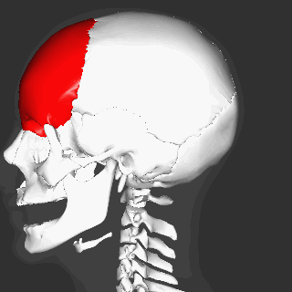
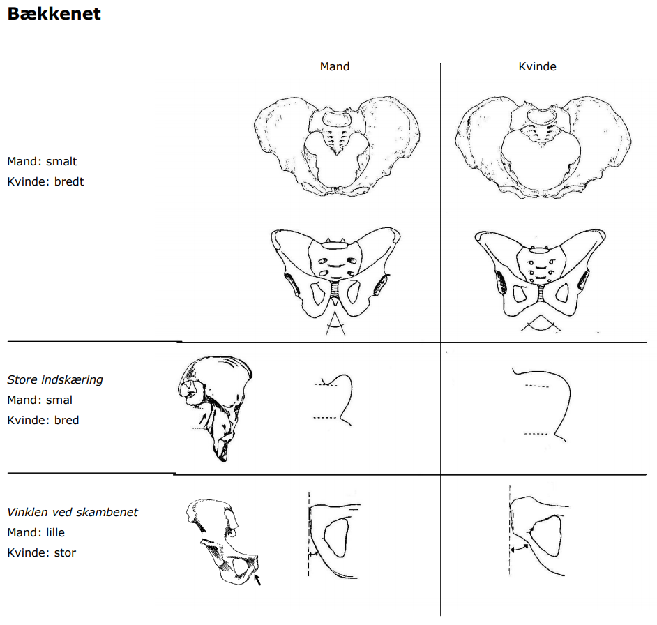
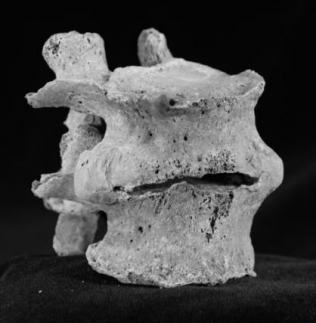
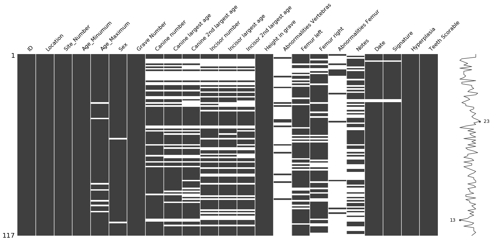
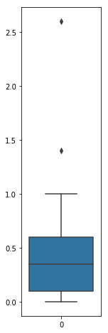

# Height Estimation from Skeletal Remains 
 
 

El objetivo de este proyecto es poder estimar la altura de un ser humano en base a los restos óseos. Para esto vamos a utilizar el dataset utilizado en un  proyecto de biomedicina en la University of Southern Denmark, titulado “[Heigh Estimation from Skeletal Remains](http://www.adbou.dk/fileadmin/adbou/projektopgaver/ADBOU_linear_regression_Mette_Wodx.pdf)” el cual contiene información de medidas de diferentes restos óseos antiguos encontrados en el pueblo Ribe de Dinamarca.

## Introducción

Utilizar restos óseos para estimar la altura de una persona es una herramienta muy util en la medicina forense y antropología biológica. Muchas veces solo unos pocos huesos se encuentran en excavaciones arqueológicas. Pero con unos pocos huesos podemos estimar la altura de una persona, esto es posible por la relación de tamaño entre los huesos.

## Problema

 Se ha determinado que existe una relación entre el fémur, tibia, humero y el radio con la altura de una persona. A continuación se muestran las imágenes de los huesos mencionados para una referencia visual.

| Fémur | Tibia |
| :---: | :---: |
|||

| Humero | Radio |
| :---: | :---: |
|||

## Estudio de atributos

El dataset cuenta con 23 atributos:

* ID `Int64`
* Location `?`
* Site_Number `?`
* Age_Minumum `Int64`
* Age_Maximum `Float64`
* Sex `?`
* Grave Number `?`
* Canine number `Float64`
* Canine largest age `Float64`
* Canine 2nd largest age `Float64`
* Incisor number `Float64`
* Incisor largest age `Float64`
* Incisor 2nd largest age `Float64`
* Height in grave `Float64`
* Abnormalities Vertebras `?`
* Femur left `Float64`
* Femur right `Float64`
* Abnormalities Femur `?`
* Notes `?`
* Date `?`
* Signature `?`
* Hyperplasia `Bool`
* Teeth Scorable `Bool`

Estamos frente a un problema de regresión ya que la salida es un numero real. La variable objetivo es la altura de la persona, en este caso "Height in grave"

A continuación una breve descripción de las definiciones  para los atributos del dataset y porque pueden ser relevantes.

A simple vista podemos descartar el atributo id ya que no aporta valor y causa ruido.

**Location:** `Ubicación` *Este atributo toma dos valores `Ribe` y `G216`.*

Varias excavaciones y sitios se les ha dado diferentes nombres en el transcurso del tiempo (por ejemplo, Tirup es el mismo lugar que Bygholm) por lo cual tenemos que tener ciertas consideraciones con los datos. Aunque en este caso solo contamos contamos con un sitio, como veremos mas adelante.

`Ribe` es un puebo de Dinamarca establecido en la primera década del siglo VIII y atestiguado por primera vez en un documento fechado en 854, Ribe es la ciudad más antigua existente en Dinamarca (y en Escandinavia). Recientes excavaciones arqueológicas realizadas entre 2008 y 2012 en han llevado al descubrimiento de entre 2.000 y 3.000 tumbas cristianas.


`G216` es un valor desconocido.

####  Ocurrencias de los atributos

| Location  | Ocurrencias |
|:---------:|:-----------:|
| Ribe      | 116         |
| G216      | 1           |
| **Total** | 117         |

Podemos ver que `G216` tiene una gran probabilidad de ser un error en la recolección de los datos.

<div>
<style scoped>
    .dataframe tbody tr th:only-of-type {
        vertical-align: middle;
    }

    .dataframe tbody tr th {
        vertical-align: top;
    }

    .dataframe thead th {
        text-align: right;
    }
</style>
<table border="1" class="dataframe">
  <thead>
    <tr style="text-align: right;">
      <th></th>
      <th>ID</th>
      <th>Location</th>
      <th>Site_Number</th>
      <th>Age_Minumum</th>
      <th>Age_Maximum</th>
      <th>Sex</th>
      <th>Grave Number</th>
      <th>Canine number</th>
      <th>Canine largest age</th>
      <th>Canine 2nd largest age</th>
      <th>Incisor number</th>
      <th>Incisor largest age</th>
      <th>Incisor 2nd largest age</th>
      <th>Height in grave</th>
      <th>Abnormalities Vertebras</th>
      <th>Femur left</th>
      <th>Femur right</th>
      <th>Abnormalities Femur</th>
      <th>Notes</th>
      <th>Date</th>
      <th>Signature</th>
      <th>Hyperplasia</th>
      <th>Teeth Scorable</th>
    </tr>
  </thead>
  <tbody>
    <tr>
      <th>30</th>
      <td>34</td>
      <td>G216</td>
      <td>ASR1015</td>
      <td>30</td>
      <td>40.0</td>
      <td>Male</td>
      <td>G216</td>
      <td>1.0</td>
      <td>3.0</td>
      <td>NaN</td>
      <td>1.0</td>
      <td>3.0</td>
      <td>NaN</td>
      <td>166.5</td>
      <td>NaN</td>
      <td>0.0</td>
      <td>47.3</td>
      <td>NaN</td>
      <td>NaN</td>
      <td>NaN</td>
      <td>NaN</td>
      <td>True</td>
      <td>True</td>
    </tr>
  </tbody>
</table>
</div>

Podemos ver que `G216` es el numero de tumba y debe haber sido copiado erróneamente en `Location`.

**Site_Number:** `Numero del sitio` *Este atributo toma un solo valor `ASR1015`*

`ASR1015` es el número de sitio en el cual la autoridad de excavación registro de la excavación real. Este atributo es relevante para usar cuando varios las excavaciones, dispersas en el tiempo, han tenido lugar en el mismo sitio.

####  Ocurrencias de los atributos

| Site Number | Ocurrencias |
|:-----------:|:-----------:|
| ASR1015     | 117         |
| **Total**   | 117         |

**Age_Minumum:** `Edad Mínimo` *Este atributo toma 16 valores*

Edad mínima estimada al momento de la muerte, verificado a través de metodologias osteológicas estándar. Con respecto a los niños, es posible estimar la edad dentro de un intervalo estrecho utilizando la dentición y las mediciones de la longitud huesos. La edad se da como una fracción decimal de un año (por ejemplo, un niño con un la edad al morir de uno y medio a dos se escribe como '1.5 - 2'). Con respecto a los adultos, un intervalo apropiado de años se da. La edad se presenta como el año entero más cercano y no para el próximo cumpleaños (el intervalo de 30 a 35 años es un lapso de 6 años desde 30.00 - 35.99 años). En este caso contamos solo con valores enteros para la edad mínima.

||
|:-------------------------------------------:|
|_Estimación de edad en base a restos óseos_  |

####  Ocurrencias de los atributos

| Edad       | Ocurrencias | Edad       | Ocurrencias |
|:----------:|:-----------:|:----------:|:-----------:|
| 35         | 26          | 60         | 3           |
| 50         | 16          | 36         | 3           |
| 30         | 15          | 55         | 1           |
| 20         | 15          | 43         | 1           |
| 25         | 11          | 34         | 1           |
| 45         | 9           | 27         | 1           |
| 40         | 9           | 22         | 1           |
| 21         | 4           | 18         | 1           |
| **Total**  | 117         |            |             |


**Age_Maximum:** `Edad Máximo` *Este atributo toma 22 valores*

Edad máxima estimada al momento de la muerte, verificado a través de metodologias osteológicas estándar. Con respecto a los niños, es posible estimar la edad dentro de un intervalo estrecho utilizando la dentición y las mediciones de la longitud huesos. La edad se da como una fracción decimal de un año (por ejemplo, un niño con un la edad al morir de uno y medio a dos se escribe como '1.5 - 2'). Con respecto a los adultos, un intervalo apropiado de años se da. La edad se presenta como el año entero más cercano y no para el próximo cumpleaños (el intervalo de 30 a 35 años es un lapso de 6 años desde 30.00 - 35.99 años). En este caso contamos solo con valores enteros para la edad mínima.

####  Ocurrencias de los atributos

| Edad       | Ocurrencias | Edad       | Ocurrencias |
|:----------:|:-----------:|:----------:|:-----------:|
| 45.0       |    17       | 34.0       |     2       |
| 40.0       |    15       | 39.0       |     2       |
| 60.0       |    14       | 65.0       |     2       |
| 50.0       |    13       | 59.0       |     2       |
| 35.0       |     8       | 26.0       |     1       |
| 24.0       |     7       | 49.0       |     1       |
| 25.0       |     5       | 70.0       |     1       |
| 30.0       |     5       | 46.0       |     1       |
| 55.0       |     5       | 20.0       |     1       |
| 29.0       |     4       | 58.0       |     1       |
| 44.0       |     3       | -          | -           |
| **Total**  | 110         |            |             |
| **NaN**    | 7           |            |             |

Podemos ver que tiene menos ocurrencia que los otros atributos por lo cual tiene valores faltantes, esto lo veremos mas adelante.


**Sex** `Sexo` *Este atributo toma dos valores `Male` y `Female`*

En este atributo, sexo es la estimación subjetiva final del sexo del individuo. 

####  Ocurrencias de los atributos

| Sexo       | Ocurrencias |
|:----------:|:-----------:|
| Male       | 67          |
| Female     | 48          |
| **Total**  | 115         |
| **NaN**    | 2           |

Podemos ver que tiene menos ocurrencia que los otros atributos por lo cual tiene valores faltantes, esto lo veremos mas adelante.


**Grave Number:** `Numero de Tumba` *Este atributo toma 116 valores*

La numeración de las tumbas y los esqueletos en ellos a menudo no es consistente. Muchos cementerios fueron excavados durante el curso de varias excavaciones independientes y por lo tanto pueden tener diferentes sistemas de numeración para cada excavación. Como regla principal, un esqueleto encontrado en una tumba debe obtener un número que comienza con 'G' seguido de un número (1, 2, ... etc.). Ambos en el campo y en el laboratorio antropológico, no es raro encontrar restos de esqueletos adicionales entremezclados con los huesos del esqueleto primario de la tumba. Si los huesos adicionales se pueden asignar al esqueleto de una tumba vecina, son transferidos. Si este no es el caso, se realiza un registro independiente de los huesos adicionales.

####  Ocurrencias de los atributos

| Grave Number | Ocurrencias | Grave Number | Ocurrencias | Grave Number | Ocurrencias |
|:------------:|:-----------:|:------------:|:-----------:|:------------:|:-----------:|
| G818         | 2           | G864         | 1           | G41          | 1           |
| G828         | 1           | G314         | 1           | G846         | 1           |
| G885         | 1           | G132         | 1           | G104         | 1           |
| G841         | 1           | G119         | 1           | G48          | 1           |
| G58          | 1           | G865         | 1           | G303         | 1           |
| G326         | 1           | G74          | 1           | G246         | 1           |
| G40          | 1           | G192         | 1           | G923         | 1           |
| G305         | 1           | G117         | 1           | G261         | 1           |
| G73          | 1           | G282         | 1           | G851         | 1           | 
| G341         | 1           | G173         | 1           | G160         | 1           |
| G897         | 1           | G33          | 1           | G206         | 1           |
| G248         | 1           | G898         | 1           | G368         | 1           |
| G166         | 1           | G419         | 1           | G856         | 1           |
| G194         | 1           | G35          | 1           | G114         | 1           |
| G24          | 1           | G213         | 1           | G315         | 1           |
| G131         | 1           | G294         | 1           | G884         | 1           |
| G324         | 1           | G63          | 1           | G229         | 1           |
| G435         | 1           | G317         | 1           | G274         | 1           |
| G387         | 1           | G871         | 1           | G340         | 1           |
| G176         | 1           | G231         | 1           | G211         | 1           |
| G843         | 1           | G332         | 1           | G863         | 1           |
| G23          | 1           | G108         | 1           | G70          | 1           |
| G215         | 1           | G344         | 1           | G178         | 1           |
| G216         | 1           | G59          | 1           | G394         | 1           |
| G404         | 1           | G148         | 1           | G823         | 1           |
| G275         | 1           | G302         | 1           | G377         | 1           |
| G159         | 1           | G850         | 1           | G285         | 1           |
| G277         | 1           | G226         | 1           | G39          | 1           | 
| G113         | 1           | G363         | 1           | G81          | 1           |
| G350         | 1           | G61          | 1           | G378         | 1           |
| G301         | 1           | G56          | 1           | G187         | 1           | 
| G89          | 1           | G801         | 1           | G803         | 1           |
| G38          | 1           | G894         | 1           | G355         | 1           | 
| G251         | 1           | G312         | 1           | G908         | 1           | 
| G267         | 1           | G903         | 1           | G122         | 1           | 
| G214         | 1           | G210         | 1           | G400         | 1           |
| G432         | 1           | G99          | 1           | G421         | 1           |
| G257         | 1           | G808         | 1           | G29          | 1           | 
| G802         | 1           | G138         | 1           | -            | -           |
| **Total**    | 117         |              |             |              |             |

Podemos ver que `G818` tiene dos ocurrencias, este valor tiene una gran probabilidad de ser un error en la recolección de los datos o puede que dos esqueletos se encontraran en la misma tumba.

**Canine number:** `Numero Canino` *Este atributo toma 9 valores diferentes*

El número de hipoplasias visibles en el diente.
La hipoplasia del esmalte es irregularidades en el esmalte dental visto como una banda impresa en el diente. La hipoplasia es causada por disturbios fisiológicos y se forma mientras diente se está desarrollando. La hipoplasia del esmalte solo se puntúa en los caninos permanentes. Se prefiere el canino superior izquierdo, pero si falta, se marca el canino derecho en lugar.

||
|:-----------------------------:|
| _Etapas del desarrollo dental_|

Fue usada la tabla de  Haderup.

|           | R |   |   |   |   |   |   |   | MAXILLA |   |   |   |   |   |   |   | L |
|-----------|---|---|---|---|---|---|---|---|:-------:|---|---|---|---|---|---|---|---|
| Permanent | 8 | 7 | 6 | 5 | 4 | 3 | 2 | 1 | +       | 1 | 2 | 3 | 4 | 5 | 6 | 7 | 8 |
| Deciduous |   |   |   | 05| 04| 03| 02| 01| +       |01 |02 |03 |04 |05 |   |   |   |

|           |       |   |   |   |   |   |   |   | MANDIBULA |   |   |   |   |   |   |   |      |
|-----------|-------|---|---|---|---|---|---|---|:---------:|---|---|---|---|---|---|---|------|
| Permanent | 8     | 7 | 6 | 5 | 4 | 3 | 2 | 1 | -         | 1 | 2 | 3 | 4 | 5 | 6 | 7 | 8    |
| Deciduous |       |   |   | 05| 04| 03| 02| 01| -         |01 |02 |03 |04 |05 |   |   |      |

| Score | Descripción                                                |
|:-----:|:-----------------------------------------------------------|
| 0     | Unworn tooth                                               |
| 1     | Attrition only in enamel                                   |
| 2     | Attrition has exposed the dentine in one cusp              |
| 3     | Attrition has exposed the dentine in two cusp              |
| 4     | Attrition has exposed the dentine in three cusp            |
| 5     | Attrition has exposed the dentine in four cusp             |
| 6     | Attrition has exposed the dentine so the dentine is visible|
| 6     | Interconnected in two or more cusps                        |
| 7     | Attrition has removed the enamel of the mastical surface   |
| 8     | Attrition has removed the entire crown of the tooth        |


####  Ocurrencias de los atributos

**Canine largest age:** `Float64` *Este atributo toma*

####  Ocurrencias de los atributos

**Canine 2nd largest age:** `Float64` *Este atributo toma*

####  Ocurrencias de los atributos

**Incisor number:** `Float64` *Este atributo toma*

####  Ocurrencias de los atributos

**Incisor largest age:** `Float64` *Este atributo toma*

####  Ocurrencias de los atributos

**Incisor 2nd largest age:** `Float64` *Este atributo toma*

####  Ocurrencias de los atributos

**Height in grave:** `Altura en la tumba` *Este atributo toma valores reales entre 0 y 185*

La longitud del esqueleto se mide en la tumba (usando las definiciones presentadas en Boldsen, 1984). Las mediciones se toman sobre esqueletos encontrados sin ser molestados en las tumbas y la longitud del esqueleto se mide desde la parte superior del cráneo a el punto mas distante del talo. El método de medir la altura como se describe arriba no se usó en todas las  excavaciones. La altura está dada en centímetros.

| Frontal Bone | Talus       |
|:------------:|:-----------:|
|  |  |


####  Ocurrencias de los atributos

| Altura (cm) | Ocurrencias | Altura (cm) | Ocurrencias |
|:-----------:|:-----------:|:-----------:|:-----------:|
| 170.0       | 5           | 144.0       | 2           |
| 159.0       | 5           | 177.0       | 2           |
| 154.0       | 5           | 158.5       | 1           |
| 161.0       | 4           | 150.0       | 1           |
| 157.0       | 4           | 182.0       | 1           |
| 160.0       | 4           | 185.0       | 1           |
| 155.0       | 4           | 183.0       | 1           |
| 164.0       | 4           | 154.3       | 1           |
| 174.0       | 3           | 168.0       | 1           |
| 167.0       | 3           | 166.5       | 1           |
| 153.0       | 3           | 167.5       | 1           |
| 156.0       | 3           | 170.5       | 1           |
| 169.0       | 3           | 150.5       | 1           |
| 173.0       | 3           | 156.5       | 1           |
| 163.0       | 3           | 174.5       | 1           |
| 175.0       | 3           | 149.5       | 1           |
| 152.0       | 3           | 168.5       | 1           |
| 157.5       | 3           | 162.0       | 1           |
| 158.0       | 3           | 142.0       | 1           |
| 166.0       | 3           | 171.0       | 1           |
| 165.0       | 3           | 151.0       | 1           |
| 171.5       | 3           | 179.5       | 1           |
| 149.0       | 3           | 180.0       | 1           |
| 148.0       | 2           | 184.0       | 1           |
| 179.0       | 2           | 151.5       | 1           |
| 0.0         | 2           | 172.5       | 1           |
| 152.5       | 2           | 173.5       | 1           |
| **Total**   | 117         |             |             |

Podemos ver dos ocurrencias con valor `0.0` que tendremos que eliminar mas adelante ya que son erroneas.

**Abnormalities Vertebras:** `Anomalias en las vertebras` *Este atributo toma 13 valores diferentes*

####  Ocurrencias de los atributos

Anomalias registradas en las vertebras (en danés).

| ID  | Anomalia (Danés) | Anomalia (Español, Google Translate) |
|:---:|:---|:---|
| 46  | En enkelt hvirvel lidt sammentrykket. Intet voldsomt    | Un solo remolino un poco de compresión. Nada feroz |
| 17  | Udvoksninger, men intet der påvirker højden             | Expansiones, pero nada que afecte la altura |
| 5   | To hvirvler fusioneret - har ingen betydning for højden | Dos remolinos fusionados: no tienen relación con la altura |
| 37  | Læbedannelse | La formación de labio |
| 47  | Læbedannelse | La formación de labio |
| 62  | Læbedannelse | La formación de labio |
| 50  | Læbedannelse men ingen sammenfald | La formación de labio pero no es coincidencia |
| 24  | Nogle hvirvler lettere trykkede | Algunos remolinos se presionan con mayor facilidad |
| 97  | Ryg lidt sammenklemt | Espalda ligeramente exprimida |
| 35  | Em smule læbedannelse | Espalda ligeramente exprimida |
| 86  | Et par hvirvler sammenklemte. Nok pga af alder. Har indvirkning på højden | Un par de remolinos se arracimaron. Suficiente por la edad. Tiene un impacto en la altura |
| 67  | Læbedanelse og ser lidt sammentrykkede ud | Formación de labios y se ve un poco comprimido |
| 81  | To ryghvirvler fusioneret, men har ingen betydning for højden | Dos vértebras se fusionaron pero no tienen importancia para la altura |


||
|:-------------------------------------------:|
|_Nombre de los huesos en danés para una mejor referencia_|

||
|:-------------------------------------------:|
|_Nombre de los huesos en danés para una mejor referencia_|

||
|:-------------------------------------:|
|_(Læbedannelse) Formación de labios: se ve a lo largo del borde de los extremos del hueso y en el edema de la vértebra._|

Podemos ver que en la `id 86` hay un comentario en el cual una anomalia en las vertebras tiene un impacto en la altura.


<div>
<style scoped>
    .dataframe tbody tr th:only-of-type {
        vertical-align: middle;
    }

    .dataframe tbody tr th {
        vertical-align: top;
    }

    .dataframe thead th {
        text-align: right;
    }
</style>
<table border="1" class="dataframe">
  <thead>
    <tr style="text-align: right;">
      <th></th>
      <th>ID</th>
      <th>Location</th>
      <th>Site_Number</th>
      <th>Age_Minumum</th>
      <th>Age_Maximum</th>
      <th>Sex</th>
      <th>Grave Number</th>
      <th>Canine number</th>
      <th>Canine largest age</th>
      <th>Canine 2nd largest age</th>
      <th>Incisor number</th>
      <th>Incisor largest age</th>
      <th>Incisor 2nd largest age</th>
      <th>Height in grave</th>
      <th>Abnormalities Vertebras</th>
      <th>Femur left</th>
      <th>Femur right</th>
      <th>Abnormalities Femur</th>
      <th>Notes</th>
      <th>Date</th>
      <th>Signature</th>
      <th>Hyperplasia</th>
      <th>Teeth Scorable</th>
    </tr>
  </thead>
  <tbody>
    <tr>
      <th>82</th>
      <td>86</td>
      <td>Ribe</td>
      <td>ASR1015</td>
      <td>60</td>
      <td>70.0</td>
      <td>Female</td>
      <td>G35</td>
      <td>0.0</td>
      <td>0.0</td>
      <td>0.0</td>
      <td>0.0</td>
      <td>0.0</td>
      <td>0.0</td>
      <td>157.0</td>
      <td>et par hvirvler sammenklemte. Nok pga af alder. Har indvirkning p? h?jden.</td>
      <td>45.1</td>
      <td>NaN</td>
      <td>NaN</td>
      <td>Collas fracture venstre radius.</td>
      <td>5/28/2008</td>
      <td>MWOD</td>
      <td>False</td>
      <td>False</td>
    </tr>
  </tbody>
</table>
</div>


**Femur left:** `Femur izquierdo` *Este atributo toma 58 valores diferentes*

La longitud máxima de los fémures derecho e izquierdo se mide en la mesa de medicion. La longitud se ingresa tradicionalmente en milímetros con un decimal aunque en este caso esta en centimentros.

||
|:-----------------------------------------------:|
| _Medición de los huesos_                        |

####  Ocurrencias de los atributos

| Femur izquierdo | Occurencias| Femur izquierdo | Occurencias | Femur izquierdo | Occurencias |
|:---------------:|:----------:|:---------------:|:-----------:|:---------------:|:-----------:|
| 0.0             | 7          | 41.6            |  2          | 47.1            | 1           |
| 47.0            | 4          | 37.7            |  1          | 47.3            | 1           |
| 43.0            | 4          | 52.6            |  1          | 45.4            | 1           |
| 50.8            | 4          | 40.6            |  1          | 43.9            | 1           |
| 44.1            | 3          | 41.0            |  1          | 42.2            | 1           |
| 45.6            | 3          | 46.1            |  1          | 50.9            | 1           |
| 43.4            | 3          | 39.8            |  1          | 46.6            | 1           |
| 48.0            | 3          | 44.5            |  1          | 41.7            | 1           |
| 43.1            | 2          | 48.3            |  1          | 54.4            | 1           |
| 45.1            | 2          | 50.0            |  1          | 41.4            | 1           |
| 44.9            | 2          | 42.1            |  1          | 44.6            | 1           |
| 43.6            | 2          | 45.8            |  1          | 52.8            | 1           |
| 49.6            | 2          | 43.5            |  1          | 41.9            | 1           |
| 48.4            | 2          | 49.0            |  1          | 46.2            | 1           |
| 48.5            | 2          | 40.7            |  1          | 47.8            | 1           |
| 52.0            | 2          | 43.3            |  1          | 43.8            | 1           |
| 44.0            | 2          | 49.3            |  1          | 49.4            | 1           |
| 47.5            | 2          | 42.0            |  1          | 51.4            | 1           |
| 51.3            | 2          | 45.3            |  1          | 44.3            | 1           |
| **Total**       | 91         |                 |             |                 |             |
| **NaN**   | 26           | | | |

Podemos ver que tenemos 7 ocurrencias de `0.0` tendremos que ver mas adelante si para estas ocurrencias existen medidas del femur derecho y si podemos remplazar los valores faltantes por estas medidas.

| Femur izquierdo | ID  |
|:---------------:|:---:|
| 0.0             | 34  |
| 0.0             | 50  |
| 0.0             | 59  |
| 0.0             | 80  |
| 0.0             | 95  |
| 0.0             | 96  |
| 0.0             | 112 |

**Femur right:** `Femur derecho` *Este atributo toma 60 valores diferentes*

La longitud máxima de los fémures derecho e izquierdo se mide en la mesa de medicion. La longitud se ingresa tradicionalmente en milímetros con un decimal aunque en este caso esta en centimentros.

| Femur izquierdo | Occurencias| Femur izquierdo | Occurencias | Femur izquierdo | Occurencias |
|:---------------:|:----------:|:---------------:|:-----------:|:---------------:|:-----------:|
| 0.0             | 11         | 53.6            |  1          | 50.6            | 1           |
| 47.0            | 3          | 46.4            |  1          | 42.3            | 1           |
| 46.1            | 3          | 46.2            |  1          | 44.8            | 1           |
| 45.8            | 3          | 51.6            |  1          | 48.3            | 1           |
| 47.8            | 2          | 48.5            |  1          | 43.1            | 1           |
| 45.4            | 2          | 47.5            |  1          | 46.8            | 1           |
| 40.7            | 2          | 49.5            |  1          | 45.2            | 1           |
| 39.5            | 2          | 45.0            |  1          | 52.3            | 1           |
| 43.0            | 2          | 52.5            |  1          | 51.3            | 1           |
| 50.5            | 2          | 49.0            |  1          | 48.9            | 1           |
| 41.0            | 2          | 51.2            |  1          | 47.1            | 1           |
| 42.4            | 2          | 42.5            |  1          | 42.6            | 1           |
| 43.5            | 2          | 41.6            |  1          | 41.7            | 1           |
| 47.3            | 2          | 46.6            |  1          | 50.9            | 1           |
| 44.0            | 2          | 48.6            |  1          | 49.6            | 1           |
| 44.2            | 2          | 43.7            |  1          | 43.6            | 1           |
| 45.1            | 2          | 51.7            |  1          | 47.9            | 1           |
| 46.0            | 2          | 48.7            |  1          | 44.6            | 1           |
| 48.0            | 2          | 43.8            |  1          | 42.1            | 1           |
|                 |            | 43.9            |  1          | 50.0            | 1           |
| **Total**       | 91         |                 |             |                 |             |
| **NaN**   | 26           | | | |

Podemos ver que tenemos 11 ocurrencias de `0.0` tendremos que ver mas adelante si para estas ocurrencias existen medidas del femur izquierdo y si podemos remplazar los valores faltantes por estas medidas.

####  Ocurrencias de los atributos

| Femur derecho | ID  |
|:-------------:|:---:|
| 0.0           | 50  | 
| 0.0           | 57  | 
| 0.0           | 59  | 
| 0.0           | 73  | 
| 0.0           | 82  | 
| 0.0           | 87  | 
| 0.0           | 88  | 
| 0.0           | 89  | 
| 0.0           | 95  | 
| 0.0           | 96  | 
| 0.0           | 112 |


**Abnormalities Femur:** `Anomalias en el femur` *Este atributo toma 12 valores diferentes*

Anomalias registradas en el femur (en danés).

####  Ocurrencias de los atributos

| ID  | Anomalia (Danés) | Anomalia (Español, Google Translate) |
|:---:|:-----------------|:-------------------------------------|
| 13  | Begge lårben for nedbrudte til at måle |Ambos muslos se descomponen para medir |
| 16  | Skør postmortal nedbrydning | Gran descomposición post mortem |
| 103 | Mærkelig venstre femur | Extraño fémur izquierdo |
| 106 | Flade exostoser på caput. Ingen betdning for højden  | Exostos planos en caput. Sin importancia para la altura |
| 9   | Knækkede postmortalt så kan ikke måles | La mortalidad de publicaciones rotas no se puede medir |
| 1   | Brækket Postmortalt | Postmortalt roto |
| 29  | Meget store og robuste. En rigtig mand | Muy grande y robusto. Un verdadero hombre |
| 85  | Læbedannelse på femur, men ingen betydning for højden |La formación de labios en el fémur, pero no importa la altura|
| 14  | Højre femur lidt deform... Syfilis? | El fémur derecho se deforma un poco ... ¿sífilis?|
| 15  | Højre femur ikke bevaret | Fémur derecho no preservado |
| 47  | FOS på femur | Síndrome osteolítico focal en el fémur |

Podemos ver que en las `id 13`, `id 103`, `id 9`, `id 14` y `id 15` hay comentarios en los que se habla de anomalias que tiene un impacto en la altura.

||
|:----------------------------------------------------------------------------------:|
| _Síndrome osteolítico focal en el fémur, no tiene un impacto relevante en la altura_|


**Notes:** `Notas` *Este atributo toma 55 valores diferentes*

Notas documentadas al momento del registro.

####  Ocurrencias de los atributos

| ID  | Notas (Danés) | Notas (Español, Google Translate) |
| :-- | :-- | :--|
| 7   | Kraniet mangler, kig om det er på udstilling | Falta la grúa, compruebe si está en exhibición |
| 12  | Kraniet mangler, kig om det er på udstilling | Falta la grúa, compruebe si está en exhibición |
| 69  | Underlige tænder. Nogler er vokset skævt og har skubbet andre ud og hæmmet vækst ved andre | Dientes extraños Los Nicks se han torcido y han empujado a otros e inhibido el crecimiento de otros |
| 30  | Spøjs falange | Spike es falso |
| 49  | FOS eller et gok i nøden. Tandbyld i underkæben. Lidt underlig tibia? Ulla tipper hende til 28-38 | FOS o una conjetura en el empujón. Topetón en la mandíbula inferior. ¿Una tibia un poco extraña? Ulla   la inclinó a 28-38 máx. Más cerca de 30 max|
| 45  | Kranie mangler| Crane no se encuentra |
| 46  | Kranie mangler| Crane no se encuentra |
| 64  | Hvis nogler er de meget små. Den er mere rillet nærmest.| Si es suficiente, son muy pequeños. Es más gemido más cercano. |
| 114 | Caries i kindtænder! Hvis en hypoplasi så en meget lille bitte bitte en ved alderen 5 på canine | Caries en los dientes de la mejilla! Si una hipoplasia vió un poco mordido uno a los 5 años en el canino|
| 113 | Male? | Masculino? |
| 17  | Syfilis?, tænder for slidte | Sífilis?, Dientes para usar |
| 108 | Tag et billede af tanden | Toma una foto del diente |
| 16  | Female?, intet kranie - kig efter om det er på udstilling | ¿Mujer?, Sin cráneo: busca una exposición|
| 6  | Male?, højre femur kan ikke måles da nedbrudt, ingen ryghvirvler, tænder for nedbrudte | ¿Masculino?, El fémur derecho no se puede medir, se descompone, no hay vértebras, los dientes se rompen |
| 10  | Tænder for slidte | Se enciende gastado |
| 40  | Lidt lepra har man jo altid. | Algo lepra siempre tiene. |
| 24  | Hyperplasier små | Hiperplasia pequeña |
| 103 | "Knude" dorsalt på venstre femurs distale ventrale side lige over ledfladen" |  Nodo" dorsal en el lado ventral distal del ventrículo izquierdo justo arriba de la articulación " |
| 47  | FOS. Spedalsk! Ikke en pløk i munden. Remodelerede huller i underkæbe. Hug i hovedet (lille) | FOS. Leproso! No una siesta en la boca. Remodelación de agujeros en la mandíbula inferior. Abrazo en la cabeza (pequeño)
| 4   | Læbedannelser | Formaciones labiales |
| 18  | "Sjov" "skæv hjørnetand" | "Gracioso" "canino torcido" |
| 89  | Tænder mere and 1/3 slidte | Giros más y 1/3 desgastados |
| 20  | Jeg havde problemer med hjørnetanden | Tuve problemas con los caninos |
| 119 | Hjørnetanden er lidt underlig.. Meget lille.. | La esquina es un poco extraña ... Muy pequeña ... |
| 35  | Har mistet rigtig mange tænder | Ha perdido muchos dientes |
| 21  | Tænder mere end 1/3 slidte | Iluminación más de 1/3 desgastada |
| 31  | Mere end 1/3 del slidt| Más de 1/3 parte desgastada |
| 50  | Tænder mere end 1/3 slidte. Remodeleret tandudfald i underkæben| Iluminación con más de 1/3 de desgaste. Gota de diente remodelado en la mandíbula inferior |
| 59  | Tænder mere end 1/3 slidte | Iluminación más de 1/3 desgastada |
| 61  | Tænder mere end 1/3 slidte| Iluminación más de 1/3 desgastada |
| 63  | Tænder mere end 1/3 slidte| Iluminación más de 1/3 desgastada |
| 73  | Tænder mere end 1/3 slidte | Iluminación más de 1/3 desgastada |
| 93  | Tænder mere end 1/3 slidte | Iluminación más de 1/3 desgastada |
| 96  | Tænder mere end 1/3 slidte | Iluminación más de 1/3 desgastada |
| 100 | Tænder mere end 1/3 slidte | Iluminación más de 1/3 desgastada |
| 101 | Tænder mere end 1/3 slidte | Iluminación más de 1/3 desgastada |
| 105 | Tænder mere end 1/3 slidte | Iluminación más de 1/3 desgastada |
| 118 | Tænder mere end 1/3 slidte | Iluminación más de 1/3 desgastada |
| 86  | Collas fracture venstre radius. | Fractura de Collas radio izquierdo. |
| 42  | Tænder mere end 1/3 slidte. Calcanus forreven. | Iluminación con más de 1/3 de desgaste. Calcanus forzado. |
| 8   | Incisor mere end 1/3 slidt ned | Incisivo más de 1/3 desgastado |
| 9   | Incisor mere end 1/3 slidt ned | Incisivo más de 1/3 desgastado |
| 22  | Female?, Kranium mangler | ¿Hembra? Cráneo falta |
| 67  | Mere end 1/3 slidte tænder | Más de 1/3 dientes desgastados |
| 37  | Kraniet er i posen, men ingen tænder | La grúa está en la bolsa, pero no tiene dientes |
| 112 | Ukendt køn. Skelet meget nedbrudt. | Género desconocido Esqueleto muy degradado |
| 98  | Tænder mere end 1/3 slidte. Skelet i dårlig stand. | Iluminación con más de 1/3 de desgaste. Esqueleto en mal estado. |
| 32  | Female? | Mujer? |
| 72  | Female? | Mujer? |
| 26  | Male? Små femur'er | Masculina? Fémur pequeño |
| 14  | Kraniet udstillet i Ribe fra 1/3-2002. Kranie kommet retur men ingen tænder | Crane exhibió en Ribe del 1/3-2002. Grulla regresó pero sin dientes |
| 15  | Tænder mere end 1/3 slidt ned. Kranie udtaget til Ribe Middelalder. Har kigget på det. Udstilling kommet hjem | Lágrimas más de 1/3 desgastadas. Grúa tomada para la Edad Media Ribe. Han mirado? ella. Exposición regresó a casa |
| 29  | Der er nok noget lepra kørende.I 2 kasser. | Probablemente hay algo de lepra en ejecución. En 2 cajas |
| 53  | Der ligger et sæm i kassen. M?ske nyt | Hay una caja en la caja. Quizás nuevo  |
| 54  | Intet kranie. Female? | Sin cráneo. Mujer?  |
| 55  | Delt i to kasser. Evt god til billede af uden hypoplasi. Stær på sp?rgevogn. | Compartido en dos cajas. Quizás sea bueno imaginar sin hipoplasia. Permanece en sp? rgevogn. |
| 56  | Intet at kigge på. Intet kranie. Female? | Nada que mirar. Sin cráneo Mujer? |
| 57  | intet kranie. Spinkel fin dame | Sin cráneo. Sparky buena señora |
| 58  | Køn ukendt. Tænder har ikke noget at sidde fast i. M? de gerne scores? | Desconocido desconocido. Los dientes no tienen nada que atrapar. ¿M? les gusta anotar? |
| 60  | Intet at kigge pv | ¿Nada para mirar? |
| 74  | Tænder faldet ud og remodeleret. Begge l?rben kn?kket postmortalt. | Tonos se cayeron y remodelaron. Ambos niños murieron post mortem |
| 78  | Der er et sæt lårben i overskud og jeg m?ler derfor ikke på l?ngden af disse. | Todavía queda un poco en exceso y no me siento así en absoluto. los números de estos |
| 79  | den hvor underkøben sidder på i jord. | El que tiene la pierna sentada en el suelo |
| 85  | Skal tænder scores når intet kranie? | ¿Deberían marcarse las colas cuando no hay cráneo? |
| 87  | Subperiale eksostoser. Ingen lepra forandringer i kranie. | Exostosis subperiales. No hay cambios de lepra en el cráneo |


Podemos ver que en la `id 6` el fémur derecho no se puede medir, se tiene que evaluar la posiblidad de remplazar el valor por le izquierdo.

La `id 16`, `id 22`, `id 54`, `id 55` y la `id 57` dicen que falta el creano y el craneo es necesario para medir la altura de la persona, lo cual hace cuestionable la altura medida en la tumba.


**Date:** `Fecha` *Este atributo toma 6 valores diferentes*

Fecha en la cual se realizo el registro.

####  Ocurrencias de los atributos

| Fecha     | Ocurrencias |
|:---------:|:-----------:|
| 5/28/2008 | 46          |
| 5/27/2008 | 35          |
| 5/8/2008  | 14          |
| 5/19/2008 | 11          |
| 5/5/2008  | 8           |
| **Total** | 114         |
| **NaN**   | 3           |

**Signature:** `?` *Este atributo toma 4 valores diferentes*

Firma de la persona que registro los datos.

####  Ocurrencias de los atributos

| Firma     | Ocurrencias |
|:---------:|:-----------:|
| MWOD      | 112         |
| MEWOD     | 1           | 
| Mwod      | 1           |
| **Total** | 114         |
| **NaN**   | 3           |

Parece ser la misma persona con un error de typeo en `MEWOD`.


**Hyperplasia:** `Hipoplasia` *Este atributo toma dos valores diferentes*

La hipoplasia es una irregularidades en el esmalte dental visto como una banda impresa en el diente. La hipoplasia es causada por disturbios fisiológicos y se forma mientras
diente se está desarrollando. La hipoplasia del esmalte solo se puntúa en los caninos permanentes. Se suele utilizar el canino superior izquierdo, pero si falta, se marca el canino derecho en lugar. Solo se puntúa la hipoplasia visible a simple vista.

####  Ocurrencias de los atributos

| Hipoplasia  | Ocurrencias |
|:-----------:|:-----------:|
| False       | 63          |
| True        | 54          | 
| **Total**   | 117         |


**Teeth Scorable:** `Dientes puntuables`

Indica si los dientes son puntiagudos o no. Un diente es considerado no puntuable cuando se desgasta más de un tercio del diente. Cuando un diente está tan gastado,existe la posibilidad de que varias hipoplasias ya no estén presentes y el diente no sea utilizable. Los dientes no deben puntuarse si hay una cantidad sustancial de sarro, ya que esto podría ocultar posibles hipoplasias. El examinador no puede quitar el sarro.

####  Ocurrencias de los atributos

| Dientes puntuables  | Ocurrencias |
|:-------------------:|:-----------:|
| True                | 61          |
| False               | 56          | 
| **Total**           | 117         |


### Analizando el Dataset (código)

El dataset se encuentra en un archivo `.accdb` (Microsoft Access) asi que lo primero que vamos a hacer es exportarlo como `.csv`


Analizándolo rápidamente en un editor de texto podemos ver que contiene caracteres que no van a poder ser decodeados con UTF-8 (`�`) ya que los comentarios estan en danes. Los remplazamos rápidamente por `?`.


Ahora ya podemos cargarlo con `pandas`

[Vista detallada del dataset ➡](./2_src/pf_overview.html)


### Importando librerias


```python
import missingno as msno
import pandas as pd
import pandas_profiling as pf
import numpy as np
import matplotlib.pyplot as plt
import seaborn as sns
```

### Cargando el dataset


```python
data = pd.read_csv('../dataindsamling.csv')
```

### Missing Values

Vamos a utilizar la libreria `missingno` para ver la estructura de los datos faltantes.


```python
msno.matrix(data)
```





```python
msno.bar(data)
```


Podemos ver que hay una gran cantidad de datos faltantes, sobretodo en `Abnormalities Vertebras` y `Abnormalities Femur`. Como el objetivo de este estudio es predecir la altura en base al tamaño del femur vamos a comenzar por solucionar el problema con los missng values de `Femur left` y `Femur right`.

Como vimos en el analisis de atributos existen valores iguales a 0, para nosotros esos valores son iguales a `NaN` ya que no aporntan a la solucion del problema.


```python
data.loc[data['Femur left']      == 0.0] = np.nan
data.loc[data['Femur right']     == 0.0] = np.nan
data.loc[data['Height in grave'] == 0.0] = np.nan
```


```python
femur_size = data[['ID','Femur left','Femur right']]
```


```python
msno.matrix(femur_size[['Femur left','Femur right']])
```


```python
full_values_femur = pd.DataFrame(data=femur_size)
```


```python
full_values_femur = femur_size.dropna()
```

Una vez eliminados los valores `NaN` podemos ver de que restos tenemos el tamaño de ambos femur y ver si existe una gran diferencia de tamaño entre ellos para mas adelante sustituir los faltantes con su contraparte.


```python
msno.matrix(full_values_femur[['Femur left','Femur right']])
```


```python
r_femur__l_femur_difference = pd.DataFrame()
r_femur__l_femur_difference['Difference'] = abs(full_values_femur['Femur left'] - full_values_femur['Femur right'])
```


```python
full_values_femur = r_femur__l_femur_difference.Difference.sort_values(ascending=False)
```


```python
full_values_femur.head(5)
```


    64     2.6
    102    1.4
    51     1.0
    4      0.9
    105    0.8
    Name: Difference, dtype: float64


Podemos ver que la diferencia de tamaño es muy poca entre los femurs


```python
full_values_femur.describe()
```


    count    64.000000
    mean      0.406250
    std       0.407031
    min       0.000000
    25%       0.100000
    50%       0.350000
    75%       0.600000
    max       2.600000
    Name: Difference, dtype: float64


```python
fig, ax = plt.subplots(figsize=(2,8))
sns.boxplot(ax=ax, data=full_values_femur)
```





Podemos ver que la diferencia entre el femur derecho e izquierdo  suele ser muy pequeña, asi que vamos a a signarle a los valores faltantes que tienen una contraparte su valor.


```python
data.loc[data['Femur left'].isnull(),'Femur left']   = data['Femur right']
data.loc[data['Femur right'].isnull(),'Femur right'] = data['Femur left']
```


```python
both_missing = data[data['Femur left'].isnull()==True]
len(both_missing)
```


    26


Podemos ver que quedamos con 26 de 117 valores NaN para los cuales no sabemos las medidas de ningun femur.


```python
both_missing
```


<div>
<style scoped>
    .dataframe tbody tr th:only-of-type {
        vertical-align: middle;
    }

    .dataframe tbody tr th {
        vertical-align: top;
    }

    .dataframe thead th {
        text-align: right;
    }
</style>
<table border="1" class="dataframe">
  <thead>
    <tr style="text-align: right;">
      <th></th>
      <th>ID</th>
      <th>Location</th>
      <th>Site_Number</th>
      <th>Age_Minumum</th>
      <th>Age_Maximum</th>
      <th>Sex</th>
      <th>Grave Number</th>
      <th>Canine number</th>
      <th>Canine largest age</th>
      <th>Canine 2nd largest age</th>
      <th>...</th>
      <th>Height in grave</th>
      <th>Abnormalities Vertebras</th>
      <th>Femur left</th>
      <th>Femur right</th>
      <th>Abnormalities Femur</th>
      <th>Notes</th>
      <th>Date</th>
      <th>Signature</th>
      <th>Hyperplasia</th>
      <th>Teeth Scorable</th>
    </tr>
  </thead>
  <tbody>
    <tr>
      <th>6</th>
      <td>9.0</td>
      <td>Ribe</td>
      <td>ASR1015</td>
      <td>50.0</td>
      <td>60.0</td>
      <td>Male</td>
      <td>G377</td>
      <td>3.0</td>
      <td>3.5</td>
      <td>5.0</td>
      <td>...</td>
      <td>166.0</td>
      <td>NaN</td>
      <td>NaN</td>
      <td>NaN</td>
      <td>Kn?kkede postmortalt s? kan ikke m?les</td>
      <td>Incisor mere end 1/3 slidt ned</td>
      <td>5/8/2008</td>
      <td>MWOD</td>
      <td>1.0</td>
      <td>1.0</td>
    </tr>
    <tr>
      <th>9</th>
      <td>12.0</td>
      <td>Ribe</td>
      <td>ASR1015</td>
      <td>50.0</td>
      <td>60.0</td>
      <td>Female</td>
      <td>G104</td>
      <td>NaN</td>
      <td>NaN</td>
      <td>NaN</td>
      <td>...</td>
      <td>150.0</td>
      <td>NaN</td>
      <td>NaN</td>
      <td>NaN</td>
      <td>NaN</td>
      <td>Kraniet mangler, kig om det er p? udstilling</td>
      <td>5/8/2008</td>
      <td>MWOD</td>
      <td>0.0</td>
      <td>0.0</td>
    </tr>
    <tr>
      <th>10</th>
      <td>13.0</td>
      <td>Ribe</td>
      <td>ASR1015</td>
      <td>35.0</td>
      <td>44.0</td>
      <td>Female</td>
      <td>G159</td>
      <td>2.0</td>
      <td>4.0</td>
      <td>4.3</td>
      <td>...</td>
      <td>158.5</td>
      <td>NaN</td>
      <td>NaN</td>
      <td>NaN</td>
      <td>Begge l?rben for nedbrudte til at m?le</td>
      <td>NaN</td>
      <td>5/8/2008</td>
      <td>MWOD</td>
      <td>0.0</td>
      <td>1.0</td>
    </tr>
    <tr>
      <th>30</th>
      <td>NaN</td>
      <td>NaN</td>
      <td>NaN</td>
      <td>NaN</td>
      <td>NaN</td>
      <td>NaN</td>
      <td>NaN</td>
      <td>NaN</td>
      <td>NaN</td>
      <td>NaN</td>
      <td>...</td>
      <td>NaN</td>
      <td>NaN</td>
      <td>NaN</td>
      <td>NaN</td>
      <td>NaN</td>
      <td>NaN</td>
      <td>NaN</td>
      <td>NaN</td>
      <td>NaN</td>
      <td>NaN</td>
    </tr>
    <tr>
      <th>46</th>
      <td>NaN</td>
      <td>NaN</td>
      <td>NaN</td>
      <td>NaN</td>
      <td>NaN</td>
      <td>NaN</td>
      <td>NaN</td>
      <td>NaN</td>
      <td>NaN</td>
      <td>NaN</td>
      <td>...</td>
      <td>NaN</td>
      <td>NaN</td>
      <td>NaN</td>
      <td>NaN</td>
      <td>NaN</td>
      <td>NaN</td>
      <td>NaN</td>
      <td>NaN</td>
      <td>NaN</td>
      <td>NaN</td>
    </tr>
    <tr>
      <th>52</th>
      <td>56.0</td>
      <td>Ribe</td>
      <td>ASR1015</td>
      <td>35.0</td>
      <td>40.0</td>
      <td>Female</td>
      <td>G808</td>
      <td>0.0</td>
      <td>0.0</td>
      <td>0.0</td>
      <td>...</td>
      <td>153.0</td>
      <td>NaN</td>
      <td>NaN</td>
      <td>NaN</td>
      <td>NaN</td>
      <td>Intet at kigge p?. Intet kranie. Female?</td>
      <td>5/27/2008</td>
      <td>MWOD</td>
      <td>0.0</td>
      <td>0.0</td>
    </tr>
    <tr>
      <th>53</th>
      <td>NaN</td>
      <td>NaN</td>
      <td>NaN</td>
      <td>NaN</td>
      <td>NaN</td>
      <td>NaN</td>
      <td>NaN</td>
      <td>NaN</td>
      <td>NaN</td>
      <td>NaN</td>
      <td>...</td>
      <td>NaN</td>
      <td>NaN</td>
      <td>NaN</td>
      <td>NaN</td>
      <td>NaN</td>
      <td>NaN</td>
      <td>NaN</td>
      <td>NaN</td>
      <td>NaN</td>
      <td>NaN</td>
    </tr>
    <tr>
      <th>54</th>
      <td>58.0</td>
      <td>Ribe</td>
      <td>ASR1015</td>
      <td>50.0</td>
      <td>60.0</td>
      <td>NaN</td>
      <td>G802</td>
      <td>3.0</td>
      <td>4.0</td>
      <td>2.5</td>
      <td>...</td>
      <td>165.0</td>
      <td>NaN</td>
      <td>NaN</td>
      <td>NaN</td>
      <td>NaN</td>
      <td>K?n ukendt. T?nder har ikke noget at sidde fas...</td>
      <td>5/27/2008</td>
      <td>MWOD</td>
      <td>1.0</td>
      <td>1.0</td>
    </tr>
    <tr>
      <th>55</th>
      <td>NaN</td>
      <td>NaN</td>
      <td>NaN</td>
      <td>NaN</td>
      <td>NaN</td>
      <td>NaN</td>
      <td>NaN</td>
      <td>NaN</td>
      <td>NaN</td>
      <td>NaN</td>
      <td>...</td>
      <td>NaN</td>
      <td>NaN</td>
      <td>NaN</td>
      <td>NaN</td>
      <td>NaN</td>
      <td>NaN</td>
      <td>NaN</td>
      <td>NaN</td>
      <td>NaN</td>
      <td>NaN</td>
    </tr>
    <tr>
      <th>56</th>
      <td>NaN</td>
      <td>NaN</td>
      <td>NaN</td>
      <td>NaN</td>
      <td>NaN</td>
      <td>NaN</td>
      <td>NaN</td>
      <td>NaN</td>
      <td>NaN</td>
      <td>NaN</td>
      <td>...</td>
      <td>NaN</td>
      <td>NaN</td>
      <td>NaN</td>
      <td>NaN</td>
      <td>NaN</td>
      <td>NaN</td>
      <td>NaN</td>
      <td>NaN</td>
      <td>NaN</td>
      <td>NaN</td>
    </tr>
    <tr>
      <th>68</th>
      <td>NaN</td>
      <td>NaN</td>
      <td>NaN</td>
      <td>NaN</td>
      <td>NaN</td>
      <td>NaN</td>
      <td>NaN</td>
      <td>NaN</td>
      <td>NaN</td>
      <td>NaN</td>
      <td>...</td>
      <td>NaN</td>
      <td>NaN</td>
      <td>NaN</td>
      <td>NaN</td>
      <td>NaN</td>
      <td>NaN</td>
      <td>NaN</td>
      <td>NaN</td>
      <td>NaN</td>
      <td>NaN</td>
    </tr>
    <tr>
      <th>69</th>
      <td>NaN</td>
      <td>NaN</td>
      <td>NaN</td>
      <td>NaN</td>
      <td>NaN</td>
      <td>NaN</td>
      <td>NaN</td>
      <td>NaN</td>
      <td>NaN</td>
      <td>NaN</td>
      <td>...</td>
      <td>NaN</td>
      <td>NaN</td>
      <td>NaN</td>
      <td>NaN</td>
      <td>NaN</td>
      <td>NaN</td>
      <td>NaN</td>
      <td>NaN</td>
      <td>NaN</td>
      <td>NaN</td>
    </tr>
    <tr>
      <th>70</th>
      <td>74.0</td>
      <td>Ribe</td>
      <td>ASR1015</td>
      <td>40.0</td>
      <td>50.0</td>
      <td>Male</td>
      <td>G846</td>
      <td>0.0</td>
      <td>0.0</td>
      <td>0.0</td>
      <td>...</td>
      <td>173.0</td>
      <td>NaN</td>
      <td>NaN</td>
      <td>NaN</td>
      <td>NaN</td>
      <td>T?nder faldet ud og remodeleret. Begge l?rben ...</td>
      <td>5/27/2008</td>
      <td>MWOD</td>
      <td>0.0</td>
      <td>0.0</td>
    </tr>
    <tr>
      <th>72</th>
      <td>76.0</td>
      <td>Ribe</td>
      <td>ASR1015</td>
      <td>30.0</td>
      <td>40.0</td>
      <td>Male</td>
      <td>G897</td>
      <td>NaN</td>
      <td>NaN</td>
      <td>NaN</td>
      <td>...</td>
      <td>162.0</td>
      <td>NaN</td>
      <td>NaN</td>
      <td>NaN</td>
      <td>NaN</td>
      <td>NaN</td>
      <td>5/28/2008</td>
      <td>MWOD</td>
      <td>1.0</td>
      <td>1.0</td>
    </tr>
    <tr>
      <th>74</th>
      <td>78.0</td>
      <td>Ribe</td>
      <td>ASR1015</td>
      <td>35.0</td>
      <td>45.0</td>
      <td>Male</td>
      <td>G894</td>
      <td>0.0</td>
      <td>0.0</td>
      <td>0.0</td>
      <td>...</td>
      <td>168.5</td>
      <td>NaN</td>
      <td>NaN</td>
      <td>NaN</td>
      <td>NaN</td>
      <td>Der er et s?t l?rben i overskud  og jeg m?ler ...</td>
      <td>5/28/2008</td>
      <td>MWOD</td>
      <td>0.0</td>
      <td>0.0</td>
    </tr>
    <tr>
      <th>76</th>
      <td>NaN</td>
      <td>NaN</td>
      <td>NaN</td>
      <td>NaN</td>
      <td>NaN</td>
      <td>NaN</td>
      <td>NaN</td>
      <td>NaN</td>
      <td>NaN</td>
      <td>NaN</td>
      <td>...</td>
      <td>NaN</td>
      <td>NaN</td>
      <td>NaN</td>
      <td>NaN</td>
      <td>NaN</td>
      <td>NaN</td>
      <td>NaN</td>
      <td>NaN</td>
      <td>NaN</td>
      <td>NaN</td>
    </tr>
    <tr>
      <th>78</th>
      <td>NaN</td>
      <td>NaN</td>
      <td>NaN</td>
      <td>NaN</td>
      <td>NaN</td>
      <td>NaN</td>
      <td>NaN</td>
      <td>NaN</td>
      <td>NaN</td>
      <td>NaN</td>
      <td>...</td>
      <td>NaN</td>
      <td>NaN</td>
      <td>NaN</td>
      <td>NaN</td>
      <td>NaN</td>
      <td>NaN</td>
      <td>NaN</td>
      <td>NaN</td>
      <td>NaN</td>
      <td>NaN</td>
    </tr>
    <tr>
      <th>83</th>
      <td>NaN</td>
      <td>NaN</td>
      <td>NaN</td>
      <td>NaN</td>
      <td>NaN</td>
      <td>NaN</td>
      <td>NaN</td>
      <td>NaN</td>
      <td>NaN</td>
      <td>NaN</td>
      <td>...</td>
      <td>NaN</td>
      <td>NaN</td>
      <td>NaN</td>
      <td>NaN</td>
      <td>NaN</td>
      <td>NaN</td>
      <td>NaN</td>
      <td>NaN</td>
      <td>NaN</td>
      <td>NaN</td>
    </tr>
    <tr>
      <th>84</th>
      <td>NaN</td>
      <td>NaN</td>
      <td>NaN</td>
      <td>NaN</td>
      <td>NaN</td>
      <td>NaN</td>
      <td>NaN</td>
      <td>NaN</td>
      <td>NaN</td>
      <td>NaN</td>
      <td>...</td>
      <td>NaN</td>
      <td>NaN</td>
      <td>NaN</td>
      <td>NaN</td>
      <td>NaN</td>
      <td>NaN</td>
      <td>NaN</td>
      <td>NaN</td>
      <td>NaN</td>
      <td>NaN</td>
    </tr>
    <tr>
      <th>85</th>
      <td>NaN</td>
      <td>NaN</td>
      <td>NaN</td>
      <td>NaN</td>
      <td>NaN</td>
      <td>NaN</td>
      <td>NaN</td>
      <td>NaN</td>
      <td>NaN</td>
      <td>NaN</td>
      <td>...</td>
      <td>NaN</td>
      <td>NaN</td>
      <td>NaN</td>
      <td>NaN</td>
      <td>NaN</td>
      <td>NaN</td>
      <td>NaN</td>
      <td>NaN</td>
      <td>NaN</td>
      <td>NaN</td>
    </tr>
    <tr>
      <th>86</th>
      <td>90.0</td>
      <td>Ribe</td>
      <td>ASR1015</td>
      <td>20.0</td>
      <td>25.0</td>
      <td>Female</td>
      <td>G99</td>
      <td>1.0</td>
      <td>4.0</td>
      <td>NaN</td>
      <td>...</td>
      <td>161.0</td>
      <td>NaN</td>
      <td>NaN</td>
      <td>NaN</td>
      <td>NaN</td>
      <td>NaN</td>
      <td>5/28/2008</td>
      <td>MWOD</td>
      <td>1.0</td>
      <td>1.0</td>
    </tr>
    <tr>
      <th>91</th>
      <td>NaN</td>
      <td>NaN</td>
      <td>NaN</td>
      <td>NaN</td>
      <td>NaN</td>
      <td>NaN</td>
      <td>NaN</td>
      <td>NaN</td>
      <td>NaN</td>
      <td>NaN</td>
      <td>...</td>
      <td>NaN</td>
      <td>NaN</td>
      <td>NaN</td>
      <td>NaN</td>
      <td>NaN</td>
      <td>NaN</td>
      <td>NaN</td>
      <td>NaN</td>
      <td>NaN</td>
      <td>NaN</td>
    </tr>
    <tr>
      <th>92</th>
      <td>NaN</td>
      <td>NaN</td>
      <td>NaN</td>
      <td>NaN</td>
      <td>NaN</td>
      <td>NaN</td>
      <td>NaN</td>
      <td>NaN</td>
      <td>NaN</td>
      <td>NaN</td>
      <td>...</td>
      <td>NaN</td>
      <td>NaN</td>
      <td>NaN</td>
      <td>NaN</td>
      <td>NaN</td>
      <td>NaN</td>
      <td>NaN</td>
      <td>NaN</td>
      <td>NaN</td>
      <td>NaN</td>
    </tr>
    <tr>
      <th>94</th>
      <td>98.0</td>
      <td>Ribe</td>
      <td>ASR1015</td>
      <td>60.0</td>
      <td>NaN</td>
      <td>Male</td>
      <td>G419</td>
      <td>0.0</td>
      <td>0.0</td>
      <td>0.0</td>
      <td>...</td>
      <td>167.0</td>
      <td>NaN</td>
      <td>NaN</td>
      <td>NaN</td>
      <td>NaN</td>
      <td>T?nder mere end 1/3 slidte. Skelet i d?rlig st...</td>
      <td>5/28/2008</td>
      <td>MWOD</td>
      <td>0.0</td>
      <td>0.0</td>
    </tr>
    <tr>
      <th>108</th>
      <td>NaN</td>
      <td>NaN</td>
      <td>NaN</td>
      <td>NaN</td>
      <td>NaN</td>
      <td>NaN</td>
      <td>NaN</td>
      <td>NaN</td>
      <td>NaN</td>
      <td>NaN</td>
      <td>...</td>
      <td>NaN</td>
      <td>NaN</td>
      <td>NaN</td>
      <td>NaN</td>
      <td>NaN</td>
      <td>NaN</td>
      <td>NaN</td>
      <td>NaN</td>
      <td>NaN</td>
      <td>NaN</td>
    </tr>
    <tr>
      <th>109</th>
      <td>113.0</td>
      <td>Ribe</td>
      <td>ASR1015</td>
      <td>25.0</td>
      <td>35.0</td>
      <td>Male</td>
      <td>G211</td>
      <td>4.0</td>
      <td>4.0</td>
      <td>4.5</td>
      <td>...</td>
      <td>163.0</td>
      <td>NaN</td>
      <td>NaN</td>
      <td>NaN</td>
      <td>NaN</td>
      <td>Male?</td>
      <td>5/28/2008</td>
      <td>MWOD</td>
      <td>1.0</td>
      <td>1.0</td>
    </tr>
  </tbody>
</table>
<p>26 rows × 23 columns</p>
</div>


Tambien podemos ver que la mayoria de estos casos no esta bien documentado y tiene muchos valores `NaN`. Vamos a eliminar los que tienen valores `NaN` en la altura de la tumba ya que no tienen informacion relevante para el caso de estudio.


```python
both_missing = both_missing[np.isfinite(both_missing['Height in grave'])]
both_missing
```


<div>
<style scoped>
    .dataframe tbody tr th:only-of-type {
        vertical-align: middle;
    }

    .dataframe tbody tr th {
        vertical-align: top;
    }

    .dataframe thead th {
        text-align: right;
    }
</style>
<table border="1" class="dataframe">
  <thead>
    <tr style="text-align: right;">
      <th></th>
      <th>ID</th>
      <th>Location</th>
      <th>Site_Number</th>
      <th>Age_Minumum</th>
      <th>Age_Maximum</th>
      <th>Sex</th>
      <th>Grave Number</th>
      <th>Canine number</th>
      <th>Canine largest age</th>
      <th>Canine 2nd largest age</th>
      <th>...</th>
      <th>Height in grave</th>
      <th>Abnormalities Vertebras</th>
      <th>Femur left</th>
      <th>Femur right</th>
      <th>Abnormalities Femur</th>
      <th>Notes</th>
      <th>Date</th>
      <th>Signature</th>
      <th>Hyperplasia</th>
      <th>Teeth Scorable</th>
    </tr>
  </thead>
  <tbody>
  </tbody>
</table>
<p>0 rows × 23 columns</p>
</div>


```python

```
