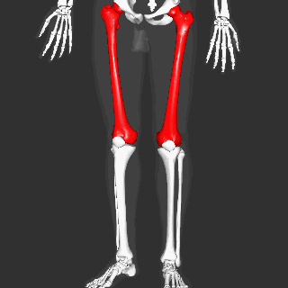
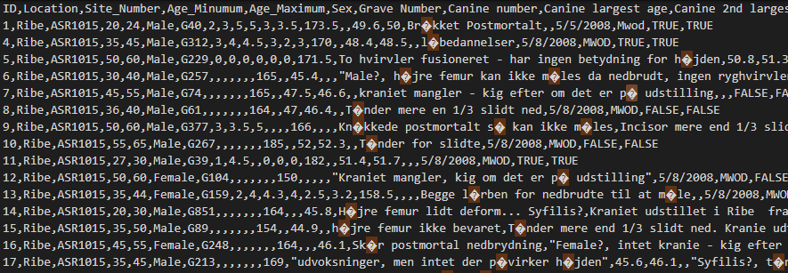
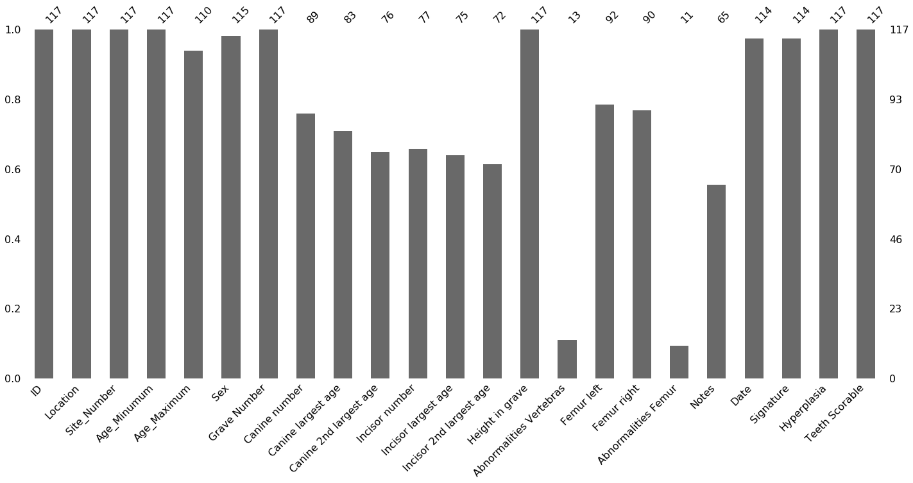

# Height Estimation from Skeletal Remains 
 
 

El objetivo de este proyecto es poder estimar la altura de un ser humano en base a los restos óseos. Para esto vamos a utilizar el dataset utilizado en un  proyecto de biomedicina en la University of Southern Denmark, titulado “[Heigh Estimation from Skeletal Remains](http://www.adbou.dk/fileadmin/adbou/projektopgaver/ADBOU_linear_regression_Mette_Wodx.pdf)” el cual contiene información de medidas de diferentes restos óseos antiguos encontrados en el pueblo Ribe de Dinamarca.

## Introducción

Utilizar restos óseos para estimar la altura de una persona es una herramienta muy util en la medicina forense y antropología biológica. Muchas veces solo unos pocos huesos se encuentran en excavaciones arqueológicas. Pero con unos pocos huesos podemos estimar la altura de una persona, esto es posible por la relación de tamaño entre los huesos.

## Problema

 Se ha determinado que existe una relación entre el fémur, tibia, humero y el radio con la altura de una persona. A continuación se muestran las imágenes de los huesos mencionados para una referencia visual.

| Fémur | Tibia |
| :---: | :---: |
|||

| Humero | Radio |
| :---: | :---: |
|||

## Estudio de atributos

El dataset cuenta con 23 atributos:

* ID `Int64`
* Location `?`
* Site_Number `?`
* Age_Minumum `Int64`
* Age_Maximum `Float64`
* Sex `?`
* Grave Number `?`
* Canine number `Float64`
* Canine largest age `Float64`
* Canine 2nd largest age `Float64`
* Incisor number `Float64`
* Incisor largest age `Float64`
* Incisor 2nd largest age `Float64`
* Height in grave `Float64`
* Abnormalities Vertebras `?`
* Femur left `Float64`
* Femur right `Float64`
* Abnormalities Femur `?`
* Notes `?`
* Date `?`
* Signature `?`
* Hyperplasia `Bool`
* Teeth Scorable `Bool`

Estamos frente a un problema de regresion ya que la salida es un numero real. La variable objetivo es la altura de la persona, en este caso "Height in grave"

A continuación una breve descripción de las definiciones  para los atributos del dataset y porque pueden ser relevantes.

A simple vista podemos descartar el atributo id ya que no aporta valor y causa ruido. 


### Analizando el Dataset (código)

El dataset se encuentra en un archivo `.accdb` (Microsoft Access) asi que lo primero que vamos a hacer es exportarlo como `.csv`


Analizándolo rápidamente en un editor de texto podemos ver que contiene caracteres que no van a poder ser decodeados con UTF-8 (`�`). Los remplazamos rápidamente por `?`.



Ahora ya podemos cargarlo con `pandas`

[Vista detallada del dataset ➡](./2_src/pf_overview.html)


```python
import missingno as msno
import pandas as pd
```


```python
data = pd.read_csv('../dataindsamling.csv')
```
### Missing Values

```python
msno.matrix(data)
```


```python
msno.bar(data)
```





# References
[ADBOU](http://www.adbou.dk/fileadmin/adbou/projektopgaver/ADBOU_linear_regression_Mette_Wodx.pdf)