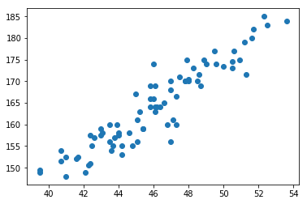
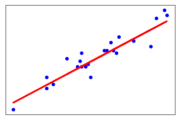

### Analizando el Dataset (código)

El dataset se encuentra en un archivo `.accdb` (Microsoft Access) asi que lo primero que vamos a hacer es exportarlo como `.csv`


Analizándolo rápidamente en un editor de texto podemos ver que contiene caracteres que no van a poder ser decodeados con UTF-8 (`�`) ya que los comentarios estan en danes. Los remplazamos rápidamente por `?`.


Ahora ya podemos cargarlo con `pandas`

[Vista detallada del dataset ➡](./2_src/pf_overview.html)


### Importando librerias


```python
import missingno as msno
import pandas as pd
import pandas_profiling as pf
import numpy as np
import matplotlib.pyplot as plt
import seaborn as sns
```

### Cargando el dataset


```python
data = pd.read_csv('../dataindsamling.csv')
```

### Missing Values

Vamos a utilizar la libreria `missingno` para ver la estructura de los datos faltantes.


```python
msno.matrix(data)
```


```python
msno.bar(data)
```


Podemos ver que hay una gran cantidad de datos faltantes, sobretodo en `Abnormalities Vertebras` y `Abnormalities Femur`. Como el objetivo de este estudio es predecir la altura en base al tamaño del femur vamos a comenzar por solucionar el problema con los missng values de `Femur left` y `Femur right`.

Como vimos en el analisis de atributos existen valores iguales a 0, para nosotros esos valores son iguales a `NaN` ya que no aporntan a la solucion del problema.


```python
data.loc[data['Femur left']      == 0.0] = np.nan
data.loc[data['Femur right']     == 0.0] = np.nan
data.loc[data['Height in grave'] == 0.0] = np.nan
```


```python
femur_size = data[['ID','Femur left','Femur right']]
```


```python
msno.matrix(femur_size[['Femur left','Femur right']])
```


```python
full_values_femur = pd.DataFrame(data=femur_size)
```


```python
full_values_femur = femur_size.dropna()
```

Una vez eliminados los valores `NaN` podemos ver de que restos tenemos el tamaño de ambos femur y ver si existe una gran diferencia de tamaño entre ellos para mas adelante sustituir los faltantes con su contraparte.


```python
msno.matrix(full_values_femur[['Femur left','Femur right']])
```


```python
r_femur__l_femur_difference = pd.DataFrame()
r_femur__l_femur_difference['Difference'] = abs(full_values_femur['Femur left'] - full_values_femur['Femur right'])
```


```python
full_values_femur = r_femur__l_femur_difference.Difference.sort_values(ascending=False)
```


```python
full_values_femur.head(5)
```


    64     2.6
    102    1.4
    51     1.0
    4      0.9
    105    0.8
    Name: Difference, dtype: float64

### Outlyers

Podemos ver que la diferencia de tamaño es muy poca entre los femurs


```python
full_values_femur.describe()
```


    count    64.000000
    mean      0.406250
    std       0.407031
    min       0.000000
    25%       0.100000
    50%       0.350000
    75%       0.600000
    max       2.600000
    Name: Difference, dtype: float64


```python
fig, ax = plt.subplots(figsize=(2,8))
sns.boxplot(ax=ax, data=full_values_femur)
```


Podemos ver que la diferencia entre el femur derecho e izquierdo  suele ser muy pequeña, asi que vamos a a signarle a los valores faltantes que tienen una contraparte su valor.


```python
data.loc[data['Femur left'].isnull(),'Femur left']   = data['Femur right']
data.loc[data['Femur right'].isnull(),'Femur right'] = data['Femur left']
```


```python
both_missing = data[data['Femur left'].isnull()==True]
len(both_missing)
```


    26


Podemos ver que quedamos con 26 de 117 valores NaN para los cuales no sabemos las medidas de ningun femur.


```python
both_missing
```


<div>
<style scoped>
    .dataframe tbody tr th:only-of-type {
        vertical-align: middle;
    }

    .dataframe tbody tr th {
        vertical-align: top;
    }

    .dataframe thead th {
        text-align: right;
    }
</style>
<table border="1" class="dataframe">
  <thead>
    <tr style="text-align: right;">
      <th></th>
      <th>ID</th>
      <th>Location</th>
      <th>Site_Number</th>
      <th>Age_Minumum</th>
      <th>Age_Maximum</th>
      <th>Sex</th>
      <th>Grave Number</th>
      <th>Canine number</th>
      <th>Canine largest age</th>
      <th>Canine 2nd largest age</th>
      <th>...</th>
      <th>Height in grave</th>
      <th>Abnormalities Vertebras</th>
      <th>Femur left</th>
      <th>Femur right</th>
      <th>Abnormalities Femur</th>
      <th>Notes</th>
      <th>Date</th>
      <th>Signature</th>
      <th>Hyperplasia</th>
      <th>Teeth Scorable</th>
    </tr>
  </thead>
  <tbody>
    <tr>
      <th>6</th>
      <td>9.0</td>
      <td>Ribe</td>
      <td>ASR1015</td>
      <td>50.0</td>
      <td>60.0</td>
      <td>Male</td>
      <td>G377</td>
      <td>3.0</td>
      <td>3.5</td>
      <td>5.0</td>
      <td>...</td>
      <td>166.0</td>
      <td>NaN</td>
      <td>NaN</td>
      <td>NaN</td>
      <td>Kn?kkede postmortalt s? kan ikke m?les</td>
      <td>Incisor mere end 1/3 slidt ned</td>
      <td>5/8/2008</td>
      <td>MWOD</td>
      <td>1.0</td>
      <td>1.0</td>
    </tr>
    <tr>
      <th>9</th>
      <td>12.0</td>
      <td>Ribe</td>
      <td>ASR1015</td>
      <td>50.0</td>
      <td>60.0</td>
      <td>Female</td>
      <td>G104</td>
      <td>NaN</td>
      <td>NaN</td>
      <td>NaN</td>
      <td>...</td>
      <td>150.0</td>
      <td>NaN</td>
      <td>NaN</td>
      <td>NaN</td>
      <td>NaN</td>
      <td>Kraniet mangler, kig om det er p? udstilling</td>
      <td>5/8/2008</td>
      <td>MWOD</td>
      <td>0.0</td>
      <td>0.0</td>
    </tr>
    <tr>
      <th>10</th>
      <td>13.0</td>
      <td>Ribe</td>
      <td>ASR1015</td>
      <td>35.0</td>
      <td>44.0</td>
      <td>Female</td>
      <td>G159</td>
      <td>2.0</td>
      <td>4.0</td>
      <td>4.3</td>
      <td>...</td>
      <td>158.5</td>
      <td>NaN</td>
      <td>NaN</td>
      <td>NaN</td>
      <td>Begge l?rben for nedbrudte til at m?le</td>
      <td>NaN</td>
      <td>5/8/2008</td>
      <td>MWOD</td>
      <td>0.0</td>
      <td>1.0</td>
    </tr>
    <tr>
      <th>30</th>
      <td>NaN</td>
      <td>NaN</td>
      <td>NaN</td>
      <td>NaN</td>
      <td>NaN</td>
      <td>NaN</td>
      <td>NaN</td>
      <td>NaN</td>
      <td>NaN</td>
      <td>NaN</td>
      <td>...</td>
      <td>NaN</td>
      <td>NaN</td>
      <td>NaN</td>
      <td>NaN</td>
      <td>NaN</td>
      <td>NaN</td>
      <td>NaN</td>
      <td>NaN</td>
      <td>NaN</td>
      <td>NaN</td>
    </tr>
    <tr>
      <th>46</th>
      <td>NaN</td>
      <td>NaN</td>
      <td>NaN</td>
      <td>NaN</td>
      <td>NaN</td>
      <td>NaN</td>
      <td>NaN</td>
      <td>NaN</td>
      <td>NaN</td>
      <td>NaN</td>
      <td>...</td>
      <td>NaN</td>
      <td>NaN</td>
      <td>NaN</td>
      <td>NaN</td>
      <td>NaN</td>
      <td>NaN</td>
      <td>NaN</td>
      <td>NaN</td>
      <td>NaN</td>
      <td>NaN</td>
    </tr>
    <tr>
      <th>52</th>
      <td>56.0</td>
      <td>Ribe</td>
      <td>ASR1015</td>
      <td>35.0</td>
      <td>40.0</td>
      <td>Female</td>
      <td>G808</td>
      <td>0.0</td>
      <td>0.0</td>
      <td>0.0</td>
      <td>...</td>
      <td>153.0</td>
      <td>NaN</td>
      <td>NaN</td>
      <td>NaN</td>
      <td>NaN</td>
      <td>Intet at kigge p?. Intet kranie. Female?</td>
      <td>5/27/2008</td>
      <td>MWOD</td>
      <td>0.0</td>
      <td>0.0</td>
    </tr>
    <tr>
      <th>53</th>
      <td>NaN</td>
      <td>NaN</td>
      <td>NaN</td>
      <td>NaN</td>
      <td>NaN</td>
      <td>NaN</td>
      <td>NaN</td>
      <td>NaN</td>
      <td>NaN</td>
      <td>NaN</td>
      <td>...</td>
      <td>NaN</td>
      <td>NaN</td>
      <td>NaN</td>
      <td>NaN</td>
      <td>NaN</td>
      <td>NaN</td>
      <td>NaN</td>
      <td>NaN</td>
      <td>NaN</td>
      <td>NaN</td>
    </tr>
    <tr>
      <th>54</th>
      <td>58.0</td>
      <td>Ribe</td>
      <td>ASR1015</td>
      <td>50.0</td>
      <td>60.0</td>
      <td>NaN</td>
      <td>G802</td>
      <td>3.0</td>
      <td>4.0</td>
      <td>2.5</td>
      <td>...</td>
      <td>165.0</td>
      <td>NaN</td>
      <td>NaN</td>
      <td>NaN</td>
      <td>NaN</td>
      <td>K?n ukendt. T?nder har ikke noget at sidde fas...</td>
      <td>5/27/2008</td>
      <td>MWOD</td>
      <td>1.0</td>
      <td>1.0</td>
    </tr>
    <tr>
      <th>55</th>
      <td>NaN</td>
      <td>NaN</td>
      <td>NaN</td>
      <td>NaN</td>
      <td>NaN</td>
      <td>NaN</td>
      <td>NaN</td>
      <td>NaN</td>
      <td>NaN</td>
      <td>NaN</td>
      <td>...</td>
      <td>NaN</td>
      <td>NaN</td>
      <td>NaN</td>
      <td>NaN</td>
      <td>NaN</td>
      <td>NaN</td>
      <td>NaN</td>
      <td>NaN</td>
      <td>NaN</td>
      <td>NaN</td>
    </tr>
    <tr>
      <th>56</th>
      <td>NaN</td>
      <td>NaN</td>
      <td>NaN</td>
      <td>NaN</td>
      <td>NaN</td>
      <td>NaN</td>
      <td>NaN</td>
      <td>NaN</td>
      <td>NaN</td>
      <td>NaN</td>
      <td>...</td>
      <td>NaN</td>
      <td>NaN</td>
      <td>NaN</td>
      <td>NaN</td>
      <td>NaN</td>
      <td>NaN</td>
      <td>NaN</td>
      <td>NaN</td>
      <td>NaN</td>
      <td>NaN</td>
    </tr>
    <tr>
      <th>68</th>
      <td>NaN</td>
      <td>NaN</td>
      <td>NaN</td>
      <td>NaN</td>
      <td>NaN</td>
      <td>NaN</td>
      <td>NaN</td>
      <td>NaN</td>
      <td>NaN</td>
      <td>NaN</td>
      <td>...</td>
      <td>NaN</td>
      <td>NaN</td>
      <td>NaN</td>
      <td>NaN</td>
      <td>NaN</td>
      <td>NaN</td>
      <td>NaN</td>
      <td>NaN</td>
      <td>NaN</td>
      <td>NaN</td>
    </tr>
    <tr>
      <th>69</th>
      <td>NaN</td>
      <td>NaN</td>
      <td>NaN</td>
      <td>NaN</td>
      <td>NaN</td>
      <td>NaN</td>
      <td>NaN</td>
      <td>NaN</td>
      <td>NaN</td>
      <td>NaN</td>
      <td>...</td>
      <td>NaN</td>
      <td>NaN</td>
      <td>NaN</td>
      <td>NaN</td>
      <td>NaN</td>
      <td>NaN</td>
      <td>NaN</td>
      <td>NaN</td>
      <td>NaN</td>
      <td>NaN</td>
    </tr>
    <tr>
      <th>70</th>
      <td>74.0</td>
      <td>Ribe</td>
      <td>ASR1015</td>
      <td>40.0</td>
      <td>50.0</td>
      <td>Male</td>
      <td>G846</td>
      <td>0.0</td>
      <td>0.0</td>
      <td>0.0</td>
      <td>...</td>
      <td>173.0</td>
      <td>NaN</td>
      <td>NaN</td>
      <td>NaN</td>
      <td>NaN</td>
      <td>T?nder faldet ud og remodeleret. Begge l?rben ...</td>
      <td>5/27/2008</td>
      <td>MWOD</td>
      <td>0.0</td>
      <td>0.0</td>
    </tr>
    <tr>
      <th>72</th>
      <td>76.0</td>
      <td>Ribe</td>
      <td>ASR1015</td>
      <td>30.0</td>
      <td>40.0</td>
      <td>Male</td>
      <td>G897</td>
      <td>NaN</td>
      <td>NaN</td>
      <td>NaN</td>
      <td>...</td>
      <td>162.0</td>
      <td>NaN</td>
      <td>NaN</td>
      <td>NaN</td>
      <td>NaN</td>
      <td>NaN</td>
      <td>5/28/2008</td>
      <td>MWOD</td>
      <td>1.0</td>
      <td>1.0</td>
    </tr>
    <tr>
      <th>74</th>
      <td>78.0</td>
      <td>Ribe</td>
      <td>ASR1015</td>
      <td>35.0</td>
      <td>45.0</td>
      <td>Male</td>
      <td>G894</td>
      <td>0.0</td>
      <td>0.0</td>
      <td>0.0</td>
      <td>...</td>
      <td>168.5</td>
      <td>NaN</td>
      <td>NaN</td>
      <td>NaN</td>
      <td>NaN</td>
      <td>Der er et s?t l?rben i overskud  og jeg m?ler ...</td>
      <td>5/28/2008</td>
      <td>MWOD</td>
      <td>0.0</td>
      <td>0.0</td>
    </tr>
    <tr>
      <th>76</th>
      <td>NaN</td>
      <td>NaN</td>
      <td>NaN</td>
      <td>NaN</td>
      <td>NaN</td>
      <td>NaN</td>
      <td>NaN</td>
      <td>NaN</td>
      <td>NaN</td>
      <td>NaN</td>
      <td>...</td>
      <td>NaN</td>
      <td>NaN</td>
      <td>NaN</td>
      <td>NaN</td>
      <td>NaN</td>
      <td>NaN</td>
      <td>NaN</td>
      <td>NaN</td>
      <td>NaN</td>
      <td>NaN</td>
    </tr>
    <tr>
      <th>78</th>
      <td>NaN</td>
      <td>NaN</td>
      <td>NaN</td>
      <td>NaN</td>
      <td>NaN</td>
      <td>NaN</td>
      <td>NaN</td>
      <td>NaN</td>
      <td>NaN</td>
      <td>NaN</td>
      <td>...</td>
      <td>NaN</td>
      <td>NaN</td>
      <td>NaN</td>
      <td>NaN</td>
      <td>NaN</td>
      <td>NaN</td>
      <td>NaN</td>
      <td>NaN</td>
      <td>NaN</td>
      <td>NaN</td>
    </tr>
    <tr>
      <th>83</th>
      <td>NaN</td>
      <td>NaN</td>
      <td>NaN</td>
      <td>NaN</td>
      <td>NaN</td>
      <td>NaN</td>
      <td>NaN</td>
      <td>NaN</td>
      <td>NaN</td>
      <td>NaN</td>
      <td>...</td>
      <td>NaN</td>
      <td>NaN</td>
      <td>NaN</td>
      <td>NaN</td>
      <td>NaN</td>
      <td>NaN</td>
      <td>NaN</td>
      <td>NaN</td>
      <td>NaN</td>
      <td>NaN</td>
    </tr>
    <tr>
      <th>84</th>
      <td>NaN</td>
      <td>NaN</td>
      <td>NaN</td>
      <td>NaN</td>
      <td>NaN</td>
      <td>NaN</td>
      <td>NaN</td>
      <td>NaN</td>
      <td>NaN</td>
      <td>NaN</td>
      <td>...</td>
      <td>NaN</td>
      <td>NaN</td>
      <td>NaN</td>
      <td>NaN</td>
      <td>NaN</td>
      <td>NaN</td>
      <td>NaN</td>
      <td>NaN</td>
      <td>NaN</td>
      <td>NaN</td>
    </tr>
    <tr>
      <th>85</th>
      <td>NaN</td>
      <td>NaN</td>
      <td>NaN</td>
      <td>NaN</td>
      <td>NaN</td>
      <td>NaN</td>
      <td>NaN</td>
      <td>NaN</td>
      <td>NaN</td>
      <td>NaN</td>
      <td>...</td>
      <td>NaN</td>
      <td>NaN</td>
      <td>NaN</td>
      <td>NaN</td>
      <td>NaN</td>
      <td>NaN</td>
      <td>NaN</td>
      <td>NaN</td>
      <td>NaN</td>
      <td>NaN</td>
    </tr>
    <tr>
      <th>86</th>
      <td>90.0</td>
      <td>Ribe</td>
      <td>ASR1015</td>
      <td>20.0</td>
      <td>25.0</td>
      <td>Female</td>
      <td>G99</td>
      <td>1.0</td>
      <td>4.0</td>
      <td>NaN</td>
      <td>...</td>
      <td>161.0</td>
      <td>NaN</td>
      <td>NaN</td>
      <td>NaN</td>
      <td>NaN</td>
      <td>NaN</td>
      <td>5/28/2008</td>
      <td>MWOD</td>
      <td>1.0</td>
      <td>1.0</td>
    </tr>
    <tr>
      <th>91</th>
      <td>NaN</td>
      <td>NaN</td>
      <td>NaN</td>
      <td>NaN</td>
      <td>NaN</td>
      <td>NaN</td>
      <td>NaN</td>
      <td>NaN</td>
      <td>NaN</td>
      <td>NaN</td>
      <td>...</td>
      <td>NaN</td>
      <td>NaN</td>
      <td>NaN</td>
      <td>NaN</td>
      <td>NaN</td>
      <td>NaN</td>
      <td>NaN</td>
      <td>NaN</td>
      <td>NaN</td>
      <td>NaN</td>
    </tr>
    <tr>
      <th>92</th>
      <td>NaN</td>
      <td>NaN</td>
      <td>NaN</td>
      <td>NaN</td>
      <td>NaN</td>
      <td>NaN</td>
      <td>NaN</td>
      <td>NaN</td>
      <td>NaN</td>
      <td>NaN</td>
      <td>...</td>
      <td>NaN</td>
      <td>NaN</td>
      <td>NaN</td>
      <td>NaN</td>
      <td>NaN</td>
      <td>NaN</td>
      <td>NaN</td>
      <td>NaN</td>
      <td>NaN</td>
      <td>NaN</td>
    </tr>
    <tr>
      <th>94</th>
      <td>98.0</td>
      <td>Ribe</td>
      <td>ASR1015</td>
      <td>60.0</td>
      <td>NaN</td>
      <td>Male</td>
      <td>G419</td>
      <td>0.0</td>
      <td>0.0</td>
      <td>0.0</td>
      <td>...</td>
      <td>167.0</td>
      <td>NaN</td>
      <td>NaN</td>
      <td>NaN</td>
      <td>NaN</td>
      <td>T?nder mere end 1/3 slidte. Skelet i d?rlig st...</td>
      <td>5/28/2008</td>
      <td>MWOD</td>
      <td>0.0</td>
      <td>0.0</td>
    </tr>
    <tr>
      <th>108</th>
      <td>NaN</td>
      <td>NaN</td>
      <td>NaN</td>
      <td>NaN</td>
      <td>NaN</td>
      <td>NaN</td>
      <td>NaN</td>
      <td>NaN</td>
      <td>NaN</td>
      <td>NaN</td>
      <td>...</td>
      <td>NaN</td>
      <td>NaN</td>
      <td>NaN</td>
      <td>NaN</td>
      <td>NaN</td>
      <td>NaN</td>
      <td>NaN</td>
      <td>NaN</td>
      <td>NaN</td>
      <td>NaN</td>
    </tr>
    <tr>
      <th>109</th>
      <td>113.0</td>
      <td>Ribe</td>
      <td>ASR1015</td>
      <td>25.0</td>
      <td>35.0</td>
      <td>Male</td>
      <td>G211</td>
      <td>4.0</td>
      <td>4.0</td>
      <td>4.5</td>
      <td>...</td>
      <td>163.0</td>
      <td>NaN</td>
      <td>NaN</td>
      <td>NaN</td>
      <td>NaN</td>
      <td>Male?</td>
      <td>5/28/2008</td>
      <td>MWOD</td>
      <td>1.0</td>
      <td>1.0</td>
    </tr>
  </tbody>
</table>
<p>26 rows × 23 columns</p>
</div>


Tambien podemos ver que la mayoria de estos casos no esta bien documentado y tiene muchos valores `NaN`. Vamos a eliminar los que tienen valores `NaN` en la altura de la tumba ya que no tienen informacion relevante para el caso de estudio.


```python
both_missing = both_missing[np.isfinite(both_missing['Height in grave'])]
both_missing
```


<div>
<style scoped>
    .dataframe tbody tr th:only-of-type {
        vertical-align: middle;
    }

    .dataframe tbody tr th {
        vertical-align: top;
    }

    .dataframe thead th {
        text-align: right;
    }
</style>
<table border="1" class="dataframe">
  <thead>
    <tr style="text-align: right;">
      <th></th>
      <th>ID</th>
      <th>Location</th>
      <th>Site_Number</th>
      <th>Age_Minumum</th>
      <th>Age_Maximum</th>
      <th>Sex</th>
      <th>Grave Number</th>
      <th>Canine number</th>
      <th>Canine largest age</th>
      <th>Canine 2nd largest age</th>
      <th>...</th>
      <th>Height in grave</th>
      <th>Abnormalities Vertebras</th>
      <th>Femur left</th>
      <th>Femur right</th>
      <th>Abnormalities Femur</th>
      <th>Notes</th>
      <th>Date</th>
      <th>Signature</th>
      <th>Hyperplasia</th>
      <th>Teeth Scorable</th>
    </tr>
  </thead>
  <tbody>
  </tbody>
</table>
<p>0 rows × 23 columns</p>
</div>


```python
import pandas as pd
import numpy as np
import matplotlib.pyplot as plt
```


```python
data = pd.read_csv('dataindsamling.csv')
```


```python
data.columns
```


    Index(['ID', 'Location', 'Site_Number', 'Age_Minumum', 'Age_Maximum', 'Sex',
           'Grave Number', 'Canine number', 'Canine largest age',
           'Canine 2nd largest age', 'Incisor number', 'Incisor largest age',
           'Incisor 2nd largest age', 'Height in grave', 'Abnormalities Vertebras',
           'Femur left', 'Femur right', 'Abnormalities Femur', 'Notes', 'Date',
           'Signature', 'Hyperplasia', 'Teeth Scorable'],
          dtype='object')


```python
femur_sizes = pd.DataFrame()
femur_sizes['Femur right'] = data['Femur right'].values
femur_sizes['Height in grave'] = data['Height in grave'].values
femur_sizes = femur_sizes[np.isfinite(femur_sizes['Femur right'])]
femur_sizes = femur_sizes[np.isfinite(femur_sizes['Height in grave'])]
femur_sizes = femur_sizes[femur_sizes['Femur right'] != 0]
femur_sizes = femur_sizes[femur_sizes['Height in grave'] != 0]
```


```python
femur_sizes.head(5)
```


<div>
<style scoped>
    .dataframe tbody tr th:only-of-type {
        vertical-align: middle;
    }

    .dataframe tbody tr th {
        vertical-align: top;
    }

    .dataframe thead th {
        text-align: right;
    }
</style>
<table border="1" class="dataframe">
  <thead>
    <tr style="text-align: right;">
      <th></th>
      <th>Femur right</th>
      <th>Height in grave</th>
    </tr>
  </thead>
  <tbody>
    <tr>
      <th>0</th>
      <td>50.0</td>
      <td>173.5</td>
    </tr>
    <tr>
      <th>1</th>
      <td>48.5</td>
      <td>170.0</td>
    </tr>
    <tr>
      <th>2</th>
      <td>51.3</td>
      <td>171.5</td>
    </tr>
    <tr>
      <th>4</th>
      <td>46.6</td>
      <td>165.0</td>
    </tr>
    <tr>
      <th>5</th>
      <td>46.4</td>
      <td>164.0</td>
    </tr>
  </tbody>
</table>
</div>


```python
plt.scatter(femur_sizes['Femur right'], femur_sizes['Height in grave'])
```


    <matplotlib.collections.PathCollection at 0x111de7278>





```python
from sklearn import linear_model
from sklearn.metrics import mean_squared_error, r2_score
```

Separando training y test set


```python
len(femur_sizes)*0.3
```


    23.7


```python
X_train = femur_sizes['Femur right'][23:]
X_test  = femur_sizes['Femur right'][:23]
y_train = femur_sizes['Height in grave'][23:]
y_test  = femur_sizes['Height in grave'][:23]
```


```python
regression = linear_model.LinearRegression()
```


```python
X_train = X_train.values.reshape(-1, 1)
y_train = y_train.values.reshape(-1, 1)
X_test  = X_test.values.reshape(-1, 1)
y_test  = y_test.values.reshape(-1, 1)
```


```python
regression.fit(X_train, y_train)
```


    LinearRegression(copy_X=True, fit_intercept=True, n_jobs=1, normalize=False)


```python
y_pred = regression.predict(X_test)
```


```python
print('Coeficiente: \n', regression.coef_)
print('Mean squared error: %.2f'
      % mean_squared_error(y_test, y_pred))
print('Variance score: %.2f' % r2_score(y_test, y_pred))

plt.scatter(X_test, y_test,  color='blue')
plt.plot(X_test, y_pred, color='red', linewidth=3)

plt.xticks(())
plt.yticks(())

plt.show()
```

    Coeficientes: 
     [[2.63314697]]
    Mean squared error: 9.74
    Variance score: 0.87





# References
[ADBOU](http://www.adbou.dk/fileadmin/adbou/projektopgaver/ADBOU_linear_regression_Mette_Wodx.pdf)

[Human Osteological Methods](http://www.adbou.dk/fileadmin/adbou/manualer/humostman2015.pdf)