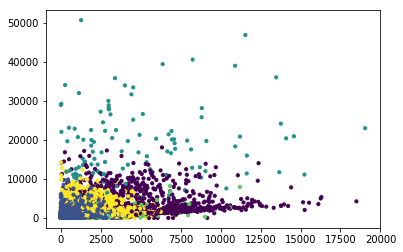

# K-Means Clustering

##### Este caso requiere desarrollar una segmentación de clientes para definir la estrategia de marketing. El conjunto de datos de muestra resume el comportamiento de aproximadamente 9000 titulares de tarjetas de crédito activas durante los últimos 6 meses. El archivo está compuesto por 18 attributos.

Importando librerias


```python
import matplotlib.pyplot as plt
import pandas as pd
from sklearn.cluster import KMeans 
```


```python
data = pd.read_csv('bankdata.csv')
```


```python
data.head()
```


<div>
<style scoped>
    .dataframe tbody tr th:only-of-type {
        vertical-align: middle;
    }

    .dataframe tbody tr th {
        vertical-align: top;
    }

    .dataframe thead th {
        text-align: right;
    }
</style>
<table border="1" class="dataframe">
  <thead>
    <tr style="text-align: right;">
      <th></th>
      <th>CUST_ID</th>
      <th>BALANCE</th>
      <th>BALANCE_FREQUENCY</th>
      <th>PURCHASES</th>
      <th>ONEOFF_PURCHASES</th>
      <th>INSTALLMENTS_PURCHASES</th>
      <th>CASH_ADVANCE</th>
      <th>PURCHASES_FREQUENCY</th>
      <th>ONEOFF_PURCHASES_FREQUENCY</th>
      <th>PURCHASES_INSTALLMENTS_FREQUENCY</th>
      <th>CASH_ADVANCE_FREQUENCY</th>
      <th>CASH_ADVANCE_TRX</th>
      <th>PURCHASES_TRX</th>
      <th>CREDIT_LIMIT</th>
      <th>PAYMENTS</th>
      <th>MINIMUM_PAYMENTS</th>
      <th>PRC_FULL_PAYMENT</th>
      <th>TENURE</th>
    </tr>
  </thead>
  <tbody>
    <tr>
      <th>0</th>
      <td>C10001</td>
      <td>40.900749</td>
      <td>0.818182</td>
      <td>95.40</td>
      <td>0.00</td>
      <td>95.4</td>
      <td>0.000000</td>
      <td>0.166667</td>
      <td>0.000000</td>
      <td>0.083333</td>
      <td>0.000000</td>
      <td>0</td>
      <td>2</td>
      <td>1000.0</td>
      <td>201.802084</td>
      <td>139.509787</td>
      <td>0.000000</td>
      <td>12</td>
    </tr>
    <tr>
      <th>1</th>
      <td>C10002</td>
      <td>3202.467416</td>
      <td>0.909091</td>
      <td>0.00</td>
      <td>0.00</td>
      <td>0.0</td>
      <td>6442.945483</td>
      <td>0.000000</td>
      <td>0.000000</td>
      <td>0.000000</td>
      <td>0.250000</td>
      <td>4</td>
      <td>0</td>
      <td>7000.0</td>
      <td>4103.032597</td>
      <td>1072.340217</td>
      <td>0.222222</td>
      <td>12</td>
    </tr>
    <tr>
      <th>2</th>
      <td>C10003</td>
      <td>2495.148862</td>
      <td>1.000000</td>
      <td>773.17</td>
      <td>773.17</td>
      <td>0.0</td>
      <td>0.000000</td>
      <td>1.000000</td>
      <td>1.000000</td>
      <td>0.000000</td>
      <td>0.000000</td>
      <td>0</td>
      <td>12</td>
      <td>7500.0</td>
      <td>622.066742</td>
      <td>627.284787</td>
      <td>0.000000</td>
      <td>12</td>
    </tr>
    <tr>
      <th>3</th>
      <td>C10004</td>
      <td>1666.670542</td>
      <td>0.636364</td>
      <td>1499.00</td>
      <td>1499.00</td>
      <td>0.0</td>
      <td>205.788017</td>
      <td>0.083333</td>
      <td>0.083333</td>
      <td>0.000000</td>
      <td>0.083333</td>
      <td>1</td>
      <td>1</td>
      <td>7500.0</td>
      <td>0.000000</td>
      <td>NaN</td>
      <td>0.000000</td>
      <td>12</td>
    </tr>
    <tr>
      <th>4</th>
      <td>C10005</td>
      <td>817.714335</td>
      <td>1.000000</td>
      <td>16.00</td>
      <td>16.00</td>
      <td>0.0</td>
      <td>0.000000</td>
      <td>0.083333</td>
      <td>0.083333</td>
      <td>0.000000</td>
      <td>0.000000</td>
      <td>0</td>
      <td>1</td>
      <td>1200.0</td>
      <td>678.334763</td>
      <td>244.791237</td>
      <td>0.000000</td>
      <td>12</td>
    </tr>
  </tbody>
</table>
</div>


```python
data.columns
```


    Index(['CUST_ID', 'BALANCE', 'BALANCE_FREQUENCY', 'PURCHASES',
           'ONEOFF_PURCHASES', 'INSTALLMENTS_PURCHASES', 'CASH_ADVANCE',
           'PURCHASES_FREQUENCY', 'ONEOFF_PURCHASES_FREQUENCY',
           'PURCHASES_INSTALLMENTS_FREQUENCY', 'CASH_ADVANCE_FREQUENCY',
           'CASH_ADVANCE_TRX', 'PURCHASES_TRX', 'CREDIT_LIMIT', 'PAYMENTS',
           'MINIMUM_PAYMENTS', 'PRC_FULL_PAYMENT', 'TENURE'],
          dtype='object')


```python
data = data.drop(['CUST_ID'],axis=1)
```


```python
data.head()
```


<div>
<style scoped>
    .dataframe tbody tr th:only-of-type {
        vertical-align: middle;
    }

    .dataframe tbody tr th {
        vertical-align: top;
    }

    .dataframe thead th {
        text-align: right;
    }
</style>
<table border="1" class="dataframe">
  <thead>
    <tr style="text-align: right;">
      <th></th>
      <th>BALANCE</th>
      <th>BALANCE_FREQUENCY</th>
      <th>PURCHASES</th>
      <th>ONEOFF_PURCHASES</th>
      <th>INSTALLMENTS_PURCHASES</th>
      <th>CASH_ADVANCE</th>
      <th>PURCHASES_FREQUENCY</th>
      <th>ONEOFF_PURCHASES_FREQUENCY</th>
      <th>PURCHASES_INSTALLMENTS_FREQUENCY</th>
      <th>CASH_ADVANCE_FREQUENCY</th>
      <th>CASH_ADVANCE_TRX</th>
      <th>PURCHASES_TRX</th>
      <th>CREDIT_LIMIT</th>
      <th>PAYMENTS</th>
      <th>MINIMUM_PAYMENTS</th>
      <th>PRC_FULL_PAYMENT</th>
      <th>TENURE</th>
    </tr>
  </thead>
  <tbody>
    <tr>
      <th>0</th>
      <td>40.900749</td>
      <td>0.818182</td>
      <td>95.40</td>
      <td>0.00</td>
      <td>95.4</td>
      <td>0.000000</td>
      <td>0.166667</td>
      <td>0.000000</td>
      <td>0.083333</td>
      <td>0.000000</td>
      <td>0</td>
      <td>2</td>
      <td>1000.0</td>
      <td>201.802084</td>
      <td>139.509787</td>
      <td>0.000000</td>
      <td>12</td>
    </tr>
    <tr>
      <th>1</th>
      <td>3202.467416</td>
      <td>0.909091</td>
      <td>0.00</td>
      <td>0.00</td>
      <td>0.0</td>
      <td>6442.945483</td>
      <td>0.000000</td>
      <td>0.000000</td>
      <td>0.000000</td>
      <td>0.250000</td>
      <td>4</td>
      <td>0</td>
      <td>7000.0</td>
      <td>4103.032597</td>
      <td>1072.340217</td>
      <td>0.222222</td>
      <td>12</td>
    </tr>
    <tr>
      <th>2</th>
      <td>2495.148862</td>
      <td>1.000000</td>
      <td>773.17</td>
      <td>773.17</td>
      <td>0.0</td>
      <td>0.000000</td>
      <td>1.000000</td>
      <td>1.000000</td>
      <td>0.000000</td>
      <td>0.000000</td>
      <td>0</td>
      <td>12</td>
      <td>7500.0</td>
      <td>622.066742</td>
      <td>627.284787</td>
      <td>0.000000</td>
      <td>12</td>
    </tr>
    <tr>
      <th>3</th>
      <td>1666.670542</td>
      <td>0.636364</td>
      <td>1499.00</td>
      <td>1499.00</td>
      <td>0.0</td>
      <td>205.788017</td>
      <td>0.083333</td>
      <td>0.083333</td>
      <td>0.000000</td>
      <td>0.083333</td>
      <td>1</td>
      <td>1</td>
      <td>7500.0</td>
      <td>0.000000</td>
      <td>NaN</td>
      <td>0.000000</td>
      <td>12</td>
    </tr>
    <tr>
      <th>4</th>
      <td>817.714335</td>
      <td>1.000000</td>
      <td>16.00</td>
      <td>16.00</td>
      <td>0.0</td>
      <td>0.000000</td>
      <td>0.083333</td>
      <td>0.083333</td>
      <td>0.000000</td>
      <td>0.000000</td>
      <td>0</td>
      <td>1</td>
      <td>1200.0</td>
      <td>678.334763</td>
      <td>244.791237</td>
      <td>0.000000</td>
      <td>12</td>
    </tr>
  </tbody>
</table>
</div>


```python
data.info()
```

    <class 'pandas.core.frame.DataFrame'>
    RangeIndex: 8950 entries, 0 to 8949
    Data columns (total 17 columns):
    BALANCE                             8950 non-null float64
    BALANCE_FREQUENCY                   8950 non-null float64
    PURCHASES                           8950 non-null float64
    ONEOFF_PURCHASES                    8950 non-null float64
    INSTALLMENTS_PURCHASES              8950 non-null float64
    CASH_ADVANCE                        8950 non-null float64
    PURCHASES_FREQUENCY                 8950 non-null float64
    ONEOFF_PURCHASES_FREQUENCY          8950 non-null float64
    PURCHASES_INSTALLMENTS_FREQUENCY    8950 non-null float64
    CASH_ADVANCE_FREQUENCY              8950 non-null float64
    CASH_ADVANCE_TRX                    8950 non-null int64
    PURCHASES_TRX                       8950 non-null int64
    CREDIT_LIMIT                        8949 non-null float64
    PAYMENTS                            8950 non-null float64
    MINIMUM_PAYMENTS                    8637 non-null float64
    PRC_FULL_PAYMENT                    8950 non-null float64
    TENURE                              8950 non-null int64
    dtypes: float64(14), int64(3)
    memory usage: 1.2 MB


```python
data.describe()
```


<div>
<style scoped>
    .dataframe tbody tr th:only-of-type {
        vertical-align: middle;
    }

    .dataframe tbody tr th {
        vertical-align: top;
    }

    .dataframe thead th {
        text-align: right;
    }
</style>
<table border="1" class="dataframe">
  <thead>
    <tr style="text-align: right;">
      <th></th>
      <th>BALANCE</th>
      <th>BALANCE_FREQUENCY</th>
      <th>PURCHASES</th>
      <th>ONEOFF_PURCHASES</th>
      <th>INSTALLMENTS_PURCHASES</th>
      <th>CASH_ADVANCE</th>
      <th>PURCHASES_FREQUENCY</th>
      <th>ONEOFF_PURCHASES_FREQUENCY</th>
      <th>PURCHASES_INSTALLMENTS_FREQUENCY</th>
      <th>CASH_ADVANCE_FREQUENCY</th>
      <th>CASH_ADVANCE_TRX</th>
      <th>PURCHASES_TRX</th>
      <th>CREDIT_LIMIT</th>
      <th>PAYMENTS</th>
      <th>MINIMUM_PAYMENTS</th>
      <th>PRC_FULL_PAYMENT</th>
      <th>TENURE</th>
    </tr>
  </thead>
  <tbody>
    <tr>
      <th>count</th>
      <td>8950.000000</td>
      <td>8950.000000</td>
      <td>8950.000000</td>
      <td>8950.000000</td>
      <td>8950.000000</td>
      <td>8950.000000</td>
      <td>8950.000000</td>
      <td>8950.000000</td>
      <td>8950.000000</td>
      <td>8950.000000</td>
      <td>8950.000000</td>
      <td>8950.000000</td>
      <td>8949.000000</td>
      <td>8950.000000</td>
      <td>8637.000000</td>
      <td>8950.000000</td>
      <td>8950.000000</td>
    </tr>
    <tr>
      <th>mean</th>
      <td>1564.474828</td>
      <td>0.877271</td>
      <td>1003.204834</td>
      <td>592.437371</td>
      <td>411.067645</td>
      <td>978.871112</td>
      <td>0.490351</td>
      <td>0.202458</td>
      <td>0.364437</td>
      <td>0.135144</td>
      <td>3.248827</td>
      <td>14.709832</td>
      <td>4494.449450</td>
      <td>1733.143852</td>
      <td>864.206542</td>
      <td>0.153715</td>
      <td>11.517318</td>
    </tr>
    <tr>
      <th>std</th>
      <td>2081.531879</td>
      <td>0.236904</td>
      <td>2136.634782</td>
      <td>1659.887917</td>
      <td>904.338115</td>
      <td>2097.163877</td>
      <td>0.401371</td>
      <td>0.298336</td>
      <td>0.397448</td>
      <td>0.200121</td>
      <td>6.824647</td>
      <td>24.857649</td>
      <td>3638.815725</td>
      <td>2895.063757</td>
      <td>2372.446607</td>
      <td>0.292499</td>
      <td>1.338331</td>
    </tr>
    <tr>
      <th>min</th>
      <td>0.000000</td>
      <td>0.000000</td>
      <td>0.000000</td>
      <td>0.000000</td>
      <td>0.000000</td>
      <td>0.000000</td>
      <td>0.000000</td>
      <td>0.000000</td>
      <td>0.000000</td>
      <td>0.000000</td>
      <td>0.000000</td>
      <td>0.000000</td>
      <td>50.000000</td>
      <td>0.000000</td>
      <td>0.019163</td>
      <td>0.000000</td>
      <td>6.000000</td>
    </tr>
    <tr>
      <th>25%</th>
      <td>128.281915</td>
      <td>0.888889</td>
      <td>39.635000</td>
      <td>0.000000</td>
      <td>0.000000</td>
      <td>0.000000</td>
      <td>0.083333</td>
      <td>0.000000</td>
      <td>0.000000</td>
      <td>0.000000</td>
      <td>0.000000</td>
      <td>1.000000</td>
      <td>1600.000000</td>
      <td>383.276166</td>
      <td>169.123707</td>
      <td>0.000000</td>
      <td>12.000000</td>
    </tr>
    <tr>
      <th>50%</th>
      <td>873.385231</td>
      <td>1.000000</td>
      <td>361.280000</td>
      <td>38.000000</td>
      <td>89.000000</td>
      <td>0.000000</td>
      <td>0.500000</td>
      <td>0.083333</td>
      <td>0.166667</td>
      <td>0.000000</td>
      <td>0.000000</td>
      <td>7.000000</td>
      <td>3000.000000</td>
      <td>856.901546</td>
      <td>312.343947</td>
      <td>0.000000</td>
      <td>12.000000</td>
    </tr>
    <tr>
      <th>75%</th>
      <td>2054.140036</td>
      <td>1.000000</td>
      <td>1110.130000</td>
      <td>577.405000</td>
      <td>468.637500</td>
      <td>1113.821139</td>
      <td>0.916667</td>
      <td>0.300000</td>
      <td>0.750000</td>
      <td>0.222222</td>
      <td>4.000000</td>
      <td>17.000000</td>
      <td>6500.000000</td>
      <td>1901.134317</td>
      <td>825.485459</td>
      <td>0.142857</td>
      <td>12.000000</td>
    </tr>
    <tr>
      <th>max</th>
      <td>19043.138560</td>
      <td>1.000000</td>
      <td>49039.570000</td>
      <td>40761.250000</td>
      <td>22500.000000</td>
      <td>47137.211760</td>
      <td>1.000000</td>
      <td>1.000000</td>
      <td>1.000000</td>
      <td>1.500000</td>
      <td>123.000000</td>
      <td>358.000000</td>
      <td>30000.000000</td>
      <td>50721.483360</td>
      <td>76406.207520</td>
      <td>1.000000</td>
      <td>12.000000</td>
    </tr>
  </tbody>
</table>
</div>


```python
data.count()
```


    BALANCE                             8950
    BALANCE_FREQUENCY                   8950
    PURCHASES                           8950
    ONEOFF_PURCHASES                    8950
    INSTALLMENTS_PURCHASES              8950
    CASH_ADVANCE                        8950
    PURCHASES_FREQUENCY                 8950
    ONEOFF_PURCHASES_FREQUENCY          8950
    PURCHASES_INSTALLMENTS_FREQUENCY    8950
    CASH_ADVANCE_FREQUENCY              8950
    CASH_ADVANCE_TRX                    8950
    PURCHASES_TRX                       8950
    CREDIT_LIMIT                        8949
    PAYMENTS                            8950
    MINIMUM_PAYMENTS                    8637
    PRC_FULL_PAYMENT                    8950
    TENURE                              8950
    dtype: int64


```python
data['MINIMUM_PAYMENTS']
```


    0         139.509787
    1        1072.340217
    2         627.284787
    3                NaN
    4         244.791237
    5        2407.246035
    6         198.065894
    7         532.033990
    8         311.963409
    9         100.302262
    10       2172.697765
    11        155.549069
    12        490.207013
    13        251.137986
    14        989.962866
    15       2109.906490
    16        376.579631
    17         73.203221
    18        744.613395
    19      12465.549380
    20      13557.297260
    21       1659.775075
    22         86.329554
    23       1425.426525
    24       1657.002877
    25        163.005536
    26        971.183209
    27        164.748819
    28       1648.851345
    29        159.684442
                ...     
    8920      233.229870
    8921       20.714869
    8922       81.407073
    8923      336.880119
    8924       44.254787
    8925       81.389378
    8926       52.453011
    8927       86.344733
    8928       73.848755
    8929             NaN
    8930       89.753056
    8931       89.496604
    8932       86.564172
    8933      337.294767
    8934       65.936751
    8935             NaN
    8936       86.868595
    8937       60.792450
    8938       21.821194
    8939      110.950798
    8940       82.771320
    8941      861.949906
    8942       86.283101
    8943       43.473717
    8944             NaN
    8945       48.886365
    8946             NaN
    8947       82.418369
    8948       55.755628
    8949       88.288956
    Name: MINIMUM_PAYMENTS, Length: 8950, dtype: float64


```python
data.isna().sum()
```


    BALANCE                               0
    BALANCE_FREQUENCY                     0
    PURCHASES                             0
    ONEOFF_PURCHASES                      0
    INSTALLMENTS_PURCHASES                0
    CASH_ADVANCE                          0
    PURCHASES_FREQUENCY                   0
    ONEOFF_PURCHASES_FREQUENCY            0
    PURCHASES_INSTALLMENTS_FREQUENCY      0
    CASH_ADVANCE_FREQUENCY                0
    CASH_ADVANCE_TRX                      0
    PURCHASES_TRX                         0
    CREDIT_LIMIT                          1
    PAYMENTS                              0
    MINIMUM_PAYMENTS                    313
    PRC_FULL_PAYMENT                      0
    TENURE                                0
    dtype: int64


```python
data.fillna(data.mean(), inplace=True)
```


```python
kmeans = KMeans(n_clusters=5)
kmeans.fit(data)
```


    KMeans(algorithm='auto', copy_x=True, init='k-means++', max_iter=300,
        n_clusters=5, n_init=10, n_jobs=1, precompute_distances='auto',
        random_state=None, tol=0.0001, verbose=0)


```python
y_kmeans = kmeans.predict(data)
plt.scatter(data.BALANCE, data.PAYMENTS, c=y_kmeans, s=10, cmap='viridis')
```


    <matplotlib.collections.PathCollection at 0x116778748>




