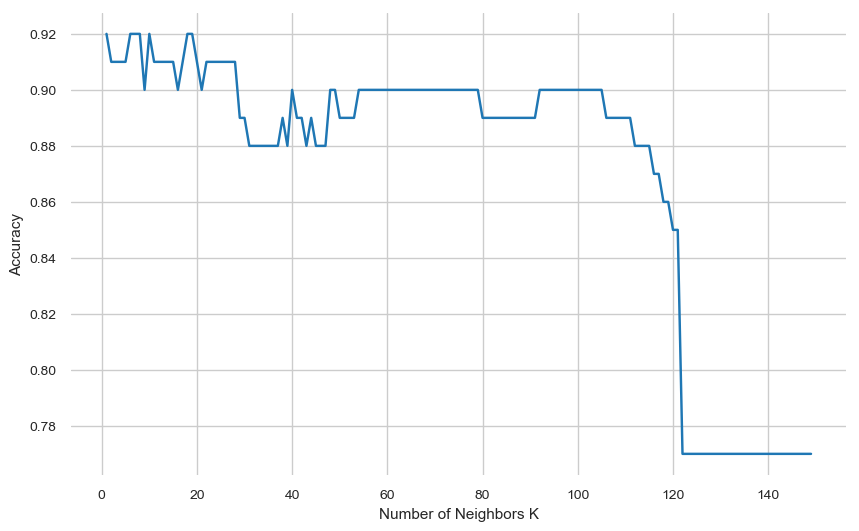

# k-NN

Importamos librerias basicas.


```python
import pandas as pd
import missingno as msn
import matplotlib.pyplot as plt
import seaborn as sns
sns.set_style("whitegrid")
import matplotlib
matplotlib.rcParams['figure.figsize'] = [10, 6]
```

Cargamos el archivo y vemos que contiene


```python
data = pd.read_csv('breast-cancer.csv')
```

Eliminamos los missing values


```python
data = data.drop(['Unnamed: 32', 'id'], 1)
```

Eliminamos los outliers


```python
l = len(data)
for column in data.columns[1:]:
    data = data[np.abs(data[column]-data[column].mean()) <= (3*data[column].std())]
print('Filas eliminadas: {0}'.format(l-len(data)))
```

    Filas eliminadas: 142


Eliminando atributos correlacioandos


```python
data = data.drop(['perimeter_mean', 'perimeter_se', 'perimeter_worst', 'radius_worst',
                  'concave points_mean', 'texture_worst'],1)
```


```python
data.head()
```


<div>
<style scoped>
    .dataframe tbody tr th:only-of-type {
        vertical-align: middle;
    }

    .dataframe tbody tr th {
        vertical-align: top;
    }

    .dataframe thead th {
        text-align: right;
    }
</style>
<table border="1" class="dataframe">
  <thead>
    <tr style="text-align: right;">
      <th></th>
      <th>diagnosis</th>
      <th>radius_mean</th>
      <th>texture_mean</th>
      <th>area_mean</th>
      <th>smoothness_mean</th>
      <th>compactness_mean</th>
      <th>concavity_mean</th>
      <th>symmetry_mean</th>
      <th>fractal_dimension_mean</th>
      <th>radius_se</th>
      <th>...</th>
      <th>concave points_se</th>
      <th>symmetry_se</th>
      <th>fractal_dimension_se</th>
      <th>area_worst</th>
      <th>smoothness_worst</th>
      <th>compactness_worst</th>
      <th>concavity_worst</th>
      <th>concave points_worst</th>
      <th>symmetry_worst</th>
      <th>fractal_dimension_worst</th>
    </tr>
  </thead>
  <tbody>
    <tr>
      <th>1</th>
      <td>M</td>
      <td>20.57</td>
      <td>17.77</td>
      <td>1326.0</td>
      <td>0.08474</td>
      <td>0.07864</td>
      <td>0.08690</td>
      <td>0.1812</td>
      <td>0.05667</td>
      <td>0.5435</td>
      <td>...</td>
      <td>0.01340</td>
      <td>0.01389</td>
      <td>0.003532</td>
      <td>1956.0</td>
      <td>0.1238</td>
      <td>0.1866</td>
      <td>0.2416</td>
      <td>0.1860</td>
      <td>0.2750</td>
      <td>0.08902</td>
    </tr>
    <tr>
      <th>2</th>
      <td>M</td>
      <td>19.69</td>
      <td>21.25</td>
      <td>1203.0</td>
      <td>0.10960</td>
      <td>0.15990</td>
      <td>0.19740</td>
      <td>0.2069</td>
      <td>0.05999</td>
      <td>0.7456</td>
      <td>...</td>
      <td>0.02058</td>
      <td>0.02250</td>
      <td>0.004571</td>
      <td>1709.0</td>
      <td>0.1444</td>
      <td>0.4245</td>
      <td>0.4504</td>
      <td>0.2430</td>
      <td>0.3613</td>
      <td>0.08758</td>
    </tr>
    <tr>
      <th>4</th>
      <td>M</td>
      <td>20.29</td>
      <td>14.34</td>
      <td>1297.0</td>
      <td>0.10030</td>
      <td>0.13280</td>
      <td>0.19800</td>
      <td>0.1809</td>
      <td>0.05883</td>
      <td>0.7572</td>
      <td>...</td>
      <td>0.01885</td>
      <td>0.01756</td>
      <td>0.005115</td>
      <td>1575.0</td>
      <td>0.1374</td>
      <td>0.2050</td>
      <td>0.4000</td>
      <td>0.1625</td>
      <td>0.2364</td>
      <td>0.07678</td>
    </tr>
    <tr>
      <th>6</th>
      <td>M</td>
      <td>18.25</td>
      <td>19.98</td>
      <td>1040.0</td>
      <td>0.09463</td>
      <td>0.10900</td>
      <td>0.11270</td>
      <td>0.1794</td>
      <td>0.05742</td>
      <td>0.4467</td>
      <td>...</td>
      <td>0.01039</td>
      <td>0.01369</td>
      <td>0.002179</td>
      <td>1606.0</td>
      <td>0.1442</td>
      <td>0.2576</td>
      <td>0.3784</td>
      <td>0.1932</td>
      <td>0.3063</td>
      <td>0.08368</td>
    </tr>
    <tr>
      <th>7</th>
      <td>M</td>
      <td>13.71</td>
      <td>20.83</td>
      <td>577.9</td>
      <td>0.11890</td>
      <td>0.16450</td>
      <td>0.09366</td>
      <td>0.2196</td>
      <td>0.07451</td>
      <td>0.5835</td>
      <td>...</td>
      <td>0.01448</td>
      <td>0.01486</td>
      <td>0.005412</td>
      <td>897.0</td>
      <td>0.1654</td>
      <td>0.3682</td>
      <td>0.2678</td>
      <td>0.1556</td>
      <td>0.3196</td>
      <td>0.11510</td>
    </tr>
  </tbody>
</table>
<p>5 rows × 25 columns</p>
</div>


```python
from sklearn.utils import shuffle
from sklearn.neighbors import KNeighborsClassifier
from sklearn.metrics import accuracy_score
```


```python
len(data)*0.25
```


    106.75


```python
data = shuffle(data)

test = data.iloc[:100,:]
data = data.iloc[100:,:]
X = data.iloc[:,1:]
y = data.iloc[:,:1].values.ravel()
```


```python
knn = KNeighborsClassifier(n_neighbors=3)
knn.fit(X, y)
```


    KNeighborsClassifier(algorithm='auto', leaf_size=30, metric='minkowski',
               metric_params=None, n_jobs=1, n_neighbors=3, p=2,
               weights='uniform')


```python
y_pred = knn.predict(test.iloc[:,1:])
y_test = test.iloc[:,:1]
```


```python
acc = accuracy_score(y_test, y_pred)
print(acc)
```

    0.91


```python
k_to_test = [i for i in range(1,150)]
accuracy = {}


for k in k_to_test:
    knn = KNeighborsClassifier(n_neighbors=k)
    knn.fit(X, y)
    y_pred = knn.predict(test.iloc[:,1:])
    acc = accuracy_score(y_test, y_pred)
    accuracy[k] = acc
    
keys, acccuracy = zip(*accuracy.items())
plt.xlabel('Number of Neighbors K')
plt.ylabel('Accuracy')
plt.plot(keys, acccuracy)
```


    [<matplotlib.lines.Line2D at 0x1a58dc9fd0>]





```python
accuracy
```


    {1: 0.92,
     2: 0.91,
     3: 0.91,
     4: 0.91,
     5: 0.91,
     6: 0.92,
     7: 0.92,
     8: 0.92,
     9: 0.9,
     10: 0.92,
     11: 0.91,
     12: 0.91,
     13: 0.91,
     14: 0.91,
     15: 0.91,
     16: 0.9,
     17: 0.91,
     18: 0.92,
     19: 0.92,
     20: 0.91,
     21: 0.9,
     22: 0.91,
     23: 0.91,
     24: 0.91,
     25: 0.91,
     26: 0.91,
     27: 0.91,
     28: 0.91,
     29: 0.89,
     30: 0.89,
     31: 0.88,
     32: 0.88,
     33: 0.88,
     34: 0.88,
     35: 0.88,
     36: 0.88,
     37: 0.88,
     38: 0.89,
     39: 0.88,
     40: 0.9,
     41: 0.89,
     42: 0.89,
     43: 0.88,
     44: 0.89,
     45: 0.88,
     46: 0.88,
     47: 0.88,
     48: 0.9,
     49: 0.9,
     50: 0.89,
     51: 0.89,
     52: 0.89,
     53: 0.89,
     54: 0.9,
     55: 0.9,
     56: 0.9,
     57: 0.9,
     58: 0.9,
     59: 0.9,
     60: 0.9,
     61: 0.9,
     62: 0.9,
     63: 0.9,
     64: 0.9,
     65: 0.9,
     66: 0.9,
     67: 0.9,
     68: 0.9,
     69: 0.9,
     70: 0.9,
     71: 0.9,
     72: 0.9,
     73: 0.9,
     74: 0.9,
     75: 0.9,
     76: 0.9,
     77: 0.9,
     78: 0.9,
     79: 0.9,
     80: 0.89,
     81: 0.89,
     82: 0.89,
     83: 0.89,
     84: 0.89,
     85: 0.89,
     86: 0.89,
     87: 0.89,
     88: 0.89,
     89: 0.89,
     90: 0.89,
     91: 0.89,
     92: 0.9,
     93: 0.9,
     94: 0.9,
     95: 0.9,
     96: 0.9,
     97: 0.9,
     98: 0.9,
     99: 0.9,
     100: 0.9,
     101: 0.9,
     102: 0.9,
     103: 0.9,
     104: 0.9,
     105: 0.9,
     106: 0.89,
     107: 0.89,
     108: 0.89,
     109: 0.89,
     110: 0.89,
     111: 0.89,
     112: 0.88,
     113: 0.88,
     114: 0.88,
     115: 0.88,
     116: 0.87,
     117: 0.87,
     118: 0.86,
     119: 0.86,
     120: 0.85,
     121: 0.85,
     122: 0.77,
     123: 0.77,
     124: 0.77,
     125: 0.77,
     126: 0.77,
     127: 0.77,
     128: 0.77,
     129: 0.77,
     130: 0.77,
     131: 0.77,
     132: 0.77,
     133: 0.77,
     134: 0.77,
     135: 0.77,
     136: 0.77,
     137: 0.77,
     138: 0.77,
     139: 0.77,
     140: 0.77,
     141: 0.77,
     142: 0.77,
     143: 0.77,
     144: 0.77,
     145: 0.77,
     146: 0.77,
     147: 0.77,
     148: 0.77,
     149: 0.77}


Podemos ver que obtenemos mejor accuracy con K = 1, 6, 7, 8, 10, 18 y 19 de ahi en mas empeora hasta tener una accuracy de 0.77 constante de K=122 en adelante


```python


```
