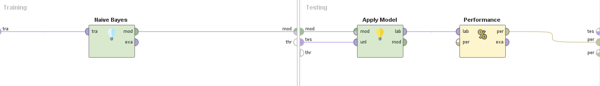
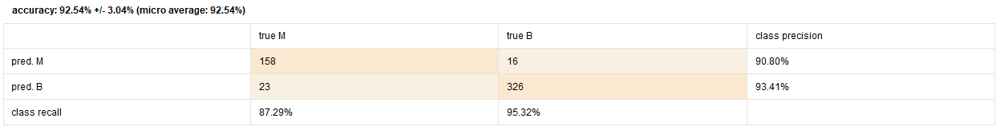

# Naive Bayes

_Se retoma el modelo de [correlation](./6_correlation_rapidminer.md)_

Primero vamos a utilizar el modulo `Set Role` para signar la label.

Luego agregamos el modulo de `Cross Validation`.

Dentro de este agregamos:

* `Naive Bayes` (el modelo), en el lado de training.
* `Apply Model` (aplica el modelo sobre el conjunto de test).
* `Performance` (da una metrica de la performance del modelo).

Luego al ejecutar el modelo obtenemos los siguientes resultados:

