# Analizando el Dataset

Primero importamos y cargamos los rapidamente los datos en RapidMiner.

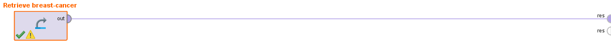

Ahora analizamos las distribuciones de los atributos
### Diagnosis

### Radius_mean
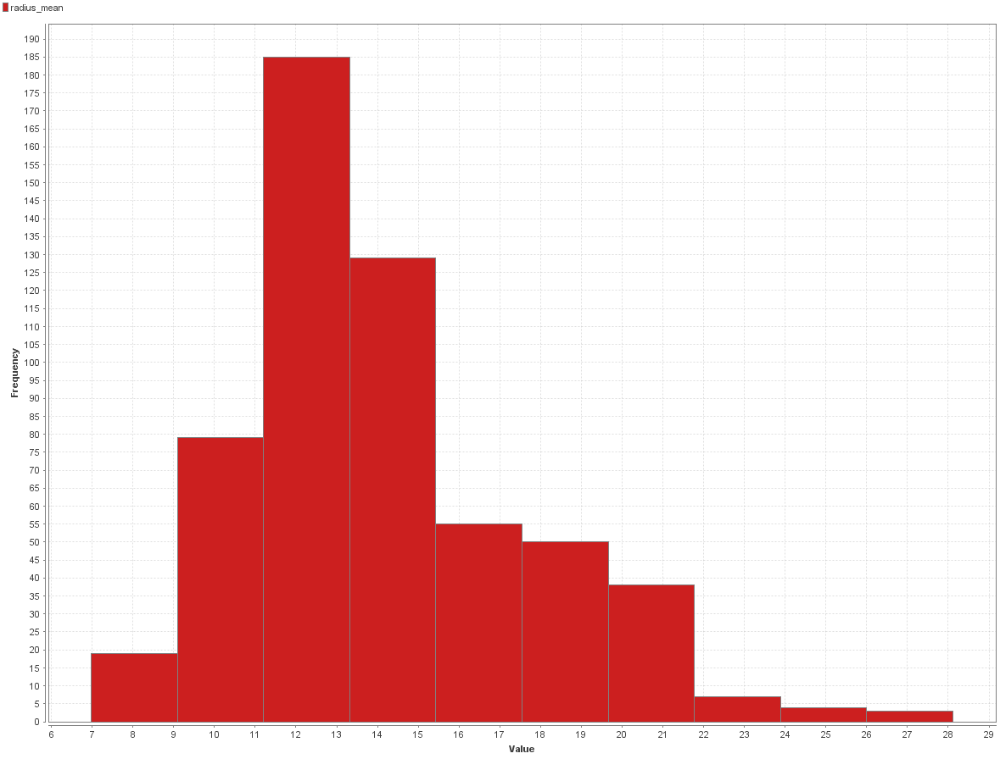

### Texture_mean

### perimeter_mean

### area_mean

### smoothness_mean
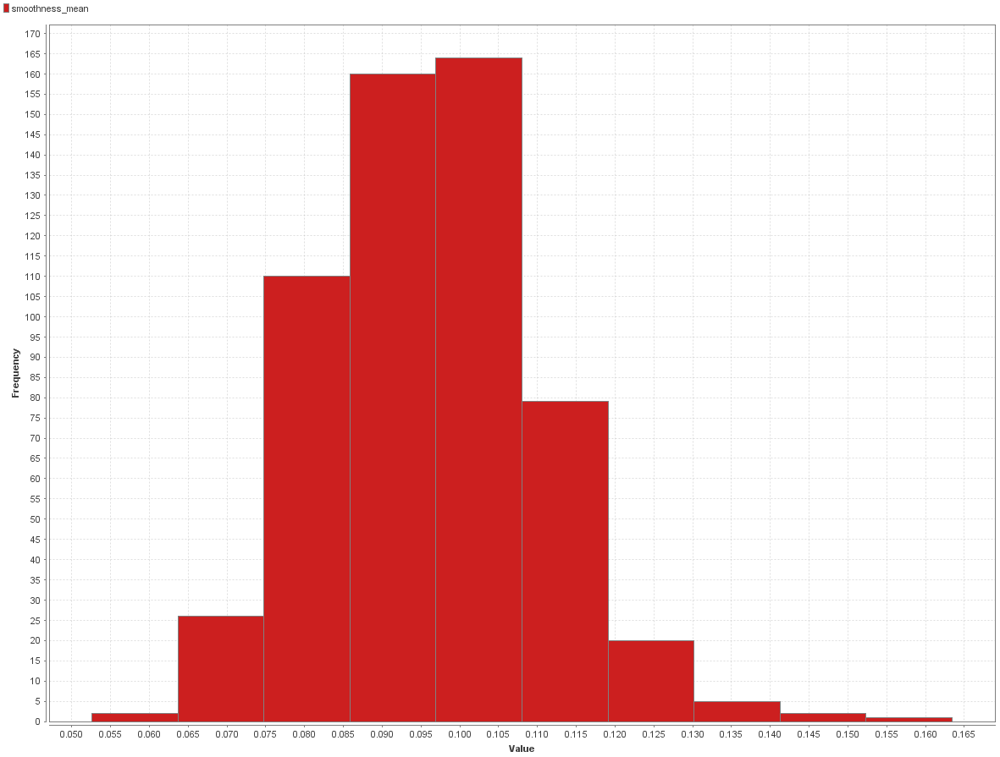

### compactness_mean

### concavity_mean
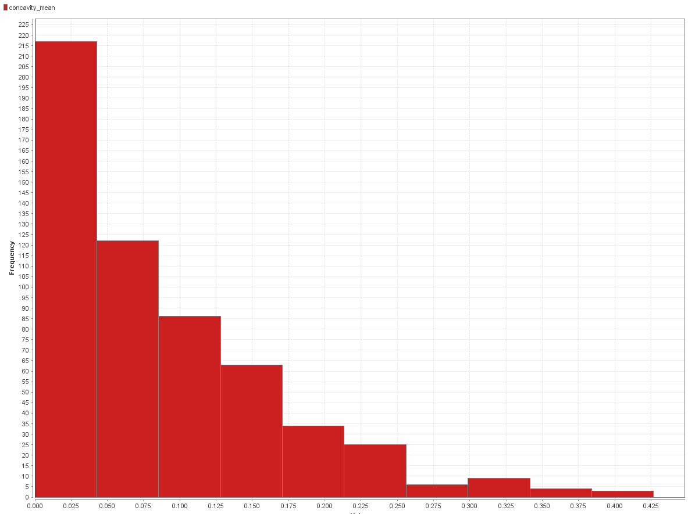

### concave points_mean

### symmetry_mean

### fractal_dimension_mean

### radius_se

### texture_se

### perimeter_se
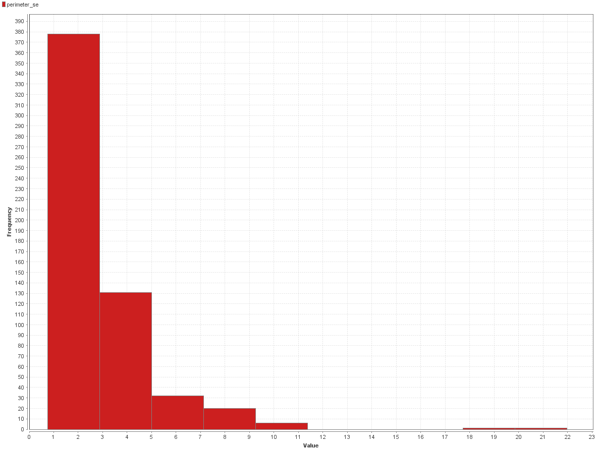

### area_se
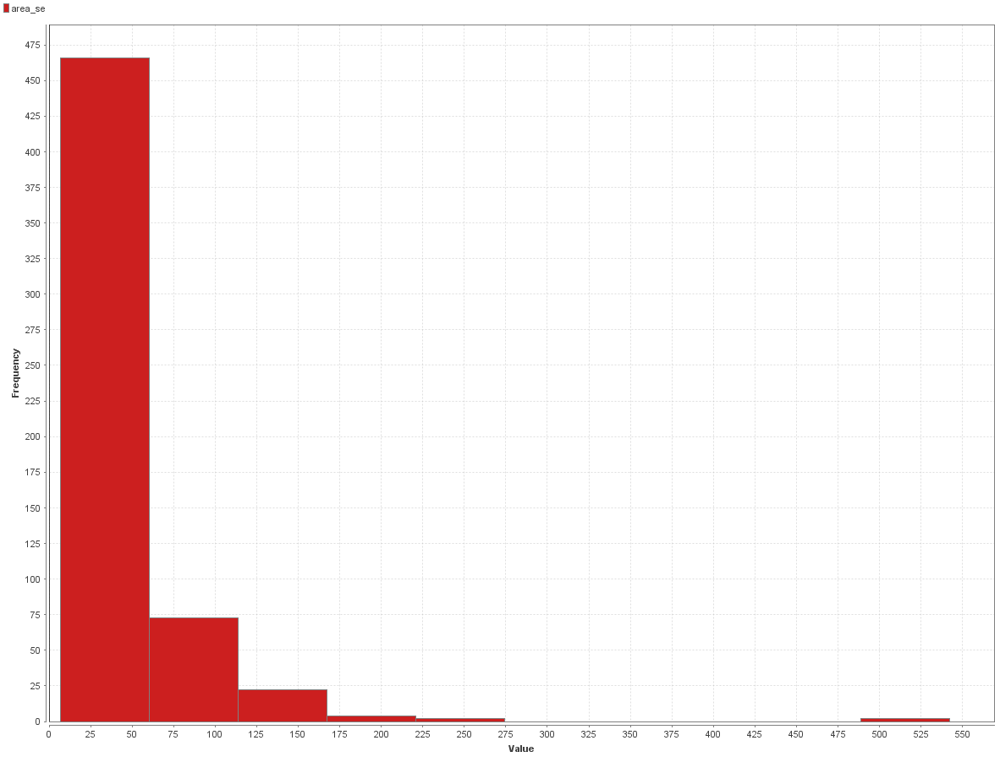

### smoothness_se

### compactness_se

### concavity_se

### concave points_se

### symmetry_se
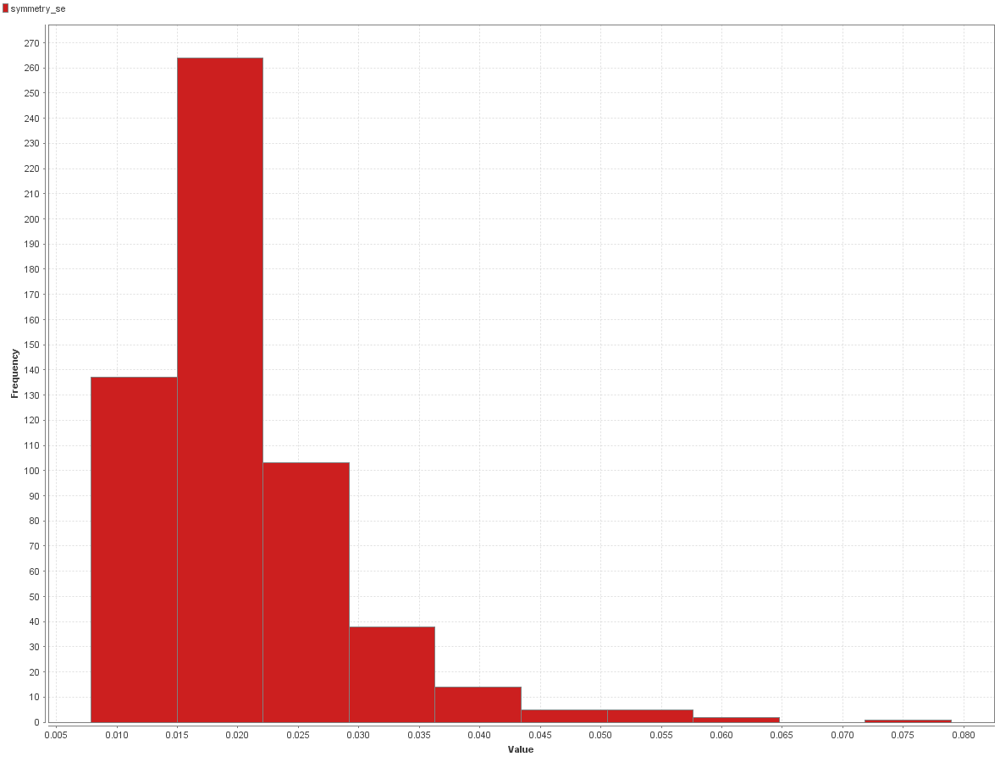

### fractal_dimension_se

### radius_worst

### texture_worst
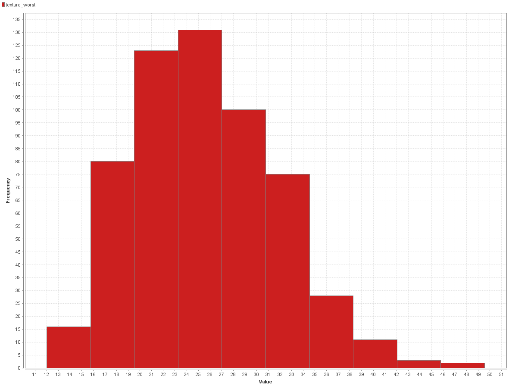

### perimeter_worst
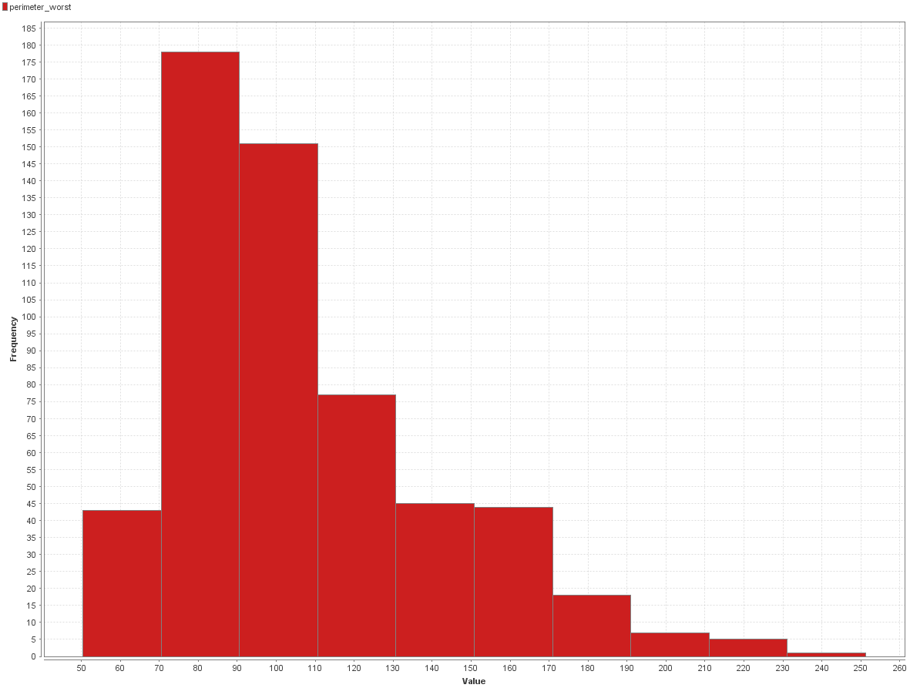

### area_worst
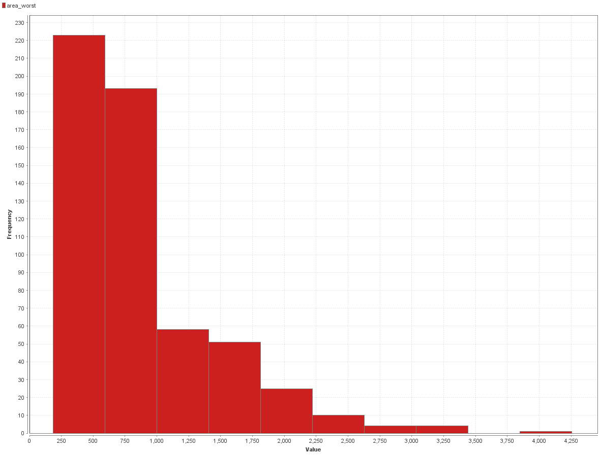

### smoothness_worst
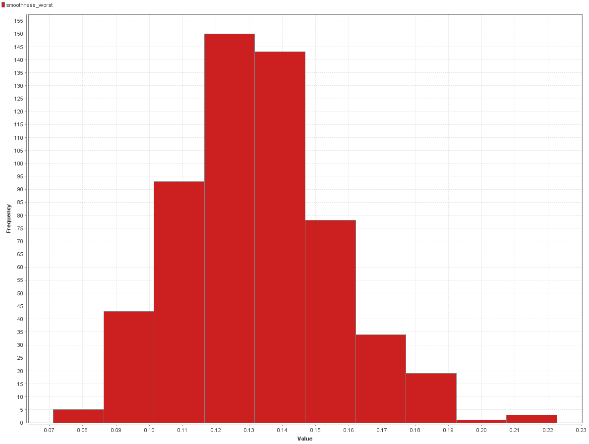

### compactness_worst

### concavity_worst

### concave points_worst

### symmetry_worst

### fractal_dimension_worst

### att33
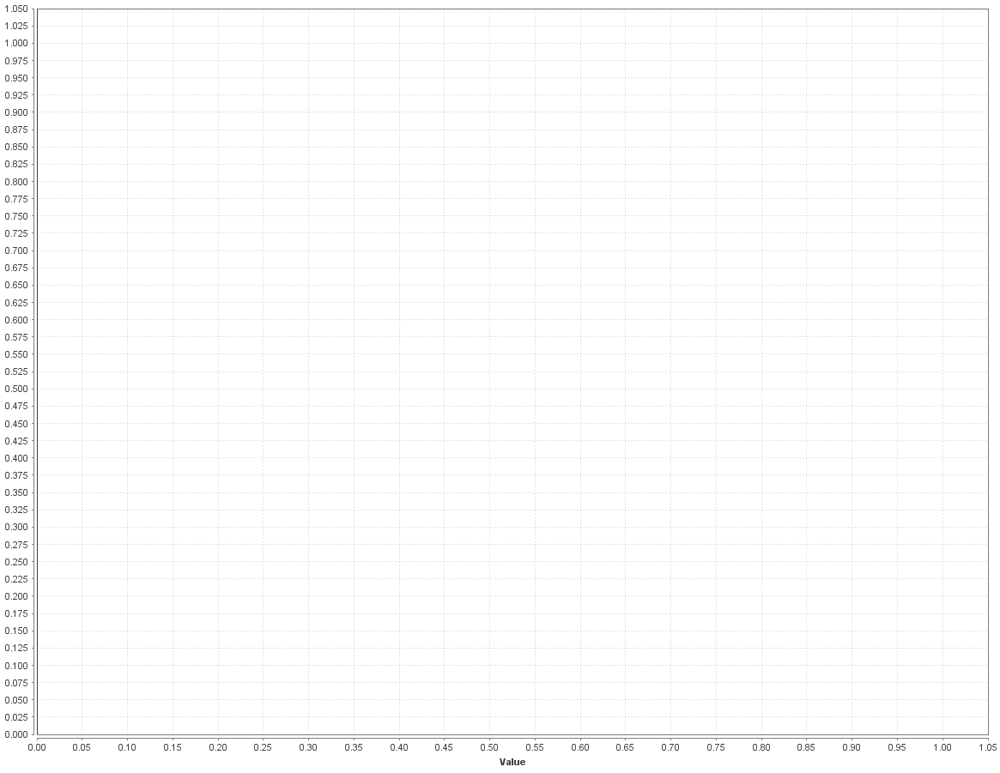

Podemos ver que casi todos los datos siguen una distrubución Beta menos el `att33` que no contiene valores numéricos y probablemente tengamos que eliminarlo en la siguiente sección Missing Values.

[Missing Values➡](./4_missing_values_rapidminer.md)