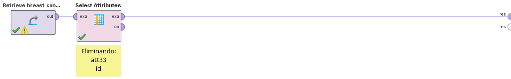

# Missing Values

Lo primero que notamos es que el unico missing value detectado por RapidMiner es el att33 con 569 missing values.

Simplemente eliminando este atributo con un `Select Attributes` es suficiente para eliminar los missing values, aprovechamos la oportunidad para eliminar tambien la columna `id` que no aporta ningún valor en este caso.

[Outliers Rapidminer ➡](./5_outliers_rapidminer.md)
