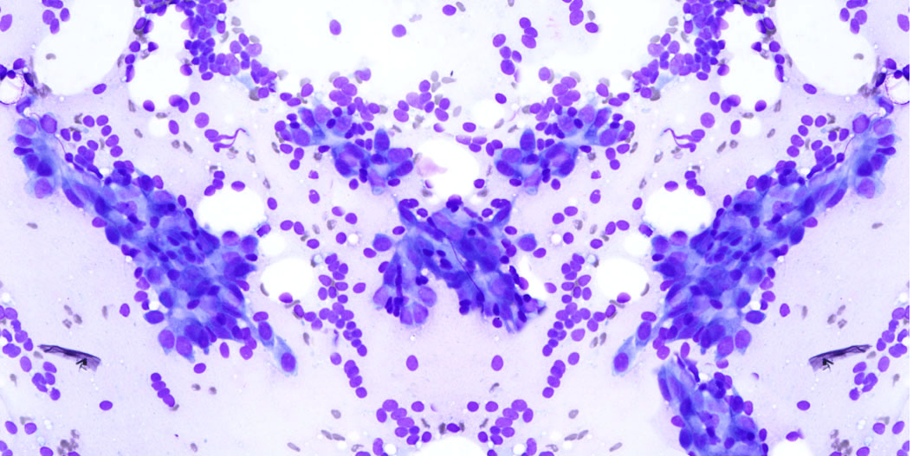

# Breast Cancer Wisconsin

En este proyecto se va a realizar un estudio sobre el dataset [Breast Cancer Wisconsin](https://archive.ics.uci.edu/ml/datasets/Breast+Cancer+Wisconsin+%28Original%29), obtenido de [UCI](https://archive.ics.uci.edu/ml/index.php).

## Motivación

A continuación un resumen de una publicación de la [American Society of Clinical Oncology](https://www.cancer.net/es/tipos-de-c%C3%A1ncer/c%C3%A1ncer-de-mama/estad%C3%ADsticas) como motivación al estudio de este problema.

Se diagnostica a más mujeres con cáncer de mama que ningún otro cáncer, sin incluir el cáncer de piel. Se estima que este año se diagnosticará cáncer de mama invasivo a 266,120 mujeres en los Estados Unidos y se diagnosticará cáncer de mama in situ a 63,960 mujeres. En los Estados Unidos, se les diagnosticará cáncer de mama a 2550 hombres, aproximadamente.

Se calcula que este año (2017) se producirán unas 41,400 muertes (40,920 mujeres y 480 hombres) a causa del cáncer de mama.

El cáncer de mama es la segunda causa más frecuente de muerte por cáncer en las mujeres de los Estados Unidos, después del cáncer de pulmón. Sin embargo, desde 1989, la cantidad de mujeres que mueren por cáncer de mama ha disminuido a un ritmo constante gracias a la detección temprana y las mejoras en los tratamientos. Las tasas de supervivencia de hombres y mujeres negros han aumentado, pero son 10 % menores en los hombres negros.

En la actualidad, hay más de 3 millones de mujeres que viven con cáncer de mama en los Estados Unidos.

## Introducción al problema

Las células cancerígenas se crean cuando los genes responsables por la división celular están dañados. La carcinogénesis (conjunto de fenómenos que determinan la aparición y desarrollo de un cáncer) es causada por mutación y epimutación (cambio en la estructura química del ADN que no altera la secuencia de codificación del ADN) del material genético en las células normales, las cuales desequilibran el balance del material genético en las células normales entre la proliferación y muerte de las células. Esto resulta en una división celular fuera de control y la evolución de esas células por selección natural. La descontrolada y en la mayoría de los casos, rápida proliferación de las células puede llevar a tumores benignos o malignos (cáncer). Los tumores benignos no invaden otras partes del cuerpo o otros tejidos, mientras que los tumores malignos pueden invadir otros órganos y llegar a lugares lejanos en el cuerpo (metastasis), convirtiéndose asi, en una amenaza letal.
<!--
Cancer cells are created when the genes responsible for regulating [cell division](https://en.wikipedia.org/wiki/Cell_division "Cell division") are damaged. Carcinogenesis is caused by mutation and epimutation of the genetic material of normal cells, which upsets the normal balance between proliferation and cell death. This results in uncontrolled cell division and the [evolution of those cells](https://en.wikipedia.org/wiki/Somatic_evolution_in_cancer "Somatic evolution in cancer") by [natural selection](https://en.wikipedia.org/wiki/Natural_selection "Natural selection") in the body. The uncontrolled and often rapid proliferation of cells can lead to benign or malignant tumours (cancer). [Benign tumors](https://en.wikipedia.org/wiki/Benign_tumor "Benign tumor") do not spread to other parts of the body or invade other tissues. [Malignant tumors](https://en.wikipedia.org/wiki/Malignant_tumor) can invade other organs, spread to distant locations ([metastasis](https://en.wikipedia.org/wiki/Metastasis "Metastasis")) and become life-threatening.
-->

|         |            |           |       |
|:--------|------------|-----------|------:|
|         |  |  | [Dataset ➡](./proyects/breast-cancer/2_dataset.md)|
 