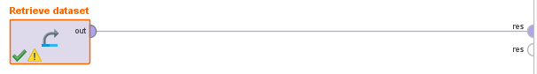
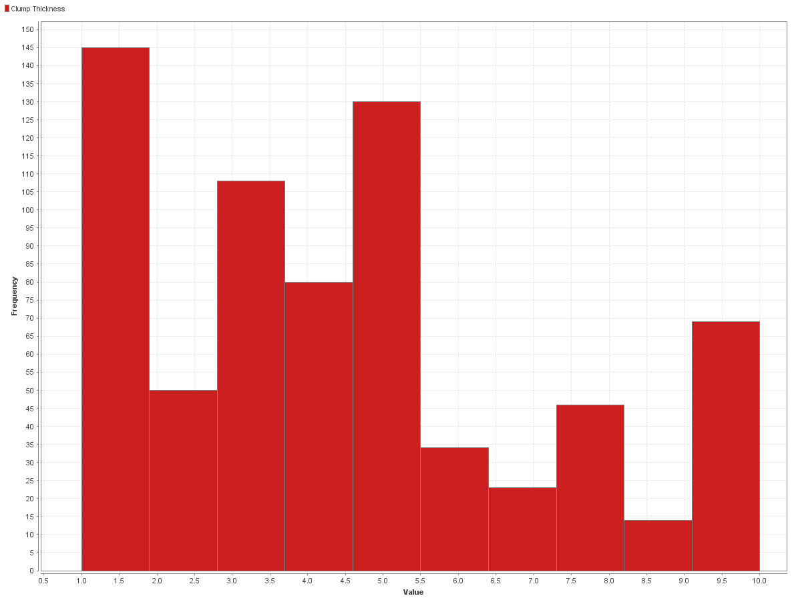
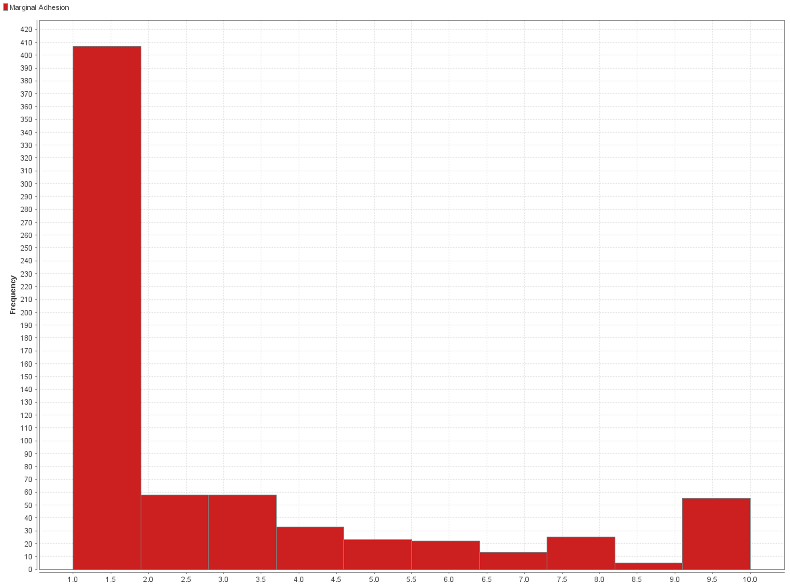
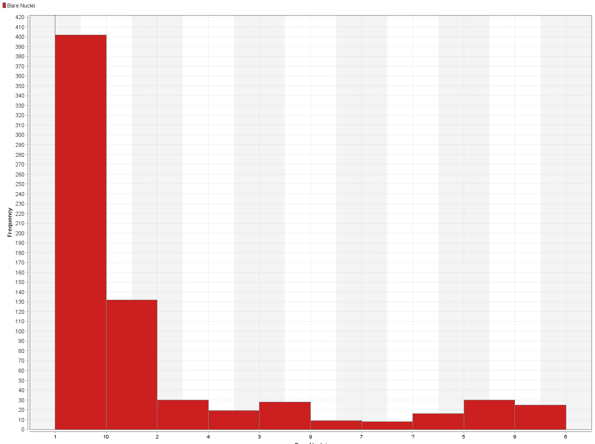
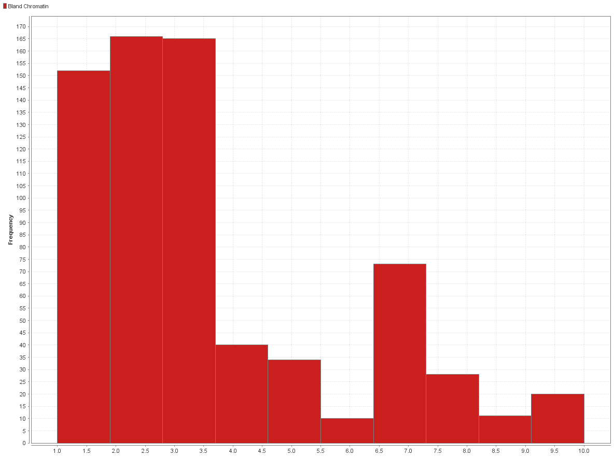
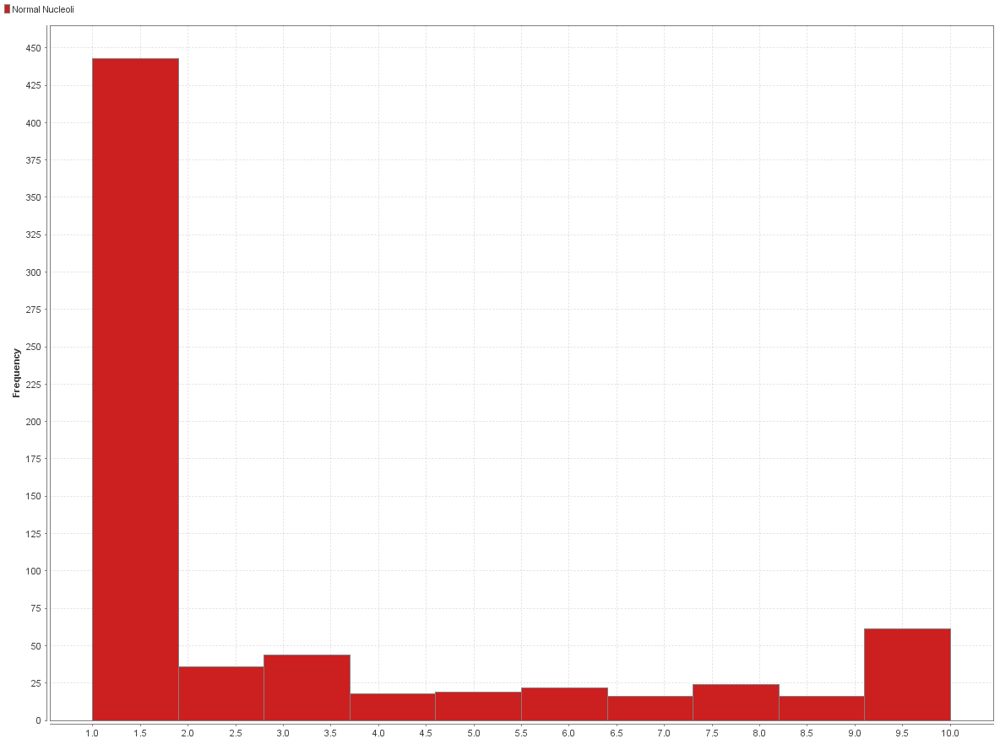
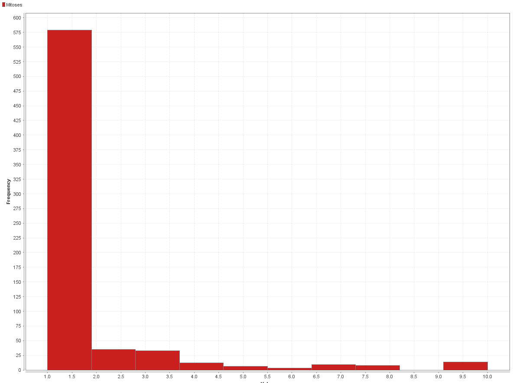
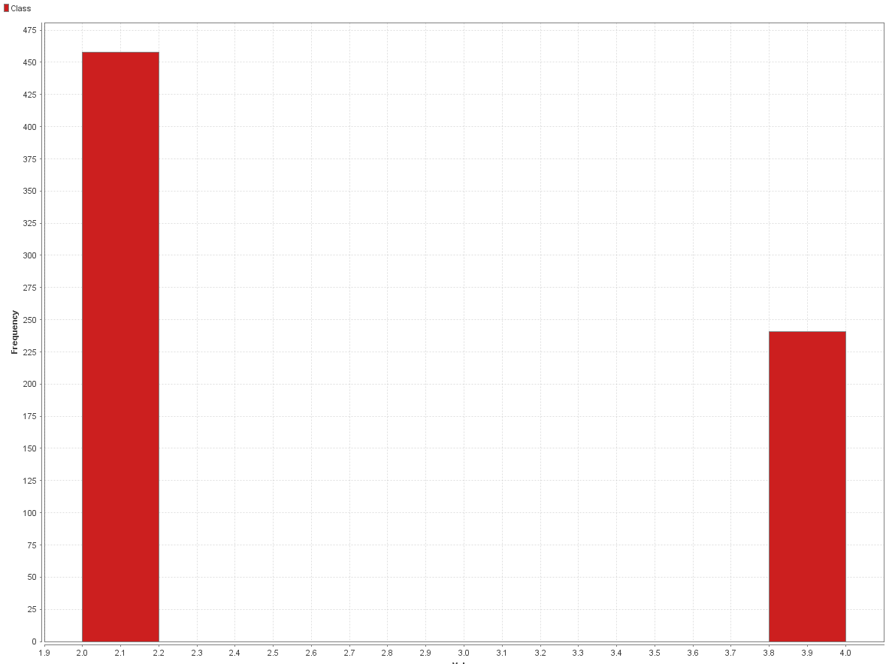

# Analizando el Dataset

Primero importamos y cargamos los rapidamente los datos en RapidMiner.

Renombramos el dataset

Ahora miramos las estadisticas para poder ver las distribuciones de los datos.

### Clump Thickness

### Uniformity of Cell Size

### Uniformity of Cell Shape

### Marginal Adhesion

### Single Epithelial Cell

### Bare Nuclei

### Bland Chromatin

### Normal Nucleoli

### Mitoses

### Classes

Podemos ver que casi todos los datos menos Clump Thickness tienen una distribucion similar (Similar a una beta).
Tambien podemos ver que no se indican missing values pero que `Bare Nuclei` es de tipo `Polynomial` cuando el dataset indicaba que todos los atributos eran numericos, vamos a tener que analizar esto como un posible caso de missing values.
