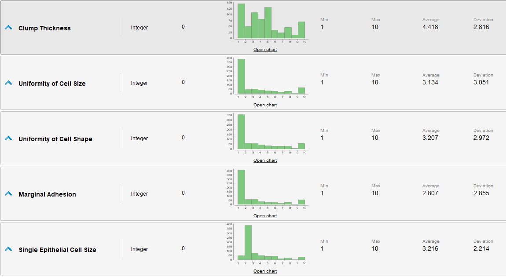
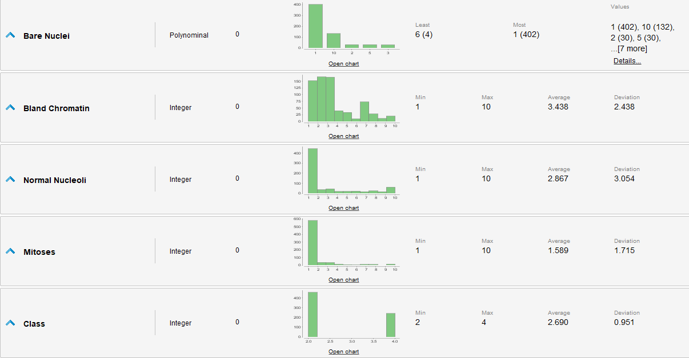

# Analizando el Dataset (RapidMiner)

Primero cargamos los rapidamente los datos en RapidMiner.

Ahora miramos las estadisticas para poder ver las distribuciones e identificar posibles outliers.

Podemos ver que casi todos los datos menos Clump Thickness tienen una distribucion similar (Similar a una beta).
Tambien podemos ver que no se indican missing values pero que `Bare Nuclei` es de tipo `Polynomial` cuando el dataset indicaba que todos los atributos eran numericos, vamos a tener que analizar esto como un posible caso de missing values.
