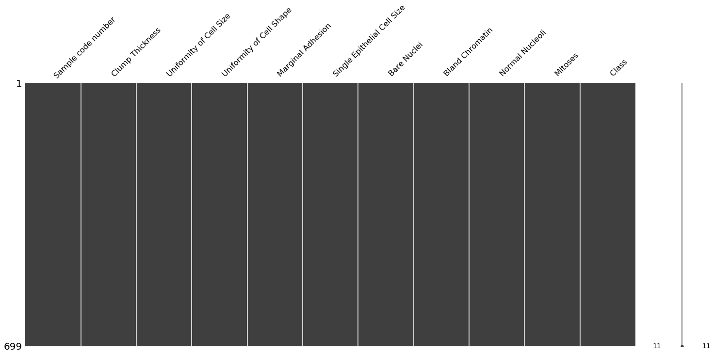

## Analizando el Dataset

[Vista detallada del dataset ➡](./docs/pf_overview.html)

En la vista detallada del dataset podemos ver la siguiente información:

|Info||
|-:|:-|
|Number of variables	|11|
|Number of observations|	699|
|Total Missing |	0.0%|


|Variables types| |
|-:|:-|
|Numeric	|8|
|Categorical|	1|
|Boolean|	1|
|Date 	|0|
|Text (Unique)|	0|
|Rejected|	1|
|Unsupported|	0|

Tambien obtenemos que `Uniformity of Cell Shape` esta altamente correlacionada con `Uniformity of Cell Size` _(ρ = 0.90688)_. Lo cual tiene sentido en base al [estudio de atributos](./3_attributes_text.md) que realizamos anteriormente.


### Importando librerias

Comenzaremos importando las librerias basicas, matplotlib y seaborn para las graficas, pandas para el manejo de los datos y numpy para realizar operaciones.


```python
import matplotlib.pyplot as plt
import pandas  as pd
import numpy   as np
import seaborn as sns
```

### Cargando el dataset

Carmgamos el dataset con pandas.


```python
dataset = pd.read_csv('breast_cancer.csv')
```

### Eliminando la columna Id number

Eliminamos el atributo id number ya que no aporta a la solución del problema y causa ruido. Para esto utlizamos el método para DataFrames de pandas, drop con el nombre de la columna y el axis.


```python
dataset = dataset.drop('Sample code number',1)
```

### Missing Values

Ahora que tenemos el dataset cargado y eliminamos la columna de id, vamos a buscar valores faltantes (o missing values). Comenzamos viendo información básica sobre los atributos faltantes del dataset con la libreria missingno.


```python
import missingno as msn
```


```python
msn.matrix(dataset)
```





Podemos ver que a simple vista no se detectan outlier. Ahora vamos a analizar el tipo de los datos.


```python
dataset.info()
```

    <class 'pandas.core.frame.DataFrame'>
    RangeIndex: 699 entries, 0 to 698
    Data columns (total 11 columns):
    Sample code number              699 non-null int64
     Clump Thickness                699 non-null int64
     Uniformity of Cell Size        699 non-null int64
     Uniformity of Cell Shape       699 non-null int64
     Marginal Adhesion              699 non-null int64
     Single Epithelial Cell Size    699 non-null int64
     Bare Nuclei                    699 non-null object
     Bland Chromatin                699 non-null int64
     Normal Nucleoli                699 non-null int64
     Mitoses                        699 non-null int64
     Class                          699 non-null int64
    dtypes: int64(10), object(1)
    memory usage: 60.1+ KB
    

Vemos que Bare **Nuclei 699 non-null object** no es de tipo entero, y sabemos que todos los atributos son enteros entre [0, 10].
A pesar de haber obtenido un total de 0.0% de missing values en nuestro análisis inicial vamos a ver si existen valores ? usando un filtro sobre el dataset en la bariable Bare Nuclei,


```python
missing_values = dataset[dataset[' Bare Nuclei']=='?']
missing_values
```


<div>
<style scoped>
    .dataframe tbody tr th:only-of-type {
        vertical-align: middle;
    }

    .dataframe tbody tr th {
        vertical-align: top;
    }

    .dataframe thead th {
        text-align: right;
    }
</style>
<table border="1" class="dataframe">
  <thead>
    <tr style="text-align: right;">
      <th></th>
      <th>Sample code number</th>
      <th>Clump Thickness</th>
      <th>Uniformity of Cell Size</th>
      <th>Uniformity of Cell Shape</th>
      <th>Marginal Adhesion</th>
      <th>Single Epithelial Cell Size</th>
      <th>Bare Nuclei</th>
      <th>Bland Chromatin</th>
      <th>Normal Nucleoli</th>
      <th>Mitoses</th>
      <th>Class</th>
    </tr>
  </thead>
  <tbody>
    <tr>
      <th>23</th>
      <td>1057013</td>
      <td>8</td>
      <td>4</td>
      <td>5</td>
      <td>1</td>
      <td>2</td>
      <td>?</td>
      <td>7</td>
      <td>3</td>
      <td>1</td>
      <td>4</td>
    </tr>
    <tr>
      <th>40</th>
      <td>1096800</td>
      <td>6</td>
      <td>6</td>
      <td>6</td>
      <td>9</td>
      <td>6</td>
      <td>?</td>
      <td>7</td>
      <td>8</td>
      <td>1</td>
      <td>2</td>
    </tr>
    <tr>
      <th>139</th>
      <td>1183246</td>
      <td>1</td>
      <td>1</td>
      <td>1</td>
      <td>1</td>
      <td>1</td>
      <td>?</td>
      <td>2</td>
      <td>1</td>
      <td>1</td>
      <td>2</td>
    </tr>
    <tr>
      <th>145</th>
      <td>1184840</td>
      <td>1</td>
      <td>1</td>
      <td>3</td>
      <td>1</td>
      <td>2</td>
      <td>?</td>
      <td>2</td>
      <td>1</td>
      <td>1</td>
      <td>2</td>
    </tr>
    <tr>
      <th>158</th>
      <td>1193683</td>
      <td>1</td>
      <td>1</td>
      <td>2</td>
      <td>1</td>
      <td>3</td>
      <td>?</td>
      <td>1</td>
      <td>1</td>
      <td>1</td>
      <td>2</td>
    </tr>
    <tr>
      <th>164</th>
      <td>1197510</td>
      <td>5</td>
      <td>1</td>
      <td>1</td>
      <td>1</td>
      <td>2</td>
      <td>?</td>
      <td>3</td>
      <td>1</td>
      <td>1</td>
      <td>2</td>
    </tr>
    <tr>
      <th>235</th>
      <td>1241232</td>
      <td>3</td>
      <td>1</td>
      <td>4</td>
      <td>1</td>
      <td>2</td>
      <td>?</td>
      <td>3</td>
      <td>1</td>
      <td>1</td>
      <td>2</td>
    </tr>
    <tr>
      <th>249</th>
      <td>169356</td>
      <td>3</td>
      <td>1</td>
      <td>1</td>
      <td>1</td>
      <td>2</td>
      <td>?</td>
      <td>3</td>
      <td>1</td>
      <td>1</td>
      <td>2</td>
    </tr>
    <tr>
      <th>275</th>
      <td>432809</td>
      <td>3</td>
      <td>1</td>
      <td>3</td>
      <td>1</td>
      <td>2</td>
      <td>?</td>
      <td>2</td>
      <td>1</td>
      <td>1</td>
      <td>2</td>
    </tr>
    <tr>
      <th>292</th>
      <td>563649</td>
      <td>8</td>
      <td>8</td>
      <td>8</td>
      <td>1</td>
      <td>2</td>
      <td>?</td>
      <td>6</td>
      <td>10</td>
      <td>1</td>
      <td>4</td>
    </tr>
    <tr>
      <th>294</th>
      <td>606140</td>
      <td>1</td>
      <td>1</td>
      <td>1</td>
      <td>1</td>
      <td>2</td>
      <td>?</td>
      <td>2</td>
      <td>1</td>
      <td>1</td>
      <td>2</td>
    </tr>
    <tr>
      <th>297</th>
      <td>61634</td>
      <td>5</td>
      <td>4</td>
      <td>3</td>
      <td>1</td>
      <td>2</td>
      <td>?</td>
      <td>2</td>
      <td>3</td>
      <td>1</td>
      <td>2</td>
    </tr>
    <tr>
      <th>315</th>
      <td>704168</td>
      <td>4</td>
      <td>6</td>
      <td>5</td>
      <td>6</td>
      <td>7</td>
      <td>?</td>
      <td>4</td>
      <td>9</td>
      <td>1</td>
      <td>2</td>
    </tr>
    <tr>
      <th>321</th>
      <td>733639</td>
      <td>3</td>
      <td>1</td>
      <td>1</td>
      <td>1</td>
      <td>2</td>
      <td>?</td>
      <td>3</td>
      <td>1</td>
      <td>1</td>
      <td>2</td>
    </tr>
    <tr>
      <th>411</th>
      <td>1238464</td>
      <td>1</td>
      <td>1</td>
      <td>1</td>
      <td>1</td>
      <td>1</td>
      <td>?</td>
      <td>2</td>
      <td>1</td>
      <td>1</td>
      <td>2</td>
    </tr>
    <tr>
      <th>617</th>
      <td>1057067</td>
      <td>1</td>
      <td>1</td>
      <td>1</td>
      <td>1</td>
      <td>1</td>
      <td>?</td>
      <td>1</td>
      <td>1</td>
      <td>1</td>
      <td>2</td>
    </tr>
  </tbody>
</table>
</div>


Podemos verque la variable `Bare Nuclei` tiene varias ocurrencias con el valor `?`, estas no fueron detectadas como missing values ya que fueron consideradas como un valor `?`, los missing values suelen ser espacios en blanco o `NaN`.

Confirmamos que tiene missing values asi que vamos a averiguar cuantos missing values son y en base a eso podriamos tener una idea que medida tomar.

### Averiguando el impacto del missing value


```python
dataset[' Class'].value_counts()
```


    2    458
    4    241
    Name:  Class, dtype: int64


```python
missing_values[' Class'].value_counts()
```


    2    14
    4     2
    Name:  Class, dtype: int64


```python
(100*14)/458
```


    3.056768558951965


```python
(100*2)/241
```


    0.8298755186721992


Para los casos benignos (458) tenemos un `3.056%` de missing values mientras que para los casos malignos (241) tenemos un total de `0.829%` missing values.

Son relativamente pocos valores y no tenemos una forma exacta de estimarlos por lo cual vamos a removerlos.


```python
dataset = dataset.drop(dataset.index[missing_values.index])
dataset[dataset[' Bare Nuclei']=='?']
```


<div>
<style scoped>
    .dataframe tbody tr th:only-of-type {
        vertical-align: middle;
    }

    .dataframe tbody tr th {
        vertical-align: top;
    }

    .dataframe thead th {
        text-align: right;
    }
</style>
<table border="1" class="dataframe">
  <thead>
    <tr style="text-align: right;">
      <th></th>
      <th>Sample code number</th>
      <th>Clump Thickness</th>
      <th>Uniformity of Cell Size</th>
      <th>Uniformity of Cell Shape</th>
      <th>Marginal Adhesion</th>
      <th>Single Epithelial Cell Size</th>
      <th>Bare Nuclei</th>
      <th>Bland Chromatin</th>
      <th>Normal Nucleoli</th>
      <th>Mitoses</th>
      <th>Class</th>
    </tr>
  </thead>
  <tbody>
  </tbody>
</table>
</div>


[Outliers ➡](./5_outliers_code.md)