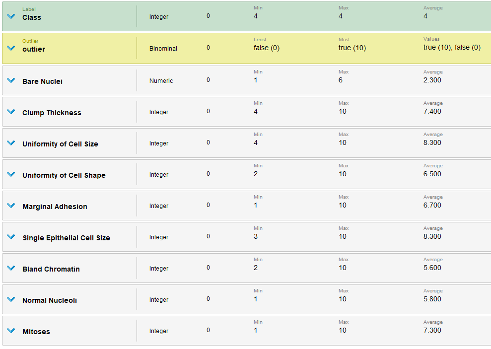
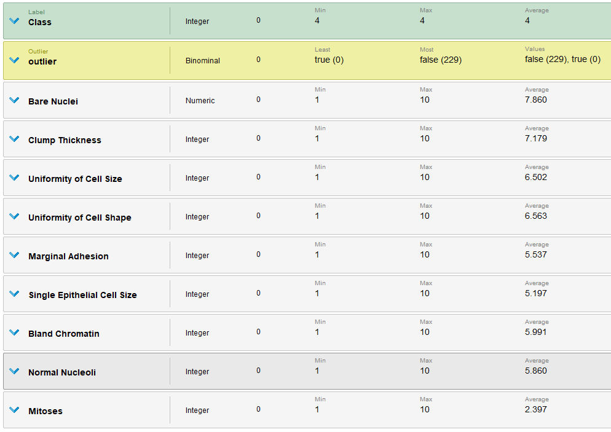

# Outliers

Una vez eliminados los [missing values](./4_missing_values_rapidminer.md) vamos a ver si podemos detectar algún outlier con Rapidminer. 
Para esto vamos a partir del modelo construido en [missing values](./4_missing_values_rapidminer.md).

Agregamos el modulo de `Detect Outliers (Distances)`, utilizando los parámetros por defecto.

| Parametros          | Detect Outliers (Distances) |
|--------------------:|:---------------------------:|
| Number of neighbors | 10                          |
| Number of outliers  | 10                          |
| Distance functions  | Euclidean Distance          |

Separamos los datos en outliers y no outliers con dos modulos de `Filter Examples`.

Ahora comparamos las estadísticas de los outliers y no outliers.

| Atributo                    | Outliers True | Outliers False  | Diferencia |
|-----------------------------|---------------|-----------------|------------|
| Bare Nuclei                 | 3.563         | 2.3             | 1.263      |
| Clump Thickness             | 4.398         | 7.4             | 3.002      |
| Uniformity of Cell Size     | 3.074         | 8.3             | 5.226      |
| Uniformity of Cell Shape    | 3.166         | 6.5             | 3.334      |
| Marginal Adhesion           | 2.773         | 6.7             | 3.927      |
| Single Epithelial Cell Size | 3.159         | 8.3             | 5.141      |
| Bland Chromatin             | 3.413         | 5.6             | 2.187      |
| Normal Nucleoli             | 2.826         | 5.8             | 2.974      |
| Mitoses                     | 1.519         | 7.3             | 5.781      |

Podemos ver que casi todos los atributos tienen una gran diferencia y pueden ser outliers (recordar que los atributos toman valores entre [0,10]). También podemos observar que son valores de la clase 4 (tumores malignos), asi que vamos a asegurarnos que no sean valores comunes para esa clase. Para esto agregamos un bloque de `Filter Examples` y tomamos las clases iguales a 4.

| Atributo                    | Outliers True | Outliers False  | Diferencia |
|-----------------------------|---------------|-----------------|------------|
| Bare Nuclei                 | 3.563         | 7.860           | 4.267      |
| Clump Thickness             | 4.398         | 7.179           | 2.781      |
| Uniformity of Cell Size     | 3.074         | 6.502           | 3.428      |
| Uniformity of Cell Shape    | 3.166         | 6.563           | 3.397      |
| Marginal Adhesion           | 2.773         | 5.537           | 2.764      |
| Single Epithelial Cell Size | 3.159         | 5.197           | 2.041      |
| Bland Chromatin             | 3.413         | 5.991           | 2.578      |
| Normal Nucleoli             | 2.826         | 5.860           | 3.034      |
| Mitoses                     | 1.519         | 2.397           | 0.878      |

Por lo que vimos en el [estudio de atributos](./3_attributes_text.md) sabemos que en las células cancerígenas suelen ser más asimétricas lo que puede justificar una diferencia de `5.781` entre todos los otuliers y no outliers contra una de `0.878`, cuando comparamos solo los outliers de la misma clase. Todos los demas atributos indican que realmente son outliers por lo cual deberán de ser descartados de aquí en mas.