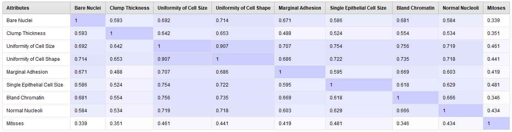

# Correlacion (RapidMiner)

Como `Bare Nuclei` estaba como valor `Polynomial` a pesar de haber removido los missing values tenemos que convertlirlos nuevamente en valores numericos. Una vez convertidos podemos hacer una matriz de correlaciones.

Podemos ver una alta correlacion entre `Uniformity of Cell Shape` y `Uniformity of Cell Size`, como vimos en el estudio de atributos esto tiene sentido dado que al ser mas grandes las celulastienen una forma mas irregular.

[Outliers Rapidminer ➡](./7_CART_rapidminer.md)

