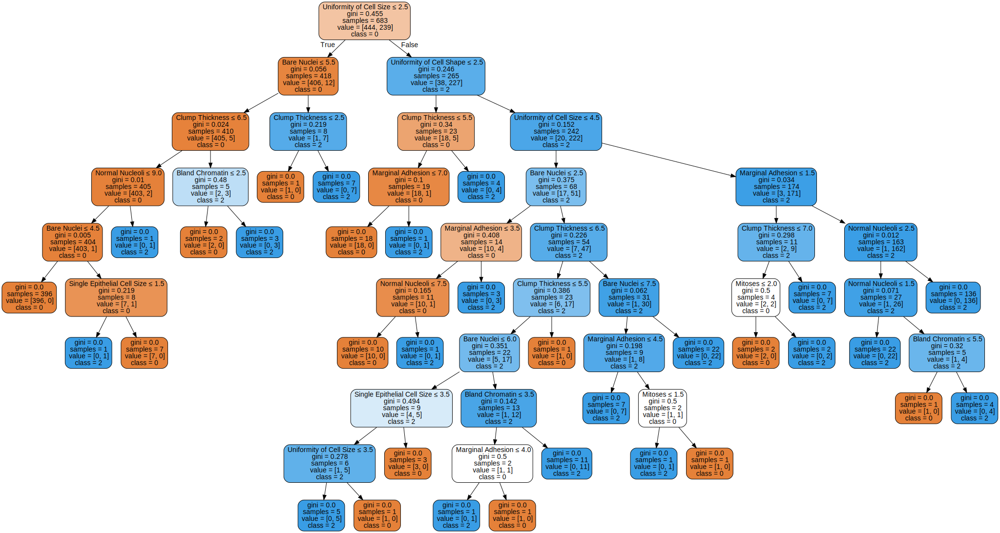

## CART 

```python
import pandas as pd
import numpy as np
import matplotlib.pyplot as plt
import matplotlib
from sklearn import tree
import graphviz
```


```python
data = pd.read_csv('breast_cancer.csv')
```


```python
data.head()
```


<div>
<style scoped>
    .dataframe tbody tr th:only-of-type {
        vertical-align: middle;
    }

    .dataframe tbody tr th {
        vertical-align: top;
    }

    .dataframe thead th {
        text-align: right;
    }
</style>
<table border="1" class="dataframe">
  <thead>
    <tr style="text-align: right;">
      <th></th>
      <th>id number</th>
      <th>Clump Thickness</th>
      <th>Uniformity of Cell Size</th>
      <th>Uniformity of Cell Shape</th>
      <th>Marginal Adhesion</th>
      <th>Single Epithelial Cell Size</th>
      <th>Bare Nuclei</th>
      <th>Bland Chromatin</th>
      <th>Normal Nucleoli</th>
      <th>Mitoses</th>
      <th>Class</th>
    </tr>
  </thead>
  <tbody>
    <tr>
      <th>0</th>
      <td>1000025</td>
      <td>5</td>
      <td>1</td>
      <td>1</td>
      <td>1</td>
      <td>2</td>
      <td>1</td>
      <td>3</td>
      <td>1</td>
      <td>1</td>
      <td>2</td>
    </tr>
    <tr>
      <th>1</th>
      <td>1002945</td>
      <td>5</td>
      <td>4</td>
      <td>4</td>
      <td>5</td>
      <td>7</td>
      <td>10</td>
      <td>3</td>
      <td>2</td>
      <td>1</td>
      <td>2</td>
    </tr>
    <tr>
      <th>2</th>
      <td>1015425</td>
      <td>3</td>
      <td>1</td>
      <td>1</td>
      <td>1</td>
      <td>2</td>
      <td>2</td>
      <td>3</td>
      <td>1</td>
      <td>1</td>
      <td>2</td>
    </tr>
    <tr>
      <th>3</th>
      <td>1016277</td>
      <td>6</td>
      <td>8</td>
      <td>8</td>
      <td>1</td>
      <td>3</td>
      <td>4</td>
      <td>3</td>
      <td>7</td>
      <td>1</td>
      <td>2</td>
    </tr>
    <tr>
      <th>4</th>
      <td>1017023</td>
      <td>4</td>
      <td>1</td>
      <td>1</td>
      <td>3</td>
      <td>2</td>
      <td>1</td>
      <td>3</td>
      <td>1</td>
      <td>1</td>
      <td>2</td>
    </tr>
  </tbody>
</table>
</div>


```python
data = data.replace('?', np.nan)
```


```python
data = data.dropna(axis=0)
```


```python
data = data.drop('id number', axis=1)
```


```python
data.head()
```


<div>
<style scoped>
    .dataframe tbody tr th:only-of-type {
        vertical-align: middle;
    }

    .dataframe tbody tr th {
        vertical-align: top;
    }

    .dataframe thead th {
        text-align: right;
    }
</style>
<table border="1" class="dataframe">
  <thead>
    <tr style="text-align: right;">
      <th></th>
      <th>Clump Thickness</th>
      <th>Uniformity of Cell Size</th>
      <th>Uniformity of Cell Shape</th>
      <th>Marginal Adhesion</th>
      <th>Single Epithelial Cell Size</th>
      <th>Bare Nuclei</th>
      <th>Bland Chromatin</th>
      <th>Normal Nucleoli</th>
      <th>Mitoses</th>
      <th>Class</th>
    </tr>
  </thead>
  <tbody>
    <tr>
      <th>0</th>
      <td>5</td>
      <td>1</td>
      <td>1</td>
      <td>1</td>
      <td>2</td>
      <td>1</td>
      <td>3</td>
      <td>1</td>
      <td>1</td>
      <td>2</td>
    </tr>
    <tr>
      <th>1</th>
      <td>5</td>
      <td>4</td>
      <td>4</td>
      <td>5</td>
      <td>7</td>
      <td>10</td>
      <td>3</td>
      <td>2</td>
      <td>1</td>
      <td>2</td>
    </tr>
    <tr>
      <th>2</th>
      <td>3</td>
      <td>1</td>
      <td>1</td>
      <td>1</td>
      <td>2</td>
      <td>2</td>
      <td>3</td>
      <td>1</td>
      <td>1</td>
      <td>2</td>
    </tr>
    <tr>
      <th>3</th>
      <td>6</td>
      <td>8</td>
      <td>8</td>
      <td>1</td>
      <td>3</td>
      <td>4</td>
      <td>3</td>
      <td>7</td>
      <td>1</td>
      <td>2</td>
    </tr>
    <tr>
      <th>4</th>
      <td>4</td>
      <td>1</td>
      <td>1</td>
      <td>3</td>
      <td>2</td>
      <td>1</td>
      <td>3</td>
      <td>1</td>
      <td>1</td>
      <td>2</td>
    </tr>
  </tbody>
</table>
</div>


```python
data_target = pd.DataFrame(data['Class'])
data = data.drop('Class', axis=1)
```


```python
data_target.head(2)
```


<div>
<style scoped>
    .dataframe tbody tr th:only-of-type {
        vertical-align: middle;
    }

    .dataframe tbody tr th {
        vertical-align: top;
    }

    .dataframe thead th {
        text-align: right;
    }
</style>
<table border="1" class="dataframe">
  <thead>
    <tr style="text-align: right;">
      <th></th>
      <th>Class</th>
    </tr>
  </thead>
  <tbody>
    <tr>
      <th>0</th>
      <td>2</td>
    </tr>
    <tr>
      <th>1</th>
      <td>2</td>
    </tr>
  </tbody>
</table>
</div>


```python
data.head(2)
```


<div>
<style scoped>
    .dataframe tbody tr th:only-of-type {
        vertical-align: middle;
    }

    .dataframe tbody tr th {
        vertical-align: top;
    }

    .dataframe thead th {
        text-align: right;
    }
</style>
<table border="1" class="dataframe">
  <thead>
    <tr style="text-align: right;">
      <th></th>
      <th>Clump Thickness</th>
      <th>Uniformity of Cell Size</th>
      <th>Uniformity of Cell Shape</th>
      <th>Marginal Adhesion</th>
      <th>Single Epithelial Cell Size</th>
      <th>Bare Nuclei</th>
      <th>Bland Chromatin</th>
      <th>Normal Nucleoli</th>
      <th>Mitoses</th>
    </tr>
  </thead>
  <tbody>
    <tr>
      <th>0</th>
      <td>5</td>
      <td>1</td>
      <td>1</td>
      <td>1</td>
      <td>2</td>
      <td>1</td>
      <td>3</td>
      <td>1</td>
      <td>1</td>
    </tr>
    <tr>
      <th>1</th>
      <td>5</td>
      <td>4</td>
      <td>4</td>
      <td>5</td>
      <td>7</td>
      <td>10</td>
      <td>3</td>
      <td>2</td>
      <td>1</td>
    </tr>
  </tbody>
</table>
</div>


```python
clf = tree.DecisionTreeClassifier()
clf = clf.fit(data, data_target)
```


```python
dot_data = tree.export_graphviz(clf, out_file=None, 
                         feature_names=['Clump Thickness', 'Uniformity of Cell Size',
                                        'Uniformity of Cell Shape', 'Marginal Adhesion',
                                        'Single Epithelial Cell Size', 'Bare Nuclei', 'Bland Chromatin',
                                        'Normal Nucleoli', 'Mitoses'],  
                         class_names=['0','2'],  
                         filled=True, rounded=True,  
                         special_characters=True)  
graph = graphviz.Source(dot_data)  
graph 
```





Modelo muy complejo

[Logistic Regression ➡](./8_logistic_regression.md)