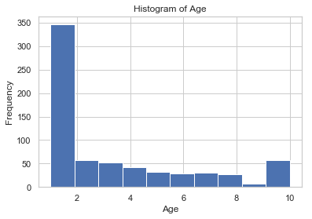

## Logistic Regression


```python
import pandas as pd
import numpy as np
from sklearn import preprocessing
import matplotlib.pyplot as plt 
from sklearn.feature_selection import RFE
from sklearn.linear_model import LogisticRegression
from sklearn.cross_validation import train_test_split
import seaborn as sns
sns.set(style="white")
sns.set(style="whitegrid", color_codes=True)
```


```python
data = pd.read_csv('dataset.csv')
```


```python
data.head()
```


<div>
<style scoped>
    .dataframe tbody tr th:only-of-type {
        vertical-align: middle;
    }

    .dataframe tbody tr th {
        vertical-align: top;
    }

    .dataframe thead th {
        text-align: right;
    }
</style>
<table border="1" class="dataframe">
  <thead>
    <tr style="text-align: right;">
      <th></th>
      <th>Sample code number</th>
      <th>Clump Thickness</th>
      <th>Uniformity of Cell Size</th>
      <th>Uniformity of Cell Shape</th>
      <th>Marginal Adhesion</th>
      <th>Single Epithelial Cell Size</th>
      <th>Bare Nuclei</th>
      <th>Bland Chromatin</th>
      <th>Normal Nucleoli</th>
      <th>Mitoses</th>
      <th>Class</th>
    </tr>
  </thead>
  <tbody>
    <tr>
      <th>0</th>
      <td>1000025</td>
      <td>5</td>
      <td>1</td>
      <td>1</td>
      <td>1</td>
      <td>2</td>
      <td>1</td>
      <td>3</td>
      <td>1</td>
      <td>1</td>
      <td>2</td>
    </tr>
    <tr>
      <th>1</th>
      <td>1002945</td>
      <td>5</td>
      <td>4</td>
      <td>4</td>
      <td>5</td>
      <td>7</td>
      <td>10</td>
      <td>3</td>
      <td>2</td>
      <td>1</td>
      <td>2</td>
    </tr>
    <tr>
      <th>2</th>
      <td>1015425</td>
      <td>3</td>
      <td>1</td>
      <td>1</td>
      <td>1</td>
      <td>2</td>
      <td>2</td>
      <td>3</td>
      <td>1</td>
      <td>1</td>
      <td>2</td>
    </tr>
    <tr>
      <th>3</th>
      <td>1016277</td>
      <td>6</td>
      <td>8</td>
      <td>8</td>
      <td>1</td>
      <td>3</td>
      <td>4</td>
      <td>3</td>
      <td>7</td>
      <td>1</td>
      <td>2</td>
    </tr>
    <tr>
      <th>4</th>
      <td>1017023</td>
      <td>4</td>
      <td>1</td>
      <td>1</td>
      <td>3</td>
      <td>2</td>
      <td>1</td>
      <td>3</td>
      <td>1</td>
      <td>1</td>
      <td>2</td>
    </tr>
  </tbody>
</table>
</div>


Uniformity of Cell Shape is highly correlated with Uniformity of Cell Size (ρ = 0.90688) Rejected
Dataset has 8 duplicate rows Warning


```python
data = data.drop(['Sample code number',' Uniformity of Cell Size'],1)
data = data.replace('?', np.nan)
data = data.dropna(axis=0)
```


```python
data.head(2)
```


<div>
<style scoped>
    .dataframe tbody tr th:only-of-type {
        vertical-align: middle;
    }

    .dataframe tbody tr th {
        vertical-align: top;
    }

    .dataframe thead th {
        text-align: right;
    }
</style>
<table border="1" class="dataframe">
  <thead>
    <tr style="text-align: right;">
      <th></th>
      <th>Clump Thickness</th>
      <th>Uniformity of Cell Shape</th>
      <th>Marginal Adhesion</th>
      <th>Single Epithelial Cell Size</th>
      <th>Bare Nuclei</th>
      <th>Bland Chromatin</th>
      <th>Normal Nucleoli</th>
      <th>Mitoses</th>
      <th>Class</th>
    </tr>
  </thead>
  <tbody>
    <tr>
      <th>0</th>
      <td>5</td>
      <td>1</td>
      <td>1</td>
      <td>2</td>
      <td>1</td>
      <td>3</td>
      <td>1</td>
      <td>1</td>
      <td>2</td>
    </tr>
    <tr>
      <th>1</th>
      <td>5</td>
      <td>4</td>
      <td>5</td>
      <td>7</td>
      <td>10</td>
      <td>3</td>
      <td>2</td>
      <td>1</td>
      <td>2</td>
    </tr>
  </tbody>
</table>
</div>


```python
labels = data.iloc[:,-1:] 
data_  = data.iloc[:,:-1]
```


```python
data_.head(2)
```


<div>
<style scoped>
    .dataframe tbody tr th:only-of-type {
        vertical-align: middle;
    }

    .dataframe tbody tr th {
        vertical-align: top;
    }

    .dataframe thead th {
        text-align: right;
    }
</style>
<table border="1" class="dataframe">
  <thead>
    <tr style="text-align: right;">
      <th></th>
      <th>Clump Thickness</th>
      <th>Uniformity of Cell Shape</th>
      <th>Marginal Adhesion</th>
      <th>Single Epithelial Cell Size</th>
      <th>Bare Nuclei</th>
      <th>Bland Chromatin</th>
      <th>Normal Nucleoli</th>
      <th>Mitoses</th>
    </tr>
  </thead>
  <tbody>
    <tr>
      <th>0</th>
      <td>5</td>
      <td>1</td>
      <td>1</td>
      <td>2</td>
      <td>1</td>
      <td>3</td>
      <td>1</td>
      <td>1</td>
    </tr>
    <tr>
      <th>1</th>
      <td>5</td>
      <td>4</td>
      <td>5</td>
      <td>7</td>
      <td>10</td>
      <td>3</td>
      <td>2</td>
      <td>1</td>
    </tr>
  </tbody>
</table>
</div>


```python
labels.head(2)
```


<div>
<style scoped>
    .dataframe tbody tr th:only-of-type {
        vertical-align: middle;
    }

    .dataframe tbody tr th {
        vertical-align: top;
    }

    .dataframe thead th {
        text-align: right;
    }
</style>
<table border="1" class="dataframe">
  <thead>
    <tr style="text-align: right;">
      <th></th>
      <th>Class</th>
    </tr>
  </thead>
  <tbody>
    <tr>
      <th>0</th>
      <td>2</td>
    </tr>
    <tr>
      <th>1</th>
      <td>2</td>
    </tr>
  </tbody>
</table>
</div>


```python
sns.countplot(x=labels[' Class'], data=labels, palette='hls')
plt.show()
```


```python
data.groupby(' Class').mean()
```


<div>
<style scoped>
    .dataframe tbody tr th:only-of-type {
        vertical-align: middle;
    }

    .dataframe tbody tr th {
        vertical-align: top;
    }

    .dataframe thead th {
        text-align: right;
    }
</style>
<table border="1" class="dataframe">
  <thead>
    <tr style="text-align: right;">
      <th></th>
      <th>Clump Thickness</th>
      <th>Uniformity of Cell Shape</th>
      <th>Marginal Adhesion</th>
      <th>Single Epithelial Cell Size</th>
      <th>Bland Chromatin</th>
      <th>Normal Nucleoli</th>
      <th>Mitoses</th>
    </tr>
    <tr>
      <th>Class</th>
      <th></th>
      <th></th>
      <th></th>
      <th></th>
      <th></th>
      <th></th>
      <th></th>
    </tr>
  </thead>
  <tbody>
    <tr>
      <th>2</th>
      <td>2.963964</td>
      <td>1.414414</td>
      <td>1.346847</td>
      <td>2.108108</td>
      <td>2.083333</td>
      <td>1.261261</td>
      <td>1.065315</td>
    </tr>
    <tr>
      <th>4</th>
      <td>7.188285</td>
      <td>6.560669</td>
      <td>5.585774</td>
      <td>5.326360</td>
      <td>5.974895</td>
      <td>5.857741</td>
      <td>2.602510</td>
    </tr>
  </tbody>
</table>
</div>


Podemos ver las diferencias entre los valores por lo cual no vale la pena sacar ninguno


```python
data[' Uniformity of Cell Shape'].hist()
plt.title('Histogram of Age')
plt.xlabel('Age')
plt.ylabel('Frequency')
```


    Text(0,0.5,'Frequency')





```python
X_train, X_test, y_train, y_test = train_test_split(data_, labels, test_size=0.3, random_state=0)
```


```python
logisticRegr = LogisticRegression()
logisticRegr.fit(X_train, y_train.values.reshape(478,))
```


    LogisticRegression(C=1.0, class_weight=None, dual=False, fit_intercept=True,
              intercept_scaling=1, max_iter=100, multi_class='ovr', n_jobs=1,
              penalty='l2', random_state=None, solver='liblinear', tol=0.0001,
              verbose=0, warm_start=False)


```python
prediction = logisticRegr.predict(X_test)
columns = ['Predicted Value', 'Actual Value']
results = pd.DataFrame()
results['Predicted Value'] = prediction
results['Actual Value']    = y_test.values
```


```python
results.head()
```


<div>
<style scoped>
    .dataframe tbody tr th:only-of-type {
        vertical-align: middle;
    }

    .dataframe tbody tr th {
        vertical-align: top;
    }

    .dataframe thead th {
        text-align: right;
    }
</style>
<table border="1" class="dataframe">
  <thead>
    <tr style="text-align: right;">
      <th></th>
      <th>Predicted Value</th>
      <th>Actual Value</th>
    </tr>
  </thead>
  <tbody>
    <tr>
      <th>0</th>
      <td>2</td>
      <td>2</td>
    </tr>
    <tr>
      <th>1</th>
      <td>2</td>
      <td>2</td>
    </tr>
    <tr>
      <th>2</th>
      <td>4</td>
      <td>4</td>
    </tr>
    <tr>
      <th>3</th>
      <td>4</td>
      <td>4</td>
    </tr>
    <tr>
      <th>4</th>
      <td>2</td>
      <td>2</td>
    </tr>
  </tbody>
</table>
</div>


```python
wrong_predictions = results[results['Predicted Value'] != results['Actual Value']]
```


```python
accuracy = (len(results)-len(wrong_predictions))/len(results)
accuracy
```


    0.9463414634146341

