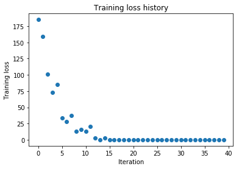
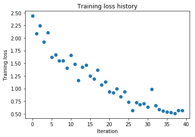
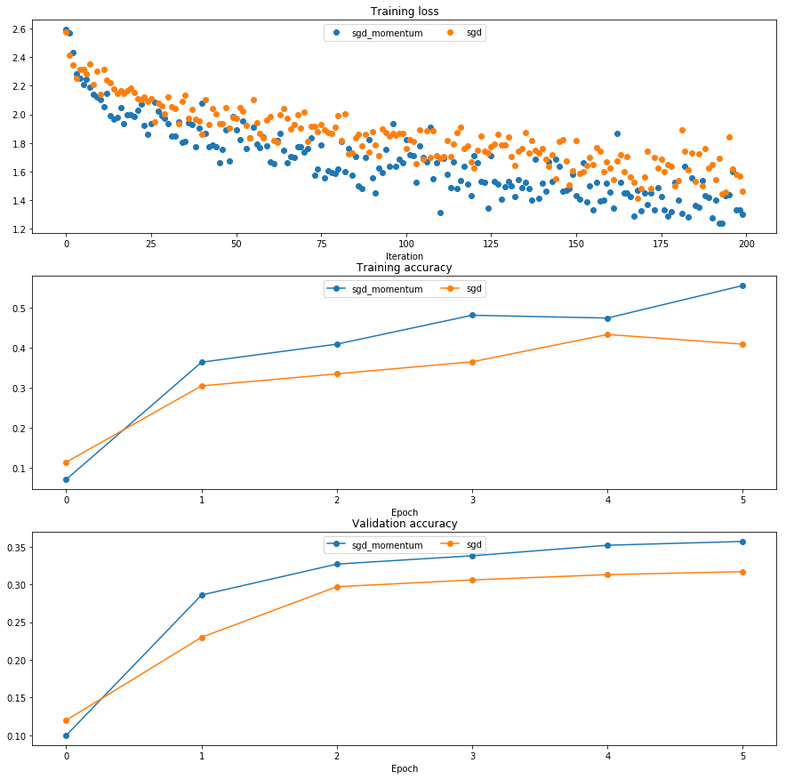
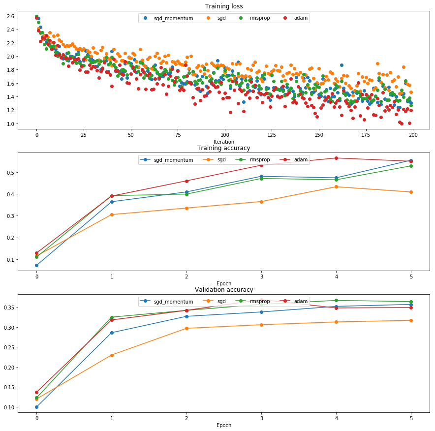
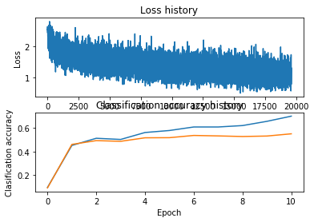

# Fully-Connected Neural Nets
In the previous homework you implemented a fully-connected two-layer neural network on CIFAR-10. The implementation was simple but not very modular since the loss and gradient were computed in a single monolithic function. This is manageable for a simple two-layer network, but would become impractical as we move to bigger models. Ideally we want to build networks using a more modular design so that we can implement different layer types in isolation and then snap them together into models with different architectures.

In this exercise we will implement fully-connected networks using a more modular approach. For each layer we will implement a `forward` and a `backward` function. The `forward` function will receive inputs, weights, and other parameters and will return both an output and a `cache` object storing data needed for the backward pass, like this:

```python
def layer_forward(x, w):
  """ Receive inputs x and weights w """
  # Do some computations ...
  z = # ... some intermediate value
  # Do some more computations ...
  out = # the output
   
  cache = (x, w, z, out) # Values we need to compute gradients
   
  return out, cache
```

The backward pass will receive upstream derivatives and the `cache` object, and will return gradients with respect to the inputs and weights, like this:

```python
def layer_backward(dout, cache):
  """
  Receive derivative of loss with respect to outputs and cache,
  and compute derivative with respect to inputs.
  """
  # Unpack cache values
  x, w, z, out = cache
  
  # Use values in cache to compute derivatives
  dx = # Derivative of loss with respect to x
  dw = # Derivative of loss with respect to w
  
  return dx, dw
```

After implementing a bunch of layers this way, we will be able to easily combine them to build classifiers with different architectures.

In addition to implementing fully-connected networks of arbitrary depth, we will also explore different update rules for optimization, and introduce Dropout as a regularizer and Batch Normalization as a tool to more efficiently optimize deep networks.
  


```python
# As usual, a bit of setup
from __future__ import print_function
import time
import numpy as np
import matplotlib.pyplot as plt
from cs231n.classifiers.fc_net import *
from cs231n.data_utils import get_CIFAR10_data
from cs231n.gradient_check import eval_numerical_gradient, eval_numerical_gradient_array
from cs231n.solver import Solver

%matplotlib inline
plt.rcParams['figure.figsize'] = (10.0, 8.0) # set default size of plots
plt.rcParams['image.interpolation'] = 'nearest'
plt.rcParams['image.cmap'] = 'gray'

# for auto-reloading external modules
# see http://stackoverflow.com/questions/1907993/autoreload-of-modules-in-ipython
%load_ext autoreload
%autoreload 2

def rel_error(x, y):
  """ returns relative error """
  return np.max(np.abs(x - y) / (np.maximum(1e-8, np.abs(x) + np.abs(y))))
```


```python
# Load the (preprocessed) CIFAR10 data.

data = get_CIFAR10_data()
for k, v in list(data.items()):
  print(('%s: ' % k, v.shape))
```

    ('X_test: ', (1000, 3, 32, 32))
    ('X_val: ', (1000, 3, 32, 32))
    ('X_train: ', (49000, 3, 32, 32))
    ('y_val: ', (1000,))
    ('y_test: ', (1000,))
    ('y_train: ', (49000,))


# Affine layer: foward
Open the file `cs231n/layers.py` and implement the `affine_forward` function.

Once you are done you can test your implementaion by running the following:


```python
# Test the affine_forward function

num_inputs = 2
input_shape = (4, 5, 6)
output_dim = 3

input_size = num_inputs * np.prod(input_shape)
weight_size = output_dim * np.prod(input_shape)

x = np.linspace(-0.1, 0.5, num=input_size).reshape(num_inputs, *input_shape)
w = np.linspace(-0.2, 0.3, num=weight_size).reshape(np.prod(input_shape), output_dim)
b = np.linspace(-0.3, 0.1, num=output_dim)

out, _ = affine_forward(x, w, b)
correct_out = np.array([[ 1.49834967,  1.70660132,  1.91485297],
                        [ 3.25553199,  3.5141327,   3.77273342]])

# Compare your output with ours. The error should be around 1e-9.
print('Testing affine_forward function:')
print('difference: ', rel_error(out, correct_out))
```

    Testing affine_forward function:
    difference:  9.769847728806635e-10


# Affine layer: backward
Now implement the `affine_backward` function and test your implementation using numeric gradient checking.


```python
# Test the affine_backward function
np.random.seed(231)
x = np.random.randn(10, 2, 3)
w = np.random.randn(6, 5)
b = np.random.randn(5)
dout = np.random.randn(10, 5)

dx_num = eval_numerical_gradient_array(lambda x: affine_forward(x, w, b)[0], x, dout)
dw_num = eval_numerical_gradient_array(lambda w: affine_forward(x, w, b)[0], w, dout)
db_num = eval_numerical_gradient_array(lambda b: affine_forward(x, w, b)[0], b, dout)

_, cache = affine_forward(x, w, b)
dx, dw, db = affine_backward(dout, cache)

# The error should be around 1e-10
print('Testing affine_backward function:')
print('dx error: ', rel_error(dx_num, dx))
print('dw error: ', rel_error(dw_num, dw))
print('db error: ', rel_error(db_num, db))
```

    Testing affine_backward function:
    dx error:  1.0908199508708189e-10
    dw error:  2.1752635504596857e-10
    db error:  7.736978834487815e-12


# ReLU layer: forward
Implement the forward pass for the ReLU activation function in the `relu_forward` function and test your implementation using the following:


```python
# Test the relu_forward function

x = np.linspace(-0.5, 0.5, num=12).reshape(3, 4)

out, _ = relu_forward(x)
correct_out = np.array([[ 0.,          0.,          0.,          0.,        ],
                        [ 0.,          0.,          0.04545455,  0.13636364,],
                        [ 0.22727273,  0.31818182,  0.40909091,  0.5,       ]])

# Compare your output with ours. The error should be around 5e-8
print('Testing relu_forward function:')
print('difference: ', rel_error(out, correct_out))
```

    Testing relu_forward function:
    difference:  4.999999798022158e-08


# ReLU layer: backward
Now implement the backward pass for the ReLU activation function in the `relu_backward` function and test your implementation using numeric gradient checking:


```python
np.random.seed(231)
x = np.random.randn(10, 10)
dout = np.random.randn(*x.shape)

dx_num = eval_numerical_gradient_array(lambda x: relu_forward(x)[0], x, dout)

_, cache = relu_forward(x)
dx = relu_backward(dout, cache)

# The error should be around 3e-12
print('Testing relu_backward function:')
print('dx error: ', rel_error(dx_num, dx))
```

    Testing relu_backward function:
    dx error:  3.2756349136310288e-12


# "Sandwich" layers
There are some common patterns of layers that are frequently used in neural nets. For example, affine layers are frequently followed by a ReLU nonlinearity. To make these common patterns easy, we define several convenience layers in the file `cs231n/layer_utils.py`.

For now take a look at the `affine_relu_forward` and `affine_relu_backward` functions, and run the following to numerically gradient check the backward pass:


```python
from cs231n.layer_utils import affine_relu_forward, affine_relu_backward
np.random.seed(231)
x = np.random.randn(2, 3, 4)
w = np.random.randn(12, 10)
b = np.random.randn(10)
dout = np.random.randn(2, 10)

out, cache = affine_relu_forward(x, w, b)
dx, dw, db = affine_relu_backward(dout, cache)

dx_num = eval_numerical_gradient_array(lambda x: affine_relu_forward(x, w, b)[0], x, dout)
dw_num = eval_numerical_gradient_array(lambda w: affine_relu_forward(x, w, b)[0], w, dout)
db_num = eval_numerical_gradient_array(lambda b: affine_relu_forward(x, w, b)[0], b, dout)

print('Testing affine_relu_forward:')
print('dx error: ', rel_error(dx_num, dx))
print('dw error: ', rel_error(dw_num, dw))
print('db error: ', rel_error(db_num, db))
```

    Testing affine_relu_forward:
    dx error:  6.395535042049294e-11
    dw error:  8.162011105764925e-11
    db error:  7.826724021458994e-12


# Loss layers: Softmax and SVM
You implemented these loss functions in the last assignment, so we'll give them to you for free here. You should still make sure you understand how they work by looking at the implementations in `cs231n/layers.py`.

You can make sure that the implementations are correct by running the following:


```python
np.random.seed(231)
num_classes, num_inputs = 10, 50
x = 0.001 * np.random.randn(num_inputs, num_classes)
y = np.random.randint(num_classes, size=num_inputs)

dx_num = eval_numerical_gradient(lambda x: svm_loss(x, y)[0], x, verbose=False)
loss, dx = svm_loss(x, y)

# Test svm_loss function. Loss should be around 9 and dx error should be 1e-9
print('Testing svm_loss:')
print('loss: ', loss)
print('dx error: ', rel_error(dx_num, dx))

dx_num = eval_numerical_gradient(lambda x: softmax_loss(x, y)[0], x, verbose=False)
loss, dx = softmax_loss(x, y)

# Test softmax_loss function. Loss should be 2.3 and dx error should be 1e-8
print('\nTesting softmax_loss:')
print('loss: ', loss)
print('dx error: ', rel_error(dx_num, dx))
```

    Testing svm_loss:
    loss:  8.999602749096233
    dx error:  1.4021566006651672e-09
    
    Testing softmax_loss:
    loss:  2.302545844500738
    dx error:  9.384673161989355e-09


# Two-layer network
In the previous assignment you implemented a two-layer neural network in a single monolithic class. Now that you have implemented modular versions of the necessary layers, you will reimplement the two layer network using these modular implementations.

Open the file `cs231n/classifiers/fc_net.py` and complete the implementation of the `TwoLayerNet` class. This class will serve as a model for the other networks you will implement in this assignment, so read through it to make sure you understand the API. You can run the cell below to test your implementation.


```python
np.random.seed(231)
N, D, H, C = 3, 5, 50, 7
X = np.random.randn(N, D)
y = np.random.randint(C, size=N)

std = 1e-3
model = TwoLayerNet(input_dim=D, hidden_dim=H, num_classes=C, weight_scale=std)

print('Testing initialization ... ')
W1_std = abs(model.params['W1'].std() - std)
b1 = model.params['b1']
W2_std = abs(model.params['W2'].std() - std)
b2 = model.params['b2']
assert W1_std < std / 10, 'First layer weights do not seem right'
assert np.all(b1 == 0), 'First layer biases do not seem right'
assert W2_std < std / 10, 'Second layer weights do not seem right'
assert np.all(b2 == 0), 'Second layer biases do not seem right'

print('Testing test-time forward pass ... ')
model.params['W1'] = np.linspace(-0.7, 0.3, num=D*H).reshape(D, H)
model.params['b1'] = np.linspace(-0.1, 0.9, num=H)
model.params['W2'] = np.linspace(-0.3, 0.4, num=H*C).reshape(H, C)
model.params['b2'] = np.linspace(-0.9, 0.1, num=C)
X = np.linspace(-5.5, 4.5, num=N*D).reshape(D, N).T
scores = model.loss(X)
correct_scores = np.asarray(
  [[11.53165108,  12.2917344,   13.05181771,  13.81190102,  14.57198434, 15.33206765,  16.09215096],
   [12.05769098,  12.74614105,  13.43459113,  14.1230412,   14.81149128, 15.49994135,  16.18839143],
   [12.58373087,  13.20054771,  13.81736455,  14.43418138,  15.05099822, 15.66781506,  16.2846319 ]])
scores_diff = np.abs(scores - correct_scores).sum()
assert scores_diff < 1e-6, 'Problem with test-time forward pass'

print('Testing training loss (no regularization)')
y = np.asarray([0, 5, 1])
loss, grads = model.loss(X, y)
correct_loss = 3.4702243556
assert abs(loss - correct_loss) < 1e-10, 'Problem with training-time loss'

model.reg = 1.0
loss, grads = model.loss(X, y)
correct_loss = 26.5948426952
assert abs(loss - correct_loss) < 1e-10, 'Problem with regularization loss'

for reg in [0.0, 0.7]:
  print('Running numeric gradient check with reg = ', reg)
  model.reg = reg
  loss, grads = model.loss(X, y)

  for name in sorted(grads):
    f = lambda _: model.loss(X, y)[0]
    grad_num = eval_numerical_gradient(f, model.params[name], verbose=False)
    print('%s relative error: %.2e' % (name, rel_error(grad_num, grads[name])))
```

    Testing initialization ... 
    Testing test-time forward pass ... 
    Testing training loss (no regularization)
    Running numeric gradient check with reg =  0.0
    W1 relative error: 1.22e-08
    W2 relative error: 3.46e-10
    b1 relative error: 6.55e-09
    b2 relative error: 2.53e-10
    Running numeric gradient check with reg =  0.7
    W1 relative error: 2.53e-07
    W2 relative error: 2.85e-08
    b1 relative error: 1.56e-08
    b2 relative error: 8.89e-10


# Solver
In the previous assignment, the logic for training models was coupled to the models themselves. Following a more modular design, for this assignment we have split the logic for training models into a separate class.

Open the file `cs231n/solver.py` and read through it to familiarize yourself with the API. After doing so, use a `Solver` instance to train a `TwoLayerNet` that achieves at least `50%` accuracy on the validation set.


```python
model = TwoLayerNet() 
solver = None

##############################################################################
# TODO: Use a Solver instance to train a TwoLayerNet that achieves at least  #
# 50% accuracy on the validation set.                                        #
##############################################################################
data   = get_CIFAR10_data()
model  = TwoLayerNet(hidden_dim=100, reg=1e-3)
solver = Solver(model, data,
                update_rule='sgd',
                optim_config={
                  'learning_rate': 1e-3,
                },
                lr_decay=0.95,
                num_epochs=10, batch_size=200,
                print_every=100)
solver.train()
##############################################################################
#                             END OF YOUR CODE                               #
##############################################################################
```

    (Iteration 1 / 2450) loss: 2.305771
    (Epoch 0 / 10) train acc: 0.109000; val_acc: 0.086000
    (Iteration 101 / 2450) loss: 1.795877
    (Iteration 201 / 2450) loss: 1.583191
    (Epoch 1 / 10) train acc: 0.460000; val_acc: 0.425000
    (Iteration 301 / 2450) loss: 1.481636
    (Iteration 401 / 2450) loss: 1.578140
    (Epoch 2 / 10) train acc: 0.475000; val_acc: 0.453000
    (Iteration 501 / 2450) loss: 1.579111
    (Iteration 601 / 2450) loss: 1.377166
    (Iteration 701 / 2450) loss: 1.420404
    (Epoch 3 / 10) train acc: 0.496000; val_acc: 0.486000
    (Iteration 801 / 2450) loss: 1.391361
    (Iteration 901 / 2450) loss: 1.343468
    (Epoch 4 / 10) train acc: 0.513000; val_acc: 0.472000
    (Iteration 1001 / 2450) loss: 1.289856
    (Iteration 1101 / 2450) loss: 1.277366
    (Iteration 1201 / 2450) loss: 1.374405
    (Epoch 5 / 10) train acc: 0.545000; val_acc: 0.491000
    (Iteration 1301 / 2450) loss: 1.233433
    (Iteration 1401 / 2450) loss: 1.370140
    (Epoch 6 / 10) train acc: 0.544000; val_acc: 0.487000
    (Iteration 1501 / 2450) loss: 1.416686
    (Iteration 1601 / 2450) loss: 1.344966
    (Iteration 1701 / 2450) loss: 1.298250
    (Epoch 7 / 10) train acc: 0.552000; val_acc: 0.493000
    (Iteration 1801 / 2450) loss: 1.116608
    (Iteration 1901 / 2450) loss: 1.424773
    (Epoch 8 / 10) train acc: 0.575000; val_acc: 0.491000
    (Iteration 2001 / 2450) loss: 1.235384
    (Iteration 2101 / 2450) loss: 1.254527
    (Iteration 2201 / 2450) loss: 1.270842
    (Epoch 9 / 10) train acc: 0.529000; val_acc: 0.502000
    (Iteration 2301 / 2450) loss: 1.110721
    (Iteration 2401 / 2450) loss: 1.193752
    (Epoch 10 / 10) train acc: 0.595000; val_acc: 0.521000


```python
# Run this cell to visualize training loss and train / val accuracy

plt.subplot(2, 1, 1)
plt.title('Training loss')
plt.plot(solver.loss_history, 'o')
plt.xlabel('Iteration')

plt.subplot(2, 1, 2)
plt.title('Accuracy')
plt.plot(solver.train_acc_history, '-o', label='train')
plt.plot(solver.val_acc_history, '-o', label='val')
plt.plot([0.5] * len(solver.val_acc_history), 'k--')
plt.xlabel('Epoch')
plt.legend(loc='lower right')
plt.gcf().set_size_inches(15, 12)
plt.show()
```


# Inline question: 
Why does the training loss in the plot jumps up and down?

Which strategies can you employ to narrow the gap between the blue and green curves in the bottom plot?

# Answer:
Se mueve de esa forma por el calculo del gradiente, siguiendo la analogia en la que una funcion que se intenta optimizar riene forma de bowl, la red esta saltando de un lado hacia el otro de la moda (la parte inferior del bowl). Saltaria de arriba a abajo de una forma mas "agresiva" si tuviera un learning rate mas alto.

Intentaria hacer overfitting. La diferencia entre entrenamiento y validacion quiere decir que con los datos de entrenamiento no son representativos de los de test. Se podria incrementar el tamaño del dataset o conseguir un dataset mas representativo.

# Multilayer network
Next you will implement a fully-connected network with an arbitrary number of hidden layers.

Read through the `FullyConnectedNet` class in the file `cs231n/classifiers/fc_net.py`.

Implement the initialization, the forward pass, and the backward pass. For the moment don't worry about implementing dropout or batch normalization; we will add those features soon.

## Initial loss and gradient check

As a sanity check, run the following to check the initial loss and to gradient check the network both with and without regularization. Do the initial losses seem reasonable?

For gradient checking, you should expect to see errors around 1e-6 or less.


```python
np.random.seed(231)
N, D, H1, H2, C = 2, 15, 20, 30, 10
X = np.random.randn(N, D)
y = np.random.randint(C, size=(N,))

for reg in [0, 3.14]:
  print('Running check with reg = ', reg)
  model = FullyConnectedNet([H1, H2], input_dim=D, num_classes=C,
                            reg=reg, weight_scale=5e-2, dtype=np.float64)

  loss, grads = model.loss(X, y)
  print('Initial loss: ', loss)

  for name in sorted(grads):
    f = lambda _: model.loss(X, y)[0]
    grad_num = eval_numerical_gradient(f, model.params[name], verbose=False, h=1e-5)
    print('%s relative error: %.2e' % (name, rel_error(grad_num, grads[name])))
    
assert(len(model.params.keys())==len(grads.keys()))
```

    Running check with reg =  0
    Initial loss:  2.3004790897684924
    W1 relative error: 1.48e-07
    W2 relative error: 2.21e-05
    W3 relative error: 3.53e-07
    b1 relative error: 5.38e-09
    b2 relative error: 2.09e-09
    b3 relative error: 5.80e-11
    Running check with reg =  3.14
    Initial loss:  7.052114776533016
    W1 relative error: 7.36e-09
    W2 relative error: 6.87e-08
    W3 relative error: 3.48e-08
    b1 relative error: 1.48e-08
    b2 relative error: 1.72e-09
    b3 relative error: 1.80e-10


As another sanity check, make sure you can overfit a small dataset of 50 images. First we will try a three-layer network with 100 units in each hidden layer. You will need to tweak the learning rate and initialization scale, but you should be able to overfit and achieve 100% training accuracy within 20 epochs.


```python
# TODO: Use a three-layer Net to overfit 50 training examples.

num_train = 50
small_data = {
  'X_train': data['X_train'][:num_train],
  'y_train': data['y_train'][:num_train],
  'X_val': data['X_val'],
  'y_val': data['y_val'],
}

# for i in range(100):
#     solver = None
#     weight_scale, learning_rate = [10**np.random.uniform(-5,-1),10**np.random.uniform(-5,-1)]
#     print(weight_scale)
#     print(learning_rate)
weight_scale  = 0.08851246925411049
learning_rate = 0.0004156158779692744
model = FullyConnectedNet([100, 100],
              weight_scale=weight_scale, dtype=np.float64)
solver = Solver(model, small_data,
                print_every=100, num_epochs=20, batch_size=25,
                update_rule='sgd',
                optim_config={
                  'learning_rate': learning_rate,
                }
         )

solver.train()


plt.plot(solver.loss_history, 'o')
plt.title('Training loss history')
plt.xlabel('Iteration')
plt.ylabel('Training loss')
plt.show()
```

    (Iteration 1 / 40) loss: 185.185400
    (Epoch 0 / 20) train acc: 0.200000; val_acc: 0.137000
    (Epoch 1 / 20) train acc: 0.240000; val_acc: 0.137000
    (Epoch 2 / 20) train acc: 0.220000; val_acc: 0.099000
    (Epoch 3 / 20) train acc: 0.520000; val_acc: 0.121000
    (Epoch 4 / 20) train acc: 0.700000; val_acc: 0.133000
    (Epoch 5 / 20) train acc: 0.780000; val_acc: 0.136000
    (Epoch 6 / 20) train acc: 0.940000; val_acc: 0.135000
    (Epoch 7 / 20) train acc: 0.960000; val_acc: 0.134000
    (Epoch 8 / 20) train acc: 1.000000; val_acc: 0.140000
    (Epoch 9 / 20) train acc: 1.000000; val_acc: 0.133000
    (Epoch 10 / 20) train acc: 1.000000; val_acc: 0.131000
    (Epoch 11 / 20) train acc: 1.000000; val_acc: 0.131000
    (Epoch 12 / 20) train acc: 1.000000; val_acc: 0.131000
    (Epoch 13 / 20) train acc: 1.000000; val_acc: 0.131000
    (Epoch 14 / 20) train acc: 1.000000; val_acc: 0.131000
    (Epoch 15 / 20) train acc: 1.000000; val_acc: 0.131000
    (Epoch 16 / 20) train acc: 1.000000; val_acc: 0.131000
    (Epoch 17 / 20) train acc: 1.000000; val_acc: 0.131000
    (Epoch 18 / 20) train acc: 1.000000; val_acc: 0.131000
    (Epoch 19 / 20) train acc: 1.000000; val_acc: 0.131000
    (Epoch 20 / 20) train acc: 1.000000; val_acc: 0.131000





Now try to use a five-layer network with 100 units on each layer to overfit 50 training examples. Again you will have to adjust the learning rate and weight initialization, but you should be able to achieve 100% training accuracy within 20 epochs.


```python
# TODO: Use a five-layer Net to overfit 50 training examples.

num_train = 50
small_data = {
  'X_train': data['X_train'][:num_train],
  'y_train': data['y_train'][:num_train],
  'X_val': data['X_val'],
  'y_val': data['y_val'],
}

for i in range(1):
    solver = None
    weight_scale, learning_rate = [10**np.random.uniform(-2,-1),10**np.random.uniform(-2,-4)]
    print(weight_scale)
    print(learning_rate)
    model = FullyConnectedNet([100, 100, 100, 100],
                    weight_scale=weight_scale, dtype=np.float64)
    solver = Solver(model, small_data,
                    print_every=10, num_epochs=20, batch_size=25,
                    update_rule='sgd',
                    optim_config={
                      'learning_rate': learning_rate,
                    }
             )
    solver.train()

plt.plot(solver.loss_history, 'o')
plt.title('Training loss history')
plt.xlabel('Iteration')
plt.ylabel('Training loss')
plt.show()
```

    0.04245971232930349
    0.0033611407975843773
    (Iteration 1 / 40) loss: 2.436404
    (Epoch 0 / 20) train acc: 0.180000; val_acc: 0.136000
    (Epoch 1 / 20) train acc: 0.240000; val_acc: 0.128000
    (Epoch 2 / 20) train acc: 0.280000; val_acc: 0.121000
    (Epoch 3 / 20) train acc: 0.440000; val_acc: 0.136000
    (Epoch 4 / 20) train acc: 0.520000; val_acc: 0.146000
    (Epoch 5 / 20) train acc: 0.580000; val_acc: 0.119000
    (Iteration 11 / 40) loss: 1.661630
    (Epoch 6 / 20) train acc: 0.660000; val_acc: 0.131000
    (Epoch 7 / 20) train acc: 0.700000; val_acc: 0.139000
    (Epoch 8 / 20) train acc: 0.680000; val_acc: 0.149000
    (Epoch 9 / 20) train acc: 0.760000; val_acc: 0.139000
    (Epoch 10 / 20) train acc: 0.780000; val_acc: 0.135000
    (Iteration 21 / 40) loss: 0.937687
    (Epoch 11 / 20) train acc: 0.800000; val_acc: 0.140000
    (Epoch 12 / 20) train acc: 0.840000; val_acc: 0.151000
    (Epoch 13 / 20) train acc: 0.860000; val_acc: 0.150000
    (Epoch 14 / 20) train acc: 0.860000; val_acc: 0.160000
    (Epoch 15 / 20) train acc: 0.880000; val_acc: 0.139000
    (Iteration 31 / 40) loss: 0.630475
    (Epoch 16 / 20) train acc: 0.920000; val_acc: 0.145000
    (Epoch 17 / 20) train acc: 0.940000; val_acc: 0.150000
    (Epoch 18 / 20) train acc: 0.940000; val_acc: 0.153000
    (Epoch 19 / 20) train acc: 0.960000; val_acc: 0.154000
    (Epoch 20 / 20) train acc: 1.000000; val_acc: 0.156000





# Inline question: 
Did you notice anything about the comparative difficulty of training the three-layer net vs training the five layer net?

# Answer:
Fue mucho mas dificil overfittear una red de 5 capas. Se incrementan las dificultades al momento de tomar decisiones sobre el modelo, cada capa introduce nuevos parametros, como, por ejemplo, el numero de nueronas. Tambien aumenta la complejidad computacional.


# Update rules
So far we have used vanilla stochastic gradient descent (SGD) as our update rule. More sophisticated update rules can make it easier to train deep networks. We will implement a few of the most commonly used update rules and compare them to vanilla SGD.

# SGD+Momentum
Stochastic gradient descent with momentum is a widely used update rule that tends to make deep networks converge faster than vanilla stochstic gradient descent.

Open the file `cs231n/optim.py` and read the documentation at the top of the file to make sure you understand the API. Implement the SGD+momentum update rule in the function `sgd_momentum` and run the following to check your implementation. You should see errors less than 1e-8.


```python
from cs231n.optim import sgd_momentum

N, D = 4, 5
w = np.linspace(-0.4, 0.6, num=N*D).reshape(N, D)
dw = np.linspace(-0.6, 0.4, num=N*D).reshape(N, D)
v = np.linspace(0.6, 0.9, num=N*D).reshape(N, D)

config = {'learning_rate': 1e-3, 'velocity': v}
next_w, _ = sgd_momentum(w, dw, config=config)

expected_next_w = np.asarray([
  [ 0.1406,      0.20738947,  0.27417895,  0.34096842,  0.40775789],
  [ 0.47454737,  0.54133684,  0.60812632,  0.67491579,  0.74170526],
  [ 0.80849474,  0.87528421,  0.94207368,  1.00886316,  1.07565263],
  [ 1.14244211,  1.20923158,  1.27602105,  1.34281053,  1.4096    ]])
expected_velocity = np.asarray([
  [ 0.5406,      0.55475789,  0.56891579, 0.58307368,  0.59723158],
  [ 0.61138947,  0.62554737,  0.63970526,  0.65386316,  0.66802105],
  [ 0.68217895,  0.69633684,  0.71049474,  0.72465263,  0.73881053],
  [ 0.75296842,  0.76712632,  0.78128421,  0.79544211,  0.8096    ]])

print('next_w error: ', rel_error(next_w, expected_next_w))
print('velocity error: ', rel_error(expected_velocity, config['velocity']))
```

    next_w error:  8.882347033505819e-09
    velocity error:  4.269287743278663e-09


Once you have done so, run the following to train a six-layer network with both SGD and SGD+momentum. You should see the SGD+momentum update rule converge faster.


```python
num_train = 4000
small_data = {
  'X_train': data['X_train'][:num_train],
  'y_train': data['y_train'][:num_train],
  'X_val': data['X_val'],
  'y_val': data['y_val'],
}

solvers = {}

for update_rule in ['sgd', 'sgd_momentum']:
  print('running with ', update_rule)
  model = FullyConnectedNet([100, 100, 100, 100, 100], weight_scale=5e-2)

  solver = Solver(model, small_data,
                  num_epochs=5, batch_size=100,
                  update_rule=update_rule,
                  optim_config={
                    'learning_rate': 1e-2,
                  },
                  verbose=True)
  solvers[update_rule] = solver
  solver.train()
  print()

plt.subplot(3, 1, 1)
plt.title('Training loss')
plt.xlabel('Iteration')

plt.subplot(3, 1, 2)
plt.title('Training accuracy')
plt.xlabel('Epoch')

plt.subplot(3, 1, 3)
plt.title('Validation accuracy')
plt.xlabel('Epoch')

for update_rule, solver in list(solvers.items()):
  plt.subplot(3, 1, 1)
  plt.plot(solver.loss_history, 'o', label=update_rule)
  
  plt.subplot(3, 1, 2)
  plt.plot(solver.train_acc_history, '-o', label=update_rule)

  plt.subplot(3, 1, 3)
  plt.plot(solver.val_acc_history, '-o', label=update_rule)
  
for i in [1, 2, 3]:
  plt.subplot(3, 1, i)
  plt.legend(loc='upper center', ncol=4)
plt.gcf().set_size_inches(15, 15)
plt.show()
```

    running with  sgd
    (Iteration 1 / 200) loss: 2.573687
    (Epoch 0 / 5) train acc: 0.115000; val_acc: 0.120000
    (Iteration 11 / 200) loss: 2.143634
    (Iteration 21 / 200) loss: 2.150335
    (Iteration 31 / 200) loss: 2.123153
    (Epoch 1 / 5) train acc: 0.305000; val_acc: 0.230000
    (Iteration 41 / 200) loss: 1.863956
    (Iteration 51 / 200) loss: 1.970178
    (Iteration 61 / 200) loss: 1.982951
    (Iteration 71 / 200) loss: 2.015394
    (Epoch 2 / 5) train acc: 0.335000; val_acc: 0.297000
    (Iteration 81 / 200) loss: 1.989400
    (Iteration 91 / 200) loss: 1.880553
    (Iteration 101 / 200) loss: 1.759101
    (Iteration 111 / 200) loss: 1.692543
    (Epoch 3 / 5) train acc: 0.365000; val_acc: 0.306000
    (Iteration 121 / 200) loss: 1.625222
    (Iteration 131 / 200) loss: 1.839339
    (Iteration 141 / 200) loss: 1.759286
    (Iteration 151 / 200) loss: 1.816708
    (Epoch 4 / 5) train acc: 0.433000; val_acc: 0.313000
    (Iteration 161 / 200) loss: 1.625878
    (Iteration 171 / 200) loss: 1.564334
    (Iteration 181 / 200) loss: 1.535899
    (Iteration 191 / 200) loss: 1.650634
    (Epoch 5 / 5) train acc: 0.409000; val_acc: 0.317000
    
    running with  sgd_momentum
    (Iteration 1 / 200) loss: 2.592141
    (Epoch 0 / 5) train acc: 0.072000; val_acc: 0.100000
    (Iteration 11 / 200) loss: 2.102615
    (Iteration 21 / 200) loss: 1.988216
    (Iteration 31 / 200) loss: 1.933802
    (Epoch 1 / 5) train acc: 0.364000; val_acc: 0.286000
    (Iteration 41 / 200) loss: 2.075356
    (Iteration 51 / 200) loss: 1.894542
    (Iteration 61 / 200) loss: 1.670772
    (Iteration 71 / 200) loss: 1.737473
    (Epoch 2 / 5) train acc: 0.409000; val_acc: 0.327000
    (Iteration 81 / 200) loss: 1.620928
    (Iteration 91 / 200) loss: 1.555277
    (Iteration 101 / 200) loss: 1.823605
    (Iteration 111 / 200) loss: 1.316633
    (Epoch 3 / 5) train acc: 0.481000; val_acc: 0.338000
    (Iteration 121 / 200) loss: 1.714028
    (Iteration 131 / 200) loss: 1.533336
    (Iteration 141 / 200) loss: 1.517884
    (Iteration 151 / 200) loss: 1.432278
    (Epoch 4 / 5) train acc: 0.474000; val_acc: 0.352000
    (Iteration 161 / 200) loss: 1.455977
    (Iteration 171 / 200) loss: 1.451193
    (Iteration 181 / 200) loss: 1.404188
    (Iteration 191 / 200) loss: 1.278586
    (Epoch 5 / 5) train acc: 0.555000; val_acc: 0.357000
    


    /Users/decemberlabs/anaconda3/lib/python3.5/site-packages/matplotlib/cbook/deprecation.py:107: MatplotlibDeprecationWarning: Adding an axes using the same arguments as a previous axes currently reuses the earlier instance.  In a future version, a new instance will always be created and returned.  Meanwhile, this warning can be suppressed, and the future behavior ensured, by passing a unique label to each axes instance.
      warnings.warn(message, mplDeprecation, stacklevel=1)





# RMSProp and Adam
RMSProp [1] and Adam [2] are update rules that set per-parameter learning rates by using a running average of the second moments of gradients.

In the file `cs231n/optim.py`, implement the RMSProp update rule in the `rmsprop` function and implement the Adam update rule in the `adam` function, and check your implementations using the tests below.

[1] Tijmen Tieleman and Geoffrey Hinton. "Lecture 6.5-rmsprop: Divide the gradient by a running average of its recent magnitude." COURSERA: Neural Networks for Machine Learning 4 (2012).

[2] Diederik Kingma and Jimmy Ba, "Adam: A Method for Stochastic Optimization", ICLR 2015.


```python
# Test RMSProp implementation; you should see errors less than 1e-7
from cs231n.optim import rmsprop

N, D = 4, 5
w = np.linspace(-0.4, 0.6, num=N*D).reshape(N, D)
dw = np.linspace(-0.6, 0.4, num=N*D).reshape(N, D)
cache = np.linspace(0.6, 0.9, num=N*D).reshape(N, D)

config = {'learning_rate': 1e-2, 'cache': cache}
next_w, _ = rmsprop(w, dw, config=config)

expected_next_w = np.asarray([
  [-0.39223849, -0.34037513, -0.28849239, -0.23659121, -0.18467247],
  [-0.132737,   -0.08078555, -0.02881884,  0.02316247,  0.07515774],
  [ 0.12716641,  0.17918792,  0.23122175,  0.28326742,  0.33532447],
  [ 0.38739248,  0.43947102,  0.49155973,  0.54365823,  0.59576619]])
expected_cache = np.asarray([
  [ 0.5976,      0.6126277,   0.6277108,   0.64284931,  0.65804321],
  [ 0.67329252,  0.68859723,  0.70395734,  0.71937285,  0.73484377],
  [ 0.75037008,  0.7659518,   0.78158892,  0.79728144,  0.81302936],
  [ 0.82883269,  0.84469141,  0.86060554,  0.87657507,  0.8926    ]])

print('next_w error: ', rel_error(expected_next_w, next_w))
print('cache error: ', rel_error(expected_cache, config['cache']))
```

    next_w error:  9.524687511038133e-08
    cache error:  2.6477955807156126e-09


```python
# Test Adam implementation; you should see errors around 1e-7 or less
from cs231n.optim import adam

N, D = 4, 5
w = np.linspace(-0.4, 0.6, num=N*D).reshape(N, D)
dw = np.linspace(-0.6, 0.4, num=N*D).reshape(N, D)
m = np.linspace(0.6, 0.9, num=N*D).reshape(N, D)
v = np.linspace(0.7, 0.5, num=N*D).reshape(N, D)

config = {'learning_rate': 1e-2, 'm': m, 'v': v, 't': 5}
next_w, _ = adam(w, dw, config=config)

expected_next_w = np.asarray([
  [-0.40094747, -0.34836187, -0.29577703, -0.24319299, -0.19060977],
  [-0.1380274,  -0.08544591, -0.03286534,  0.01971428,  0.0722929],
  [ 0.1248705,   0.17744702,  0.23002243,  0.28259667,  0.33516969],
  [ 0.38774145,  0.44031188,  0.49288093,  0.54544852,  0.59801459]])
expected_v = np.asarray([
  [ 0.69966,     0.68908382,  0.67851319,  0.66794809,  0.65738853,],
  [ 0.64683452,  0.63628604,  0.6257431,   0.61520571,  0.60467385,],
  [ 0.59414753,  0.58362676,  0.57311152,  0.56260183,  0.55209767,],
  [ 0.54159906,  0.53110598,  0.52061845,  0.51013645,  0.49966,   ]])
expected_m = np.asarray([
  [ 0.48,        0.49947368,  0.51894737,  0.53842105,  0.55789474],
  [ 0.57736842,  0.59684211,  0.61631579,  0.63578947,  0.65526316],
  [ 0.67473684,  0.69421053,  0.71368421,  0.73315789,  0.75263158],
  [ 0.77210526,  0.79157895,  0.81105263,  0.83052632,  0.85      ]])

print('next_w error: ', rel_error(expected_next_w, next_w))
print('v error: ', rel_error(expected_v, config['v']))
print('m error: ', rel_error(expected_m, config['m']))
```

    next_w error:  1.1395691798535431e-07
    v error:  4.208314038113071e-09
    m error:  4.214963193114416e-09


Once you have debugged your RMSProp and Adam implementations, run the following to train a pair of deep networks using these new update rules:


```python
learning_rates = {'rmsprop': 1e-4, 'adam': 1e-3}
for update_rule in ['adam', 'rmsprop']:
  print('running with ', update_rule)
  model = FullyConnectedNet([100, 100, 100, 100, 100], weight_scale=5e-2)

  solver = Solver(model, small_data,
                  num_epochs=5, batch_size=100,
                  update_rule=update_rule,
                  optim_config={
                    'learning_rate': learning_rates[update_rule]
                  },
                  verbose=True)
  solvers[update_rule] = solver
  solver.train()
  print()

plt.subplot(3, 1, 1)
plt.title('Training loss')
plt.xlabel('Iteration')

plt.subplot(3, 1, 2)
plt.title('Training accuracy')
plt.xlabel('Epoch')

plt.subplot(3, 1, 3)
plt.title('Validation accuracy')
plt.xlabel('Epoch')

for update_rule, solver in list(solvers.items()):
  plt.subplot(3, 1, 1)
  plt.plot(solver.loss_history, 'o', label=update_rule)
  
  plt.subplot(3, 1, 2)
  plt.plot(solver.train_acc_history, '-o', label=update_rule)

  plt.subplot(3, 1, 3)
  plt.plot(solver.val_acc_history, '-o', label=update_rule)
  
for i in [1, 2, 3]:
  plt.subplot(3, 1, i)
  plt.legend(loc='upper center', ncol=4)
plt.gcf().set_size_inches(15, 15)
plt.show()
```

    running with  adam
    (Iteration 1 / 200) loss: 2.573687


    /Users/decemberlabs/Desktop/postgrado/assignment2/cs231n/optim.py:146: RuntimeWarning: invalid value encountered in sqrt
      next_x = x - config['learning_rate'] * mt / (np.sqrt(vt) + config['epsilon'])


    (Epoch 0 / 5) train acc: 0.129000; val_acc: 0.137000
    (Iteration 11 / 200) loss: 2.012391
    (Iteration 21 / 200) loss: 1.957238
    (Iteration 31 / 200) loss: 1.848074
    (Epoch 1 / 5) train acc: 0.390000; val_acc: 0.318000
    (Iteration 41 / 200) loss: 1.556848
    (Iteration 51 / 200) loss: 1.735981
    (Iteration 61 / 200) loss: 1.744840
    (Iteration 71 / 200) loss: 1.554268
    (Epoch 2 / 5) train acc: 0.460000; val_acc: 0.342000
    (Iteration 81 / 200) loss: 1.709111
    (Iteration 91 / 200) loss: 1.413853
    (Iteration 101 / 200) loss: 1.455356
    (Iteration 111 / 200) loss: 1.180105
    (Epoch 3 / 5) train acc: 0.532000; val_acc: 0.369000
    (Iteration 121 / 200) loss: 1.311819
    (Iteration 131 / 200) loss: 1.400983
    (Iteration 141 / 200) loss: 1.438730
    (Iteration 151 / 200) loss: 1.382845
    (Epoch 4 / 5) train acc: 0.565000; val_acc: 0.348000
    (Iteration 161 / 200) loss: 1.343992
    (Iteration 171 / 200) loss: 1.335571
    (Iteration 181 / 200) loss: 1.125024
    (Iteration 191 / 200) loss: 1.324045
    (Epoch 5 / 5) train acc: 0.550000; val_acc: 0.349000
    
    running with  rmsprop
    (Iteration 1 / 200) loss: 2.592141
    (Epoch 0 / 5) train acc: 0.110000; val_acc: 0.123000


    /Users/decemberlabs/Desktop/postgrado/assignment2/cs231n/optim.py:104: RuntimeWarning: invalid value encountered in sqrt
      next_x = x - config['learning_rate']*dx / (np.sqrt(config['cache']) + config['epsilon'])


    (Iteration 11 / 200) loss: 2.063403
    (Iteration 21 / 200) loss: 1.925407
    (Iteration 31 / 200) loss: 1.914749
    (Epoch 1 / 5) train acc: 0.392000; val_acc: 0.325000
    (Iteration 41 / 200) loss: 1.985837
    (Iteration 51 / 200) loss: 1.860505
    (Iteration 61 / 200) loss: 1.676581
    (Iteration 71 / 200) loss: 1.664635
    (Epoch 2 / 5) train acc: 0.399000; val_acc: 0.342000
    (Iteration 81 / 200) loss: 1.607665
    (Iteration 91 / 200) loss: 1.689273
    (Iteration 101 / 200) loss: 1.791340
    (Iteration 111 / 200) loss: 1.496820
    (Epoch 3 / 5) train acc: 0.471000; val_acc: 0.357000
    (Iteration 121 / 200) loss: 1.695300
    (Iteration 131 / 200) loss: 1.627252
    (Iteration 141 / 200) loss: 1.487402
    (Iteration 151 / 200) loss: 1.537601
    (Epoch 4 / 5) train acc: 0.465000; val_acc: 0.367000
    (Iteration 161 / 200) loss: 1.545286
    (Iteration 171 / 200) loss: 1.476692
    (Iteration 181 / 200) loss: 1.408408
    (Iteration 191 / 200) loss: 1.432171
    (Epoch 5 / 5) train acc: 0.529000; val_acc: 0.364000
    


    /Users/decemberlabs/anaconda3/lib/python3.5/site-packages/matplotlib/cbook/deprecation.py:107: MatplotlibDeprecationWarning: Adding an axes using the same arguments as a previous axes currently reuses the earlier instance.  In a future version, a new instance will always be created and returned.  Meanwhile, this warning can be suppressed, and the future behavior ensured, by passing a unique label to each axes instance.
      warnings.warn(message, mplDeprecation, stacklevel=1)





# Train a good model!
Train the best fully-connected model that you can on CIFAR-10, storing your best model in the `best_model` variable. We require you to get at least 50% accuracy on the validation set using a fully-connected net.

If you are careful it should be possible to get accuracies above 55%, but we don't require it for this part and won't assign extra credit for doing so. Later in the assignment we will ask you to train the best convolutional network that you can on CIFAR-10, and we would prefer that you spend your effort working on convolutional nets rather than fully-connected nets.

You might find it useful to complete the `BatchNormalization.ipynb` and `Dropout.ipynb` notebooks before completing this part, since those techniques can help you train powerful models.

You **should explain** how did you get the model (e.g., how did you find/set the parameters/hyperparameters).


```python
best_model   = None
################################################################################
# TODO: Train the best FullyConnectedNet that you can on CIFAR-10. You might   #
# batch normalization and dropout useful. Store your best model in the         #
# best_model variable.                                                         #
################################################################################


w_s = 10**np.random.uniform(-3,-2)
r   = 10**np.random.uniform(-5,-1)
lr  = 10**np.random.uniform(-5,-4)
model = FullyConnectedNet([100, 100, 100, 100],
                          weight_scale=w_s,
                          reg= r)
solver = Solver(model, data,
        print_every=100, num_epochs=10, batch_size=25,
        update_rule='adam',
        optim_config={
          'learning_rate': lr,
        },
        lr_decay = 0.9,
        verbose = True
        )   

solver.train()

best_model = model

plt.subplot(2, 1, 1)
plt.plot(solver.loss_history)
plt.title('Loss history')
plt.xlabel('Iteration')
plt.ylabel('Loss')

plt.subplot(2, 1, 2)
plt.plot(solver.train_acc_history, label='train')
plt.plot(solver.val_acc_history, label='val')
plt.title('Classification accuracy history')
plt.xlabel('Epoch')
plt.ylabel('Clasification accuracy')
plt.show() 

################################################################################
#                              END OF YOUR CODE                                #
################################################################################
```

    (Iteration 1 / 19600) loss: 2.528440
    (Epoch 0 / 10) train acc: 0.096000; val_acc: 0.092000
    (Iteration 101 / 19600) loss: 2.163994
    (Iteration 201 / 19600) loss: 1.987360
    (Iteration 301 / 19600) loss: 1.939734
    (Iteration 401 / 19600) loss: 1.914992
    (Iteration 501 / 19600) loss: 2.422377
    (Iteration 601 / 19600) loss: 1.921711
    (Iteration 701 / 19600) loss: 1.445441
    (Iteration 801 / 19600) loss: 1.578532
    (Iteration 901 / 19600) loss: 2.162563
    (Iteration 1001 / 19600) loss: 2.035394
    (Iteration 1101 / 19600) loss: 1.723327
    (Iteration 1201 / 19600) loss: 1.456609
    (Iteration 1301 / 19600) loss: 1.683692
    (Iteration 1401 / 19600) loss: 1.614544
    (Iteration 1501 / 19600) loss: 1.699983
    (Iteration 1601 / 19600) loss: 2.385637
    (Iteration 1701 / 19600) loss: 1.879803
    (Iteration 1801 / 19600) loss: 1.324123
    (Iteration 1901 / 19600) loss: 1.477038
    (Epoch 1 / 10) train acc: 0.453000; val_acc: 0.462000
    (Iteration 2001 / 19600) loss: 1.643892
    (Iteration 2101 / 19600) loss: 1.726885
    (Iteration 2201 / 19600) loss: 1.774925
    (Iteration 2301 / 19600) loss: 1.650176
    (Iteration 2401 / 19600) loss: 1.641928
    (Iteration 2501 / 19600) loss: 1.832029
    (Iteration 2601 / 19600) loss: 1.703222
    (Iteration 2701 / 19600) loss: 1.794295
    (Iteration 2801 / 19600) loss: 1.448957
    (Iteration 2901 / 19600) loss: 1.561151
    (Iteration 3001 / 19600) loss: 1.747892
    (Iteration 3101 / 19600) loss: 1.945865
    (Iteration 3201 / 19600) loss: 1.448114
    (Iteration 3301 / 19600) loss: 1.389247
    (Iteration 3401 / 19600) loss: 1.268382
    (Iteration 3501 / 19600) loss: 1.377562
    (Iteration 3601 / 19600) loss: 1.892531
    (Iteration 3701 / 19600) loss: 1.703922
    (Iteration 3801 / 19600) loss: 1.796971
    (Iteration 3901 / 19600) loss: 1.647500
    (Epoch 2 / 10) train acc: 0.514000; val_acc: 0.494000
    (Iteration 4001 / 19600) loss: 1.581332
    (Iteration 4101 / 19600) loss: 1.433402
    (Iteration 4201 / 19600) loss: 1.391078
    (Iteration 4301 / 19600) loss: 1.426780
    (Iteration 4401 / 19600) loss: 1.541611
    (Iteration 4501 / 19600) loss: 1.471224
    (Iteration 4601 / 19600) loss: 1.261851
    (Iteration 4701 / 19600) loss: 1.539709
    (Iteration 4801 / 19600) loss: 1.820954
    (Iteration 4901 / 19600) loss: 1.323413
    (Iteration 5001 / 19600) loss: 1.440397
    (Iteration 5101 / 19600) loss: 1.165618
    (Iteration 5201 / 19600) loss: 1.307587
    (Iteration 5301 / 19600) loss: 1.677143
    (Iteration 5401 / 19600) loss: 1.355907
    (Iteration 5501 / 19600) loss: 1.499901
    (Iteration 5601 / 19600) loss: 1.559745
    (Iteration 5701 / 19600) loss: 0.882103
    (Iteration 5801 / 19600) loss: 1.570335
    (Epoch 3 / 10) train acc: 0.504000; val_acc: 0.488000
    (Iteration 5901 / 19600) loss: 1.492102
    (Iteration 6001 / 19600) loss: 1.786700
    (Iteration 6101 / 19600) loss: 1.491679
    (Iteration 6201 / 19600) loss: 1.185524
    (Iteration 6301 / 19600) loss: 1.064116
    (Iteration 6401 / 19600) loss: 1.039162
    (Iteration 6501 / 19600) loss: 1.278225
    (Iteration 6601 / 19600) loss: 1.590618
    (Iteration 6701 / 19600) loss: 1.929895
    (Iteration 6801 / 19600) loss: 1.524283
    (Iteration 6901 / 19600) loss: 1.422666
    (Iteration 7001 / 19600) loss: 1.568862
    (Iteration 7101 / 19600) loss: 1.205663
    (Iteration 7201 / 19600) loss: 1.373389
    (Iteration 7301 / 19600) loss: 1.618012
    (Iteration 7401 / 19600) loss: 1.131348
    (Iteration 7501 / 19600) loss: 1.244793
    (Iteration 7601 / 19600) loss: 1.582653
    (Iteration 7701 / 19600) loss: 1.241905
    (Iteration 7801 / 19600) loss: 1.172754
    (Epoch 4 / 10) train acc: 0.563000; val_acc: 0.518000
    (Iteration 7901 / 19600) loss: 1.735205
    (Iteration 8001 / 19600) loss: 1.208647
    (Iteration 8101 / 19600) loss: 1.100243
    (Iteration 8201 / 19600) loss: 1.391684
    (Iteration 8301 / 19600) loss: 1.643421
    (Iteration 8401 / 19600) loss: 1.440684
    (Iteration 8501 / 19600) loss: 1.390172
    (Iteration 8601 / 19600) loss: 1.799626
    (Iteration 8701 / 19600) loss: 0.939242
    (Iteration 8801 / 19600) loss: 1.591648
    (Iteration 8901 / 19600) loss: 1.548964
    (Iteration 9001 / 19600) loss: 1.662121
    (Iteration 9101 / 19600) loss: 1.365275
    (Iteration 9201 / 19600) loss: 1.608305
    (Iteration 9301 / 19600) loss: 1.483978
    (Iteration 9401 / 19600) loss: 1.147073
    (Iteration 9501 / 19600) loss: 1.438642
    (Iteration 9601 / 19600) loss: 0.801365
    (Iteration 9701 / 19600) loss: 1.446691
    (Epoch 5 / 10) train acc: 0.580000; val_acc: 0.519000
    (Iteration 9801 / 19600) loss: 1.537106
    (Iteration 9901 / 19600) loss: 1.265297
    (Iteration 10001 / 19600) loss: 1.316234
    (Iteration 10101 / 19600) loss: 1.440614
    (Iteration 10201 / 19600) loss: 1.462577
    (Iteration 10301 / 19600) loss: 1.029741
    (Iteration 10401 / 19600) loss: 1.263571
    (Iteration 10501 / 19600) loss: 1.513761
    (Iteration 10601 / 19600) loss: 1.101672
    (Iteration 10701 / 19600) loss: 1.079203
    (Iteration 10801 / 19600) loss: 1.619652
    (Iteration 10901 / 19600) loss: 1.286860
    (Iteration 11001 / 19600) loss: 0.985487
    (Iteration 11101 / 19600) loss: 1.647508
    (Iteration 11201 / 19600) loss: 1.303699
    (Iteration 11301 / 19600) loss: 1.601253
    (Iteration 11401 / 19600) loss: 0.919606
    (Iteration 11501 / 19600) loss: 1.162162
    (Iteration 11601 / 19600) loss: 1.285695
    (Iteration 11701 / 19600) loss: 1.250351
    (Epoch 6 / 10) train acc: 0.610000; val_acc: 0.538000
    (Iteration 11801 / 19600) loss: 1.409480
    (Iteration 11901 / 19600) loss: 1.218450
    (Iteration 12001 / 19600) loss: 0.841371
    (Iteration 12101 / 19600) loss: 1.240874
    (Iteration 12201 / 19600) loss: 1.194149
    (Iteration 12301 / 19600) loss: 1.168248
    (Iteration 12401 / 19600) loss: 1.099203
    (Iteration 12501 / 19600) loss: 1.162405
    (Iteration 12601 / 19600) loss: 1.419177
    (Iteration 12701 / 19600) loss: 1.234056
    (Iteration 12801 / 19600) loss: 1.316800
    (Iteration 12901 / 19600) loss: 1.420450
    (Iteration 13001 / 19600) loss: 1.438283
    (Iteration 13101 / 19600) loss: 1.123078
    (Iteration 13201 / 19600) loss: 0.857547
    (Iteration 13301 / 19600) loss: 0.972462
    (Iteration 13401 / 19600) loss: 1.029814
    (Iteration 13501 / 19600) loss: 1.450450
    (Iteration 13601 / 19600) loss: 0.951978
    (Iteration 13701 / 19600) loss: 1.041697
    (Epoch 7 / 10) train acc: 0.610000; val_acc: 0.534000
    (Iteration 13801 / 19600) loss: 1.042970
    (Iteration 13901 / 19600) loss: 1.387017
    (Iteration 14001 / 19600) loss: 0.989730
    (Iteration 14101 / 19600) loss: 1.176574
    (Iteration 14201 / 19600) loss: 1.526206
    (Iteration 14301 / 19600) loss: 1.324495
    (Iteration 14401 / 19600) loss: 1.702375
    (Iteration 14501 / 19600) loss: 1.054280
    (Iteration 14601 / 19600) loss: 1.339237
    (Iteration 14701 / 19600) loss: 0.896589
    (Iteration 14801 / 19600) loss: 0.863784
    (Iteration 14901 / 19600) loss: 0.879634
    (Iteration 15001 / 19600) loss: 1.393866
    (Iteration 15101 / 19600) loss: 1.422379
    (Iteration 15201 / 19600) loss: 1.044811
    (Iteration 15301 / 19600) loss: 1.080926
    (Iteration 15401 / 19600) loss: 1.390031
    (Iteration 15501 / 19600) loss: 1.206318
    (Iteration 15601 / 19600) loss: 0.968967
    (Epoch 8 / 10) train acc: 0.622000; val_acc: 0.529000
    (Iteration 15701 / 19600) loss: 1.154703
    (Iteration 15801 / 19600) loss: 1.370383
    (Iteration 15901 / 19600) loss: 1.384790
    (Iteration 16001 / 19600) loss: 1.181858
    (Iteration 16101 / 19600) loss: 0.954497
    (Iteration 16201 / 19600) loss: 1.861735
    (Iteration 16301 / 19600) loss: 1.215235
    (Iteration 16401 / 19600) loss: 0.622437
    (Iteration 16501 / 19600) loss: 1.153686
    (Iteration 16601 / 19600) loss: 1.464924
    (Iteration 16701 / 19600) loss: 0.836741
    (Iteration 16801 / 19600) loss: 0.990462
    (Iteration 16901 / 19600) loss: 1.382588
    (Iteration 17001 / 19600) loss: 1.243468
    (Iteration 17101 / 19600) loss: 1.607915
    (Iteration 17201 / 19600) loss: 1.382860
    (Iteration 17301 / 19600) loss: 0.899281
    (Iteration 17401 / 19600) loss: 1.141775
    (Iteration 17501 / 19600) loss: 1.127066
    (Iteration 17601 / 19600) loss: 1.055135
    (Epoch 9 / 10) train acc: 0.658000; val_acc: 0.533000
    (Iteration 17701 / 19600) loss: 1.289570
    (Iteration 17801 / 19600) loss: 1.261018
    (Iteration 17901 / 19600) loss: 0.952435
    (Iteration 18001 / 19600) loss: 0.966146
    (Iteration 18101 / 19600) loss: 1.175350
    (Iteration 18201 / 19600) loss: 1.039401
    (Iteration 18301 / 19600) loss: 1.576203
    (Iteration 18401 / 19600) loss: 0.811957
    (Iteration 18501 / 19600) loss: 1.216546
    (Iteration 18601 / 19600) loss: 0.994238
    (Iteration 18701 / 19600) loss: 0.880211
    (Iteration 18801 / 19600) loss: 0.833566
    (Iteration 18901 / 19600) loss: 0.835824
    (Iteration 19001 / 19600) loss: 0.803645
    (Iteration 19101 / 19600) loss: 1.034756
    (Iteration 19201 / 19600) loss: 1.117320
    (Iteration 19301 / 19600) loss: 0.864402
    (Iteration 19401 / 19600) loss: 0.910641
    (Iteration 19501 / 19600) loss: 1.079775
    (Epoch 10 / 10) train acc: 0.702000; val_acc: 0.552000





# Test you model
Run your best model on the validation and test sets. You should achieve above 50% accuracy on the validation set.


```python
y_test_pred = np.argmax(best_model.loss(data['X_test']), axis=1)
y_val_pred = np.argmax(best_model.loss(data['X_val']), axis=1)
print('Validation set accuracy: ', (y_val_pred == data['y_val']).mean())
print('Test set accuracy: ', (y_test_pred == data['y_test']).mean())
```

    Validation set accuracy:  0.552
    Test set accuracy:  0.527

