# Image Generation
In this notebook we will continue our exploration of image gradients using the deep model that was pretrained on TinyImageNet. We will explore various ways of using these image gradients to generate images. We will implement class visualizations, feature inversion, and DeepDream.


```python
# As usual, a bit of setup

import time, os, json
import numpy as np
from scipy.misc import imread, imresize
import matplotlib.pyplot as plt

from cs231n.classifiers.pretrained_cnn import PretrainedCNN
from cs231n.data_utils import load_tiny_imagenet
from cs231n.image_utils import blur_image, deprocess_image_2016, preprocess_image_2016

%matplotlib inline
plt.rcParams['figure.figsize'] = (10.0, 8.0) # set default size of plots
plt.rcParams['image.interpolation'] = 'nearest'
plt.rcParams['image.cmap'] = 'gray'

# for auto-reloading external modules
# see http://stackoverflow.com/questions/1907993/autoreload-of-modules-in-ipython
%load_ext autoreload
%autoreload 2
```

# TinyImageNet and pretrained model
As in the previous notebook, load the TinyImageNet dataset and the pretrained model.


```python
data = load_tiny_imagenet('cs231n/datasets/tiny-imagenet-100-A', subtract_mean=True)
model = PretrainedCNN(h5_file='cs231n/datasets/pretrained_model.h5')
```

    loading training data for synset 20 / 100
    loading training data for synset 40 / 100
    loading training data for synset 60 / 100
    loading training data for synset 80 / 100
    loading training data for synset 100 / 100


 # Class visualization
By starting with a random noise image and performing gradient ascent on a target class, we can generate an image that the network will recognize as the target class. This idea was first presented in [1]; [2] extended this idea by suggesting several regularization techniques that can improve the quality of the generated image.

Concretely, let $I$ be an image and let $y$ be a target class. Let $s_y(I)$ be the score that a convolutional network assigns to the image $I$ for class $y$; note that these are raw unnormalized scores, not class probabilities. We wish to generate an image $I^*$ that achieves a high score for the class $y$ by solving the problem

$$
I^* = \arg\max_I s_y(I) + R(I)
$$

where $R$ is a (possibly implicit) regularizer. We can solve this optimization problem using gradient descent, computing gradients with respect to the generated image. We will use (explicit) L2 regularization of the form

$$
R(I) + \lambda \|I\|_2^2
$$

and implicit regularization as suggested by [2] by peridically blurring the generated image. We can solve this problem using gradient ascent on the generated image.

In the cell below, complete the implementation of the `create_class_visualization` function.

[1] Karen Simonyan, Andrea Vedaldi, and Andrew Zisserman. "Deep Inside Convolutional Networks: Visualising
Image Classification Models and Saliency Maps", ICLR Workshop 2014.

[2] Yosinski et al, "Understanding Neural Networks Through Deep Visualization", ICML 2015 Deep Learning Workshop


```python
def create_class_visualization(target_y, model, **kwargs):
    """
    Perform optimization over the image to generate class visualizations.
  
    Inputs:
    - target_y: Integer in the range [0, 100) giving the target class
    - model: A PretrainedCNN that will be used for generation
  
    Keyword arguments:
    - learning_rate: Floating point number giving the learning rate
    - blur_every: An integer; how often to blur the image as a regularizer
    - l2_reg: Floating point number giving L2 regularization strength on the image;
      this is lambda in the equation above.
    - max_jitter: How much random jitter to add to the image as regularization
    - num_iterations: How many iterations to run for
    - show_every: How often to show the image
    """
  
    learning_rate = kwargs.pop('learning_rate', 10000)
    blur_every = kwargs.pop('blur_every', 1)
    l2_reg = kwargs.pop('l2_reg', 1e-6)
    max_jitter = kwargs.pop('max_jitter', 4)
    num_iterations = kwargs.pop('num_iterations', 100)
    show_every = kwargs.pop('show_every', 25)
  
    X = np.random.randn(1, 3, 64, 64)
    for t in range(num_iterations):
        # As a regularizer, add random jitter to the image
        ox, oy = np.random.randint(-max_jitter, max_jitter+1, 2)
        X = np.roll(np.roll(X, ox, -1), oy, -2)

        dX = None
        ############################################################################
        # TODO: Compute the image gradient dX of the image with respect to the     #
        # target_y class score. This should be similar to the fooling images. Also #
        # add L2 regularization to dX and update the image X using the image       #
        # gradient and the learning rate.                                          #
        ############################################################################
        scores, cache = model.forward(X)
        
        ds = np.zeros_like(scores)
        ds[0, target_y] = 1
        
        dX, grads = model.backward(ds, cache)
        dX -= l2_reg*X
        
        X += learning_rate*dX
        ############################################################################
        #                             END OF YOUR CODE                             #
        ############################################################################
    
        # Undo the jitter
        X = np.roll(np.roll(X, -ox, -1), -oy, -2)
    
        # As a regularizer, clip the image
        X = np.clip(X, -data['mean_image'], 255.0 - data['mean_image'])
    
        # As a regularizer, periodically blur the image
        if t % blur_every == 0:
            X = blur_image(X)
        # Periodically show the image
        if t % show_every == 0:
            plt.imshow(deprocess_image_2016(X, data['mean_image']))
            plt.gcf().set_size_inches(3, 3)
            plt.axis('off')
            plt.show()
    return X
```

You can use the code above to generate some cool images! An example is shown below. Try to generate a cool-looking image. If you want you can try to implement the other regularization schemes from Yosinski et al, but it isn't required.


```python
target_y = 43 # Tarantula
print(data['class_names'][target_y])
X = create_class_visualization(target_y, model, show_every=25)
```

    ['tarantula']


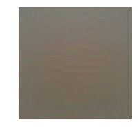


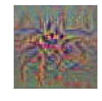


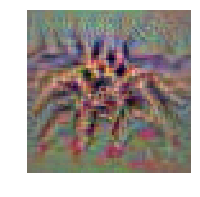


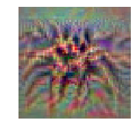


# Feature Inversion
In an attempt to understand the types of features that convolutional networks learn to recognize, a recent paper [1] attempts to reconstruct an image from its feature representation. We can easily implement this idea using image gradients from the pretrained network.

Concretely, given a image $I$, let $\phi_\ell(I)$ be the activations at layer $\ell$ of the convolutional network $\phi$. We wish to find an image $I^*$ with a similar feature representation as $I$ at layer $\ell$ of the network $\phi$ by solving the optimization problem

$$
I^* = \arg\min_{I'} \|\phi_\ell(I) - \phi_\ell(I')\|_2^2 + R(I')
$$

where $\|\cdot\|_2^2$ is the squared Euclidean norm. As above, $R$ is a (possibly implicit) regularizer. We can solve this optimization problem using gradient descent, computing gradients with respect to the generated image. We will use (explicit) L2 regularization of the form

$$
R(I') + \lambda \|I'\|_2^2
$$

together with implicit regularization by periodically blurring the image, as recommended by [2].

Implement this method in the function below.

[1] Aravindh Mahendran, Andrea Vedaldi, "Understanding Deep Image Representations by Inverting them", CVPR 2015

[2] Yosinski et al, "Understanding Neural Networks Through Deep Visualization", ICML 2015 Deep Learning Workshop


```python
def invert_features(target_feats, layer, model, **kwargs):
    """
    Perform feature inversion in the style of Mahendran and Vedaldi 2015, using
    L2 regularization and periodic blurring.
  
    Inputs:
    - target_feats: Image features of the target image, of shape (1, C, H, W);
      we will try to generate an image that matches these features
    - layer: The index of the layer from which the features were extracted
    - model: A PretrainedCNN that was used to extract features
  
    Keyword arguments:
    - learning_rate: The learning rate to use for gradient descent
    - num_iterations: The number of iterations to use for gradient descent
    - l2_reg: The strength of L2 regularization to use; this is lambda in the
      equation above.
    - blur_every: How often to blur the image as implicit regularization; set
      to 0 to disable blurring.
    - show_every: How often to show the generated image; set to 0 to disable
      showing intermediate reuslts.
    
    Returns:
    - X: Generated image of shape (1, 3, 64, 64) that matches the target features.
    """
    learning_rate = kwargs.pop('learning_rate', 10000)
    num_iterations = kwargs.pop('num_iterations', 500)
    l2_reg = kwargs.pop('l2_reg', 1e-7)
    blur_every = kwargs.pop('blur_every', 1)
    show_every = kwargs.pop('show_every', 50)
  
    X = np.random.randn(1, 3, 64, 64)
    for t in range(num_iterations):
        ############################################################################
        # TODO: Compute the image gradient dX of the reconstruction loss with      #
        # respect to the image. You should include L2 regularization penalizing    #
        # large pixel values in the generated image using the l2_reg parameter;    #
        # then update the generated image using the learning_rate from above.      #
        ############################################################################
        activation, cache = model.forward(X, end=layer)
        dactivation = 2*(activation - target_feats)
        
        dX, grads = model.backward(dactivation, cache)
        dX += l2_reg*X
        
        loss = np.sum((activation - target_feats)**2) + l2_reg*np.sum(X**2)
        
        X -= learning_rate*dX
        ############################################################################
        #                             END OF YOUR CODE                             #
        ############################################################################
    
        # As a regularizer, clip the image
        X = np.clip(X, -data['mean_image'], 255.0 - data['mean_image'])
    
        # As a regularizer, periodically blur the image
        if (blur_every > 0) and t % blur_every == 0:
            X = blur_image(X)
            print("loss = " + str(loss))

        if (show_every > 0) and (t % show_every == 0 or t + 1 == num_iterations):
            plt.imshow(deprocess_image_2016(X, data['mean_image']))
            plt.gcf().set_size_inches(3, 3)
            plt.axis('off')
            plt.title('t = %d' % t)
            plt.show()
```

### Shallow feature reconstruction
After implementing the feature inversion above, run the following cell to try and reconstruct features from the fourth convolutional layer of the pretrained model. You should be able to reconstruct the features using the provided optimization parameters.


```python
filename = 'kitten.jpg'
layer = 3 # layers start from 0 so these are features after 4 convolutions
img = imresize(imread(filename), (64, 64))

plt.imshow(img)
plt.gcf().set_size_inches(3, 3)
plt.title('Original image')
plt.axis('off')
plt.show()

# Preprocess the image before passing it to the network:
# subtract the mean, add a dimension, etc
img_pre = preprocess_image_2016(img, data['mean_image'])

# Extract features from the image
feats, _ = model.forward(img_pre, end=layer)

# Invert the features
kwargs = {
  'num_iterations': 400,
  'learning_rate': 5000,
  'l2_reg': 1e-8,
  'show_every': 100,
  'blur_every': 10,
}
X = invert_features(feats, layer, model, **kwargs)
```

    /Users/decemberlabs/anaconda3/lib/python3.5/site-packages/ipykernel_launcher.py:3: DeprecationWarning: `imread` is deprecated!
    `imread` is deprecated in SciPy 1.0.0, and will be removed in 1.2.0.
    Use ``imageio.imread`` instead.
      This is separate from the ipykernel package so we can avoid doing imports until
    /Users/decemberlabs/anaconda3/lib/python3.5/site-packages/ipykernel_launcher.py:3: DeprecationWarning: `imresize` is deprecated!
    `imresize` is deprecated in SciPy 1.0.0, and will be removed in 1.2.0.
    Use ``skimage.transform.resize`` instead.
      This is separate from the ipykernel package so we can avoid doing imports until


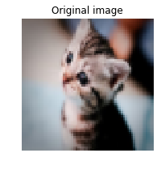


    loss = 258.08282538537304


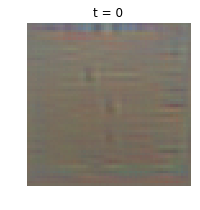


    loss = 220.87769258312005
    loss = 122.24407402903056
    loss = 98.70328603923927
    loss = 76.51454721815068
    loss = 57.85886107852715
    loss = 55.80212713207479
    loss = 48.332157635426675
    loss = 41.60398775955651
    loss = 41.48549206378907
    loss = 29.917946373509196


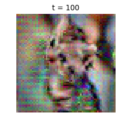


    loss = 29.596747038306155
    loss = 28.730833790701247
    loss = 35.4317487749549
    loss = 23.677511413366656
    loss = 30.345474866298353
    loss = 21.9725688176827
    loss = 30.916429084447383
    loss = 31.87400698545684
    loss = 16.897424545707214
    loss = 15.816110174907708


    loss = 13.518147088312862
    loss = 21.07219645963387
    loss = 34.46441992989243
    loss = 18.610312092588604
    loss = 22.317473357523596
    loss = 21.40406762165179
    loss = 17.753157373592046
    loss = 20.959385747009154
    loss = 19.980560046765987
    loss = 10.1926543080682


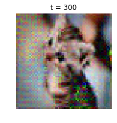


    loss = 13.151870735571547
    loss = 7.902701946631484
    loss = 17.994715662050616
    loss = 12.884592210559365
    loss = 26.027683686647205
    loss = 11.561839937053007
    loss = 6.449650088459049
    loss = 13.363101114503829
    loss = 14.895225500855494


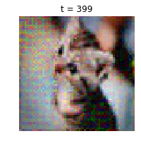


### Deep feature reconstruction
Reconstructing images using features from deeper layers of the network tends to give interesting results. In the cell below, try to reconstruct the best image you can by inverting the features after 7 layers of convolutions. You will need to play with the hyperparameters to try and get a good result.

HINT: If you read the paper by Mahendran and Vedaldi, you'll see that reconstructions from deep features tend not to look much like the original image, so you shouldn't expect the results to look like the reconstruction above. You should be able to get an image that shows some discernable structure within 1000 iterations.


```python
filename = 'kitten.jpg'
layer = 6 # layers start from 0 so these are features after 7 convolutions
img = imresize(imread(filename), (64, 64))

plt.imshow(img)
plt.gcf().set_size_inches(3, 3)
plt.title('Original image')
plt.axis('off')
plt.show()

# Preprocess the image before passing it to the network:
# subtract the mean, add a dimension, etc
img_pre = preprocess_image_2016(img, data['mean_image'])

# Extract features from the image
feats, _ = model.forward(img_pre, end=layer)

# Invert the features
# You will need to play with these parameters.
#kwargs = {
#  'num_iterations': 1000,
#  'learning_rate': 0,
#  'l2_reg': 0,
#  'show_every': 100,
#  'blur_every': 0,
#}
kwargs = {
  'num_iterations': 1000,
  'learning_rate': 10000,
  'l2_reg': 1e-8,
  'show_every': 100,
  'blur_every': 10,
}
X = invert_features(feats, layer, model, **kwargs)
```

    /Users/decemberlabs/anaconda3/lib/python3.5/site-packages/ipykernel_launcher.py:3: DeprecationWarning: `imread` is deprecated!
    `imread` is deprecated in SciPy 1.0.0, and will be removed in 1.2.0.
    Use ``imageio.imread`` instead.
      This is separate from the ipykernel package so we can avoid doing imports until
    /Users/decemberlabs/anaconda3/lib/python3.5/site-packages/ipykernel_launcher.py:3: DeprecationWarning: `imresize` is deprecated!
    `imresize` is deprecated in SciPy 1.0.0, and will be removed in 1.2.0.
    Use ``skimage.transform.resize`` instead.
      This is separate from the ipykernel package so we can avoid doing imports until


    loss = 12.028852691546238


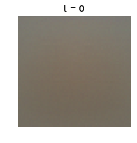


    loss = 10.806625410903775
    loss = 10.002250463888059
    loss = 9.510325062514578
    loss = 8.921332319014827
    loss = 8.2988491261915
    loss = 8.022115313445532
    loss = 7.610135777151274
    loss = 6.227347927257667
    loss = 5.243621471497862
    loss = 4.675097215851012


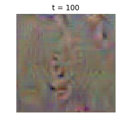


    loss = 3.9130661034711185
    loss = 3.5643782969989166
    loss = 3.1417748227389266
    loss = 2.9260832962299204
    loss = 2.4960566651221447
    loss = 2.3233351198639407
    loss = 2.1824957805685763
    loss = 1.8867916252601213
    loss = 1.7726644571825199
    loss = 1.6619070274562482


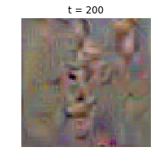


    loss = 1.5858589692092093
    loss = 1.4955736281950218
    loss = 1.4669295244257663
    loss = 1.4229350615079486
    loss = 1.4114610579629454
    loss = 1.2897516541414615
    loss = 1.2798340656469815
    loss = 1.2369360758292667
    loss = 1.186480022772339
    loss = 1.1823549665514215


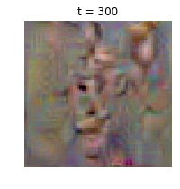


    loss = 1.0964823265437977
    loss = 1.0699120901591583
    loss = 1.0328511644080736
    loss = 0.9961980171984077
    loss = 0.996037239242378
    loss = 0.9826869989830055
    loss = 0.9306754079195176
    loss = 0.9075022133663371
    loss = 0.8754671055717381
    loss = 0.8933371699623271


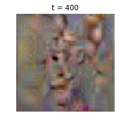


    loss = 0.8208394053527588
    loss = 0.8111159600393697
    loss = 0.8220192699882722
    loss = 0.7994669287851188
    loss = 0.7988490402626685
    loss = 0.7661375032368068
    loss = 0.76885519943429
    loss = 0.7381464936849818
    loss = 0.7360177519972079
    loss = 0.7310182657921985


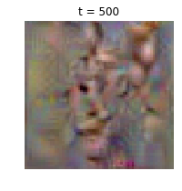


    loss = 0.7311596454107803
    loss = 0.6968031545680989
    loss = 0.6919806593899783
    loss = 0.7131827797383914
    loss = 0.7127671816934543
    loss = 0.6934041235677606
    loss = 0.6670050230236583
    loss = 0.6710390292061164
    loss = 0.6438471147712621
    loss = 0.635136693425239


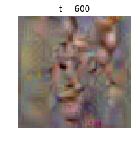


    loss = 0.665405324973627
    loss = 0.6427346006954487
    loss = 0.6235449797895805
    loss = 0.631263798291424
    loss = 0.6140507135947301
    loss = 0.6098229278446141
    loss = 0.6320532511782618
    loss = 0.6071725089537054
    loss = 0.5914616008472188
    loss = 0.6474857188814642


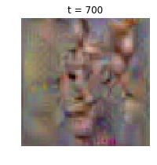


    loss = 0.5850234165770092
    loss = 0.5800489639328331
    loss = 0.5910713915211495
    loss = 0.5660602445122318
    loss = 0.618855732222664
    loss = 0.5613294360664982
    loss = 0.5638984758353927
    loss = 0.6040797355417066
    loss = 0.6085382681243313
    loss = 0.5460842685084765


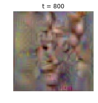


    loss = 0.5458069446315398
    loss = 0.5788371756456694
    loss = 0.5371877772891176
    loss = 0.5538814677949958
    loss = 0.6014089252493834
    loss = 0.5323743297926418
    loss = 0.5438216091886101
    loss = 0.5390519998666097
    loss = 0.5807238921766702
    loss = 0.5340857101405454


    loss = 0.5727885912861962
    loss = 0.5156759953104866
    loss = 0.5648194269129734
    loss = 0.5470343535322124
    loss = 0.5233782516057676
    loss = 0.5097457801333759
    loss = 0.5483966417170484
    loss = 0.5189939425089596
    loss = 0.5076997585582734


This cat is in pain, pls send help

# DeepDream
In the summer of 2015, Google released a [blog post](http://googleresearch.blogspot.com/2015/06/inceptionism-going-deeper-into-neural.html) describing a new method of generating images from neural networks, and they later [released code](https://github.com/google/deepdream) to generate these images.

The idea is very simple. We pick some layer from the network, pass the starting image through the network to extract features at the chosen layer, set the gradient at that layer equal to the activations themselves, and then backpropagate to the image. This has the effect of modifying the image to amplify the activations at the chosen layer of the network.

For DeepDream we usually extract features from one of the convolutional layers, allowing us to generate images of any resolution.

We can implement this idea using our pretrained network. The results probably won't look as good as Google's since their network is much bigger, but we should still be able to generate some interesting images.


```python
def deepdream(X, layer, model, **kwargs):
    """
    Generate a DeepDream image.
  
    Inputs:
    - X: Starting image, of shape (1, 3, H, W)
    - layer: Index of layer at which to dream
    - model: A PretrainedCNN object
  
    Keyword arguments:
    - learning_rate: How much to update the image at each iteration
    - max_jitter: Maximum number of pixels for jitter regularization
    - num_iterations: How many iterations to run for
    - show_every: How often to show the generated image
    """
  
    X = X.copy()
  
    learning_rate = kwargs.pop('learning_rate', 5.0)
    max_jitter = kwargs.pop('max_jitter', 16)
    num_iterations = kwargs.pop('num_iterations', 100)
    show_every = kwargs.pop('show_every', 25)
  
    for t in range(num_iterations):
        # As a regularizer, add random jitter to the image
        ox, oy = np.random.randint(-max_jitter, max_jitter+1, 2)
        X = np.roll(np.roll(X, ox, -1), oy, -2)

        dX = None
        ############################################################################
        # TODO: Compute the image gradient dX using the DeepDream method. You'll   #
        # need to use the forward and backward methods of the model object to      #
        # extract activations and set gradients for the chosen layer. After        #
        # computing the image gradient dX, you should use the learning rate to     #
        # update the image X.                                                      #
        ############################################################################
        features, cache = model.forward(X, end=layer)
        dX, _ = model.backward(features, cache)
        X += learning_rate*dX
        ############################################################################
        #                             END OF YOUR CODE                             #
        ############################################################################
    
        # Undo the jitter
        X = np.roll(np.roll(X, -ox, -1), -oy, -2)
    
        # As a regularizer, clip the image
        mean_pixel = data['mean_image'].mean(axis=(1, 2), keepdims=True)
        X = np.clip(X, -mean_pixel, 255.0 - mean_pixel)
    
        # Periodically show the image
        if t == 0 or (t + 1) % show_every == 0:
            img = deprocess_image_2016(X, data['mean_image'], mean='pixel')
            plt.imshow(img)
            plt.title('t = %d' % (t + 1))
            plt.gcf().set_size_inches(8, 8)
            plt.axis('off')
            plt.show()
    return X
```

# Generate some images!
Try and generate a cool-looking DeepDeam image using the pretrained network. You can try using different layers, or starting from different images. You can reduce the image size if it runs too slowly on your machine, or increase the image size if you are feeling ambitious.


```python
def read_image(filename, max_size):
    """
    Read an image from disk and resize it so its larger side is max_size
    """
    img = imread(filename)
    H, W, _ = img.shape
    if H >= W:
        img = imresize(img, (max_size, int(W * float(max_size) / H)))
    elif H < W:
        img = imresize(img, (int(H * float(max_size) / W), max_size))
    return img

filename = 'img.jpg'
max_size = 256
img = read_image(filename, max_size)
plt.imshow(img)
plt.axis('off')

# Preprocess the image by converting to float, transposing,
# and performing mean subtraction.
img_pre = preprocess_image_2016(img, data['mean_image'], mean='pixel')

out = deepdream(img_pre, 7, model, learning_rate=1000, num_iterations=200)
```

    /Users/decemberlabs/anaconda3/lib/python3.5/site-packages/ipykernel_launcher.py:5: DeprecationWarning: `imread` is deprecated!
    `imread` is deprecated in SciPy 1.0.0, and will be removed in 1.2.0.
    Use ``imageio.imread`` instead.
      """
    /Users/decemberlabs/anaconda3/lib/python3.5/site-packages/ipykernel_launcher.py:8: DeprecationWarning: `imresize` is deprecated!
    `imresize` is deprecated in SciPy 1.0.0, and will be removed in 1.2.0.
    Use ``skimage.transform.resize`` instead.
      


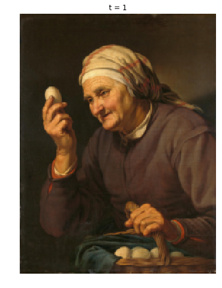


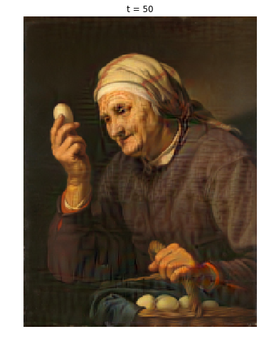


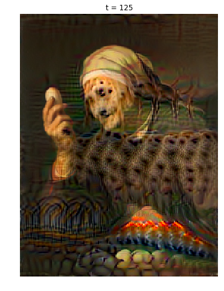


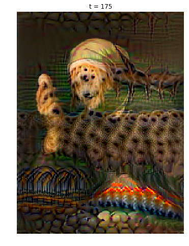


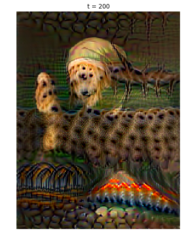

