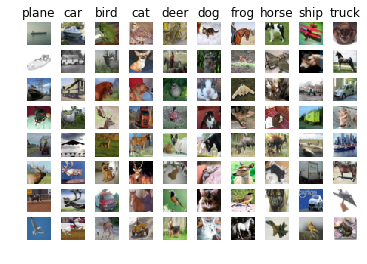
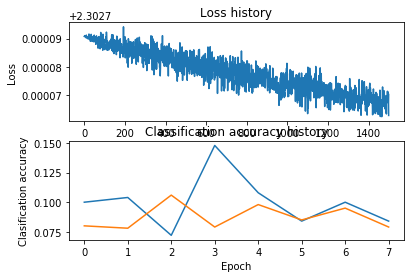
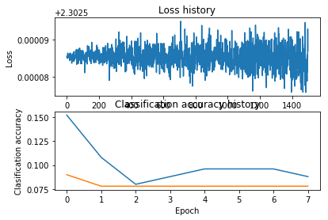
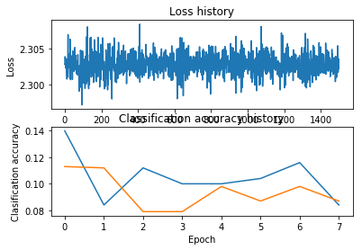
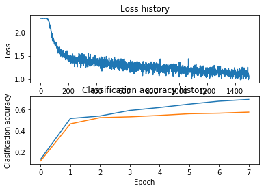

# Image features exercise
*Complete and hand in this completed worksheet (including its outputs and any supporting code outside of the worksheet) with your assignment submission. For more details see the [assignments page](https://eva.fing.edu.uy/mod/page/view.php?id=69213) on the course website.*

We have seen that we can achieve reasonable performance on an image classification task by training a linear classifier on the pixels of the input image. In this exercise we will show that we can improve our classification performance by training linear classifiers not on raw pixels but on features that are computed from the raw pixels.

All of your work for this exercise will be done in this notebook.


```python
import random
import numpy as np
from cs231n.data_utils import load_CIFAR10
import matplotlib.pyplot as plt

from __future__ import print_function

%matplotlib inline
plt.rcParams['figure.figsize'] = (10.0, 8.0) # set default size of plots
plt.rcParams['image.interpolation'] = 'nearest'
plt.rcParams['image.cmap'] = 'gray'

# for auto-reloading extenrnal modules
# see http://stackoverflow.com/questions/1907993/autoreload-of-modules-in-ipython
%load_ext autoreload
%autoreload 2
```

## Load data
Similar to previous exercises, we will load CIFAR-10 data from disk.


```python
from cs231n.features import color_histogram_hsv, hog_feature

def get_CIFAR10_data(num_training=49000, num_validation=1000, num_test=1000):
    # Load the raw CIFAR-10 data
    cifar10_dir = 'cs231n/datasets/cifar-10-batches-py'
    X_train, y_train, X_test, y_test = load_CIFAR10(cifar10_dir)
  
    # Subsample the data
    mask = list(range(num_training, num_training + num_validation))
    X_val = X_train[mask]
    y_val = y_train[mask]
    mask = list(range(num_training))
    X_train = X_train[mask]
    y_train = y_train[mask]
    mask = list(range(num_test))
    X_test = X_test[mask]
    y_test = y_test[mask]

    return X_train, y_train, X_val, y_val, X_test, y_test

X_train, y_train, X_val, y_val, X_test, y_test = get_CIFAR10_data()
```

## Extract Features
For each image we will compute a Histogram of Oriented
Gradients (HOG) as well as a color histogram using the hue channel in HSV
color space. We form our final feature vector for each image by concatenating
the HOG and color histogram feature vectors.

Roughly speaking, HOG should capture the texture of the image while ignoring
color information, and the color histogram represents the color of the input
image while ignoring texture. As a result, we expect that using both together
ought to work better than using either alone. Verifying this assumption would
be a good thing to try for the bonus section.

The `hog_feature` and `color_histogram_hsv` functions both operate on a single
image and return a feature vector for that image. The extract_features
function takes a set of images and a list of feature functions and evaluates
each feature function on each image, storing the results in a matrix where
each column is the concatenation of all feature vectors for a single image.


```python
from cs231n.features import *

num_color_bins = 10 # Number of bins in the color histogram
feature_fns = [hog_feature, lambda img: color_histogram_hsv(img, nbin=num_color_bins)]
X_train_feats = extract_features(X_train, feature_fns, verbose=True)
X_val_feats = extract_features(X_val, feature_fns)
X_test_feats = extract_features(X_test, feature_fns)

# Preprocessing: Subtract the mean feature
mean_feat = np.mean(X_train_feats, axis=0, keepdims=True)
X_train_feats -= mean_feat
X_val_feats -= mean_feat
X_test_feats -= mean_feat

# Preprocessing: Divide by standard deviation. This ensures that each feature
# has roughly the same scale.
std_feat = np.std(X_train_feats, axis=0, keepdims=True)
X_train_feats /= std_feat
X_val_feats /= std_feat
X_test_feats /= std_feat

# Preprocessing: Add a bias dimension
X_train_feats = np.hstack([X_train_feats, np.ones((X_train_feats.shape[0], 1))])
X_val_feats = np.hstack([X_val_feats, np.ones((X_val_feats.shape[0], 1))])
X_test_feats = np.hstack([X_test_feats, np.ones((X_test_feats.shape[0], 1))])
```

    Done extracting features for 1000 / 49000 images
    Done extracting features for 2000 / 49000 images
    Done extracting features for 3000 / 49000 images
    Done extracting features for 4000 / 49000 images
    Done extracting features for 5000 / 49000 images
    Done extracting features for 6000 / 49000 images
    Done extracting features for 7000 / 49000 images
    Done extracting features for 8000 / 49000 images
    Done extracting features for 9000 / 49000 images
    Done extracting features for 10000 / 49000 images
    Done extracting features for 11000 / 49000 images
    Done extracting features for 12000 / 49000 images
    Done extracting features for 13000 / 49000 images
    Done extracting features for 14000 / 49000 images
    Done extracting features for 15000 / 49000 images
    Done extracting features for 16000 / 49000 images
    Done extracting features for 17000 / 49000 images
    Done extracting features for 18000 / 49000 images
    Done extracting features for 19000 / 49000 images
    Done extracting features for 20000 / 49000 images
    Done extracting features for 21000 / 49000 images
    Done extracting features for 22000 / 49000 images
    Done extracting features for 23000 / 49000 images
    Done extracting features for 24000 / 49000 images
    Done extracting features for 25000 / 49000 images
    Done extracting features for 26000 / 49000 images
    Done extracting features for 27000 / 49000 images
    Done extracting features for 28000 / 49000 images
    Done extracting features for 29000 / 49000 images
    Done extracting features for 30000 / 49000 images
    Done extracting features for 31000 / 49000 images
    Done extracting features for 32000 / 49000 images
    Done extracting features for 33000 / 49000 images
    Done extracting features for 34000 / 49000 images
    Done extracting features for 35000 / 49000 images
    Done extracting features for 36000 / 49000 images
    Done extracting features for 37000 / 49000 images
    Done extracting features for 38000 / 49000 images
    Done extracting features for 39000 / 49000 images
    Done extracting features for 40000 / 49000 images
    Done extracting features for 41000 / 49000 images
    Done extracting features for 42000 / 49000 images
    Done extracting features for 43000 / 49000 images
    Done extracting features for 44000 / 49000 images
    Done extracting features for 45000 / 49000 images
    Done extracting features for 46000 / 49000 images
    Done extracting features for 47000 / 49000 images
    Done extracting features for 48000 / 49000 images


## Train Softmax on features
Using the multiclass Softmax code developed earlier in the assignment, train SoftMaxs on top of the features extracted above; this should achieve better results than training SoftMaxs directly on top of raw pixels.


```python
# Use the validation set to tune the learning rate and regularization strength

from cs231n.classifiers.linear_classifier import Softmax

learning_rates = [1e-9, 1e-8, 1e-7]
regularization_strengths = [1e5, 1e6, 1e7]

results = {}
best_val = -1
best_softmax = None

pass
################################################################################
# TODO:                                                                        #
# Use the validation set to set the learning rate and regularization strength. #
# This should be identical to the validation that you did for the Softmax;     #
# save the best trained classifer in best_softmax. You might also want to play #
# with different numbers of bins in the color histogram. If you are careful    #
# you should be able to get accuracy of near [0.42] on the validation set.     #
################################################################################
to_test = [(l, r) for l in learning_rates for r in regularization_strengths]

for parameters in to_test:
    print(parameters)
    learning_rate, regularization_strength = parameters
    softmax   = Softmax()
    loss_hist = softmax.train(X_train_feats, y_train, learning_rate=learning_rate,
                              reg=regularization_strength, num_iters=1500, verbose=True)

    y_train_pred = softmax.predict(X_train_feats)
    train_accuracy = np.mean(y_train == y_train_pred)
    
    y_val_pred = softmax.predict(X_val_feats)
    validation_accuracy = np.mean(y_val == y_val_pred)
                             
    if validation_accuracy > best_val:
        best_val = validation_accuracy
        best_softmax = softmax
    results[parameters] = (train_accuracy, validation_accuracy)
    print(results)
################################################################################
#                              END OF YOUR CODE                                #
################################################################################

# Print out results.
for lr, reg in sorted(results):
    train_accuracy, val_accuracy = results[(lr, reg)]
    print('lr %e reg %e train accuracy: %f val accuracy: %f' % (
                lr, reg, train_accuracy, val_accuracy))
    
print('best validation accuracy achieved during cross-validation: %f' % best_val)
```

    (1e-09, 100000.0)
    iteration 0 / 1500: loss 80.133765
    iteration 100 / 1500: loss 78.589612
    iteration 200 / 1500: loss 77.079523
    iteration 300 / 1500: loss 75.598719
    iteration 400 / 1500: loss 74.148031
    iteration 500 / 1500: loss 72.724607
    iteration 600 / 1500: loss 71.329986
    iteration 700 / 1500: loss 69.963473
    iteration 800 / 1500: loss 68.623307
    iteration 900 / 1500: loss 67.310042
    iteration 1000 / 1500: loss 66.022472
    iteration 1100 / 1500: loss 64.760353
    iteration 1200 / 1500: loss 63.524507
    iteration 1300 / 1500: loss 62.311895
    iteration 1400 / 1500: loss 61.123967
    {(1e-09, 100000.0): (0.10744897959183673, 0.098)}
    (1e-09, 1000000.0)
    iteration 0 / 1500: loss 824.285330
    iteration 100 / 1500: loss 675.217949
    iteration 200 / 1500: loss 553.185239
    iteration 300 / 1500: loss 453.281818
    iteration 400 / 1500: loss 371.496408
    iteration 500 / 1500: loss 304.542711
    iteration 600 / 1500: loss 249.730784
    iteration 700 / 1500: loss 204.858757
    iteration 800 / 1500: loss 168.125580
    iteration 900 / 1500: loss 138.053223
    iteration 1000 / 1500: loss 113.434637
    iteration 1100 / 1500: loss 93.280742
    iteration 1200 / 1500: loss 76.781814
    iteration 1300 / 1500: loss 63.274502
    iteration 1400 / 1500: loss 52.217648
    {(1e-09, 100000.0): (0.10744897959183673, 0.098), (1e-09, 1000000.0): (0.08430612244897959, 0.099)}
    (1e-09, 10000000.0)
    iteration 0 / 1500: loss 7191.427616
    iteration 100 / 1500: loss 965.498961
    iteration 200 / 1500: loss 131.351398
    iteration 300 / 1500: loss 19.592465
    iteration 400 / 1500: loss 4.619082
    iteration 500 / 1500: loss 2.612951
    iteration 600 / 1500: loss 2.344167
    iteration 700 / 1500: loss 2.308156
    iteration 800 / 1500: loss 2.303331
    iteration 900 / 1500: loss 2.302685
    iteration 1000 / 1500: loss 2.302598
    iteration 1100 / 1500: loss 2.302587
    iteration 1200 / 1500: loss 2.302585
    iteration 1300 / 1500: loss 2.302585
    iteration 1400 / 1500: loss 2.302585
    {(1e-09, 100000.0): (0.10744897959183673, 0.098), (1e-09, 1000000.0): (0.08430612244897959, 0.099), (1e-09, 10000000.0): (0.41661224489795917, 0.429)}
    (1e-08, 100000.0)
    iteration 0 / 1500: loss 76.471292
    iteration 100 / 1500: loss 63.021679
    iteration 200 / 1500: loss 52.010511
    iteration 300 / 1500: loss 42.995050
    iteration 400 / 1500: loss 35.615440
    iteration 500 / 1500: loss 29.574753
    iteration 600 / 1500: loss 24.629130
    iteration 700 / 1500: loss 20.579653
    iteration 800 / 1500: loss 17.265793
    iteration 900 / 1500: loss 14.552239
    iteration 1000 / 1500: loss 12.330438
    iteration 1100 / 1500: loss 10.511388
    iteration 1200 / 1500: loss 9.022957
    iteration 1300 / 1500: loss 7.804192
    iteration 1400 / 1500: loss 6.806410
    {(1e-09, 100000.0): (0.10744897959183673, 0.098), (1e-09, 1000000.0): (0.08430612244897959, 0.099), (1e-09, 10000000.0): (0.41661224489795917, 0.429), (1e-08, 100000.0): (0.079, 0.089)}
    (1e-08, 1000000.0)
    iteration 0 / 1500: loss 749.521366
    iteration 100 / 1500: loss 102.414710
    iteration 200 / 1500: loss 15.715638
    iteration 300 / 1500: loss 4.099709
    iteration 400 / 1500: loss 2.543352
    iteration 500 / 1500: loss 2.334841
    iteration 600 / 1500: loss 2.306906
    iteration 700 / 1500: loss 2.303164
    iteration 800 / 1500: loss 2.302663
    iteration 900 / 1500: loss 2.302595
    iteration 1000 / 1500: loss 2.302586
    iteration 1100 / 1500: loss 2.302585
    iteration 1200 / 1500: loss 2.302585
    iteration 1300 / 1500: loss 2.302585
    iteration 1400 / 1500: loss 2.302585
    {(1e-09, 100000.0): (0.10744897959183673, 0.098), (1e-08, 1000000.0): (0.41812244897959183, 0.422), (1e-09, 1000000.0): (0.08430612244897959, 0.099), (1e-09, 10000000.0): (0.41661224489795917, 0.429), (1e-08, 100000.0): (0.079, 0.089)}
    (1e-08, 10000000.0)
    iteration 0 / 1500: loss 7665.662019
    iteration 100 / 1500: loss 2.302590
    iteration 200 / 1500: loss 2.302585
    iteration 300 / 1500: loss 2.302585
    iteration 400 / 1500: loss 2.302585
    iteration 500 / 1500: loss 2.302585
    iteration 600 / 1500: loss 2.302585
    iteration 700 / 1500: loss 2.302585
    iteration 800 / 1500: loss 2.302585
    iteration 900 / 1500: loss 2.302585
    iteration 1000 / 1500: loss 2.302585
    iteration 1100 / 1500: loss 2.302585
    iteration 1200 / 1500: loss 2.302585
    iteration 1300 / 1500: loss 2.302585
    iteration 1400 / 1500: loss 2.302585
    {(1e-08, 1000000.0): (0.41812244897959183, 0.422), (1e-09, 100000.0): (0.10744897959183673, 0.098), (1e-08, 100000.0): (0.079, 0.089), (1e-08, 10000000.0): (0.40685714285714286, 0.381), (1e-09, 1000000.0): (0.08430612244897959, 0.099), (1e-09, 10000000.0): (0.41661224489795917, 0.429)}
    (1e-07, 100000.0)
    iteration 0 / 1500: loss 79.291315
    iteration 100 / 1500: loss 12.618179
    iteration 200 / 1500: loss 3.684704
    iteration 300 / 1500: loss 2.487750
    iteration 400 / 1500: loss 2.327369
    iteration 500 / 1500: loss 2.305904
    iteration 600 / 1500: loss 2.303030
    iteration 700 / 1500: loss 2.302640
    iteration 800 / 1500: loss 2.302590
    iteration 900 / 1500: loss 2.302582
    iteration 1000 / 1500: loss 2.302581
    iteration 1100 / 1500: loss 2.302582
    iteration 1200 / 1500: loss 2.302582
    iteration 1300 / 1500: loss 2.302582
    iteration 1400 / 1500: loss 2.302582
    {(1e-07, 100000.0): (0.41714285714285715, 0.414), (1e-08, 1000000.0): (0.41812244897959183, 0.422), (1e-09, 100000.0): (0.10744897959183673, 0.098), (1e-08, 100000.0): (0.079, 0.089), (1e-08, 10000000.0): (0.40685714285714286, 0.381), (1e-09, 1000000.0): (0.08430612244897959, 0.099), (1e-09, 10000000.0): (0.41661224489795917, 0.429)}
    (1e-07, 1000000.0)
    iteration 0 / 1500: loss 780.304678
    iteration 100 / 1500: loss 2.302585
    iteration 200 / 1500: loss 2.302585
    iteration 300 / 1500: loss 2.302585
    iteration 400 / 1500: loss 2.302585
    iteration 500 / 1500: loss 2.302585
    iteration 600 / 1500: loss 2.302585
    iteration 700 / 1500: loss 2.302585
    iteration 800 / 1500: loss 2.302585
    iteration 900 / 1500: loss 2.302585
    iteration 1000 / 1500: loss 2.302585
    iteration 1100 / 1500: loss 2.302585
    iteration 1200 / 1500: loss 2.302585
    iteration 1300 / 1500: loss 2.302585
    iteration 1400 / 1500: loss 2.302585
    {(1e-07, 1000000.0): (0.4100204081632653, 0.397), (1e-07, 100000.0): (0.41714285714285715, 0.414), (1e-08, 1000000.0): (0.41812244897959183, 0.422), (1e-09, 100000.0): (0.10744897959183673, 0.098), (1e-08, 100000.0): (0.079, 0.089), (1e-08, 10000000.0): (0.40685714285714286, 0.381), (1e-09, 1000000.0): (0.08430612244897959, 0.099), (1e-09, 10000000.0): (0.41661224489795917, 0.429)}
    (1e-07, 10000000.0)
    iteration 0 / 1500: loss 7572.485264
    iteration 100 / 1500: loss 2.302585
    iteration 200 / 1500: loss 2.302585
    iteration 300 / 1500: loss 2.302585
    iteration 400 / 1500: loss 2.302585
    iteration 500 / 1500: loss 2.302585
    iteration 600 / 1500: loss 2.302585
    iteration 700 / 1500: loss 2.302585
    iteration 800 / 1500: loss 2.302585
    iteration 900 / 1500: loss 2.302585
    iteration 1000 / 1500: loss 2.302585
    iteration 1100 / 1500: loss 2.302585
    iteration 1200 / 1500: loss 2.302585
    iteration 1300 / 1500: loss 2.302585
    iteration 1400 / 1500: loss 2.302585
    {(1e-07, 1000000.0): (0.4100204081632653, 0.397), (1e-07, 10000000.0): (0.3325714285714286, 0.337), (1e-07, 100000.0): (0.41714285714285715, 0.414), (1e-08, 1000000.0): (0.41812244897959183, 0.422), (1e-09, 100000.0): (0.10744897959183673, 0.098), (1e-08, 100000.0): (0.079, 0.089), (1e-08, 10000000.0): (0.40685714285714286, 0.381), (1e-09, 1000000.0): (0.08430612244897959, 0.099), (1e-09, 10000000.0): (0.41661224489795917, 0.429)}
    lr 1.000000e-09 reg 1.000000e+05 train accuracy: 0.107449 val accuracy: 0.098000
    lr 1.000000e-09 reg 1.000000e+06 train accuracy: 0.084306 val accuracy: 0.099000
    lr 1.000000e-09 reg 1.000000e+07 train accuracy: 0.416612 val accuracy: 0.429000
    lr 1.000000e-08 reg 1.000000e+05 train accuracy: 0.079000 val accuracy: 0.089000
    lr 1.000000e-08 reg 1.000000e+06 train accuracy: 0.418122 val accuracy: 0.422000
    lr 1.000000e-08 reg 1.000000e+07 train accuracy: 0.406857 val accuracy: 0.381000
    lr 1.000000e-07 reg 1.000000e+05 train accuracy: 0.417143 val accuracy: 0.414000
    lr 1.000000e-07 reg 1.000000e+06 train accuracy: 0.410020 val accuracy: 0.397000
    lr 1.000000e-07 reg 1.000000e+07 train accuracy: 0.332571 val accuracy: 0.337000
    best validation accuracy achieved during cross-validation: 0.429000


```python
# Evaluate your trained Softmax on the test set
y_test_pred = best_softmax.predict(X_test_feats)
test_accuracy = np.mean(y_test == y_test_pred)
print(test_accuracy)
```

    0.418


```python
# An important way to gain intuition about how an algorithm works is to
# visualize the mistakes that it makes. In this visualization, we show examples
# of images that are misclassified by our current system. The first column
# shows images that our system labeled as "plane" but whose true label is
# something other than "plane".

examples_per_class = 8
classes = ['plane', 'car', 'bird', 'cat', 'deer', 'dog', 'frog', 'horse', 'ship', 'truck']
for cls, cls_name in enumerate(classes):
    idxs = np.where((y_test != cls) & (y_test_pred == cls))[0]
    idxs = np.random.choice(idxs, examples_per_class, replace=False)
    for i, idx in enumerate(idxs):
        plt.subplot(examples_per_class, len(classes), i * len(classes) + cls + 1)
        plt.imshow(X_test[idx].astype('uint8'))
        plt.axis('off')
        if i == 0:
            plt.title(cls_name)
plt.show()
```





### Inline question 1:
Describe the misclassification results that you see. Do they make sense?

**Answer:** 
*Podemos ver que el fondo juega un rol importante al momento de clasificar por lo menos con "plane" y "ship", clases  que fueron confundidas. Las "truck" y "car" tambien fueron confundida ya que comparten caracteristicas (features) similares. Para las otras clases tambien podemos ver que los elementos mal clasificados comparten caracteristicas (features) con la clase asignada*

## Neural Network on image features
Earlier in this assigment we saw that training a two-layer neural network on raw pixels achieved better classification performance than linear classifiers on raw pixels. In this notebook we have seen that linear classifiers on image features outperform linear classifiers on raw pixels. 

For completeness, we should also try training a neural network on image features. This approach should outperform all previous approaches: you should easily be able to achieve over 55% classification accuracy on the test set; our best model achieves about 60% classification accuracy.


```python
print(X_train_feats.shape)
```

    (49000, 155)


```python
from cs231n.classifiers.neural_net import TwoLayerNet

input_dim    = X_train_feats.shape[1]
hidden_dim   = 500
num_classes  = 10
best_net_acc = -1
best_net = None

################################################################################
# TODO: Train a two-layer neural network on image features. You may want to    #
# cross-validate various parameters as in previous sections. Store your best   #
# model in the best_net variable.                                              #
################################################################################
import itertools as it

parameters = {'batch_size':[250, 500],
              'hidden_size':[500],
              'num_iters':[1000, 1500],
              'learning_rate':[1e-4, 0.3],
              'learning_rate_decay':[0.95],
              'reg':[0.5, 0.001]}

allNames = sorted(parameters)
to_train = list(it.product(*(parameters[Name] for Name in allNames)))

for parameters in to_train:
    bs, hs, lr, lrd, n_it, reg = parameters
    net = TwoLayerNet(input_dim, hs, num_classes)
    stats = net.train(X_train_feats, y_train, X_val_feats, y_val,
                num_iters= n_it, batch_size=bs,
                learning_rate=lr, learning_rate_decay=lrd,
                reg=reg, verbose=False)

    val_acc = (net.predict(X_val_feats) == y_val).mean()
    print('Validation accuracy: ', val_acc)
    
    if val_acc > best_net_acc:
        best_net = net
        best_params = parameters
        
    plt.subplot(211)
    plt.plot(stats['loss_history'])
    plt.title('Loss history')
    plt.xlabel('Iteration')
    plt.ylabel('Loss')

    plt.subplot(212)
    plt.plot(stats['train_acc_history'], label='train')
    plt.plot(stats['val_acc_history'], label='val')
    plt.title('Classification accuracy history')
    plt.xlabel('Epoch')
    plt.ylabel('Clasification accuracy')
    plt.show()
################################################################################
#                              END OF YOUR CODE                                #
################################################################################
```

    [(250, 500, 0.0001, 0.95, 1500, 0.5), (250, 500, 0.0001, 0.95, 1500, 0.001), (250, 500, 0.3, 0.95, 1500, 0.5), (250, 500, 0.3, 0.95, 1500, 0.001)]
    Validation accuracy:  0.079





    Validation accuracy:  0.078





    Validation accuracy:  0.078





    Validation accuracy:  0.572





Intente con muchos, parametros, deje solo algunos


```python
# Run your neural net classifier on the test set. You should be able to
# get more than 55% accuracy.

test_acc = (net.predict(X_test_feats) == y_test).mean()
print(test_acc)
```

    0.566

