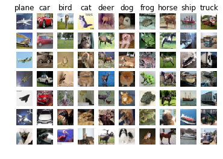
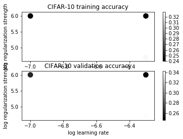
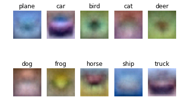

# Softmax

## Softmax implementation

```python
import numpy as np
from random import shuffle
from past.builtins import xrange

def softmax_loss_naive(W, X, y, reg):
  """
  Softmax loss function, naive implementation (with loops)

  Inputs have dimension D, there are C classes, and we operate on minibatches
  of N examples.

  Inputs:
  - W: A numpy array of shape (D, C) containing weights.
  - X: A numpy array of shape (N, D) containing a minibatch of data.
  - y: A numpy array of shape (N,) containing training labels; y[i] = c means
    that X[i] has label c, where 0 <= c < C.
  - reg: (float) regularization strength

  Returns a tuple of:
  - loss as single float
  - gradient with respect to weights W; an array of same shape as W
  """

  #############################################################################
  # TODO:                                                                     #
  # Compute the gradient of the loss function and store it dW.                #
  # Rather that first computing the loss and then computing the derivative,   #
  # it may be simpler to compute the derivative at the same time that the     #
  # loss is being computed. You may need to modify some of the                #
  # code above to compute the gradient.                                       #
  #############################################################################

  # Initialize the loss and gradient to zero.
  loss = 0.0
  dW = np.zeros_like(W)
  num_train = X.shape[0]
  num_classes = W.shape[1]

  for i in xrange(num_train):
    scores = X[i].dot(W)
    scores -=  np.max(scores) #To avoid numerical issues
    p = np.exp(scores) / np.sum(np.exp(scores))
    loss += -np.log(p[y[i]])
    p[y[i]] -= 1
    
    for j in range(num_classes):
        dW[:,j] += X[i,:]*p[j]
    
  loss /= num_train
  dW   /= num_train
 
  # Add regularization to the loss.
  loss += 0.5 * reg * np.sum(W * W)
  dW += reg * W
  #############################################################################
  #                          END OF YOUR CODE                                 #
  #############################################################################

  return loss, dW


def softmax_loss_vectorized(W, X, y, reg):
  """
  Softmax loss function, vectorized version.

  Inputs and outputs are the same as softmax_loss_naive.
  """
  # Initialize the loss and gradient to zero.
  loss = 0.0
  dW = np.zeros_like(W)

  #############################################################################
  # TODO: Compute the softmax loss and its gradient using no explicit loops.  #
  # Store the loss in loss and the gradient in dW. If you are not careful     #
  # here, it is easy to run into numeric instability. Don't forget the        #
  # regularization!                                                           #
  #############################################################################
  num_train = X.shape[0]
  scores = X.dot(W)
  scores -=  np.max(scores) #To avoid numerical issues
  scores_exp = np.exp(scores)
  prob = scores_exp / np.sum(scores_exp, axis=1, keepdims=True)
  loss = (-np.log(prob[range(num_train),y]).sum() / num_train) + 0.5 * reg * (W*W).sum()
  prob[range(num_train),y] -= 1
  dW = np.dot(X.T, prob)
  dW /= num_train
  dW += reg * W
  #############################################################################
  #                          END OF YOUR CODE                                 #
  #############################################################################

  return loss, dW
```


# Softmax exercise

*Complete and hand in this completed worksheet (including its outputs and any supporting code outside of the worksheet) with your assignment submission. For more details see the [assignments page](https://eva.fing.edu.uy/mod/page/view.php?id=69213) on the course website.*

In this exercise you will:
    
- implement a fully-vectorized **loss function** for the Softmax classifier
- implement the fully-vectorized expression for its **analytic gradient**
- **check your implementation** with numerical gradient
- use a validation set to **tune the learning rate and regularization** strength
- **optimize** the loss function with **SGD**
- **visualize** the final learned weights


```python
# Run some setup code for this notebook.

import random
import numpy as np
from cs231n.data_utils import load_CIFAR10
import matplotlib.pyplot as plt

from __future__ import print_function

# This is a bit of magic to make matplotlib figures appear inline in the
# notebook rather than in a new window.
%matplotlib inline
plt.rcParams['figure.figsize'] = (10.0, 8.0) # set default size of plots
plt.rcParams['image.interpolation'] = 'nearest'
plt.rcParams['image.cmap'] = 'gray'

# Some more magic so that the notebook will reload external python modules;
# see http://stackoverflow.com/questions/1907993/autoreload-of-modules-in-ipython
%load_ext autoreload
%autoreload 2
```

## CIFAR-10 Data Loading and Preprocessing


```python
# Load the raw CIFAR-10 data.
cifar10_dir = 'cs231n/datasets/cifar-10-batches-py'
X_train, y_train, X_test, y_test = load_CIFAR10(cifar10_dir)

# As a sanity check, we print out the size of the training and test data.
print('Training data shape: ', X_train.shape)
print('Training labels shape: ', y_train.shape)
print('Test data shape: ', X_test.shape)
print('Test labels shape: ', y_test.shape)
```

    Training data shape:  (50000, 32, 32, 3)
    Training labels shape:  (50000,)
    Test data shape:  (10000, 32, 32, 3)
    Test labels shape:  (10000,)


```python
# Visualize some examples from the dataset.
# We show a few examples of training images from each class.
classes = ['plane', 'car', 'bird', 'cat', 'deer', 'dog', 'frog', 'horse', 'ship', 'truck']
num_classes = len(classes)
samples_per_class = 7
for y, cls in enumerate(classes):
    idxs = np.flatnonzero(y_train == y)
    idxs = np.random.choice(idxs, samples_per_class, replace=False)
    for i, idx in enumerate(idxs):
        plt_idx = i * num_classes + y + 1
        plt.subplot(samples_per_class, num_classes, plt_idx)
        plt.imshow(X_train[idx].astype('uint8'))
        plt.axis('off')
        if i == 0:
            plt.title(cls)
plt.show()
```





```python
# Split the data into train, val, and test sets. In addition we will
# create a small development set as a subset of the training data;
# we can use this for development so our code runs faster.
num_training = 49000
num_validation = 1000
num_test = 1000
num_dev = 500

# Our validation set will be num_validation points from the original
# training set.
mask = range(num_training, num_training + num_validation)
X_val = X_train[mask]
y_val = y_train[mask]

# Our training set will be the first num_train points from the original
# training set.
mask = range(num_training)
X_train = X_train[mask]
y_train = y_train[mask]

# We will also make a development set, which is a small subset of
# the training set.
mask = np.random.choice(num_training, num_dev, replace=False)
X_dev = X_train[mask]
y_dev = y_train[mask]

# We use the first num_test points of the original test set as our
# test set.
mask = range(num_test)
X_test = X_test[mask]
y_test = y_test[mask]

print( 'Train data shape: ', X_train.shape )
print( 'Train labels shape: ', y_train.shape )
print( 'Validation data shape: ', X_val.shape )
print( 'Validation labels shape: ', y_val.shape )
print( 'Test data shape: ', X_test.shape )
print( 'Test labels shape: ', y_test.shape )
```

    Train data shape:  (49000, 32, 32, 3)
    Train labels shape:  (49000,)
    Validation data shape:  (1000, 32, 32, 3)
    Validation labels shape:  (1000,)
    Test data shape:  (1000, 32, 32, 3)
    Test labels shape:  (1000,)


```python
# Preprocessing: reshape the image data into rows
X_train = np.reshape(X_train, (X_train.shape[0], -1))
X_val = np.reshape(X_val, (X_val.shape[0], -1))
X_test = np.reshape(X_test, (X_test.shape[0], -1))
X_dev = np.reshape(X_dev, (X_dev.shape[0], -1))

# As a sanity check, print out the shapes of the data
print('Training data shape: ', X_train.shape )
print( 'Validation data shape: ', X_val.shape )
print( 'Test data shape: ', X_test.shape )
print( 'dev data shape: ', X_dev.shape )
```

    Training data shape:  (49000, 3072)
    Validation data shape:  (1000, 3072)
    Test data shape:  (1000, 3072)
    dev data shape:  (500, 3072)


```python
# Preprocessing: subtract the mean image
# first: compute the image mean based on the training data
mean_image = np.mean(X_train, axis=0)
print(mean_image[:10]) # print a few of the elements
plt.figure(figsize=(4,4))
plt.imshow(mean_image.reshape((32,32,3)).astype('uint8')) # visualize the mean image
plt.show()
```

    [130.64189796 135.98173469 132.47391837 130.05569388 135.34804082
     131.75402041 130.96055102 136.14328571 132.47636735 131.48467347]


```python
# second: subtract the mean image from train and test data
X_train -= mean_image
X_val -= mean_image
X_test -= mean_image
X_dev -= mean_image
```


```python
# third: append the bias dimension of ones (i.e. bias trick) so that our SoftMax
# only has to worry about optimizing a single weight matrix W.
X_train = np.hstack([X_train, np.ones((X_train.shape[0], 1))])
X_val = np.hstack([X_val, np.ones((X_val.shape[0], 1))])
X_test = np.hstack([X_test, np.ones((X_test.shape[0], 1))])
X_dev = np.hstack([X_dev, np.ones((X_dev.shape[0], 1))])

print(X_train.shape, X_val.shape, X_test.shape, X_dev.shape)
```

    (49000, 3073) (1000, 3073) (1000, 3073) (500, 3073)


## Softmax Classifier

Your code for this section will all be written inside **cs231n/classifiers/softmax.py**. 

*TODO_OURS* As you can see, we have prefilled the function `compute_loss_naive` which uses for loops to evaluate the multiclass SoftMax loss function. 


```python
# Evaluate the naive implementation of the loss we provided for you:
from cs231n.classifiers.softmax import softmax_loss_naive
import time

# generate a random SoftMax weight matrix of small numbers
W = np.random.randn(3073, 10) * 0.0001 

loss, grad = softmax_loss_naive(W, X_dev, y_dev, 0.00001)
print( 'loss: %f' % (loss, ) )
```

    loss: 2.367627


### Inline Question 1:
Why do we expect our loss to be close to -log(0.1)? Explain briefly.

**Your answer:** *Por la cross entropy loss*
\begin{equation*}
-\sum_{k} {y_{k}} . log(S({l_{k}})) = - log(S(l))
\end{equation*}
*Como utilizamos esta formula en la que S es la funcion softmax y l es la layer, como tenemos 10 layers toma un valor de 0.1*

The `grad` returned from the function above is right now all zero. Derive and implement the gradient for the Softmax cost function and implement it inline inside the function `softmax_loss_naive`. You will find it helpful to interleave your new code inside the existing function.

To check that you have correctly implemented the gradient correctly, you can numerically estimate the gradient of the loss function and compare the numeric estimate to the gradient that you computed. We have provided code that does this for you:


```python
# Once you've implemented the gradient, recompute it with the code below
# and gradient check it with the function we provided for you

# Compute the loss and its gradient at W.
loss, grad = softmax_loss_naive(W, X_dev, y_dev, 0.0)

# Numerically compute the gradient along several randomly chosen dimensions, and
# compare them with your analytically computed gradient. The numbers should match
# almost exactly along all dimensions.
from cs231n.gradient_check import grad_check_sparse
f = lambda w: softmax_loss_naive(w, X_dev, y_dev, 0.0)[0]
grad_numerical = grad_check_sparse(f, W, grad, 10)

# do the gradient check once again with regularization turned on
# you didn't forget the regularization gradient did you?
loss, grad = softmax_loss_naive(W, X_dev, y_dev, 1e2)
f = lambda w: softmax_loss_naive(w, X_dev, y_dev, 1e2)[0]
grad_numerical = grad_check_sparse(f, W, grad, 10)
```

    numerical: 0.659258 analytic: 0.659258, relative error: 3.302788e-08
    numerical: -5.753989 analytic: -5.753989, relative error: 8.412036e-09
    numerical: -0.659837 analytic: -0.659837, relative error: 2.304372e-08
    numerical: 1.003242 analytic: 1.003242, relative error: 8.729233e-08
    numerical: 2.527484 analytic: 2.527484, relative error: 1.856494e-08
    numerical: -5.637889 analytic: -5.637889, relative error: 9.259649e-09
    numerical: 3.138334 analytic: 3.138334, relative error: 6.136189e-09
    numerical: -1.557443 analytic: -1.557443, relative error: 4.195874e-08
    numerical: 0.962881 analytic: 0.962881, relative error: 1.917070e-08
    numerical: 0.427315 analytic: 0.427315, relative error: 3.062701e-08
    numerical: 3.359094 analytic: 3.359094, relative error: 4.963804e-09
    numerical: 3.004712 analytic: 3.004712, relative error: 1.931655e-08
    numerical: -0.145862 analytic: -0.145862, relative error: 1.952585e-08
    numerical: -0.481057 analytic: -0.481057, relative error: 2.272618e-08
    numerical: 2.284643 analytic: 2.284643, relative error: 2.030200e-08
    numerical: 1.744845 analytic: 1.744845, relative error: 3.767583e-08
    numerical: -1.315208 analytic: -1.315207, relative error: 1.485077e-08
    numerical: 0.250382 analytic: 0.250382, relative error: 6.388851e-08
    numerical: 1.242694 analytic: 1.242694, relative error: 3.936940e-08
    numerical: 1.245225 analytic: 1.245225, relative error: 1.002633e-08


```python
# Next implement the function softmax_loss_vectorized; for now only compute the loss;
# we will implement the gradient in a moment.

tic = time.time()
loss_naive, grad_naive = softmax_loss_naive(W, X_dev, y_dev, 0.00001)
toc = time.time()
print('naive loss: %e computed in %fs' % (loss_naive, toc - tic))

from cs231n.classifiers.softmax import softmax_loss_vectorized
tic = time.time()
loss_vectorized, _ = softmax_loss_vectorized(W, X_dev, y_dev, 0.00001)
toc = time.time()
print('vectorized loss: %e computed in %fs' % (loss_vectorized, toc - tic))

# The losses should match but your vectorized implementation should be much faster.
print('difference: %f' % (loss_naive - loss_vectorized))
```

    naive loss: 2.367627e+00 computed in 0.161148s
    vectorized loss: 2.367627e+00 computed in 0.007398s
    difference: 0.000000


```python
# Complete the implementation of softmax_loss_vectorized, and compute the gradient
# of the loss function in a vectorized way.

# The naive implementation and the vectorized implementation should match, but
# the vectorized version should still be much faster.
tic = time.time()
_, grad_naive = softmax_loss_naive(W, X_dev, y_dev, 0.00001)
toc = time.time()
print('Naive loss and gradient: computed in %fs' % (toc - tic))

tic = time.time()
_, grad_vectorized = softmax_loss_vectorized(W, X_dev, y_dev, 0.00001)
toc = time.time()
print('Vectorized loss and gradient: computed in %fs' % (toc - tic))

# The loss is a single number, so it is easy to compare the values computed
# by the two implementations. The gradient on the other hand is a matrix, so
# we use the Frobenius norm to compare them.
difference = np.linalg.norm(grad_naive - grad_vectorized, ord='fro')
print('difference: %f' % difference)
```

    Naive loss and gradient: computed in 0.163436s
    Vectorized loss and gradient: computed in 0.006573s
    difference: 0.000000


### Stochastic Gradient Descent

We now have vectorized and efficient expressions for the loss, the gradient and our gradient matches the numerical gradient. We are therefore ready to do SGD to minimize the loss.


```python
# In the file linear_classifier.py, implement SGD in the function
# LinearClassifier.train() and then run it with the code below.
from cs231n.classifiers import Softmax
softmax = Softmax()
tic = time.time()
loss_hist = softmax.train(X_train, y_train, learning_rate=1e-7, reg=5e4,
                      num_iters=1500, verbose=True)
toc = time.time()
print('That took %fs' % (toc - tic))
```

    iteration 0 / 1500: loss 767.683677
    iteration 100 / 1500: loss 281.524063
    iteration 200 / 1500: loss 104.461412
    iteration 300 / 1500: loss 39.446908
    iteration 400 / 1500: loss 15.774975
    iteration 500 / 1500: loss 7.064058
    iteration 600 / 1500: loss 3.953855
    iteration 700 / 1500: loss 2.749773
    iteration 800 / 1500: loss 2.315833
    iteration 900 / 1500: loss 2.200643
    iteration 1000 / 1500: loss 2.132410
    iteration 1100 / 1500: loss 2.096757
    iteration 1200 / 1500: loss 2.114680
    iteration 1300 / 1500: loss 2.090197
    iteration 1400 / 1500: loss 2.080620
    That took 11.239703s


```python
# A useful debugging strategy is to plot the loss as a function of
# iteration number:
plt.plot(loss_hist)
plt.xlabel('Iteration number')
plt.ylabel('Loss value')
plt.show()
```


```python
# Write the LinearClassifier.predict function and evaluate the performance on both the
# training and validation set
y_train_pred = softmax.predict(X_train)
print( 'training accuracy: %f' % (np.mean(y_train == y_train_pred), ))
y_val_pred = softmax.predict(X_val)
print( 'validation accuracy: %f' % (np.mean(y_val == y_val_pred), ))
```

    training accuracy: 0.333000
    validation accuracy: 0.343000


```python
# Use the validation set to tune hyperparameters (regularization strength and
# learning rate). You should experiment with different ranges for the learning
# rates and regularization strengths; if you are careful you should be able to
# get a classification accuracy of about 0.35 on the validation set.
learning_rates = [1e-7, 5e-7]
regularization_strengths = [5e4, 1e6]

# results is dictionary mapping tuples of the form
# (learning_rate, regularization_strength) to tuples of the form
# (training_accuracy, validation_accuracy). The accuracy is simply the fraction
# of data points that are correctly classified.
results = {}
best_val = -1   # The highest validation accuracy that we have seen so far.
best_softmax = None # The Softmax object that achieved the highest validation rate.

################################################################################
# TODO:                                                                        #
# Write code that chooses the best hyperparameters by tuning on the validation #
# set. For each combination of hyperparameters, train a SoftMax    on the      #
# training set, compute its accuracy on the training and validation sets, and  #
# store these numbers in the results dictionary. In addition, store the best   #
# validation accuracy in best_val and the SoftMax object that achieves this    #
# accuracy in best_softmax.                                                    #
#                                                                              #
# Hint: You should use a small value for num_iters as you develop your valid.  #
# code so that the Softmax don't take much time to train; once you are         #
# confident that your validation code works, you should rerun the validation   #
# code with a larger value for num_iters.                                      #
################################################################################
to_test = [(l, r) for l in learning_rates for r in regularization_strengths]
for parameters in to_test:
    learning_rate, regularization_strength = parameters
    softmax   = Softmax()
    loss_hist = softmax.train(X_train, y_train, learning_rate=learning_rate,
                              reg=regularization_strength, num_iters=1500, verbose=True)

    y_train_pred = softmax.predict(X_train)
    train_accuracy = np.mean(y_train == y_train_pred)
    
    y_val_pred = softmax.predict(X_val)
    validation_accuracy = np.mean(y_val == y_val_pred)
                             
    if train_accuracy > best_val:
        best_val = train_accuracy
        best_softmax = softmax
    results[parameters] = (train_accuracy, validation_accuracy)
################################################################################
#                              END OF YOUR CODE                                #
################################################################################
    
# Print out results.
for lr, reg in sorted(results):
    train_accuracy, val_accuracy = results[(lr, reg)]
    print('lr %e reg %e train accuracy: %f val accuracy: %f' % (
                lr, reg, train_accuracy, val_accuracy))
    
print('best validation accuracy achieved during cross-validation: %f' % best_val)
```

    iteration 0 / 1500: loss 779.739088
    iteration 100 / 1500: loss 286.291373
    iteration 200 / 1500: loss 106.041071
    iteration 300 / 1500: loss 40.109497
    iteration 400 / 1500: loss 15.984808
    iteration 500 / 1500: loss 7.210007
    iteration 600 / 1500: loss 3.926706
    iteration 700 / 1500: loss 2.803271
    iteration 800 / 1500: loss 2.337156
    iteration 900 / 1500: loss 2.170321
    iteration 1000 / 1500: loss 2.098909
    iteration 1100 / 1500: loss 2.077580
    iteration 1200 / 1500: loss 2.116325
    iteration 1300 / 1500: loss 2.107866
    iteration 1400 / 1500: loss 2.110996
    iteration 0 / 1500: loss 15117.868429
    iteration 100 / 1500: loss 2.272302
    iteration 200 / 1500: loss 2.269452
    iteration 300 / 1500: loss 2.271398
    iteration 400 / 1500: loss 2.273613
    iteration 500 / 1500: loss 2.270903
    iteration 600 / 1500: loss 2.256772
    iteration 700 / 1500: loss 2.268135
    iteration 800 / 1500: loss 2.263820
    iteration 900 / 1500: loss 2.268615
    iteration 1000 / 1500: loss 2.276885
    iteration 1100 / 1500: loss 2.266553
    iteration 1200 / 1500: loss 2.274314
    iteration 1300 / 1500: loss 2.263493
    iteration 1400 / 1500: loss 2.257312
    iteration 0 / 1500: loss 779.140437
    iteration 100 / 1500: loss 6.999697
    iteration 200 / 1500: loss 2.085385
    iteration 300 / 1500: loss 2.069479
    iteration 400 / 1500: loss 2.101965
    iteration 500 / 1500: loss 2.098840
    iteration 600 / 1500: loss 2.100878
    iteration 700 / 1500: loss 2.121371
    iteration 800 / 1500: loss 2.050700
    iteration 900 / 1500: loss 2.075999
    iteration 1000 / 1500: loss 2.059094
    iteration 1100 / 1500: loss 2.079575
    iteration 1200 / 1500: loss 2.121455
    iteration 1300 / 1500: loss 2.075603
    iteration 1400 / 1500: loss 2.092459
    iteration 0 / 1500: loss 15270.048798
    iteration 100 / 1500: loss 2.279796
    iteration 200 / 1500: loss 2.277429
    iteration 300 / 1500: loss 2.272868
    iteration 400 / 1500: loss 2.273379
    iteration 500 / 1500: loss 2.270032
    iteration 600 / 1500: loss 2.273252
    iteration 700 / 1500: loss 2.277442
    iteration 800 / 1500: loss 2.273688
    iteration 900 / 1500: loss 2.269601
    iteration 1000 / 1500: loss 2.273891
    iteration 1100 / 1500: loss 2.275017
    iteration 1200 / 1500: loss 2.264245
    iteration 1300 / 1500: loss 2.279934
    iteration 1400 / 1500: loss 2.270924
    lr 1.000000e-07 reg 5.000000e+04 train accuracy: 0.328204 val accuracy: 0.343000
    lr 1.000000e-07 reg 1.000000e+06 train accuracy: 0.239735 val accuracy: 0.260000
    lr 5.000000e-07 reg 5.000000e+04 train accuracy: 0.325531 val accuracy: 0.342000
    lr 5.000000e-07 reg 1.000000e+06 train accuracy: 0.240878 val accuracy: 0.246000
    best validation accuracy achieved during cross-validation: 0.328204


```python
# Visualize the cross-validation results
import math
x_scatter = [math.log10(x[0]) for x in results]
y_scatter = [math.log10(x[1]) for x in results]

# plot training accuracy
marker_size = 100
colors = [results[x][0] for x in results]
plt.subplot(2, 1, 1)
plt.scatter(x_scatter, y_scatter, marker_size, c=colors)
plt.colorbar()
plt.xlabel('log learning rate')
plt.ylabel('log regularization strength')
plt.title('CIFAR-10 training accuracy')

# plot validation accuracy
colors = [results[x][1] for x in results] # default size of markers is 20
plt.subplot(2, 1, 2)
plt.scatter(x_scatter, y_scatter, marker_size, c=colors)
plt.colorbar()
plt.xlabel('log learning rate')
plt.ylabel('log regularization strength')
plt.title('CIFAR-10 validation accuracy')
plt.show()
```





```python
# Evaluate the best softmax on test set
y_test_pred = best_softmax.predict(X_test)
test_accuracy = np.mean(y_test == y_test_pred)
print('SoftMax on raw pixels final test set accuracy: %f' % test_accuracy)
```

    SoftMax on raw pixels final test set accuracy: 0.339000


```python
# Visualize the learned weights for each class.
# Depending on your choice of learning rate and regularization strength, these may
# or may not be nice to look at.
w = best_softmax.W[:-1,:] # strip out the bias
w = w.reshape(32, 32, 3, 10)
w_min, w_max = np.min(w), np.max(w)
classes = ['plane', 'car', 'bird', 'cat', 'deer', 'dog', 'frog', 'horse', 'ship', 'truck']
for i in range(10):
  plt.subplot(2, 5, i + 1)
    
  # Rescale the weights to be between 0 and 255
  wimg = 255.0 * (w[:, :, :, i].squeeze() - w_min) / (w_max - w_min)
  plt.imshow(wimg.astype('uint8'))
  plt.axis('off')
  plt.title(classes[i])
```





### Inline question 2:
Describe what your visualized Softmax weights look like, and offer a brief explanation for why they look the way that they do.

**Your answer:** *Los diferentes weights comforman imagenes similares a lo que clasifican ya que al actualizarse los weights en entrenamiento se los intenta aproximar a la imagen de la categoria correspondiente. Por esto son similares a una "imagen promedio" de la categoria correspondiente.*

### Inline question 3:

Comment on the influence of L2 regularization in the solution?

**Your answer:** *Con la regularizacion L2 mantenemos al modelo "simple" y evitamos el overfitting para que funcione en nuevos datos (test).*
