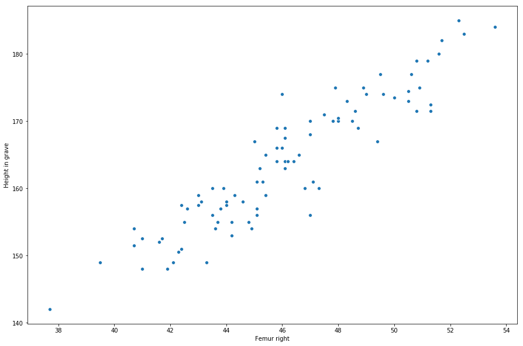

# Linear Regression

Para hacer la regresion lineal vamos a utilizar solo los tamaños de femurs.


```python
femur_height_data = data.drop(['ID', 'Location', 'Site_Number', 'Age_Minumum', 'Age_Maximum', 'Sex',
       'Grave Number', 'Canine number', 'Canine largest age',
       'Canine 2nd largest age', 'Incisor number', 'Incisor largest age',
       'Incisor 2nd largest age', 'Abnormalities Vertebras', 'Abnormalities Femur', 'Notes', 'Date',
       'Signature', 'Hyperplasia', 'Teeth Scorable'],1)
```


```python
femur_height_data.head()
```


<div>
<style scoped>
    .dataframe tbody tr th:only-of-type {
        vertical-align: middle;
    }

    .dataframe tbody tr th {
        vertical-align: top;
    }

    .dataframe thead th {
        text-align: right;
    }
</style>
<table border="1" class="dataframe">
  <thead>
    <tr style="text-align: right;">
      <th></th>
      <th>Height in grave</th>
      <th>Femur left</th>
      <th>Femur right</th>
    </tr>
  </thead>
  <tbody>
    <tr>
      <th>0</th>
      <td>173.5</td>
      <td>49.6</td>
      <td>50.0</td>
    </tr>
    <tr>
      <th>1</th>
      <td>170.0</td>
      <td>48.4</td>
      <td>48.5</td>
    </tr>
    <tr>
      <th>2</th>
      <td>171.5</td>
      <td>50.8</td>
      <td>51.3</td>
    </tr>
    <tr>
      <th>3</th>
      <td>165.0</td>
      <td>45.4</td>
      <td>45.4</td>
    </tr>
    <tr>
      <th>4</th>
      <td>165.0</td>
      <td>47.5</td>
      <td>46.6</td>
    </tr>
  </tbody>
</table>
</div>


Vamos a comenzar utilizando el femur derecho.


```python
rf_data = pd.DataFrame()
rf_data['Femur right'] = femur_height_data['Femur right']
rf_data['Height in grave'] = femur_height_data['Height in grave']
```


```python
rf_data.head()
```


<div>
<style scoped>
    .dataframe tbody tr th:only-of-type {
        vertical-align: middle;
    }

    .dataframe tbody tr th {
        vertical-align: top;
    }

    .dataframe thead th {
        text-align: right;
    }
</style>
<table border="1" class="dataframe">
  <thead>
    <tr style="text-align: right;">
      <th></th>
      <th>Femur right</th>
      <th>Height in grave</th>
    </tr>
  </thead>
  <tbody>
    <tr>
      <th>0</th>
      <td>50.0</td>
      <td>173.5</td>
    </tr>
    <tr>
      <th>1</th>
      <td>48.5</td>
      <td>170.0</td>
    </tr>
    <tr>
      <th>2</th>
      <td>51.3</td>
      <td>171.5</td>
    </tr>
    <tr>
      <th>3</th>
      <td>45.4</td>
      <td>165.0</td>
    </tr>
    <tr>
      <th>4</th>
      <td>46.6</td>
      <td>165.0</td>
    </tr>
  </tbody>
</table>
</div>


```python
sns.scatterplot(x='Femur right', y='Height in grave', data=rf_data)
plt.show()
```





Podemos ver muy facilmente que esto es un problema adecuado para una regresion lineal.

Importamos las liberias para poder hacer la regresion lineal


```python
from sklearn import linear_model
from sklearn.metrics import mean_squared_error, r2_score
```

Separamos en `training` y `test` set.


```python
len(rf_data)*0.3
```


    27.3


```python
X_train = rf_data['Femur right'][23:]
X_test  = rf_data['Femur right'][:23]
y_train = rf_data['Height in grave'][23:]
y_test  = rf_data['Height in grave'][:23]
```


```python
regression = linear_model.LinearRegression()
```


```python
X_train = X_train.values.reshape(-1, 1)
y_train = y_train.values.reshape(-1, 1)
X_test  = X_test.values.reshape(-1, 1)
y_test  = y_test.values.reshape(-1, 1)
```


```python
regression.fit(X_train, y_train)
```


    LinearRegression(copy_X=True, fit_intercept=True, n_jobs=1, normalize=False)


```python
y_pred = regression.predict(X_test)
```


```python
print('Coeficiente:', regression.coef_[0][0])
print('Mean squared error: %.2f'
      % mean_squared_error(y_test, y_pred))
print('Variance score: %.2f' % r2_score(y_test, y_pred))
```

    Coeficiente: 2.649907727761467
    Mean squared error: 11.22
    Variance score: 0.86
    

Ahora mostramos graficamente nuestros resultados


```python
plt.scatter(X_test, y_test)
plt.plot(X_test, y_pred, color='red', linewidth=3)
plt.xlabel("Femur right")
plt.ylabel("Height in grave")
plt.show()
```


```python

```
