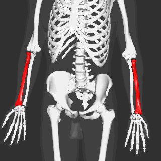

# Height Estimation from Skeletal Remains 
 
 

El objetivo de este proyecto es poder estimar la altura de un ser humano en base a los restos óseos. Para esto vamos a utilizar el dataset utilizado en un  proyecto de biomedicina en la University of Southern Denmark, titulado “[Heigh Estimation from Skeletal Remains](http://www.adbou.dk/fileadmin/adbou/projektopgaver/ADBOU_linear_regression_Mette_Wodx.pdf)” el cual contiene información de medidas de diferentes restos óseos antiguos encontrados en el pueblo Ribe de Dinamarca.

## Introducción

Utilizar restos óseos para estimar la altura de una persona es una herramienta muy util en la medicina forense y antropología biológica. Muchas veces solo unos pocos huesos se encuentran en excavaciones arqueológicas. Pero con unos pocos huesos podemos estimar la altura de una persona, esto es posible por la relación de tamaño entre los huesos.

## Problema

 Se ha determinado que existe una relación entre el fémur, tibia, humero y el radio con la altura de una persona. A continuación se muestran las imágenes de los huesos mencionados para una referencia visual.

| Fémur | Tibia |
| :---: | :---: |
|||

| Humero | Radio |
| :---: | :---: |
|||

[Dataset ➡](./2_dataset.md)
