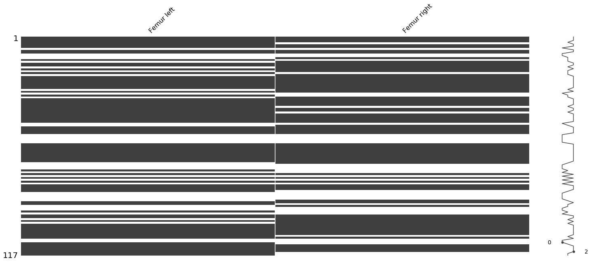

# Missing Values

Vamos a utilizar la libreria `missingno` para ver la estructura de los datos faltantes.


```python
msno.matrix(data)
```


    <matplotlib.axes._subplots.AxesSubplot at 0x1c7de6b27f0>


```python
msno.bar(data)
```


    <matplotlib.axes._subplots.AxesSubplot at 0x1c7de67e8d0>


Podemos ver que hay una gran cantidad de datos faltantes, sobretodo en `Abnormalities Vertebras` y `Abnormalities Femur`. Como el objetivo de este estudio es predecir la altura en base al tamaño del femur vamos a comenzar por solucionar el problema con los missng values de `Femur left` y `Femur right`.

Como vimos en el analisis de atributos existen valores iguales a 0, para nosotros esos valores son iguales a `NaN` ya que no aporntan a la solucion del problema.


```python
data.loc[data['Femur left']      == 0.0] = np.nan
data.loc[data['Femur right']     == 0.0] = np.nan
data.loc[data['Height in grave'] == 0.0] = np.nan
```

Vamos a analizar los dataos faltantes para los valores que vamos a utilizar `Femur left` y `Femur right`


```python
femur_size = data[['ID','Femur left','Femur right']]
```


```python
msno.matrix(femur_size[['Femur left','Femur right']])
```


    <matplotlib.axes._subplots.AxesSubplot at 0x1c7e02189e8>





```python
full_values_femur = pd.DataFrame(data=femur_size)
```


```python
full_values_femur = femur_size.dropna()
```

Una vez eliminados los valores `NaN` podemos ver de que restos tenemos el tamaño de ambos femur y ver si existe una gran diferencia de tamaño entre ellos para mas adelante sustituir los faltantes con su contraparte.


```python
msno.matrix(full_values_femur[['Femur left','Femur right']])
```


    <matplotlib.axes._subplots.AxesSubplot at 0x1c7df579710>


```python
r_femur__l_femur_difference = pd.DataFrame()
r_femur__l_femur_difference['Difference'] = abs(full_values_femur['Femur left'] - full_values_femur['Femur right'])
```


```python
full_values_femur = r_femur__l_femur_difference.Difference.sort_values(ascending=False)
```


```python
full_values_femur = pd.DataFrame(full_values_femur.head(5))
```
