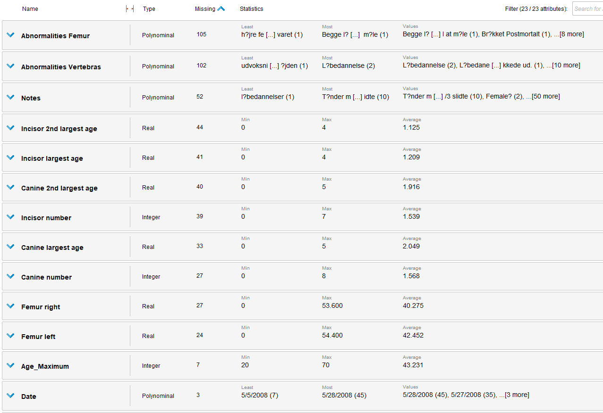
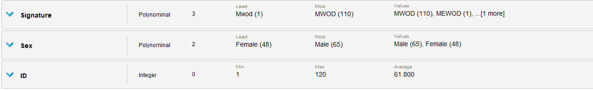
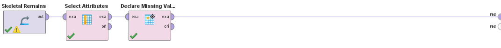
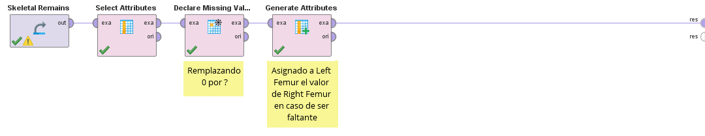
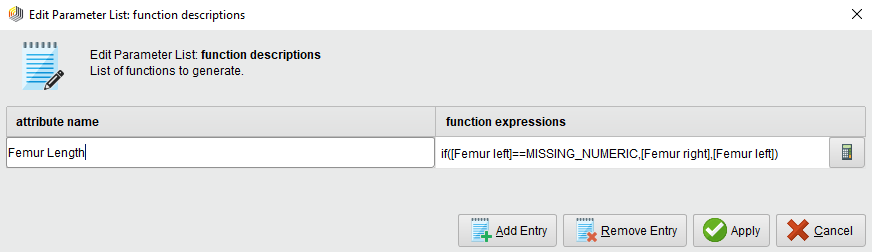
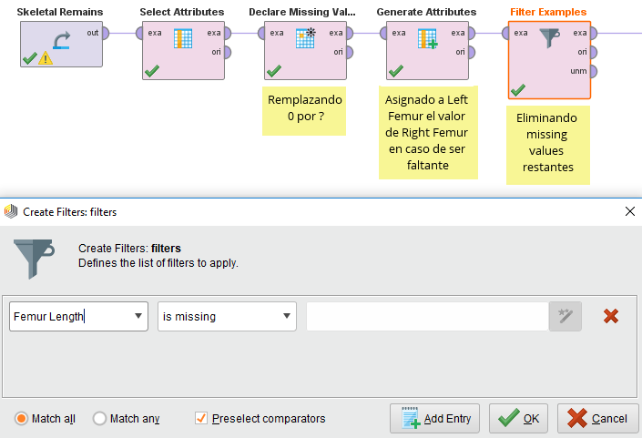

# Missing values

Comenzamos agregando el dataset y viendo las estadisticas.

Podemos ver que tiene varios valores faltantes. Para simplificar el problema vamos a eliminar todos los atributos que no utilizaremos en este problema. Para estimar la altura solo necesitamos la medida de los femurs.
Para eliminar los demas atributos vamos a utilizar el modulo de rapid miner `Select Attributes`.

Podemos ver que tenemos 24 missing values para `Femur left` y 27 para `Femur right`. también podemos notar que tienen una media muy similar. Como vimos en el análisis en codigo podemos remplazar los valores faltantes de `Femur left` por `Femur right` y viceversa. Antes de solucionar este problema tenemos que solucionar los valores 0 en las los tamaños.

Ya que estamos tratando con tamaños de femurs y alturas 0 es un valor invalido y debemos eliminarlo, para esto vamos a utilizar el operador `Declare Missing Values` y asignar 0 como un missing value.

Ahora para podemos asignalre a alguno de los femurs con missing values el valor del femur opuesto en caso de tenerlo. Para esto vamos a utilizar el modulo `Generate Attributes`.

Con esto asignamos en caso de no tener un valor para el femur izquierdo, el valor del femur derecho. Seguimos teniendo valores faltantes para el caso en que ambos son nulos y tendremos que elminarlos. Para esto filtramos por missing values con el modulo `Filter Examples`.

Con esto ya no tenemos valores faltantes en el atributo `Femur Length` que es el que utilizaremos de aqui en mas.