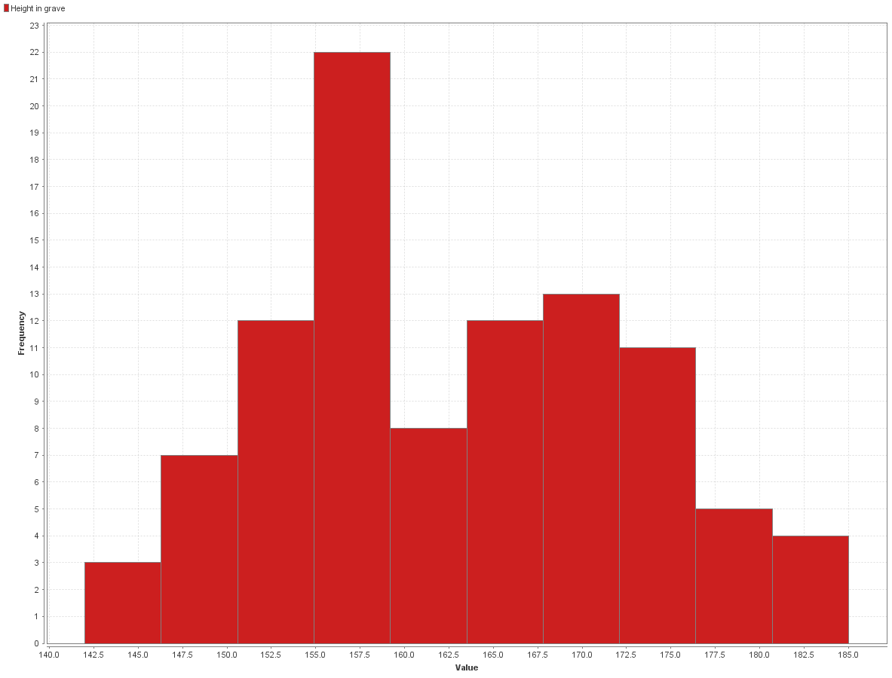

# Outliers

Retomando el modelo que teniamos en [missing values](./4_missing_values_rapidminer.md) vamos a ver las estadisticas de los datos.

Podemos ver que parecen seguir una distribucion normal y no parecen tener missing values. Para estar seguros vamos a hacer un scatter plot.

