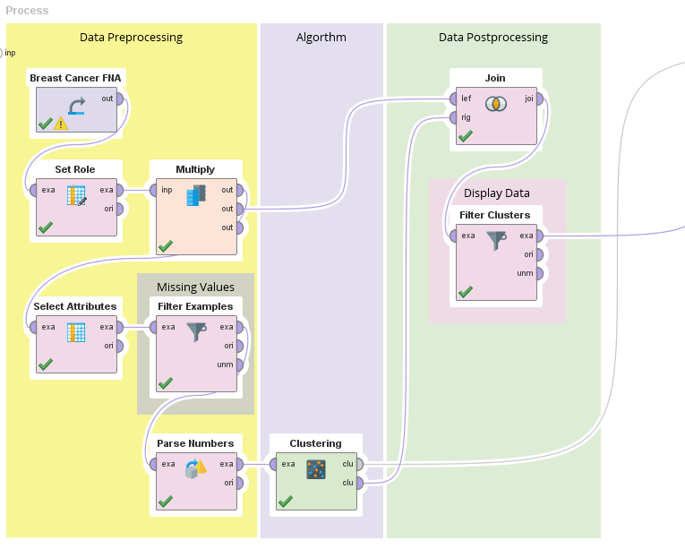
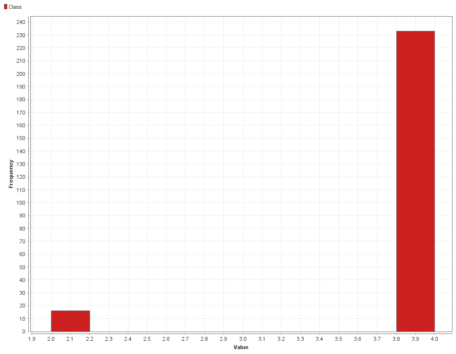
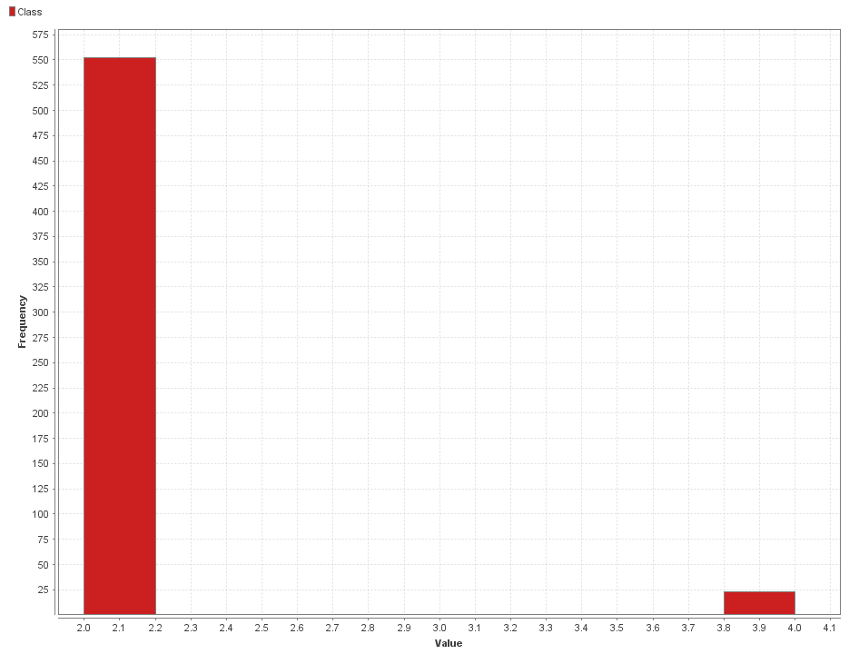
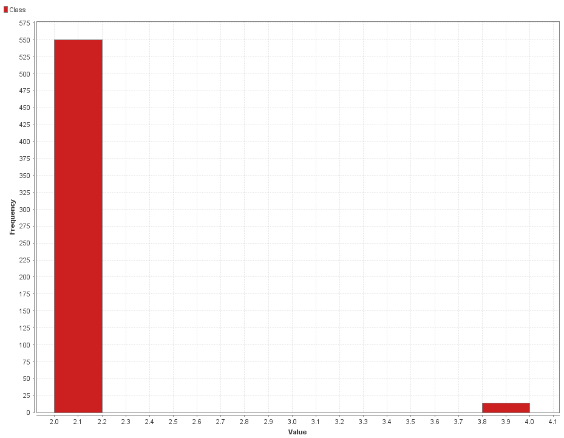
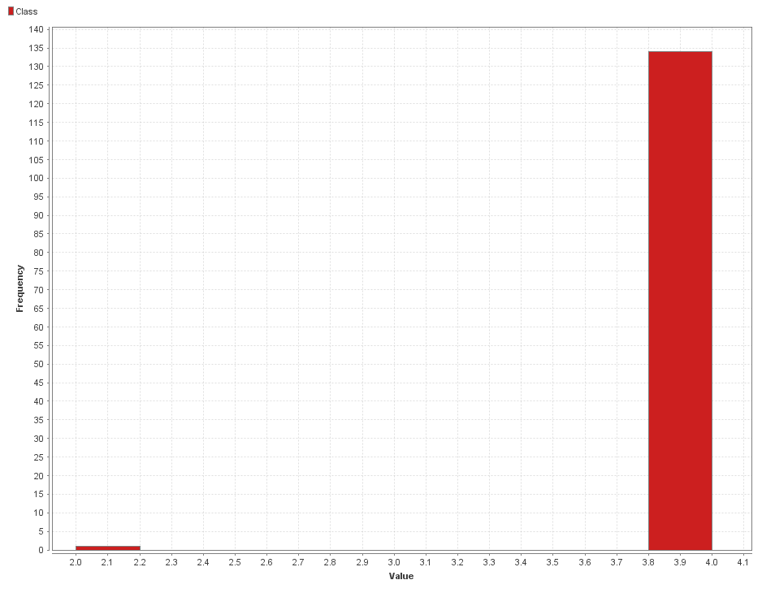
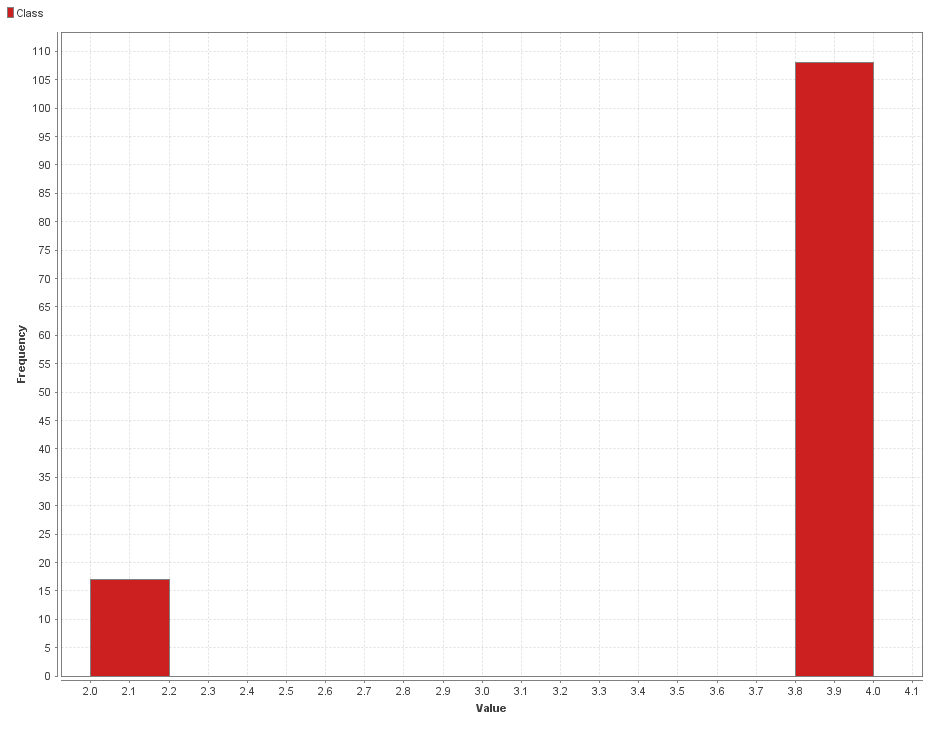

# K-Means Clustering

### Proceso en RapidMiner

__Seed = 2018__

1- Agregamos el dataset en un proceso nuevo con el modulo `Retrive`.

2- Indicamos que el atributo **id** com id con el modulo `Set Role`, esto nos va a ser util mas adelante cuando intentemos realizar un join.

3- Utilizamos el modulo `Multiply` para tener un conjunto de datos que mantenga el atributo `Class` _(lo vamos a eliminar a continuación)_.

4- Eliminamos los atributos que no vamos a utilizar con un modulo de `Select Attributes`, en este caso vamos a eliminar la clase _(`Class`)_.

5- Como vimos en [Missing Values](./), este dataset contiene valores faltantes en el atributo **Bare Nuclei**. Vamos a removerlos con el modulo `Filter Examples`.

6- Los valores del atributo **Bare Nuclei** estan siendo considerados como _polynomial_ vamos a utilizar el modulo de `Parse Numbers` para convertirlos en números.

7- Agregamos el modulo de `Clustering (K-Means)`  

8- Agregamos un join por id con los datos originales para recuperar el atributo de la clase. 

9- Agregamos un modulo `Filter` y a medida que realizamos los experimentos vamos filtrando por clusters.

### Process

DBSCAN cuenta con 2 hiperparametros principales:

* K: Numero de clusters.

* Measure: Formula para calcular la distancia entre datos.

| K  |  Measure           | Clase 2        |  Clase 4 | 
|----| ------------------ | ------------   | -------  |
|2   | Euclidean Distance | C0: 16 C1: 430  _(Imagen 1 y 2)_| C0: 214  C1:2 3 _(Imagen 2 y 1)_|
|3   | Euclidean Distance | C0: 428 C1: 1 C2: 17 _(Imagen 3, 4 y 5)_| C0: 14 C1: 124 C2: 102 _(Imagen 5, 4 y 3)_|

_Imagen 1: Cluster 0_

_Imagen 2: Cluster 1_

_Imagen 3: Cluster 0_

_Imagen 4: Cluster 1_

_Imagen 5: Cluster 2_

Podemos ver que con K=2 se pueden separar bastante bien las clases.