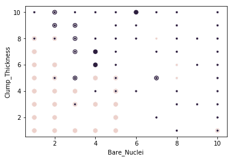
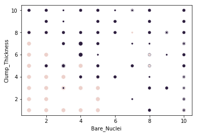
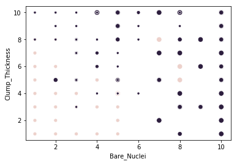
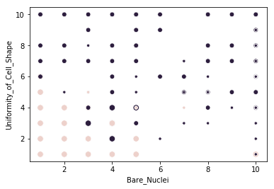

# K-Means

Importamos las librerias


```python
import matplotlib
import seaborn as sns
import pandas as pd
from sklearn.cluster import KMeans
```


```python
# Cargamos el dataset
data = pd.read_csv('../dataset/breast-cancer.csv')
# Eliminamos las varialbes que no vamos a utilizar
data = data.drop(['id'], axis=1)
data = data[data.Bare_Nuclei!='?']
# Convertimos Bare Nuclei en una variable numerica
data.Bare_Nuclei = data.Bare_Nuclei.apply(lambda x: int(x))
```


```python
# Eliminamos la clase
X = data.drop(['Class'], axis=1)
# Creamos y entrenamos un modelo
kmeans = KMeans(n_clusters=2, random_state=0).fit(X)
# Ahora graficamos algunas variables indicando su clase con diferente color y 
# dieferente tamaño dependiendo del cluster al que pertenecen
ax = sns.scatterplot(x=X.Bare_Nuclei,y=X.Clump_Thickness, hue=data.Class, size=(kmeans.labels_+2)*2)
ax.legend_.remove()
```





```python
kmeans = KMeans(n_clusters=3, random_state=0).fit(X)

ax = sns.scatterplot(x=X.Bare_Nuclei,y=X.Clump_Thickness, hue=data.Class, size=(kmeans.labels_+2)*2)
ax.legend_.remove()
```





```python
kmeans = KMeans(n_clusters=4, random_state=0).fit(X)

ax = sns.scatterplot(x=X.Bare_Nuclei,y=X.Clump_Thickness, hue=data.Class, size=(kmeans.labels_+2)*2)
ax.legend_.remove()
```





```python
kmeans = KMeans(n_clusters=3, random_state=0).fit(X)

ax = sns.scatterplot(x=X.Bare_Nuclei,y=X.Uniformity_of_Cell_Shape, hue=data.Class, size=(kmeans.labels_+2)*2)
ax.legend_.remove()
```





Podemos ver que para algunos atributos los logra separar bien, mientras que otros no. Para ver una analisis mas en profundida de clustering ver [K-Means Rapidmienr](./)
