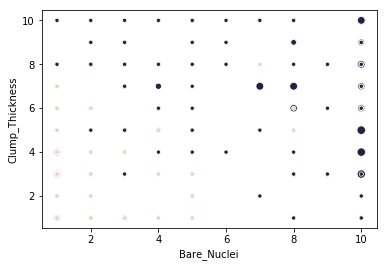
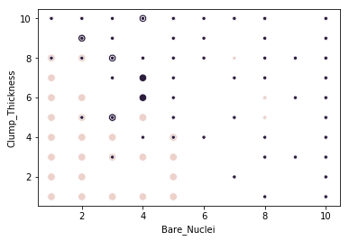

#  DBSCAN

Importando librerias


```python
import matplotlib
import seaborn as sns
import pandas as pd
from sklearn.cluster import DBSCAN
```


```python
# Cargamos los datos
data = pd.read_csv('../dataset/breast-cancer.csv')
# Eliminamos los atributos que no vamos a utilizar
data = data.drop(['id'], axis=1)
data = data[data.Bare_Nuclei!='?']
# Convertimos los valores de Bare Nuclei en enteros
data.Bare_Nuclei = data.Bare_Nuclei.apply(lambda x: int(x))
```


```python
# Eliminamos la label
X = data.drop(['Class'], axis=1)
clustering = DBSCAN(eps=3, min_samples=2).fit(X)
# Graficamos los clusters
clustering.labels_
ax = sns.scatterplot(x=X.Bare_Nuclei,y=X.Clump_Thickness, hue=data.Class, size=(clustering.labels_+2)*2)
ax.legend_.remove()
```





```python
# Basados en los experimentos con rapidminer probamos
clustering = DBSCAN(eps=5, min_samples=100).fit(X)
# Graficamos los clusters
clustering.labels_
ax = sns.scatterplot(x=X.Bare_Nuclei,y=X.Clump_Thickness, hue=data.Class, size=(clustering.labels_+2)*2)
ax.legend_.remove()
```





```python
print('Cluster 0: {0}'.format(clustering.labels_.max()))
print('Cluster 1: {0}'.format(clustering.labels_.min()))
```

    Cluster 0: 0
    Cluster 1: -1


Al igual que rapidminer podemos ver dos clusters, para un analisis mas en prfundidad ver [DBSCAN RapidMiner](./)
