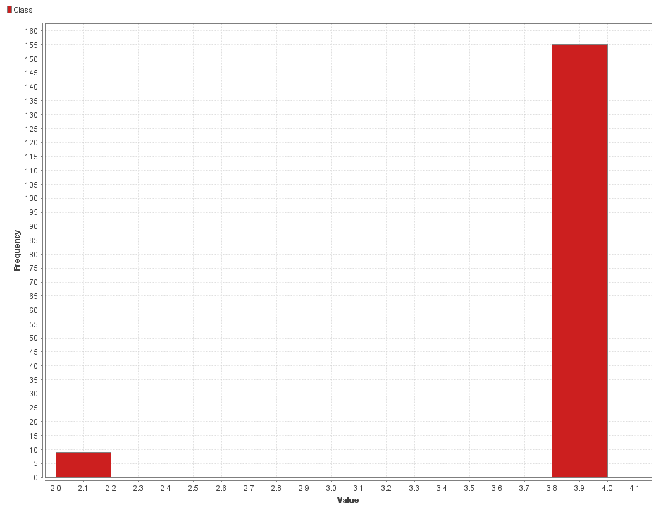
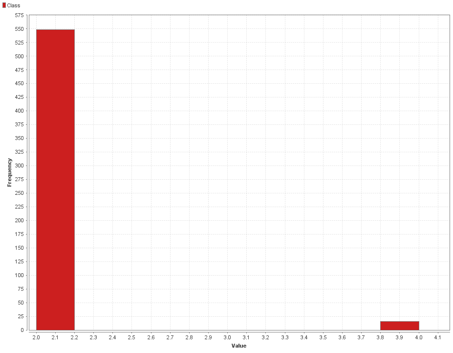
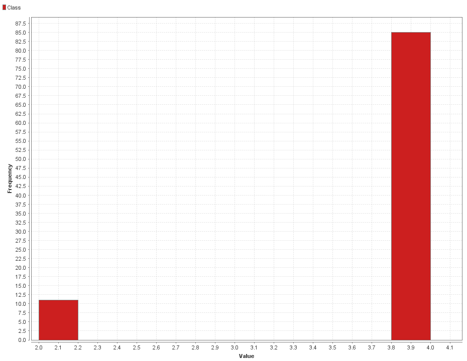
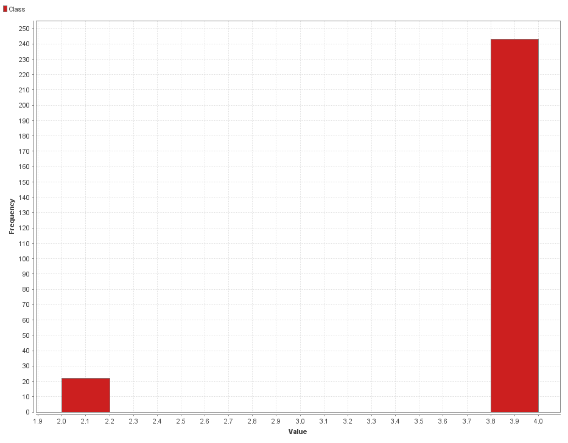
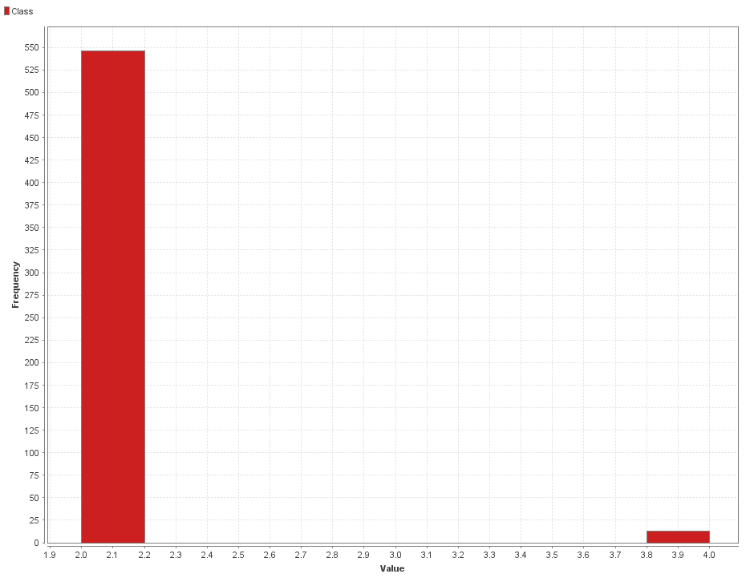
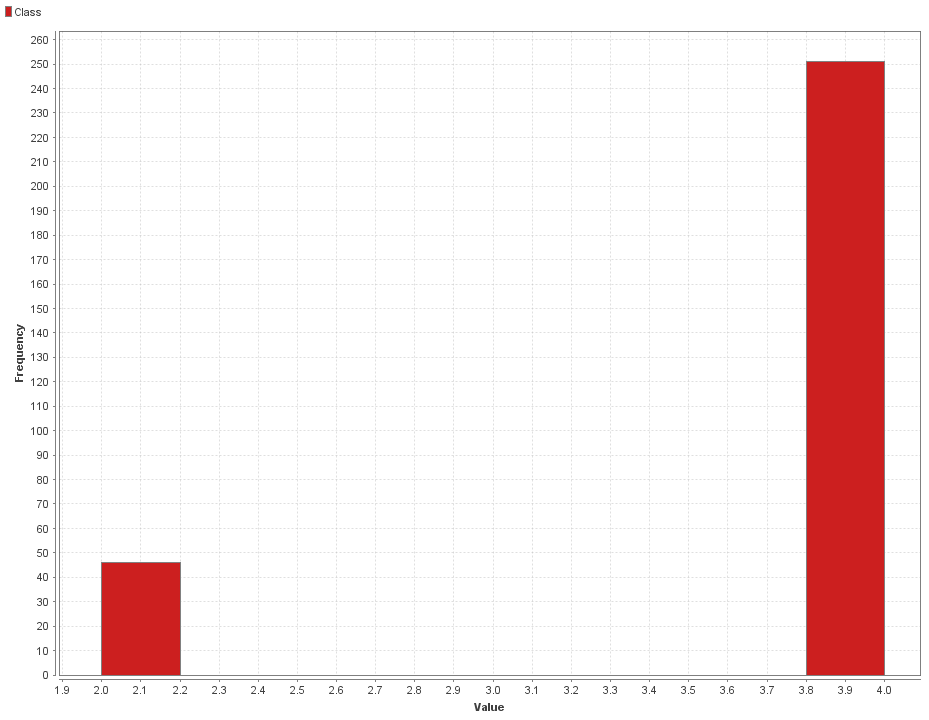
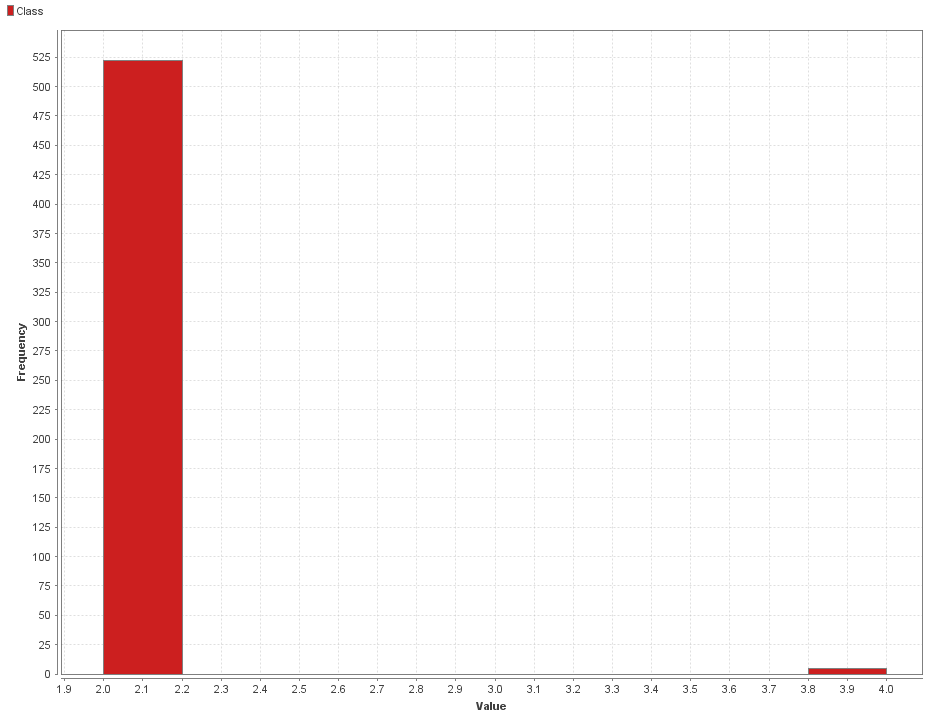
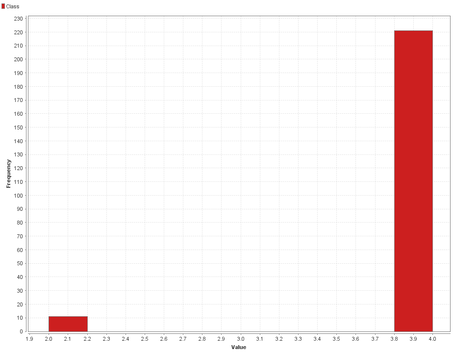
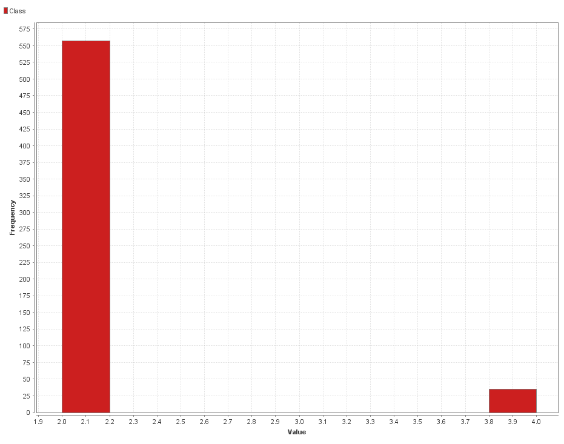

# DBSCAN 

### Consideraciones

### Proceso en RapidMiner

__Seed = 2018__

1- Agregamos el dataset en un proceso nuevo con el modulo `Retrive`.

2- Indicamos que el atributo **id** com id con el modulo `Set Role`, esto nos va a ser util mas adelante cuando intentemos realizar un join.

3- Utilizamos el modulo `Multiply` para tener un conjunto de datos que mantenga el atributo `Class` _(lo vamos a eliminar a continuación)_.

4- Eliminamos los atributos que no vamos a utilizar con un modulo de `Select Attributes`, en este caso vamos a eliminar la clase _(`Class`)_.

5- Como vimos en [Missing Values](./), este dataset contiene valores faltantes en el atributo **Bare Nuclei**. Vamos a removerlos con el modulo `Filter Examples`.

6- Los valores del atributo **Bare Nuclei** estan siendo considerados como _polynomial_ vamos a utilizar el modulo de `Parse Numbers` para convertirlos en números.

7- Agregamos el modulo de `Clustering (DBSCAN)`.

8- Agregamos un join por id con los datos originales para recuperar el atributo de la clase. 

9- Agregamos un modulo `Filter` y a medida que realizamos los experimentos vamos filtrando por clusters.

### Process

## Experimentos

DBSCAN cuenta con 3 hiperparametros principales:

* Epsilon: La distancia máxima entre dos muestras para que se consideren en el mismo vecindario.

* Min Points: Este parámetro especifica el número mínimo de puntos que forman un grupo.

* Measure: Formula para calcular la distancia entre datos.

| Epsilon  | Min Points    | Measure      | Clusters Obtenidos | Observaciones | 
|----------| ------------- | ------------ | ---------------- | -------------- |
| 5.0        |     1         | Euclidean Distance | 73           | Uno de los clusters tiene 597 mientras que los demas tienen 1 o 2 elementos. |
| 5.0        |     10        | Euclidean Distance | 3           | Los clusters nuevos tienen 152, 442 y 89 elementos. Filtrando por diferentes cluster podemos observar que en el cluster_0 tenemos 9 elementos de la clase 2 y 143 de la clase 4 _(imagen 1)_. En el cluster_1 tenemos 16 de la clase 4 y 426 de la clase 2  _(imagen 2)_. En el cluster_2 tenemos 11 de la clase 2 y 78 de la clase 4 _(imagen 3)_. |
| 5.0        |     100        | Euclidean Distance | 2           | Esta vez tenemos solamente dos clusters, cluster_0 con 246 elementos y el cluster_1 con 437 elementos. El cluster_0 tiene 22 elementos de la clase 2 y 224 de la clase 4_(imagen 4)_, mientras que el cluste_1 tiene 13 elementos de la clase 4 y 424 de la clase 2 _(imagen 5)_. |
| 3.0        |     100         | Euclidean Distance | 2           | Nuevamente podemos ver dos grandes clusters cluster_0 con 275 elementos y el cluster_1 con 408. El cluster_0 tiene 46 elementos de la clase 2 y 229 de la clase 4_(imagen 6)_, mientras que el cluste_1 tiene 5 elementos de la clase 4 y 403 de la clase 2 _(imagen 7)_. |
| 7.0        |     100         | Euclidean Distance | 2           | Nuevamente podemos ver dos grandes clusters cluster_0 con 214 elementos y el cluster_1 con 469. El cluster_0 tiene 11 elementos de la clase 2 y 203 de la clase 4_(imagen 8)_, mientras que el cluste_1 tiene 34 elementos de la clase 4 y 435 de la clase 2 _(imagen 9)_. |

_Imagen 1: Cluster 0_

_Imagen 2: Cluster 1_

_Imagen 3: Cluster 2_

_Imagen 4: Cluster 0_

_Imagen 5: Cluster 1_

_Imagen 6: Cluster 0_

_Imagen 7: Cluster 1_

_Imagen 8: Cluster 0_

_Imagen 9: Cluster 1_

En el primer intento obtubimos muchos clusters con 1 solo dato, esto nos queria decir que estabamos siendo muy estrictos al momento de sperar los clusters.
Para solucionar esto aumentamos la cantidad de datos necesarios para formar un cluster de 1 a 10, con esto generamos 3 clusters mejor separados. Dos de estos cluster lograban separar bien las clases 2 y 4 aunque en un 3er cluster no se pudo encontrar la caracteristica que los agrupaba. Para intentar eliminar este tercer cluster y ver que tan bien se separaban las dos clases se cambio a 100 la cantidad de datos minimos para pertenecer a un cluster. Al final pudimos ver que se pueden separar bien las clases con dos clusters.

**Matriz de resultados para Min Points 100 Epsilon 5.0**

|                | Clase 2  | Clase 4  | 
|----------      | -------- | -------- |
|**Cluster 0**   | 22       | 224      |
|**Cluster 1**   | 424      |  4       | 

**Matriz de resultados para Min Points 100 Epsilon 7.0**

|                | Clase 2  | Clase 4  | 
|----------      | -------- | -------- |
|**Cluster 0**   | 11       | 203      |
|**Cluster 1**   | 435      | 34       | 

Para continuar se podria comparar los resultados obtenidos con K=3 en [K-Means Clustering]() y los obtenidos con epsilon 5.0 y 10 min points. Comprando estos dos podemos ver si los datos agrupados en el 3er cluster son los mismos e intentar buscar que tienen en comun. 