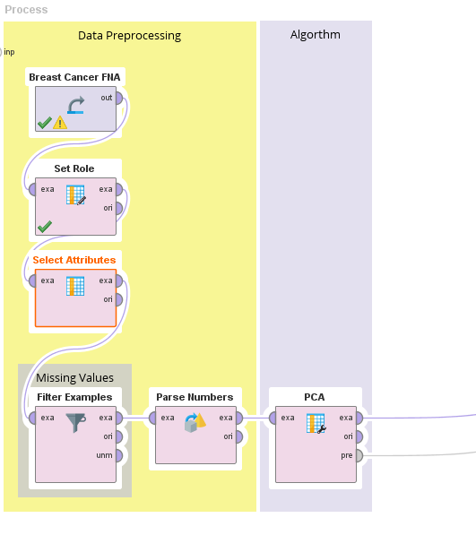
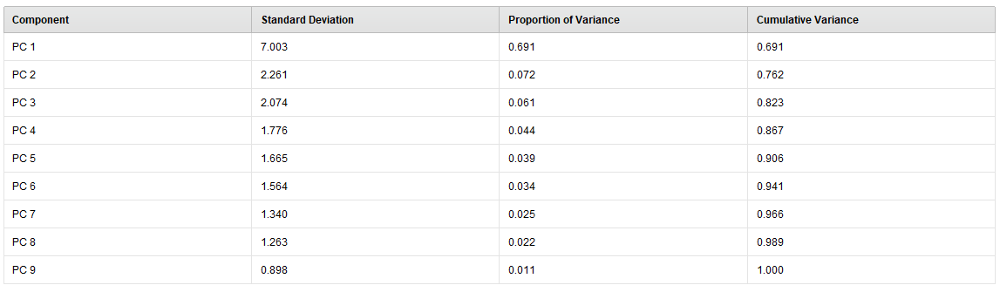
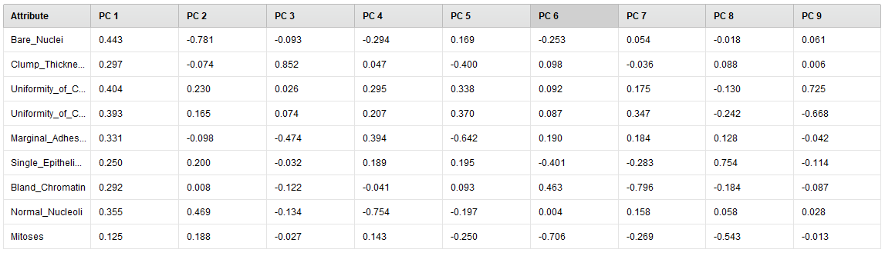
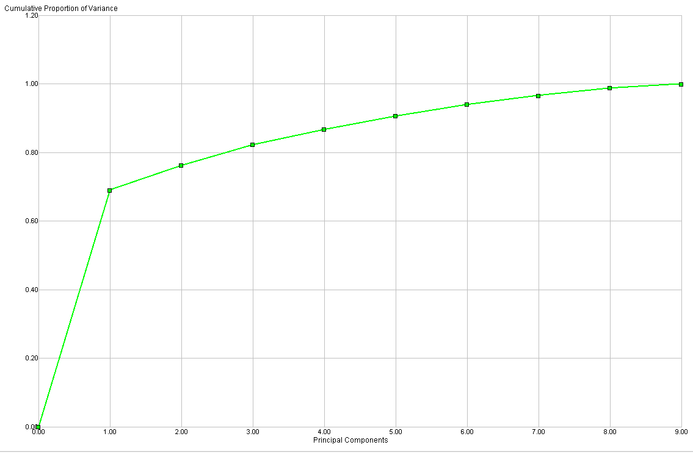

# Principal Component Analisys

### Consideraciones

✔ PCA solo trabaja con valores numericos.

* Una vez eliminados los missing values y convertido los valores de String a Integer, todos los valores restantes son numericos.

### Proceso en RapidMiner

__Seed = 2018__

1- Agregamos el dataset en un proceso nuevo con el modulo `Retrive`.

2- Indicamos que el atributo **Class** va a ser nuestra label con un modulo de  `Set Role`.

3- Eliminamos los atributos que no vamos a utilizar con un modulo de `Select Attributes`, en este caso vamos a eliminar la id.

4- Como vimos en [Missing Values](./), este dataset contiene valores faltantes en el atributo **Bare Nuclei**. Vamos a removerlos con el modulo `Filter Examples`.

5- Los valores del atributo **Bare Nuclei** estan siendo considerados como _polynomial_ vamos a utilizar el modulo de `Parse Numbers` para convertirlos en números.

7- Agregamos el modulo de `PCA`.

### Process

## Experimentos

PCA cuenta con 2 hiperparametros:

* Dimensionality Reduction: Este parámetro indica qué tipo de reducción de dimensionalidad (reducción en el número de atributos) debe aplicarse.

* Variance Threshold: Este parámetro está disponible solo cuando el parámetro de reducción de dimensionalidad está configurado para 'mantener varianza'. Todos los componentes con una varianza acumulada mayor que el umbral de varianza se eliminan del dataset.

Vamos a ejecutar PCA con los valores por defecto, dimensionality reduction = Keep Variance y  variance threshold = 0.95

### Eigenvalues

### Eigenvectors

### Cumulative Variance

Podemos ver que necesitamos por lo menos 6 componentes para llegar al 0.95 de la varianza.