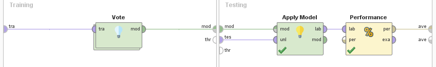
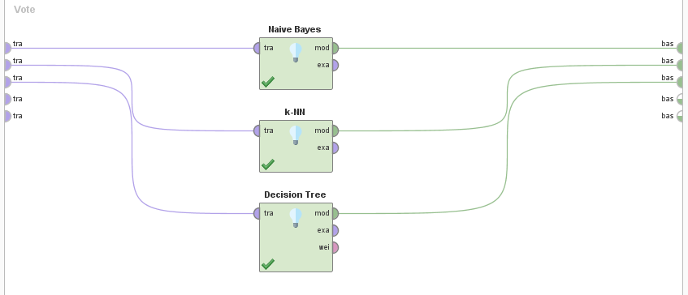
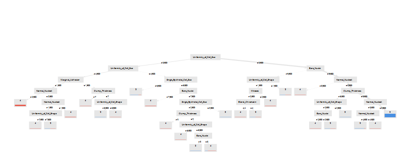
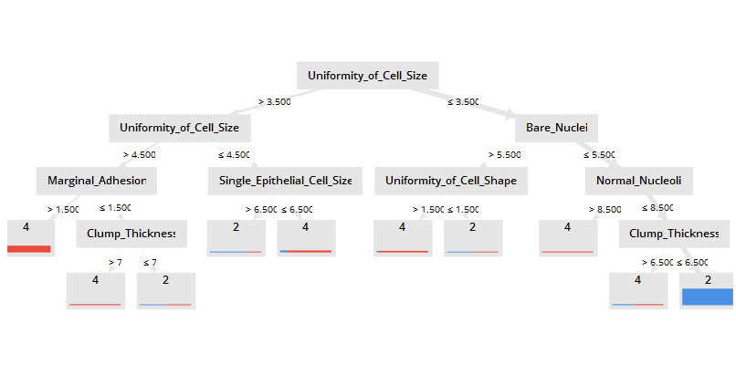

# Ensembles

### Proceso en RapidMiner

__Seed = 2018__

1- Agregamos el dataset en un proceso nuevo con el modulo `Retrive`.

2- Indicamos que el atributo **Class** va a ser nuestra _label_ a predecir con el modulo `Set Role`.

3- Eliminamos los atributos que no vamos a utilizar con un modulo de `Select Attributes`, en este caso vamos a eliminar la id.

4- Nuestras variables de salida son 2 y 4, algunos de los modelos que vamos a utilizar requieren salidas de tipo _polynomial_, para cumplir con este requsito vamos a utilizar el modulo `Numerical to Polynominal` sobre la variable **Class**.

5- Como vimos en [Missing Values](./), este dataset contiene valores faltantes en el atributo **Bare Nuclei**. Vamos a removerlos con el modulo `Filter Examples`.

6- Los valores del atributo **Bare Nuclei** estan siendo considerados como _polynomial_ vamos a utilizar el modulo de `Parse Numbers` para convertirlos en números.

7- Agregamos un modulo de `Validation`.

* Dentro del Validation:
  
  7.1 Del lado izquierdo agregamos un modulo de `Vote`
  
  *  7.1.1 Dentro del modulo de vote agregamos los clasificadores `Naive Bayes`, `k-NN` y `Decision Tree`.

  7.2- En el lado derecho _(testing)_ agregamos el modulo de `Apply model` conectado a `Performance`.

### Process

### Validation

### Vote

## Experimentos

Comenzamos agregando clasificadores debiles como, Naive Bayes, K-nn y Decision Tree dejando todos sus parametros por defecto.

| Vote  | Accuracy         | 2 Recall | 4 Recall |
|----| ---------------- | -------- | -------- |
| **Naive Bayes, K-NN, Decision Tree** |  **98.54%** |  **97.74%**  |  **100.00%**  |
| Naive Bayes, K-NN, Decision Tree, Gradient Boosted Tree | 97.56% |  97.74%  |  97.22%  |
| Naive Bayes, K-NN | 97.56% |  97.74%  |  97.22%  |
| Naive Bayes, Decision Tree | 94.15% |  98.50%  |  86.11%  |
| K-NN, Decision Tree | 94.15% |  98.50%  |  86.11%  |

Podemos ver que se consigue un muy buen modeo con buena accuracy, reacall y un arbol bastante complejo. Tambien podemos observar que el algoritmo mas influyente parece ser el Decision Tree.

Reduciendo el maximal deept del  `Decision Tree` obtenemos el siguiente arbol y valores.

| Vote  | Accuracy         | 2 Recall | 4 Recall |
|----| ---------------- | -------- | -------- |
| Naive Bayes, K-NN, Decision Tree |  98.05% |  97.74% | 98.61%  |

Vemos que la perdida en accuracy no es mucha y le agrega interpretabilidad al modelo ya que el nuevo arbol es mas facil de comprender.
