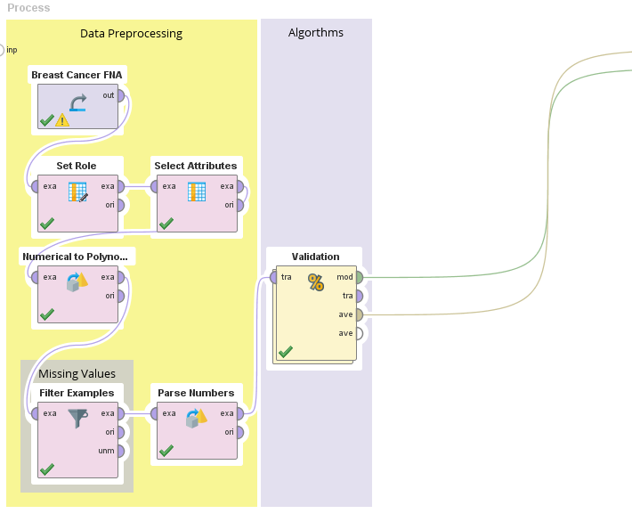
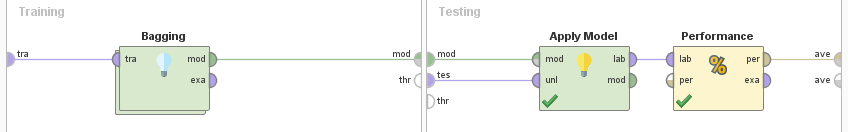
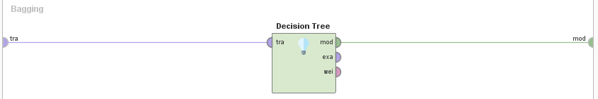
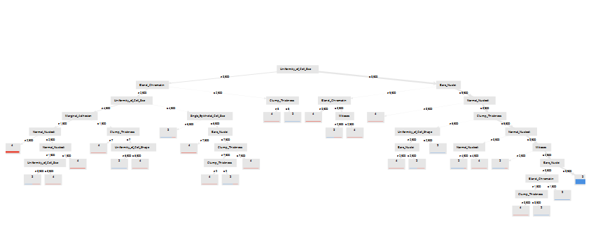
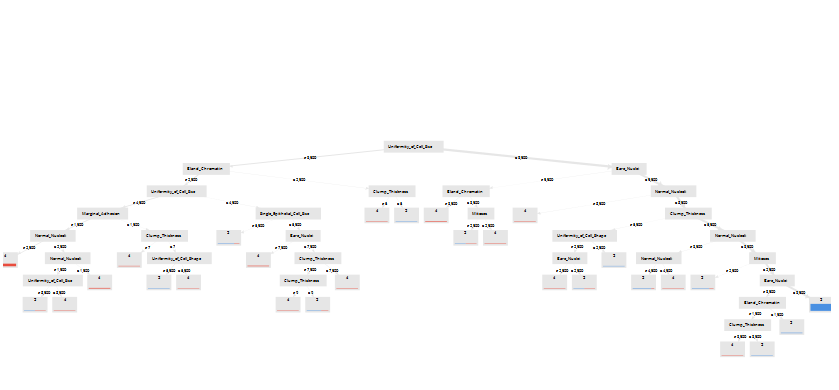
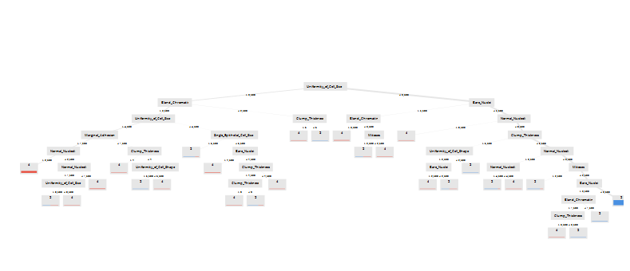
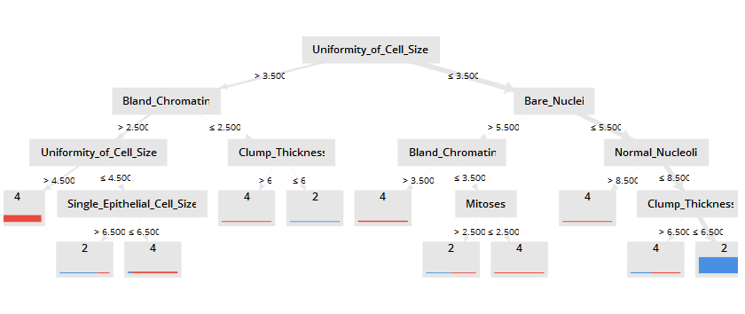

# Bagging

### Consideraciones

### Proceso en RapidMiner

__Seed = 2018__

1- Agregamos el dataset en un proceso nuevo con el modulo `Retrive`.

2- Indicamos que el atributo **Class** va a ser nuestra _label_ a predecir con el modulo `Set Role`.

3- Eliminamos los atributos que no vamos a utilizar con un modulo de `Select Attributes`, en este caso vamos a eliminar la id.

4- Nuestras variables de salida son 2 y 4, algunos de los modelos que vamos a utilizar requieren salidas de tipo _polynomial_, para cumplir con este requsito vamos a utilizar el modulo `Numerical to Polynominal` sobre la variable **Class**.

5- Como vimos en [Missing Values](./), este dataset contiene valores faltantes en el atributo **Bare Nuclei**. Vamos a removerlos con el modulo `Filter Examples`.

6- Los valores del atributo **Bare Nuclei** estan siendo considerados como _polynomial_ vamos a utilizar el modulo de `Parse Numbers` para convertirlos en números.

7- Agregamos un modulo de `Validation`.

* Dentro del Validation:
  
  7.1 Del lado izquierdo agregamos un modulo de `Bagging`
  
  *  7.1.1 Dentro del modulo de vote agregamos un  `Decision Tree`.

  7.2- En el lado derecho _(testing)_ agregamos el modulo de `Apply model` conectado a `Performance`.

### Process

### Validation

### Bagging

## Experimentos

El operador `Bagging` contiene dos parametros:

* Sample ratio: Este parámetro especifica la fracción de ejemplos que se utilizarán para el entrenamiento. Su valor debe ser mayor que 0 (es decir, cero ejemplos) y debe ser menor o igual a 1 (es decir, conjunto de datos completo).

* Iterations: Este parámetro especifica el número máximo de iteraciones del algoritmo
 
| Sample Ratio  | Iterations    | Accuracy |2 Recall | 4 Recall |
|-------------| ---------------- | ----|---- | -------- |
| **0.9** | **10** | **95.61%** | **100.00%** | **87.50%** |
| 0.9 | 5  | 95.61% | 100.00% | 87.50% |
| 0.9 | 2  | 95.61% | 100.00% | 87.50% |
| 0.9 | 15 | 95.61% | 100.00% | 87.50% |
| 0.9 | 20 | 95.61% | 100.00% | 87.50% |
| 0.8 | 10 | 95.12% | 97.74% | 90.28% |
| 0.7 | 10 | 95.12% | 97.74% | 90.28% |
| 0.7 | 10 |  92.68% | 96.24%| 86.11% |

Podemos ovservar que cambiar las iteraciones no surge efecto y que reducir el sample ratio empeora la performance, como es de esperarse.

Algunos arboles de nuestro mejor modelo:

Podemos ver que los arboles generados son muy grandes y poco descriptivos, ahora vamos a intentar reducir a 5 la max deept.

| Sample Ratio  | Iterations    | Accuracy |2 Recall | 4 Recall |
|-------------| ---------------- | ----|---- | -------- |
| **0.9** | **10** | **95.61%** | **97.74%** | **91.67%** |
| 0.9 | 5  | 95.61% | 97.74%| 91.67% |
| 0.9 | 5  | 95.61% | 97.74%| 91.67% |
| 0.9 | 5  | 95.61% | 97.74%| 91.67% |
| 0.9 | 5  | 95.61% | 97.74%| 91.67% |
| 0.8 | 10 | 95.12% | 97.74% | 90.28% |
| 0.7 | 10 | 94.15% | 93.23% | 95.83% |

Nuevamente podemos observar eun comprotamiento similar aunque ahora tenemos arboles mas faciles de comprender.

