# Random Forest

### Consideraciones

### Proceso en RapidMiner

__Seed = 2018__

1- Agregamos el dataset en un proceso nuevo con el modulo `Retrive`.

2- Eliminamos los atributos inecesarios con un modulo de `Select Attributes`, en este caso vamos a eliminar la id.

3- Como vimos en [Missing Values](./), este dataset contiene valores faltantes en el atributo **Bare Nuclei**. Vamos a removerlos con el modulo `Filter Examples`.

4- En los proximos pasos vamos a utlizar el modulo de `Performace (Classification)` el cual requiere que las _labels_ sean de tipo _polynomial_. Actualmente nuestras variables de salida son 2 y 4, para cumplir con este requsito vamos a utilizar el modulo `Numerical to Polynominal` sobre la variable **Class**.

5- Los valores del atributo **Bare Nuclei** estan siendo considerados como _polynomial_ vamos a utilizar el modulo de `Nominal to Numerical` para convertirlo en numeros.

El paso 4 y 5 los englobamos en un `Subprocess`.

6- Indicamos que el atributo **Class** va a ser nuestra _label_ a predecir con el modulo `Set Role`.

7- Para evaluar que tan buneo es nuestro modelo vamos a utilizar validacion cruza tambien conocido como _cross validation_, vamos a utilizar el estandar de 10 folds.

* Dentro del cross validation:
  
  7.1- En el lado izquierdo _(training)_ agregamos el modulo `Random Forest`.

  7.2- En el lado derecho _(testing)_ agregamos el modulo de `Apply model` conectado a `Performance (Classification)`.

### Process

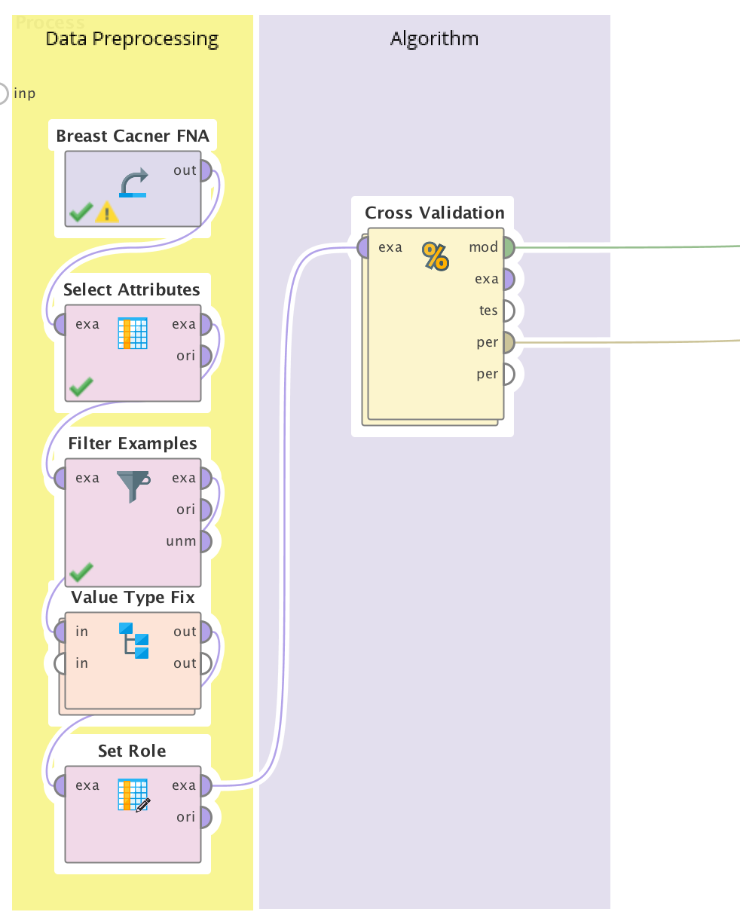

### Cross Validation

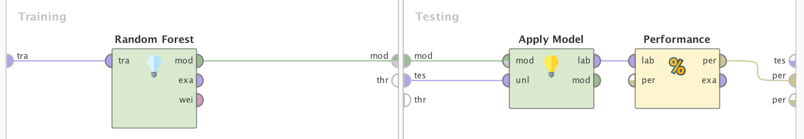

## Experimentos

El operador `Random Forst` contiene varios parametros:

* Number of trees: Este parámetro especifica el número de árboles aleatorios para generar. Para cada árbol se selecciona un subconjunto de ejemplos. Si el parámetro que habilita la ejecución paralela está marcado, los árboles se entrenan en paralelo a través de los subprocesos disponibles del procesador.

* Criterion: Es el criterio con en el que se seleccionarán los atributos para la división. Para cada uno de estos criterios, el valor de división se optimiza con respecto al criterio elegido.

* Maximal Depth: La profundidad de un árbol varía según el tamaño y las características del dataset de entrenamiento. Este parámetro se utiliza para restringir la profundidad de cada árbol aleatorio.
 
* Apply Prepruning: Este parámetro especifica si se deben usar más criterios de detención que la profundidad máxima durante la generación de los árboles de decisión. Si se seleccionan, los parámetros ganancia mínima, tamaño de hoja mínimo, tamaño mínimo de división y número de alternativas de prepruning se utilizan como criterios de detención.

* Voting Strategy: Especifica la estrategia de predicción en caso de discrepancias en las predicciones del modelo de árbol.

Estos son los hiperparametros que vamos a modificar, tambien existen otros:

* Minimal Gain
* Minimal Leaf Size
* Minimal Size for Split
* Number of prepruning

| Number of Trees  | Criterion | Maximal Depth | Apply Prepruning | Voting Strategy | Accuracy | 2 Recall | 4 Recall |
|------------------| ----------| ------------- | ---------------- | --------------- | -------- | -------- | -------- |
|       5          | Gain Rato |    10         |     ✔            | Confidence Vote | 96.34% +/- 1.75% | 96.40% | 96.23% | 
|       10         | Gain Rato |    10         |     ✔            | Confidence Vote | 96.63% +/- 1.97% | 96.62% | 96.65% |
|       15         | Gain Rato |    10         |     ✔            | Confidence Vote | 96.64% +/- 1.85% | 96.62% | 96.65% |
|       20         | Gain Rato |    10         |     ✔            | Confidence Vote | 96.64% +/- 2.07% | 96.62% | 96.65% |  
|       5          | Information Gain |    10         |     ✔     | Confidence Vote | 95.90% +/- 2.25% | 96.40% | 94.98% | 
|       10         | Information Gain |    10         |     ✔     | Confidence Vote | 96.63% +/- 2.28% | 96.85% | 96.23% |
|       15         | Information Gain |    10         |     ✔     | Confidence Vote | 96.63% +/- 2.18% | 97.07% | 95.82% |
|       20         | Information Gain |    10         |     ✔     | Confidence Vote | 96.78% +/- 2.25% | 97.30% | 95.82% |
|       5          | Gini Index       |    10         |     ✔     | Confidence Vote | 96.78% +/- 1.94% | 96.85% | 96.65% | 
|       10         | Gini Index       |    10         |     ✔     | Confidence Vote | 96.93% +/- 2.22% | 96.85% | 97.07% |
|       15         | Gini Index       |    10         |     ✔     | Confidence Vote | 96.78% +/- 2.35% | 96.85% | 96.65% |
|       20         | Gini Index       |    10         |     ✔     | Confidence Vote | 96.78% +/- 2.35% | 96.85% | 96.65% |
|       5          | Information Gain |    5         |     ✔      | Confidence Vote | 96.05% +/- 2.45% | 96.40% | 95.40% | 
|     **10**  | **Information Gain** |   **5**       |   **✔**    | **Confidence Vote** | **96.78% +/- 2.06%** | **96.62%** | **97.07%** |
|       15         | Information Gain |    5         |     ✔      | Confidence Vote | 96.49% +/- 2.30% | 96.62% | 96.23% |
|       20         | Information Gain |    5         |     ✔      | Confidence Vote | 96.63% +/- 2.19% | 96.85% | 96.23% |
|       5          | Information Gain |    5         |     ✘      | Confidence Vote | 96.05% +/- 2.45% | 96.40% | 95.40% | 
|       10         | Information Gain |    5         |     ✘      | Confidence Vote | 96.63% +/- 2.28% | 96.85% | 96.23% |
|       15         | Information Gain |    5         |     ✘      | Confidence Vote | 96.78% +/- 2.06% | 97.07% | 96.23% |
|       20         | Information Gain |    5         |     ✘      | Confidence Vote | 96.78% +/- 2.06% | 97.07% | 96.23% |
|       5          | Information Gain |    5         |     ✘      | Majority Vote   | 96.05% +/- 2.45% | 96.40% | 95.40% | 
|       10         | Information Gain |    5         |     ✘      | Majority Vote   | 96.78% +/- 2.06% | 96.62% | 97.07% |
|       15         | Information Gain |    5         |     ✘      | Majority Vote   | 96.78% +/- 2.35% | 96.62% | 97.07% |
|       20         | Information Gain |    5         |     ✘      | Majority Vote   | 96.78% +/- 2.25% | 96.85% | 96.65% |
|       5          | Gain Rato |    5         |     ✔             | Confidence Vote | 96.49% +/- 2.19% | 96.40% | 96.65% |
|       10         | Gain Rato |    5         |     ✔             | Confidence Vote | 96.19% +/- 1.63% | 96.62% | 95.40% |
|       15         | Gain Rato |    5         |     ✔             | Confidence Vote | 96.63% +/- 1.74% | 96.85% | 96.23% |
|       20         | Gain Rato |    5         |     ✔             | Confidence Vote | 96.49% +/- 1.76% | 96.85% | 95.82% | 
|       5          | Gain Rato |    5         |     ✘             | Confidence Vote | 96.34% +/- 1.99% | 96.40% | 96.23% |
|       10         | Gain Rato |    5         |     ✘             | Confidence Vote | 96.19% +/- 1.63% | 96.62% | 95.40% |
|       15         | Gain Rato |    5         |     ✘             | Confidence Vote | 96.63% +/- 1.74% | 96.85% | 96.23% |
|       20         | Gain Rato |    5         |     ✘             | Confidence Vote | 96.63% +/- 1.74% | 96.85% | 96.23% | 
|       5          | Gini Index       |    5          |     ✔     | Confidence Vote | 96.93% +/- 1.78% | 96.40% | 97.91% | 
|       10         | Gini Index       |    5          |     ✔     | Confidence Vote | 96.49% +/- 1.99% | 96.40% | 96.65% |
|       15         | Gini Index       |    5          |     ✔     | Confidence Vote | 96.49% +/- 2.29% | 96.62% | 96.23% |
|       20         | Gini Index       |    5          |     ✔     | Confidence Vote | 96.78% +/- 2.35% | 96.85% | 96.65% |

Podemos ver que a pesar de los cambios en los parametros no se ven cambios mayores a un ~1% en la Accuracy, ~1% en el Recall de la clase 2 y un ~2% en el Recall de la clase 4. Nuestra mejor accuracy es 96.78% a continuacion una lista con los parametros de estos modelos.

| Number of Trees  | Criterion | Maximal Depth | Apply Prepruning | Voting Strategy | Accuracy | 2 Recall | 4 Recall |
|------------------| ----------| ------------- | ---------------- | --------------- | -------- | -------- | -------- |
|       20         | Information Gain |    10         |     ✔     | Confidence Vote | 96.78% +/- 2.25% | 97.30% | 95.82% |
|       5          | Gini Index       |    10         |     ✔     | Confidence Vote | 96.78% +/- 1.94% | 96.85% | 96.65% |
|       15         | Gini Index       |    10         |     ✔     | Confidence Vote | 96.78% +/- 2.35% | 96.85% | 96.65% |
|       20         | Gini Index       |    10         |     ✔     | Confidence Vote | 96.78% +/- 2.35% | 96.85% | 96.65% | 
|       10         | Information Gain |    5         |     ✔      | Confidence Vote | 96.78% +/- 2.06% | 96.62% | 97.07% |
|       15         | Information Gain |    5         |     ✘      | Confidence Vote | 96.78% +/- 2.06% | 97.07% | 96.23% |
|       20         | Information Gain |    5         |     ✘      | Confidence Vote | 96.78% +/- 2.06% | 97.07% | 96.23% | 
|       10         | Information Gain |    5         |     ✘      | Majority Vote   | 96.78% +/- 2.06% | 96.62% | 97.07% |
|       15         | Information Gain |    5         |     ✘      | Majority Vote   | 96.78% +/- 2.35% | 96.62% | 97.07% |
|       20         | Information Gain |    5         |     ✘      | Majority Vote   | 96.78% +/- 2.25% | 96.85% | 96.65% |
|       20         | Gini Index       |    5          |     ✔     | Confidence Vote | 96.78% +/- 2.35% | 96.85% | 96.65% |

Como vamos a estar clasificando enfermedades es preferible un _False Positve_ que un _False Negative_, por esto vamos a quedarlos con las configuraciones que maximizan esto. En otras palabras queremos aumentar el recall de la clase 4 (tumor maligno).

| Number of Trees  | Criterion | Maximal Depth | Apply Prepruning | Voting Strategy | Accuracy | 2 Recall | 4 Recall |
|------------------| ----------| ------------- | ---------------- | --------------- | -------- | -------- | -------- | 
|       10         | Information Gain |   5    |     ✔            | Confidence Vote | 96.78% +/- 2.06% | 96.62% | 97.07% | 
|       10         | Information Gain |   5    |     ✘            | Majority Vote   | 96.78% +/- 2.06% | 96.62% | 97.07% |
|       15         | Information Gain |   5    |     ✘            | Majority Vote   | 96.78% +/- 2.35% | 96.62% | 97.07% |

Con los restantes vamos a apicar el prinicipio de _Occam's Razor_ y nos vamos a quedar con la solucion mas simple.

| Number of Trees  | Criterion | Maximal Depth | Apply Prepruning | Voting Strategy | Accuracy | 2 Recall | 4 Recall |
|------------------| ----------| ------------- | ---------------- | --------------- | -------- | -------- | -------- | 
|       10         | Information Gain |   5    |     ✔            | Confidence Vote | 96.78% +/- 2.06% | 96.62% | 97.07% | 

Ahora vamos a ver los arboles generados con esta configuracion.

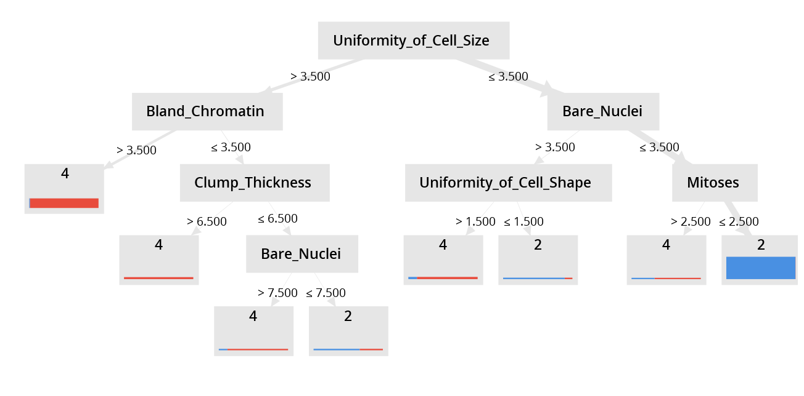

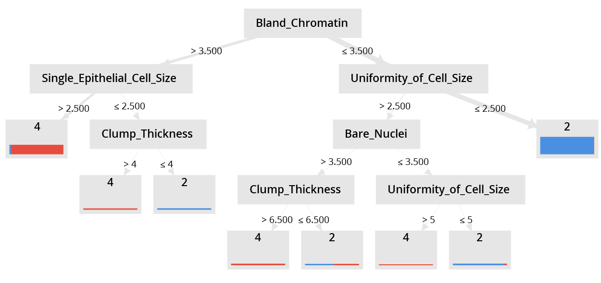

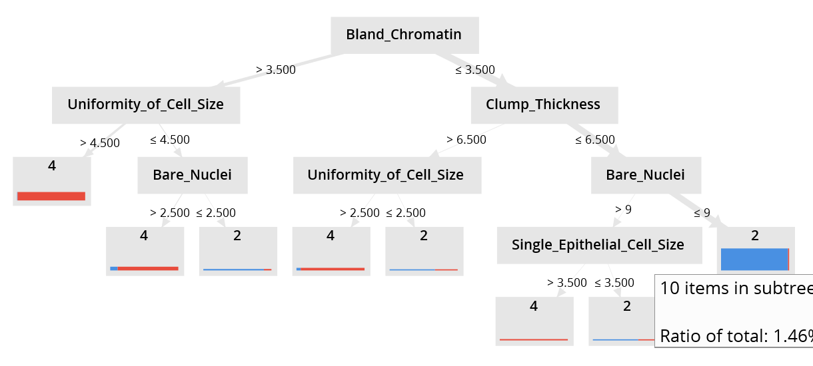

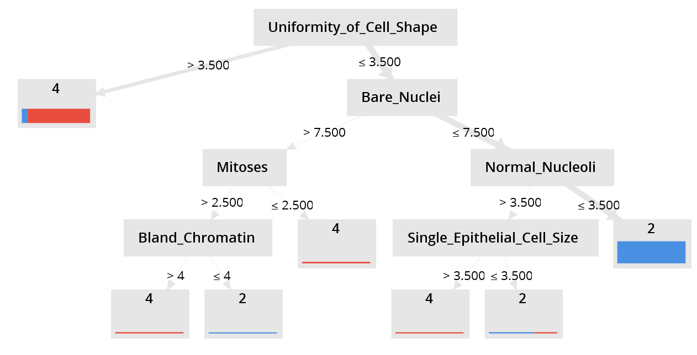

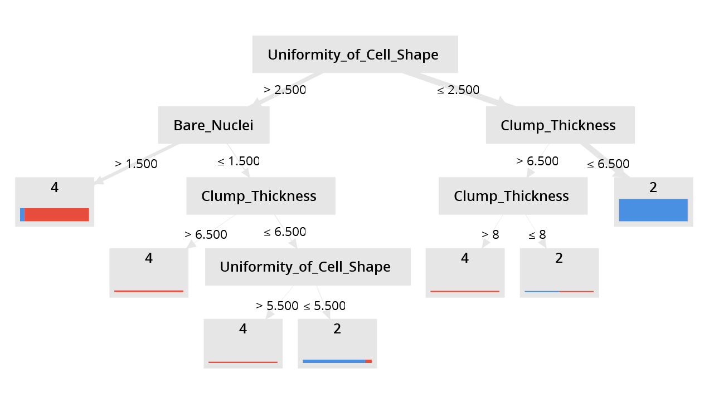

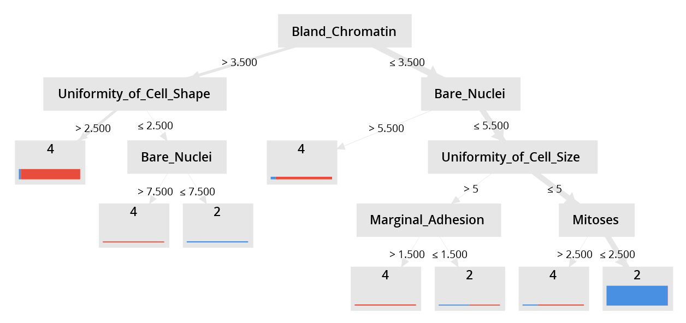

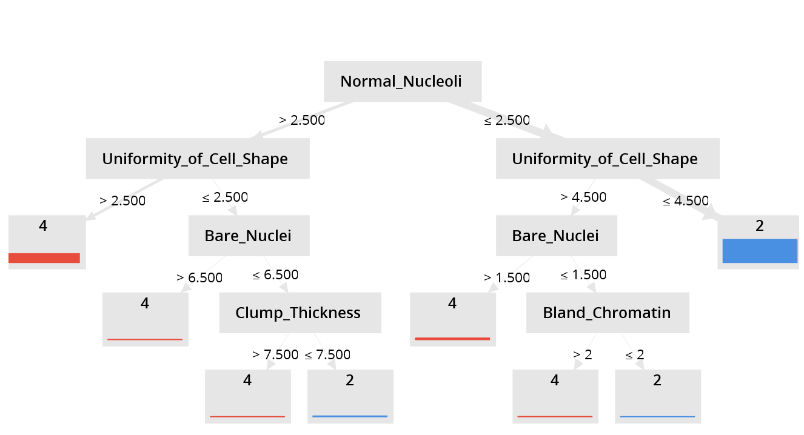

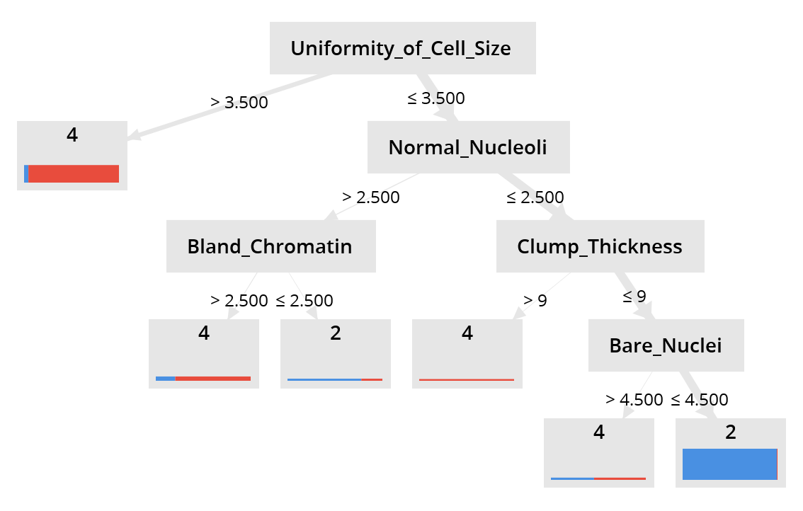

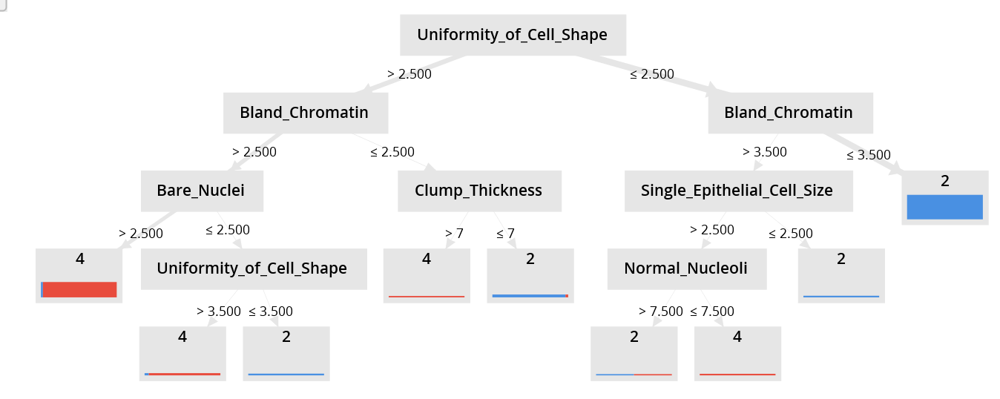

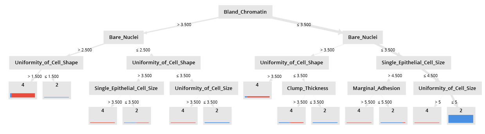

Podemos ver que **Uniformity of Cell Size** es predominante como raiz, que este atributo se encuentre frecuentemente como raiz tiene sentido. Si recordamos la seccion de [Attributes](./) la forma de las celulas cancerigenas suelen ser bastante irregulares.