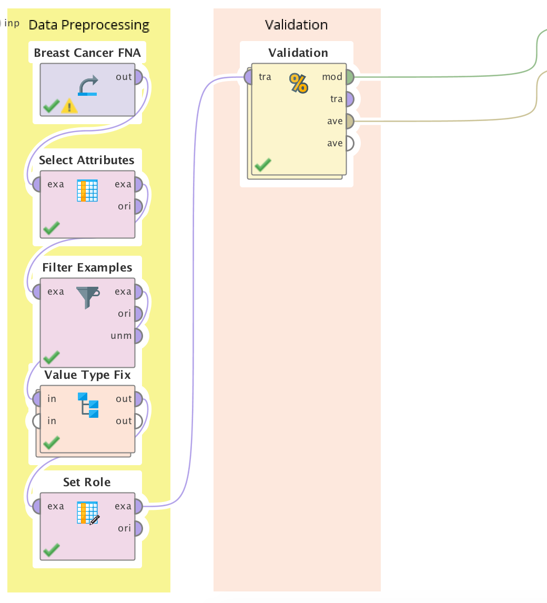
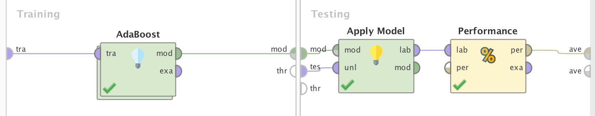
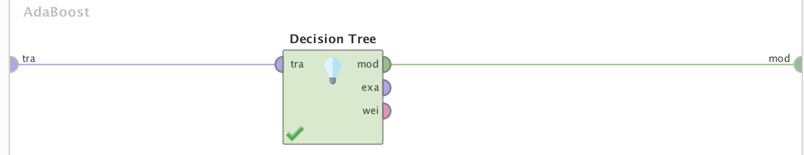
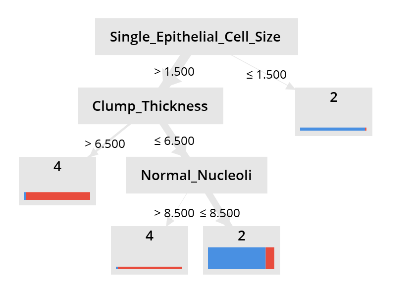
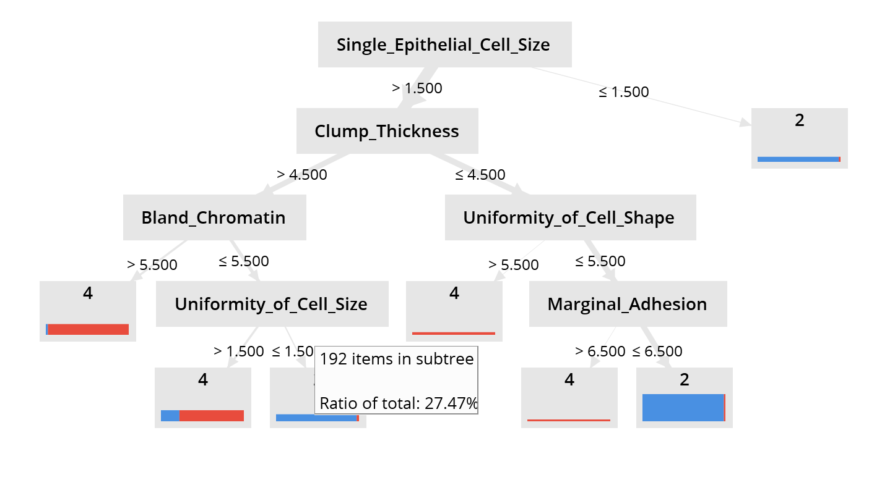
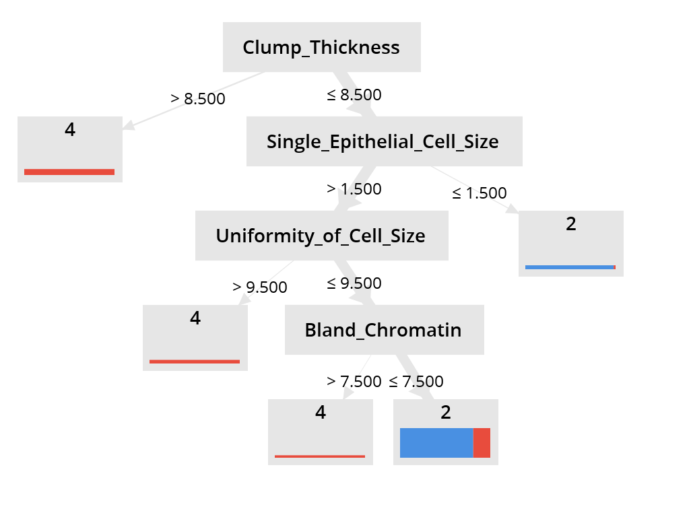
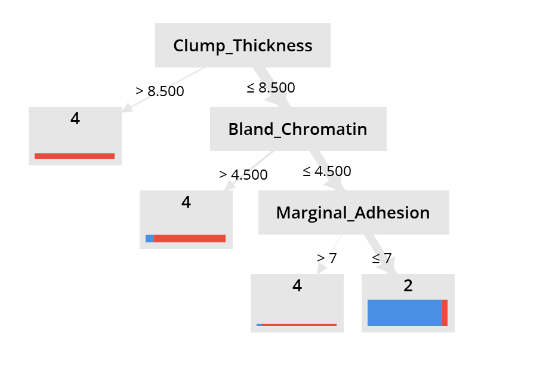
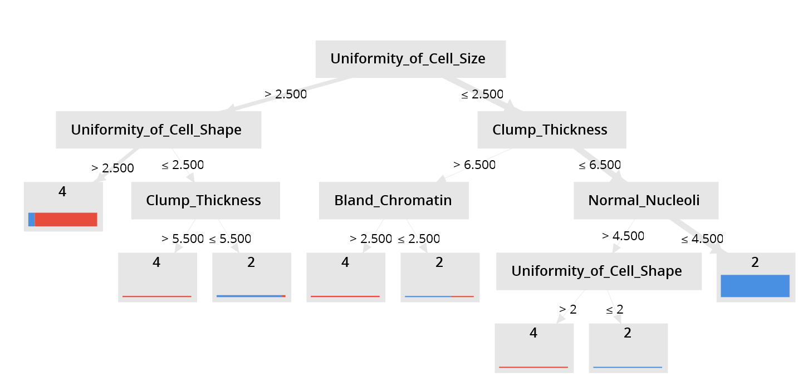

# AdaBoost

### Proceso en RapidMiner

__Seed = 2018__

1- Agregamos el dataset en un proceso nuevo con el modulo `Retrive`.

2- Eliminamos los atributos inecesarios con un modulo de `Select Attributes`, en este caso vamos a eliminar la id.

3- Como vimos en [Missing Values](./), este dataset contiene valores faltantes en el atributo **Bare Nuclei**. Vamos a removerlos con el modulo `Filter Examples`.

4- Actualmente nuestras variables de salida son 2 y 4, vamos a utilizar el modulo `Numerical to Polynominal` sobre la variable **Class** para convertirla en un atributo polinomial.

5- Los valores del atributo **Bare Nuclei** estan siendo considerados como _polynomial_ vamos a utilizar el modulo de `Parse Numbers` para convertirlo en numeros.

El paso 4 y 5 los englobamos en un `Subprocess`.

6- Indicamos que el atributo **Class** va a ser nuestra _label_ a predecir con el modulo `Set Role`.

7- Para evaluar que tan buneo es nuestro modelo vamos a utilizar el modulo  de `Validation`, vamos a dejarlo con un split de 0.7 y sampling _stratified smpling_.

* Dentro del validation:
  
  7.1- En el lado izquierdo _(training)_ agregamos el modulo `AdaBoost`.
  * 7.1.1 Dentro agregamos un modulo `Decision Tree`.

  7.2- En el lado derecho _(testing)_ agregamos el modulo de `Apply model` conectado a `Performance (Classification)`.

### Process

### Validation

## Experimentos

AdaBoost cuenta solo con un hiperparametro, el numero de iteraciones.

El Decision Tree cuenta con varios parametros:
* Criterion
* Maximal depth
* Apply pruning
* Apply prepruning
* Minimal Gain
* Minimal Leaf Size
* Minimal Size for Split
* Number of prepruning

| Iteraciones | Criterion | Maximal depth | Apply pruning | Accuracy | 2 Recall | 4 Recall |
|-------------|-----------|---------------| ------------  | -------- | -------- | -------- |
| 5           | Gain Ratio| 10            |   ✔           |  94.74%  | 93.43%   | 97.22%   |
| 10          | Gain Ratio| 10            |   ✔           |  94.74%  | 93.43%   | 97.22%   |
| 15          | Gain Ratio| 10            |   ✔           |  94.74%  | 93.43%   | 97.22%   |
| 20          | Gain Ratio| 10            |   ✔           |  94.74%  | 93.43%   | 97.22%   |
| 5           | Gain Ratio| 5             |   ✔           |  92.82%  | 92.70%   | 93.06%   |
| 10          | Gain Ratio| 5             |   ✔           |  92.82%  | 92.70%   | 93.06%   |
| 15          | Gain Ratio| 5             |   ✔           |  92.82%  | 92.70%   | 93.06%   |
| 20          | Gain Ratio| 5             |   ✔           |  92.82%  | 92.70%   | 93.06%   |
| 5           | Gain Ratio| 5             |   ✘           |  92.82%  | 92.70%   | 93.06%   |
| 10          | Gain Ratio| 5             |   ✘           |  92.82%  | 92.70%   | 93.06%   |
| 15          | Gain Ratio| 5             |   ✘           |  92.82%  | 92.70%   | 93.06%   |
| 20          | Gain Ratio| 5             |   ✘           |  92.82%  | 92.70%   | 93.06%   |
| **5**           | **Gini Index**| **5**             |   **✔**           |  **95.69%**  | **93.43%**   | **100.00%**   |
| 10          | Gini Index| 5             |   ✔           |  95.69%  | 93.43%   | 100.00%   |
| 15          | Gini Index| 5             |   ✔           |  95.69%  | 93.43%   | 100.00%   |
| 20          | Gini Index| 5             |   ✔           |  95.69%  | 93.43%   | 100.00%   |

Podemos ver que la variacion con el numero de iteracione en AdaBoost y prepruning surgen efectos. A continuacion los trees generados por AdaBoost, puede verse que son mas simples que los generados por [Random Forest](./)

