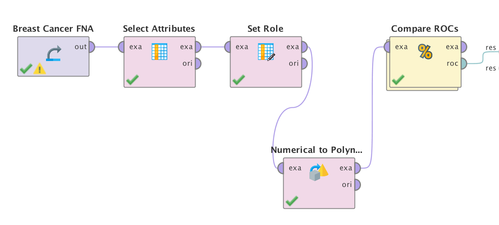
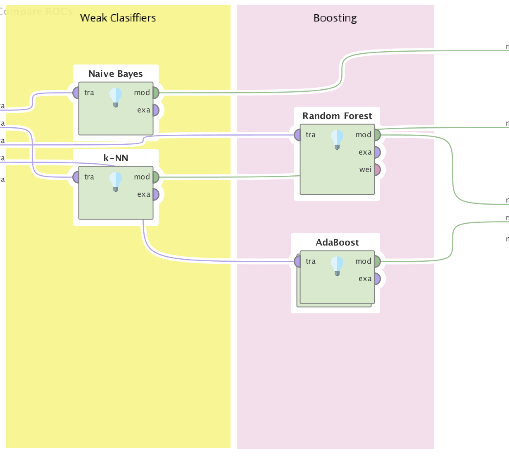
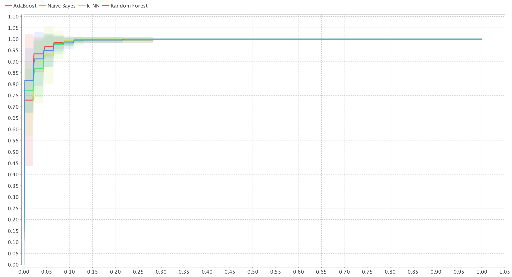

# ROC Comparison

### Proceso en RapidMiner

__Seed = 2018__

1- Agregamos el dataset en un proceso nuevo con el modulo `Retrive`.

2- Eliminamos los atributos inecesarios con un modulo de `Select Attributes`, en este caso vamos a eliminar la id y `Bare Nuclei`.

3- Indicamos que el atributo **Class** va a ser nuestra _label_ a predecir con el modulo `Set Role`.

4- Nuestras variables de salida son 2 y 4, vamos a utilizar el modulo `Numerical to Polynominal` sobre la variable **Class**.

5- Agregamos el modulo `Compare ROCs`
* 5.1- Agregamos un clasificador de `Naive Bayes`
* 5.2- Agregamos un clasificador de `k-NN`
* 5.3- Agregamos un clasificador de `Random Forest`
* 5.4- Agregamos un clasificador de `AdaBoost`
    * 5.4.- Agregamos clasificador de `Tree`

Podemos ver que `k-NN` y `Naive Bayes` performan peor que `Random Forest` y `AdaBoost`, como era de esperarse.