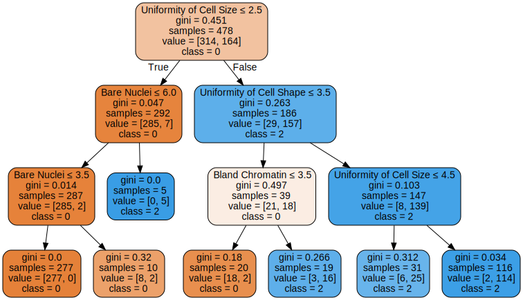

# CART

Importamos las librerias basicas y `tree` de sklearn junto con `graphviz` para la visualización de los resultados.


```python
import pandas as pd
import numpy as np
import matplotlib.pyplot as plt
import matplotlib
from sklearn.cross_validation import train_test_split
from sklearn import tree
import graphviz
```


```python
data = pd.read_csv('breast_cancer.csv')
```


```python
data.head()
```


<div>
<style scoped>
    .dataframe tbody tr th:only-of-type {
        vertical-align: middle;
    }

    .dataframe tbody tr th {
        vertical-align: top;
    }

    .dataframe thead th {
        text-align: right;
    }
</style>
<table border="1" class="dataframe">
  <thead>
    <tr style="text-align: right;">
      <th></th>
      <th>Sample code number</th>
      <th>Clump Thickness</th>
      <th>Uniformity of Cell Size</th>
      <th>Uniformity of Cell Shape</th>
      <th>Marginal Adhesion</th>
      <th>Single Epithelial Cell Size</th>
      <th>Bare Nuclei</th>
      <th>Bland Chromatin</th>
      <th>Normal Nucleoli</th>
      <th>Mitoses</th>
      <th>Class</th>
    </tr>
  </thead>
  <tbody>
    <tr>
      <th>0</th>
      <td>1000025</td>
      <td>5</td>
      <td>1</td>
      <td>1</td>
      <td>1</td>
      <td>2</td>
      <td>1</td>
      <td>3</td>
      <td>1</td>
      <td>1</td>
      <td>2</td>
    </tr>
    <tr>
      <th>1</th>
      <td>1002945</td>
      <td>5</td>
      <td>4</td>
      <td>4</td>
      <td>5</td>
      <td>7</td>
      <td>10</td>
      <td>3</td>
      <td>2</td>
      <td>1</td>
      <td>2</td>
    </tr>
    <tr>
      <th>2</th>
      <td>1015425</td>
      <td>3</td>
      <td>1</td>
      <td>1</td>
      <td>1</td>
      <td>2</td>
      <td>2</td>
      <td>3</td>
      <td>1</td>
      <td>1</td>
      <td>2</td>
    </tr>
    <tr>
      <th>3</th>
      <td>1016277</td>
      <td>6</td>
      <td>8</td>
      <td>8</td>
      <td>1</td>
      <td>3</td>
      <td>4</td>
      <td>3</td>
      <td>7</td>
      <td>1</td>
      <td>2</td>
    </tr>
    <tr>
      <th>4</th>
      <td>1017023</td>
      <td>4</td>
      <td>1</td>
      <td>1</td>
      <td>3</td>
      <td>2</td>
      <td>1</td>
      <td>3</td>
      <td>1</td>
      <td>1</td>
      <td>2</td>
    </tr>
  </tbody>
</table>
</div>


Primero tenemos que eliminar los missing values que encontramos en las secciones anteriores y eliminar la columna de id.


```python
data = data.replace('?', np.nan)
```


```python
data = data.dropna(axis=0)
```


```python
data = data.drop('Sample code number', axis=1)
```


```python
data.head()
```


<div>
<style scoped>
    .dataframe tbody tr th:only-of-type {
        vertical-align: middle;
    }

    .dataframe tbody tr th {
        vertical-align: top;
    }

    .dataframe thead th {
        text-align: right;
    }
</style>
<table border="1" class="dataframe">
  <thead>
    <tr style="text-align: right;">
      <th></th>
      <th>Clump Thickness</th>
      <th>Uniformity of Cell Size</th>
      <th>Uniformity of Cell Shape</th>
      <th>Marginal Adhesion</th>
      <th>Single Epithelial Cell Size</th>
      <th>Bare Nuclei</th>
      <th>Bland Chromatin</th>
      <th>Normal Nucleoli</th>
      <th>Mitoses</th>
      <th>Class</th>
    </tr>
  </thead>
  <tbody>
    <tr>
      <th>0</th>
      <td>5</td>
      <td>1</td>
      <td>1</td>
      <td>1</td>
      <td>2</td>
      <td>1</td>
      <td>3</td>
      <td>1</td>
      <td>1</td>
      <td>2</td>
    </tr>
    <tr>
      <th>1</th>
      <td>5</td>
      <td>4</td>
      <td>4</td>
      <td>5</td>
      <td>7</td>
      <td>10</td>
      <td>3</td>
      <td>2</td>
      <td>1</td>
      <td>2</td>
    </tr>
    <tr>
      <th>2</th>
      <td>3</td>
      <td>1</td>
      <td>1</td>
      <td>1</td>
      <td>2</td>
      <td>2</td>
      <td>3</td>
      <td>1</td>
      <td>1</td>
      <td>2</td>
    </tr>
    <tr>
      <th>3</th>
      <td>6</td>
      <td>8</td>
      <td>8</td>
      <td>1</td>
      <td>3</td>
      <td>4</td>
      <td>3</td>
      <td>7</td>
      <td>1</td>
      <td>2</td>
    </tr>
    <tr>
      <th>4</th>
      <td>4</td>
      <td>1</td>
      <td>1</td>
      <td>3</td>
      <td>2</td>
      <td>1</td>
      <td>3</td>
      <td>1</td>
      <td>1</td>
      <td>2</td>
    </tr>
  </tbody>
</table>
</div>


```python
data[' Bare Nuclei'].mean()
```


    inf


Podemos ver que los datos fueron eliminados pero los valores numericos restantes estan como string.


```python
data[' Bare Nuclei'] = data[' Bare Nuclei'].apply(lambda x: int(x))
```


```python
data[' Bare Nuclei'].mean()
```


    3.5446559297218156


Una vez solucionado esto separamos la variable dependiente de las independientes.


```python
data_target = pd.DataFrame(data[' Class'])
data = data.drop(' Class', axis=1)
```


```python
data_target.head(2)
```


<div>
<style scoped>
    .dataframe tbody tr th:only-of-type {
        vertical-align: middle;
    }

    .dataframe tbody tr th {
        vertical-align: top;
    }

    .dataframe thead th {
        text-align: right;
    }
</style>
<table border="1" class="dataframe">
  <thead>
    <tr style="text-align: right;">
      <th></th>
      <th>Class</th>
    </tr>
  </thead>
  <tbody>
    <tr>
      <th>0</th>
      <td>2</td>
    </tr>
    <tr>
      <th>1</th>
      <td>2</td>
    </tr>
  </tbody>
</table>
</div>


```python
data.head(2)
```


<div>
<style scoped>
    .dataframe tbody tr th:only-of-type {
        vertical-align: middle;
    }

    .dataframe tbody tr th {
        vertical-align: top;
    }

    .dataframe thead th {
        text-align: right;
    }
</style>
<table border="1" class="dataframe">
  <thead>
    <tr style="text-align: right;">
      <th></th>
      <th>Clump Thickness</th>
      <th>Uniformity of Cell Size</th>
      <th>Uniformity of Cell Shape</th>
      <th>Marginal Adhesion</th>
      <th>Single Epithelial Cell Size</th>
      <th>Bare Nuclei</th>
      <th>Bland Chromatin</th>
      <th>Normal Nucleoli</th>
      <th>Mitoses</th>
    </tr>
  </thead>
  <tbody>
    <tr>
      <th>0</th>
      <td>5</td>
      <td>1</td>
      <td>1</td>
      <td>1</td>
      <td>2</td>
      <td>1</td>
      <td>3</td>
      <td>1</td>
      <td>1</td>
    </tr>
    <tr>
      <th>1</th>
      <td>5</td>
      <td>4</td>
      <td>4</td>
      <td>5</td>
      <td>7</td>
      <td>10</td>
      <td>3</td>
      <td>2</td>
      <td>1</td>
    </tr>
  </tbody>
</table>
</div>


Separamos nuestros datos en `entrenamiento` y `test`


```python
X_train, X_test, y_train, y_test = train_test_split(data, data_target,
                                                    test_size=0.3,
                                                    random_state=0)
```

Creamos un modelo de arbol de decisión y lo entrenamos


```python
clf = tree.DecisionTreeClassifier()
clf = clf.fit(X_train, y_train)
```

Ahora con la libreria `graphviz` podemos generar un grafico del árbol.


```python
# Codigo para Windows en caso de no tener graphviz en el PATH
import os
os.environ["PATH"] += os.pathsep + 'C:/Program Files (x86)/Graphviz2.38/bin/'
```


```python
dot_data = tree.export_graphviz(clf, out_file=None, 
                         feature_names=['Clump Thickness', 'Uniformity of Cell Size',
                                        'Uniformity of Cell Shape', 'Marginal Adhesion',
                                        'Single Epithelial Cell Size', 'Bare Nuclei', 'Bland Chromatin',
                                        'Normal Nucleoli', 'Mitoses'],  
                         class_names=['0','2'],  
                         filled=True, rounded=True,  
                         special_characters=True)  
graph = graphviz.Source(dot_data)  
graph 
```


Podemos ver que el árbol generado es muy complejo, aun asi vamos a evaluar su `accuracy`


```python
prediction = clf.predict(X_test)
columns = ['Predicted Value', 'Actual Value']
results = pd.DataFrame()
results['Predicted Value'] = prediction
results['Actual Value']    = y_test.values
```


```python
results.head()
```


<div>
<style scoped>
    .dataframe tbody tr th:only-of-type {
        vertical-align: middle;
    }

    .dataframe tbody tr th {
        vertical-align: top;
    }

    .dataframe thead th {
        text-align: right;
    }
</style>
<table border="1" class="dataframe">
  <thead>
    <tr style="text-align: right;">
      <th></th>
      <th>Predicted Value</th>
      <th>Actual Value</th>
    </tr>
  </thead>
  <tbody>
    <tr>
      <th>0</th>
      <td>2</td>
      <td>2</td>
    </tr>
    <tr>
      <th>1</th>
      <td>2</td>
      <td>2</td>
    </tr>
    <tr>
      <th>2</th>
      <td>4</td>
      <td>4</td>
    </tr>
    <tr>
      <th>3</th>
      <td>4</td>
      <td>4</td>
    </tr>
    <tr>
      <th>4</th>
      <td>2</td>
      <td>2</td>
    </tr>
  </tbody>
</table>
</div>


```python
wrong_predictions = results[results['Predicted Value'] != results['Actual Value']]
accuracy = (len(results)-len(wrong_predictions))/len(results)
accuracy
```


    0.9365853658536586


Intentemos modificar los hiperparametros para intentar encontrar un modelo mas simple. Para esto vamos a darle una profundidad maxima de 3.


```python
simple_clf = tree.DecisionTreeClassifier(max_depth=3)
simple_clf = simple_clf.fit(X_train, y_train)
```


```python
dot_data = tree.export_graphviz(simple_clf, out_file=None, 
                         feature_names=['Clump Thickness', 'Uniformity of Cell Size',
                                        'Uniformity of Cell Shape', 'Marginal Adhesion',
                                        'Single Epithelial Cell Size', 'Bare Nuclei', 'Bland Chromatin',
                                        'Normal Nucleoli', 'Mitoses'],  
                         class_names=['0','2'],  
                         filled=True, rounded=True,  
                         special_characters=True)  
graph = graphviz.Source(dot_data)  
graph 
```





Rapidamente podemos notar que este árbol es mucho mas simple, ahora evaluaremos su `accuracy`.


```python
prediction = simple_clf.predict(X_test)
columns = ['Predicted Value', 'Actual Value']
results = pd.DataFrame()
results['Predicted Value'] = prediction
results['Actual Value']    = y_test.values
```


```python
wrong_predictions = results[results['Predicted Value'] != results['Actual Value']]
simple_accuracy = (len(results)-len(wrong_predictions))/len(results)
simple_accuracy
```


    0.9365853658536586


```python
#Diferencia entre los clasificadores
simple_accuracy - accuracy
```


    0.0


Podemos ver que tenemos exactamente los mismos resultados con un árbol mucho mas simple.

Ahora intentemos reducir la profundidad maxima a 2 y comparemos los resultados.


```python
super_simple_clf = tree.DecisionTreeClassifier(max_depth=2)
super_simple_clf = super_simple_clf.fit(X_train, y_train)
```


```python
dot_data = tree.export_graphviz(super_simple_clf, out_file=None, 
                         feature_names=['Clump Thickness', 'Uniformity of Cell Size',
                                        'Uniformity of Cell Shape', 'Marginal Adhesion',
                                        'Single Epithelial Cell Size', 'Bare Nuclei', 'Bland Chromatin',
                                        'Normal Nucleoli', 'Mitoses'],  
                         class_names=['0','2'],  
                         filled=True, rounded=True,  
                         special_characters=True)  
graph = graphviz.Source(dot_data)  
graph 
```


Este árbol es mucho mas simple, ahora evaluaremos su `accuracy`.


```python
prediction = super_simple_clf.predict(X_test)
columns = ['Predicted Value', 'Actual Value']
results = pd.DataFrame()
results['Predicted Value'] = prediction
results['Actual Value']    = y_test.values
```


```python
wrong_predictions = results[results['Predicted Value'] != results['Actual Value']]
super_simple_accuracy = (len(results)-len(wrong_predictions))/len(results)
super_simple_accuracy
```


    0.926829268292683


```python
#Diferencia entre los clasificadores
super_simple_accuracy - accuracy
```


    -0.009756097560975618


Podemos ver que empeora en un `0.00975`. Pero al ser un árbol tan simple es preferible quedarnos con este. También podemos notar que `Uniformity of Cell Size`, `Uniformity of Cell Shape` y `Bare Nuclei` son de los atributos mas importantes para la clasifiación ya que se encuentran en la parte superior de todos los árboles.


[Logistic Regression ➡](./8_logistic_regression_code.md)
