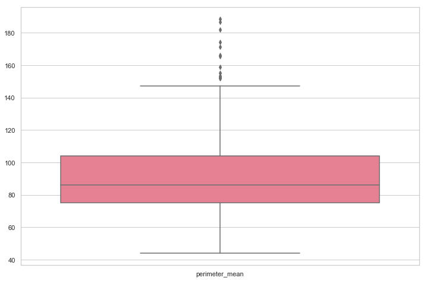
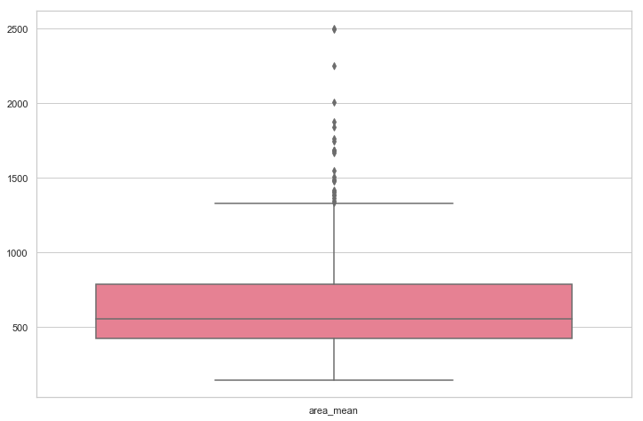
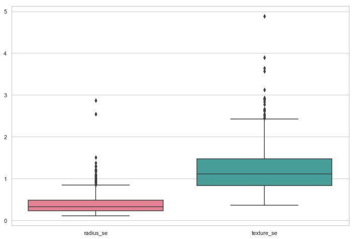
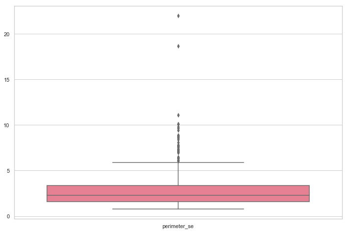
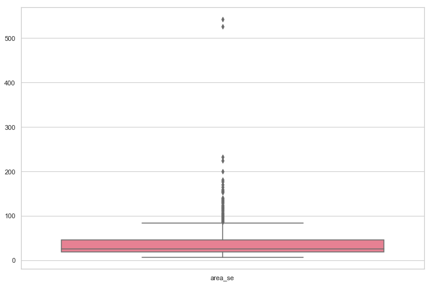
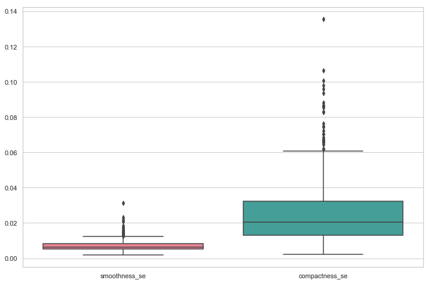
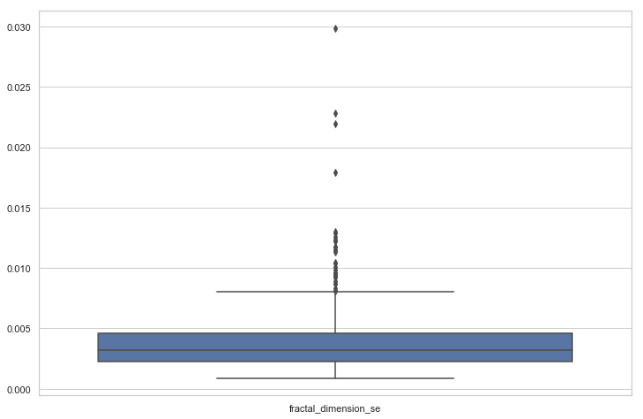
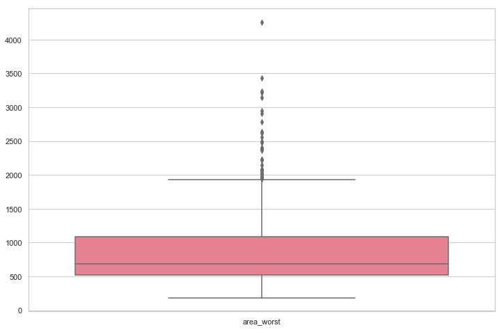

# Outliers

Importamos librerias basicas.


```python
import pandas as pd
import missingno as msn
import matplotlib.pyplot as plt
import seaborn as sns
sns.set_style("whitegrid")
import matplotlib
matplotlib.rcParams['figure.figsize'] = [10, 6]
```

Cargamos el archivo y vemos que contiene


```python
data = pd.read_csv('breast-cancer.csv')
```


```python
data.head()
```


<div>
<style scoped>
    .dataframe tbody tr th:only-of-type {
        vertical-align: middle;
    }

    .dataframe tbody tr th {
        vertical-align: top;
    }

    .dataframe thead th {
        text-align: right;
    }
</style>
<table border="1" class="dataframe">
  <thead>
    <tr style="text-align: right;">
      <th></th>
      <th>id</th>
      <th>diagnosis</th>
      <th>radius_mean</th>
      <th>texture_mean</th>
      <th>perimeter_mean</th>
      <th>area_mean</th>
      <th>smoothness_mean</th>
      <th>compactness_mean</th>
      <th>concavity_mean</th>
      <th>concave points_mean</th>
      <th>...</th>
      <th>texture_worst</th>
      <th>perimeter_worst</th>
      <th>area_worst</th>
      <th>smoothness_worst</th>
      <th>compactness_worst</th>
      <th>concavity_worst</th>
      <th>concave points_worst</th>
      <th>symmetry_worst</th>
      <th>fractal_dimension_worst</th>
      <th>Unnamed: 32</th>
    </tr>
  </thead>
  <tbody>
    <tr>
      <th>0</th>
      <td>842302</td>
      <td>M</td>
      <td>17.99</td>
      <td>10.38</td>
      <td>122.80</td>
      <td>1001.0</td>
      <td>0.11840</td>
      <td>0.27760</td>
      <td>0.3001</td>
      <td>0.14710</td>
      <td>...</td>
      <td>17.33</td>
      <td>184.60</td>
      <td>2019.0</td>
      <td>0.1622</td>
      <td>0.6656</td>
      <td>0.7119</td>
      <td>0.2654</td>
      <td>0.4601</td>
      <td>0.11890</td>
      <td>NaN</td>
    </tr>
    <tr>
      <th>1</th>
      <td>842517</td>
      <td>M</td>
      <td>20.57</td>
      <td>17.77</td>
      <td>132.90</td>
      <td>1326.0</td>
      <td>0.08474</td>
      <td>0.07864</td>
      <td>0.0869</td>
      <td>0.07017</td>
      <td>...</td>
      <td>23.41</td>
      <td>158.80</td>
      <td>1956.0</td>
      <td>0.1238</td>
      <td>0.1866</td>
      <td>0.2416</td>
      <td>0.1860</td>
      <td>0.2750</td>
      <td>0.08902</td>
      <td>NaN</td>
    </tr>
    <tr>
      <th>2</th>
      <td>84300903</td>
      <td>M</td>
      <td>19.69</td>
      <td>21.25</td>
      <td>130.00</td>
      <td>1203.0</td>
      <td>0.10960</td>
      <td>0.15990</td>
      <td>0.1974</td>
      <td>0.12790</td>
      <td>...</td>
      <td>25.53</td>
      <td>152.50</td>
      <td>1709.0</td>
      <td>0.1444</td>
      <td>0.4245</td>
      <td>0.4504</td>
      <td>0.2430</td>
      <td>0.3613</td>
      <td>0.08758</td>
      <td>NaN</td>
    </tr>
    <tr>
      <th>3</th>
      <td>84348301</td>
      <td>M</td>
      <td>11.42</td>
      <td>20.38</td>
      <td>77.58</td>
      <td>386.1</td>
      <td>0.14250</td>
      <td>0.28390</td>
      <td>0.2414</td>
      <td>0.10520</td>
      <td>...</td>
      <td>26.50</td>
      <td>98.87</td>
      <td>567.7</td>
      <td>0.2098</td>
      <td>0.8663</td>
      <td>0.6869</td>
      <td>0.2575</td>
      <td>0.6638</td>
      <td>0.17300</td>
      <td>NaN</td>
    </tr>
    <tr>
      <th>4</th>
      <td>84358402</td>
      <td>M</td>
      <td>20.29</td>
      <td>14.34</td>
      <td>135.10</td>
      <td>1297.0</td>
      <td>0.10030</td>
      <td>0.13280</td>
      <td>0.1980</td>
      <td>0.10430</td>
      <td>...</td>
      <td>16.67</td>
      <td>152.20</td>
      <td>1575.0</td>
      <td>0.1374</td>
      <td>0.2050</td>
      <td>0.4000</td>
      <td>0.1625</td>
      <td>0.2364</td>
      <td>0.07678</td>
      <td>NaN</td>
    </tr>
  </tbody>
</table>
<p>5 rows × 33 columns</p>
</div>


Eliminamos los missing values


```python
data = data.drop(['Unnamed: 32', 'id'], 1)
data.head()
```


<div>
<style scoped>
    .dataframe tbody tr th:only-of-type {
        vertical-align: middle;
    }

    .dataframe tbody tr th {
        vertical-align: top;
    }

    .dataframe thead th {
        text-align: right;
    }
</style>
<table border="1" class="dataframe">
  <thead>
    <tr style="text-align: right;">
      <th></th>
      <th>diagnosis</th>
      <th>radius_mean</th>
      <th>texture_mean</th>
      <th>perimeter_mean</th>
      <th>area_mean</th>
      <th>smoothness_mean</th>
      <th>compactness_mean</th>
      <th>concavity_mean</th>
      <th>concave points_mean</th>
      <th>symmetry_mean</th>
      <th>...</th>
      <th>radius_worst</th>
      <th>texture_worst</th>
      <th>perimeter_worst</th>
      <th>area_worst</th>
      <th>smoothness_worst</th>
      <th>compactness_worst</th>
      <th>concavity_worst</th>
      <th>concave points_worst</th>
      <th>symmetry_worst</th>
      <th>fractal_dimension_worst</th>
    </tr>
  </thead>
  <tbody>
    <tr>
      <th>0</th>
      <td>M</td>
      <td>17.99</td>
      <td>10.38</td>
      <td>122.80</td>
      <td>1001.0</td>
      <td>0.11840</td>
      <td>0.27760</td>
      <td>0.3001</td>
      <td>0.14710</td>
      <td>0.2419</td>
      <td>...</td>
      <td>25.38</td>
      <td>17.33</td>
      <td>184.60</td>
      <td>2019.0</td>
      <td>0.1622</td>
      <td>0.6656</td>
      <td>0.7119</td>
      <td>0.2654</td>
      <td>0.4601</td>
      <td>0.11890</td>
    </tr>
    <tr>
      <th>1</th>
      <td>M</td>
      <td>20.57</td>
      <td>17.77</td>
      <td>132.90</td>
      <td>1326.0</td>
      <td>0.08474</td>
      <td>0.07864</td>
      <td>0.0869</td>
      <td>0.07017</td>
      <td>0.1812</td>
      <td>...</td>
      <td>24.99</td>
      <td>23.41</td>
      <td>158.80</td>
      <td>1956.0</td>
      <td>0.1238</td>
      <td>0.1866</td>
      <td>0.2416</td>
      <td>0.1860</td>
      <td>0.2750</td>
      <td>0.08902</td>
    </tr>
    <tr>
      <th>2</th>
      <td>M</td>
      <td>19.69</td>
      <td>21.25</td>
      <td>130.00</td>
      <td>1203.0</td>
      <td>0.10960</td>
      <td>0.15990</td>
      <td>0.1974</td>
      <td>0.12790</td>
      <td>0.2069</td>
      <td>...</td>
      <td>23.57</td>
      <td>25.53</td>
      <td>152.50</td>
      <td>1709.0</td>
      <td>0.1444</td>
      <td>0.4245</td>
      <td>0.4504</td>
      <td>0.2430</td>
      <td>0.3613</td>
      <td>0.08758</td>
    </tr>
    <tr>
      <th>3</th>
      <td>M</td>
      <td>11.42</td>
      <td>20.38</td>
      <td>77.58</td>
      <td>386.1</td>
      <td>0.14250</td>
      <td>0.28390</td>
      <td>0.2414</td>
      <td>0.10520</td>
      <td>0.2597</td>
      <td>...</td>
      <td>14.91</td>
      <td>26.50</td>
      <td>98.87</td>
      <td>567.7</td>
      <td>0.2098</td>
      <td>0.8663</td>
      <td>0.6869</td>
      <td>0.2575</td>
      <td>0.6638</td>
      <td>0.17300</td>
    </tr>
    <tr>
      <th>4</th>
      <td>M</td>
      <td>20.29</td>
      <td>14.34</td>
      <td>135.10</td>
      <td>1297.0</td>
      <td>0.10030</td>
      <td>0.13280</td>
      <td>0.1980</td>
      <td>0.10430</td>
      <td>0.1809</td>
      <td>...</td>
      <td>22.54</td>
      <td>16.67</td>
      <td>152.20</td>
      <td>1575.0</td>
      <td>0.1374</td>
      <td>0.2050</td>
      <td>0.4000</td>
      <td>0.1625</td>
      <td>0.2364</td>
      <td>0.07678</td>
    </tr>
  </tbody>
</table>
<p>5 rows × 31 columns</p>
</div>


Si recordamos de nuestro analisis de atributos pudimos ver algunas distribuciones con posibles outliers


```python
data.mean()
```


    radius_mean                 14.127292
    texture_mean                19.289649
    perimeter_mean              91.969033
    area_mean                  654.889104
    smoothness_mean              0.096360
    compactness_mean             0.104341
    concavity_mean               0.088799
    concave points_mean          0.048919
    symmetry_mean                0.181162
    fractal_dimension_mean       0.062798
    radius_se                    0.405172
    texture_se                   1.216853
    perimeter_se                 2.866059
    area_se                     40.337079
    smoothness_se                0.007041
    compactness_se               0.025478
    concavity_se                 0.031894
    concave points_se            0.011796
    symmetry_se                  0.020542
    fractal_dimension_se         0.003795
    radius_worst                16.269190
    texture_worst               25.677223
    perimeter_worst            107.261213
    area_worst                 880.583128
    smoothness_worst             0.132369
    compactness_worst            0.254265
    concavity_worst              0.272188
    concave points_worst         0.114606
    symmetry_worst               0.290076
    fractal_dimension_worst      0.083946
    dtype: float64


```python
fig, ax = plt.subplots(figsize=(12,8))
sns.boxplot(ax=ax, data=data.iloc[:, : 3], palette='husl')
```


```python
fig, ax = plt.subplots(figsize=(12,8))
sns.boxplot(ax=ax, data=data.iloc[:, 3: 4], palette='husl')
```





```python
fig, ax = plt.subplots(figsize=(12,8))
sns.boxplot(ax=ax, data=data.iloc[:, 4: 5], palette='husl')
```





```python
fig, ax = plt.subplots(figsize=(12,8))
sns.boxplot(ax=ax, data=data.iloc[:, 5: 11], palette='husl')
```


```python
fig, ax = plt.subplots(figsize=(12,8))
sns.boxplot(ax=ax, data=data.iloc[:, 11: 13], palette='husl')
```





```python
fig, ax = plt.subplots(figsize=(12,8))
sns.boxplot(ax=ax, data=data.iloc[:, 13:14], palette='husl')
```





```python
fig, ax = plt.subplots(figsize=(12,8))
sns.boxplot(ax=ax, data=data.iloc[:, 14:15], palette='husl')
```





```python
fig, ax = plt.subplots(figsize=(12,8))
sns.boxplot(ax=ax, data=data.iloc[:, 15:17], palette='husl')
```





```python
fig, ax = plt.subplots(figsize=(12,8))
sns.boxplot(ax=ax, data=data.iloc[:, 17:20], palette='husl')
```


```python
fig, ax = plt.subplots(figsize=(12,8))
sns.boxplot(ax=ax, data=data.iloc[:, 20:21])
```





```python
fig, ax = plt.subplots(figsize=(12,8))
sns.boxplot(ax=ax, data=data.iloc[:, 21:24], palette='husl')
```


```python
fig, ax = plt.subplots(figsize=(12,8))
sns.boxplot(ax=ax, data=data.iloc[:, 24:25], palette='husl')
```





```python
fig, ax = plt.subplots(figsize=(12,8))
sns.boxplot(ax=ax, data=data.iloc[:, 25:], palette='husl')
```


Podemos ver outliers en casi todos los atributos.
Vamos a quedarnos con los datos que esten como maximo a tres desviaciones estandar de la media.


```python
l = len(data)
for column in data.columns[1:]:
    data = data[np.abs(data[column]-data[column].mean()) <= (3*data[column].std())]
print('Filas eliminadas: {0}'.format(l-len(data)))
```

    Filas eliminadas: 142

