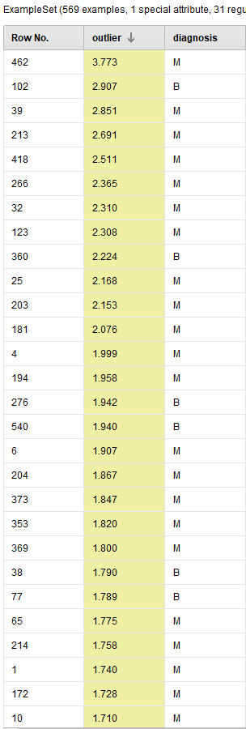

# Outliers

### Radius_mean


Para detectar outliers vamos a utilizar el bloque `Detect Outliers (LOF)` que nos da la los valores atípicos de LOF o valores atípicos con un factor de valor atípico local por objeto, que son valores atípicos basados ​​en la densidad según Breunig y Kriegel. Como lo indica el nombre, el factor de valor atípico local se basa en un concepto de densidad local, donde k son los vecinos más cercanos, cuya distancia se usa para estimar la densidad. Sobre esta distancia podemos ver lo siguiente:




Podemos ver que los mas distantes se encuentran en valores superiores a `1.5` luego toman valores entre 1 y 1.5 por lo cual utilizaremos el bloque `Generate attributes` para separar los outliers con la condición:

```python
Outlier -> if(outlier>1.5, True, False)
```

Y eso nos genera la siguiente columna.


Ahora solo nos resta filtrar los outliers con el operador `Filter Examples`.


Podemos ver que en el dataset nos restan los con una distancia menor a `1.5`.


[Correlation ➡](./6_correlation_rapidminer)