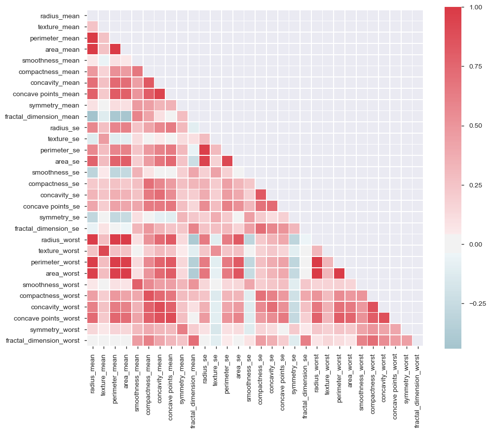

# Correlation

Importamos librerias basicas.


```python
import pandas as pd
import missingno as msn
import matplotlib.pyplot as plt
import seaborn as sns
sns.set_style("whitegrid")
import matplotlib
matplotlib.rcParams['figure.figsize'] = [10, 6]
```

Cargamos el archivo y vemos que contiene


```python
data = pd.read_csv('breast-cancer.csv')
```


```python
data.head()
```


<div>
<style scoped>
    .dataframe tbody tr th:only-of-type {
        vertical-align: middle;
    }

    .dataframe tbody tr th {
        vertical-align: top;
    }

    .dataframe thead th {
        text-align: right;
    }
</style>
<table border="1" class="dataframe">
  <thead>
    <tr style="text-align: right;">
      <th></th>
      <th>id</th>
      <th>diagnosis</th>
      <th>radius_mean</th>
      <th>texture_mean</th>
      <th>perimeter_mean</th>
      <th>area_mean</th>
      <th>smoothness_mean</th>
      <th>compactness_mean</th>
      <th>concavity_mean</th>
      <th>concave points_mean</th>
      <th>...</th>
      <th>texture_worst</th>
      <th>perimeter_worst</th>
      <th>area_worst</th>
      <th>smoothness_worst</th>
      <th>compactness_worst</th>
      <th>concavity_worst</th>
      <th>concave points_worst</th>
      <th>symmetry_worst</th>
      <th>fractal_dimension_worst</th>
      <th>Unnamed: 32</th>
    </tr>
  </thead>
  <tbody>
    <tr>
      <th>0</th>
      <td>842302</td>
      <td>M</td>
      <td>17.99</td>
      <td>10.38</td>
      <td>122.80</td>
      <td>1001.0</td>
      <td>0.11840</td>
      <td>0.27760</td>
      <td>0.3001</td>
      <td>0.14710</td>
      <td>...</td>
      <td>17.33</td>
      <td>184.60</td>
      <td>2019.0</td>
      <td>0.1622</td>
      <td>0.6656</td>
      <td>0.7119</td>
      <td>0.2654</td>
      <td>0.4601</td>
      <td>0.11890</td>
      <td>NaN</td>
    </tr>
    <tr>
      <th>1</th>
      <td>842517</td>
      <td>M</td>
      <td>20.57</td>
      <td>17.77</td>
      <td>132.90</td>
      <td>1326.0</td>
      <td>0.08474</td>
      <td>0.07864</td>
      <td>0.0869</td>
      <td>0.07017</td>
      <td>...</td>
      <td>23.41</td>
      <td>158.80</td>
      <td>1956.0</td>
      <td>0.1238</td>
      <td>0.1866</td>
      <td>0.2416</td>
      <td>0.1860</td>
      <td>0.2750</td>
      <td>0.08902</td>
      <td>NaN</td>
    </tr>
    <tr>
      <th>2</th>
      <td>84300903</td>
      <td>M</td>
      <td>19.69</td>
      <td>21.25</td>
      <td>130.00</td>
      <td>1203.0</td>
      <td>0.10960</td>
      <td>0.15990</td>
      <td>0.1974</td>
      <td>0.12790</td>
      <td>...</td>
      <td>25.53</td>
      <td>152.50</td>
      <td>1709.0</td>
      <td>0.1444</td>
      <td>0.4245</td>
      <td>0.4504</td>
      <td>0.2430</td>
      <td>0.3613</td>
      <td>0.08758</td>
      <td>NaN</td>
    </tr>
    <tr>
      <th>3</th>
      <td>84348301</td>
      <td>M</td>
      <td>11.42</td>
      <td>20.38</td>
      <td>77.58</td>
      <td>386.1</td>
      <td>0.14250</td>
      <td>0.28390</td>
      <td>0.2414</td>
      <td>0.10520</td>
      <td>...</td>
      <td>26.50</td>
      <td>98.87</td>
      <td>567.7</td>
      <td>0.2098</td>
      <td>0.8663</td>
      <td>0.6869</td>
      <td>0.2575</td>
      <td>0.6638</td>
      <td>0.17300</td>
      <td>NaN</td>
    </tr>
    <tr>
      <th>4</th>
      <td>84358402</td>
      <td>M</td>
      <td>20.29</td>
      <td>14.34</td>
      <td>135.10</td>
      <td>1297.0</td>
      <td>0.10030</td>
      <td>0.13280</td>
      <td>0.1980</td>
      <td>0.10430</td>
      <td>...</td>
      <td>16.67</td>
      <td>152.20</td>
      <td>1575.0</td>
      <td>0.1374</td>
      <td>0.2050</td>
      <td>0.4000</td>
      <td>0.1625</td>
      <td>0.2364</td>
      <td>0.07678</td>
      <td>NaN</td>
    </tr>
  </tbody>
</table>
<p>5 rows × 33 columns</p>
</div>


Eliminamos los missing values


```python
data = data.drop(['Unnamed: 32', 'id'], 1)
data.head()
```


<div>
<style scoped>
    .dataframe tbody tr th:only-of-type {
        vertical-align: middle;
    }

    .dataframe tbody tr th {
        vertical-align: top;
    }

    .dataframe thead th {
        text-align: right;
    }
</style>
<table border="1" class="dataframe">
  <thead>
    <tr style="text-align: right;">
      <th></th>
      <th>diagnosis</th>
      <th>radius_mean</th>
      <th>texture_mean</th>
      <th>perimeter_mean</th>
      <th>area_mean</th>
      <th>smoothness_mean</th>
      <th>compactness_mean</th>
      <th>concavity_mean</th>
      <th>concave points_mean</th>
      <th>symmetry_mean</th>
      <th>...</th>
      <th>radius_worst</th>
      <th>texture_worst</th>
      <th>perimeter_worst</th>
      <th>area_worst</th>
      <th>smoothness_worst</th>
      <th>compactness_worst</th>
      <th>concavity_worst</th>
      <th>concave points_worst</th>
      <th>symmetry_worst</th>
      <th>fractal_dimension_worst</th>
    </tr>
  </thead>
  <tbody>
    <tr>
      <th>0</th>
      <td>M</td>
      <td>17.99</td>
      <td>10.38</td>
      <td>122.80</td>
      <td>1001.0</td>
      <td>0.11840</td>
      <td>0.27760</td>
      <td>0.3001</td>
      <td>0.14710</td>
      <td>0.2419</td>
      <td>...</td>
      <td>25.38</td>
      <td>17.33</td>
      <td>184.60</td>
      <td>2019.0</td>
      <td>0.1622</td>
      <td>0.6656</td>
      <td>0.7119</td>
      <td>0.2654</td>
      <td>0.4601</td>
      <td>0.11890</td>
    </tr>
    <tr>
      <th>1</th>
      <td>M</td>
      <td>20.57</td>
      <td>17.77</td>
      <td>132.90</td>
      <td>1326.0</td>
      <td>0.08474</td>
      <td>0.07864</td>
      <td>0.0869</td>
      <td>0.07017</td>
      <td>0.1812</td>
      <td>...</td>
      <td>24.99</td>
      <td>23.41</td>
      <td>158.80</td>
      <td>1956.0</td>
      <td>0.1238</td>
      <td>0.1866</td>
      <td>0.2416</td>
      <td>0.1860</td>
      <td>0.2750</td>
      <td>0.08902</td>
    </tr>
    <tr>
      <th>2</th>
      <td>M</td>
      <td>19.69</td>
      <td>21.25</td>
      <td>130.00</td>
      <td>1203.0</td>
      <td>0.10960</td>
      <td>0.15990</td>
      <td>0.1974</td>
      <td>0.12790</td>
      <td>0.2069</td>
      <td>...</td>
      <td>23.57</td>
      <td>25.53</td>
      <td>152.50</td>
      <td>1709.0</td>
      <td>0.1444</td>
      <td>0.4245</td>
      <td>0.4504</td>
      <td>0.2430</td>
      <td>0.3613</td>
      <td>0.08758</td>
    </tr>
    <tr>
      <th>3</th>
      <td>M</td>
      <td>11.42</td>
      <td>20.38</td>
      <td>77.58</td>
      <td>386.1</td>
      <td>0.14250</td>
      <td>0.28390</td>
      <td>0.2414</td>
      <td>0.10520</td>
      <td>0.2597</td>
      <td>...</td>
      <td>14.91</td>
      <td>26.50</td>
      <td>98.87</td>
      <td>567.7</td>
      <td>0.2098</td>
      <td>0.8663</td>
      <td>0.6869</td>
      <td>0.2575</td>
      <td>0.6638</td>
      <td>0.17300</td>
    </tr>
    <tr>
      <th>4</th>
      <td>M</td>
      <td>20.29</td>
      <td>14.34</td>
      <td>135.10</td>
      <td>1297.0</td>
      <td>0.10030</td>
      <td>0.13280</td>
      <td>0.1980</td>
      <td>0.10430</td>
      <td>0.1809</td>
      <td>...</td>
      <td>22.54</td>
      <td>16.67</td>
      <td>152.20</td>
      <td>1575.0</td>
      <td>0.1374</td>
      <td>0.2050</td>
      <td>0.4000</td>
      <td>0.1625</td>
      <td>0.2364</td>
      <td>0.07678</td>
    </tr>
  </tbody>
</table>
<p>5 rows × 31 columns</p>
</div>


Eliminamos los outliers


```python
l = len(data)
for column in data.columns[1:]:
    data = data[np.abs(data[column]-data[column].mean()) <= (3*data[column].std())]
print('Filas eliminadas: {0}'.format(l-len(data)))
```

    Filas eliminadas: 142


```python
sns.pairplot(data, kind="scatter", hue="diagnosis", markers=["o", "d"], palette="Set2")
```


```python
data_correlation = data.corr()
mask = np.zeros_like(data_correlation, dtype=np.bool)
mask[np.triu_indices_from(mask)] = True
f, ax = plt.subplots(figsize=(11, 9))
cmap = sns.diverging_palette(220, 10, as_cmap=True)
sns.heatmap(data_correlation, mask=mask, cmap=cmap,  center=0,
            square=True, linewidths=.5)
```





Podemos ver variables que estan bastante correlacionadas

Podemos obetener los valores de las correlaciones altas con la libreria `pandas_profiling`

* `area_mean` is highly correlated with `perimeter_mean` **(ρ = 0.99099)**

* `area_se` is highly correlated with `perimeter_se` **(ρ = 0.91538)**

* `area_worst` is highly correlated with `perimeter_worst` **(ρ = 0.9859)**

* `concave points_mean` is highly correlated with `concavity_mean` **(ρ = 0.93901)**

* `concave points_worst` is highly correlated with `concave points_mean` **(ρ = 0.90087)**

* `perimeter_mean` is highly correlated with `radius_mean` **(ρ = 0.99857)**

* `perimeter_se` is highly correlated with `radius_se` **(ρ = 0.96819)**

* `perimeter_worst` is highly correlated with `radius_worst` **(ρ = 0.99464)**

* `radius_worst` is highly correlated with `area_mean` **(ρ = 0.97389)**

* `texture_worst` is highly correlated with `texture_mean` **(ρ = 0.91012)**

Podemos ver que tiene sentido que `area_mean`y `perimeter_mean` esten altamente correlacionadas por lo cual, vamos a eliminar una de las dos.

A pesar no saber que significa `area_se` por la falta de documentacion, podemos intuir que esta relacionada con el area y de la misma forma para el perimetro `perimeter_se` por lo cual, podemos eliminar una de las dos.

A pesar no saber que significa `area_worst` por la falta de documentacion, podemos intuir que esta relacionada con el area y de la misma forma para el perimetro `perimeter_worst` por lo cual, podemos eliminar una de las dos.

Tiene sentido la correlacion entre `concave points_mean` y `concavity_mean` por lo cual, podemos eliminar una de las dos.

Tiene sentido la correlacion entre `concave points_worst` y `concave points_mean` por lo cual, podemos eliminar una de las dos.

Tiene sentido la correlacion entre `perimeter_mean` y `radius_mean` por lo cual, podemos eliminar una de las dos.

A pesar no saber que significa `perimeter_se` por la falta de documentacion podemos intuir que esta relacionada con el perimetro y de la misma forma para el radio `radius_se` por lo cual, podemos eliminar una de las dos.

A pesar no saber que significa  `perimeter_worst` por la falta de documentacion, podemos intuir que esta relacionada con el perimietro y de la misma forma para el radi  `radius_worst` por lo cual, podemos eliminar una de las dos.

A pesar no saber que significa `radius_worst` por la falta de documentacion, podemos intuir que esta relacionada con el radio y de la misma forma para el area  `area_mean` por lo cual, podemos eliminar una de las dos.

A pesar no saber que significa `texture_worst` y  `texture_mean` por la falta de documentacion podemos intuir que esta relacionada con el textura y tiene sentido que esten correlacionadas, por lo cual, podemos eliminar una de las dos.


```python
data = data.drop(['perimeter_mean', 'perimeter_se', 'perimeter_worst', 'radius_worst', 'concave points_mean', 'texture_worst'],1)
```


```python
data.head()
```


<div>
<style scoped>
    .dataframe tbody tr th:only-of-type {
        vertical-align: middle;
    }

    .dataframe tbody tr th {
        vertical-align: top;
    }

    .dataframe thead th {
        text-align: right;
    }
</style>
<table border="1" class="dataframe">
  <thead>
    <tr style="text-align: right;">
      <th></th>
      <th>diagnosis</th>
      <th>radius_mean</th>
      <th>texture_mean</th>
      <th>area_mean</th>
      <th>smoothness_mean</th>
      <th>compactness_mean</th>
      <th>concavity_mean</th>
      <th>symmetry_mean</th>
      <th>fractal_dimension_mean</th>
      <th>radius_se</th>
      <th>...</th>
      <th>concave points_se</th>
      <th>symmetry_se</th>
      <th>fractal_dimension_se</th>
      <th>area_worst</th>
      <th>smoothness_worst</th>
      <th>compactness_worst</th>
      <th>concavity_worst</th>
      <th>concave points_worst</th>
      <th>symmetry_worst</th>
      <th>fractal_dimension_worst</th>
    </tr>
  </thead>
  <tbody>
    <tr>
      <th>1</th>
      <td>M</td>
      <td>20.57</td>
      <td>17.77</td>
      <td>1326.0</td>
      <td>0.08474</td>
      <td>0.07864</td>
      <td>0.08690</td>
      <td>0.1812</td>
      <td>0.05667</td>
      <td>0.5435</td>
      <td>...</td>
      <td>0.01340</td>
      <td>0.01389</td>
      <td>0.003532</td>
      <td>1956.0</td>
      <td>0.1238</td>
      <td>0.1866</td>
      <td>0.2416</td>
      <td>0.1860</td>
      <td>0.2750</td>
      <td>0.08902</td>
    </tr>
    <tr>
      <th>2</th>
      <td>M</td>
      <td>19.69</td>
      <td>21.25</td>
      <td>1203.0</td>
      <td>0.10960</td>
      <td>0.15990</td>
      <td>0.19740</td>
      <td>0.2069</td>
      <td>0.05999</td>
      <td>0.7456</td>
      <td>...</td>
      <td>0.02058</td>
      <td>0.02250</td>
      <td>0.004571</td>
      <td>1709.0</td>
      <td>0.1444</td>
      <td>0.4245</td>
      <td>0.4504</td>
      <td>0.2430</td>
      <td>0.3613</td>
      <td>0.08758</td>
    </tr>
    <tr>
      <th>4</th>
      <td>M</td>
      <td>20.29</td>
      <td>14.34</td>
      <td>1297.0</td>
      <td>0.10030</td>
      <td>0.13280</td>
      <td>0.19800</td>
      <td>0.1809</td>
      <td>0.05883</td>
      <td>0.7572</td>
      <td>...</td>
      <td>0.01885</td>
      <td>0.01756</td>
      <td>0.005115</td>
      <td>1575.0</td>
      <td>0.1374</td>
      <td>0.2050</td>
      <td>0.4000</td>
      <td>0.1625</td>
      <td>0.2364</td>
      <td>0.07678</td>
    </tr>
    <tr>
      <th>6</th>
      <td>M</td>
      <td>18.25</td>
      <td>19.98</td>
      <td>1040.0</td>
      <td>0.09463</td>
      <td>0.10900</td>
      <td>0.11270</td>
      <td>0.1794</td>
      <td>0.05742</td>
      <td>0.4467</td>
      <td>...</td>
      <td>0.01039</td>
      <td>0.01369</td>
      <td>0.002179</td>
      <td>1606.0</td>
      <td>0.1442</td>
      <td>0.2576</td>
      <td>0.3784</td>
      <td>0.1932</td>
      <td>0.3063</td>
      <td>0.08368</td>
    </tr>
    <tr>
      <th>7</th>
      <td>M</td>
      <td>13.71</td>
      <td>20.83</td>
      <td>577.9</td>
      <td>0.11890</td>
      <td>0.16450</td>
      <td>0.09366</td>
      <td>0.2196</td>
      <td>0.07451</td>
      <td>0.5835</td>
      <td>...</td>
      <td>0.01448</td>
      <td>0.01486</td>
      <td>0.005412</td>
      <td>897.0</td>
      <td>0.1654</td>
      <td>0.3682</td>
      <td>0.2678</td>
      <td>0.1556</td>
      <td>0.3196</td>
      <td>0.11510</td>
    </tr>
  </tbody>
</table>
<p>5 rows × 25 columns</p>
</div>


```python
data_correlation = data.corr()
mask = np.zeros_like(data_correlation, dtype=np.bool)
mask[np.triu_indices_from(mask)] = True
f, ax = plt.subplots(figsize=(11, 9))
cmap = sns.diverging_palette(220, 10, as_cmap=True)
sns.heatmap(data_correlation, mask=mask, cmap=cmap,  center=0,
            square=True, linewidths=.5)
```


