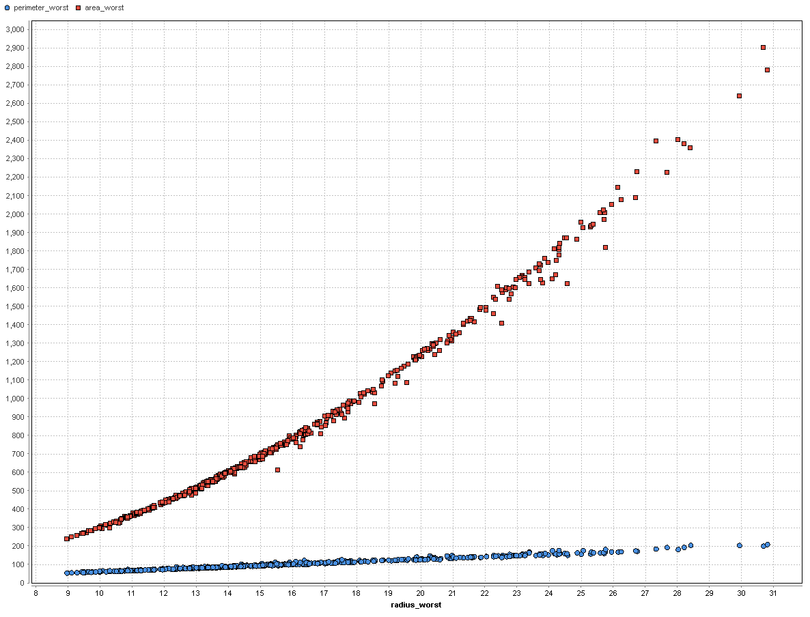
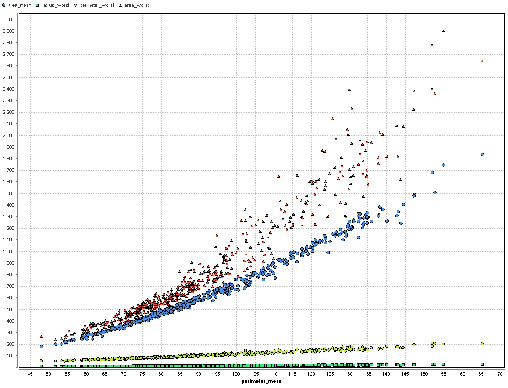
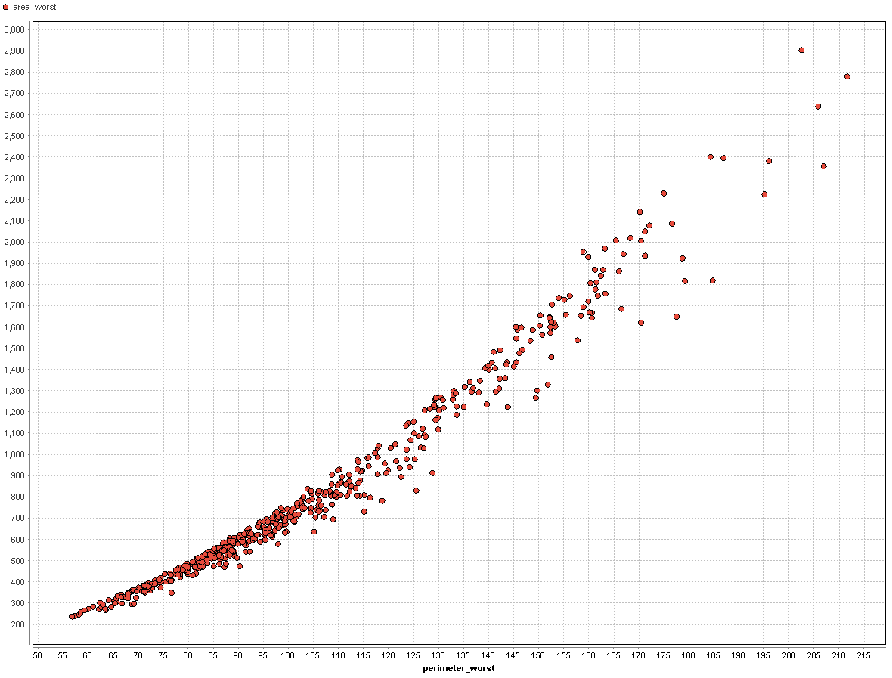
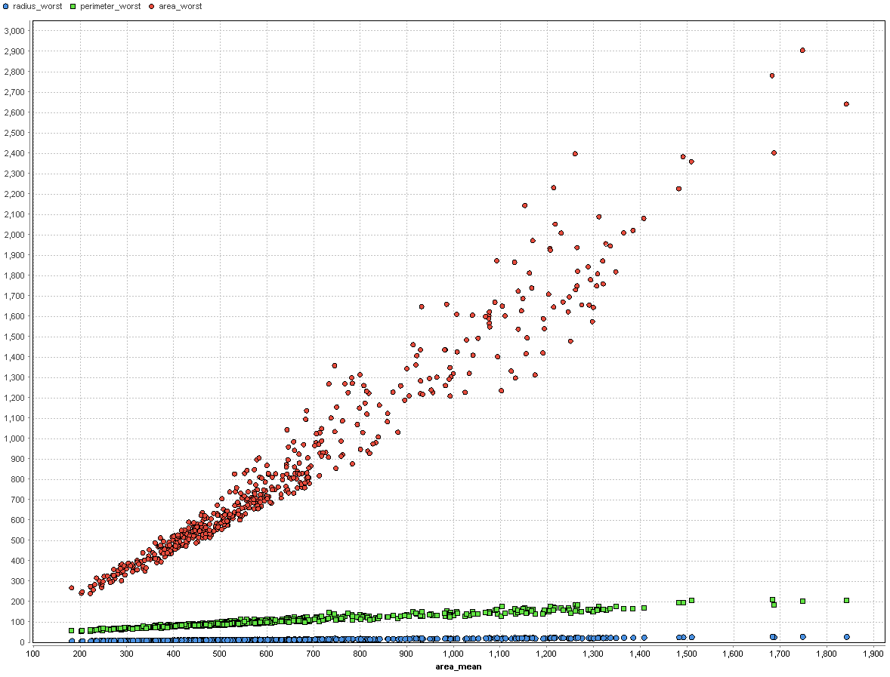
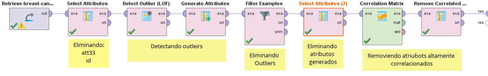

# Correlation

_Se retoma el modelo de [outliers](./5_outliers_rapidminer.md)_

Primero eliminamos los atributos que generamos en la deteccion de otuliers y utilizamos el modulo `Correlation Matrix`

Podemos observar que los atributos con mayor correlación son:

| Atributo 1| Atributo 2 | Correlación |
|:----------|:-----------|:------------|
|radius_mean	|perimeter_mean|	0.997561623039936|
|radius_worst|	perimeter_worst| 0.992657065474132|
|radius_mean	|area_mean	|0.9919003449129997|
|perimeter_mean|area_mean	|0.9902080430937652|
|radius_worst	|area_worst	|0.98999500432762|
|perimeter_worst|	area_worst	|0.9824612396754517|
|radius_mean	|radius_worst	|0.9801099075417596|
|perimeter_mean	|radius_worst	|0.9800989345342787|
|perimeter_mean	|perimeter_worst|	0.9798591412747525|
|area_mean	|radius_worst	|0.9793034894447585|
|area_mean	|area_worst	|0.9769836451092457|
|radius_mean|	perimeter_worst|	0.9737641514538055|
|area_mean	|perimeter_worst	|0.9731997180741648|
|perimeter_mean|	area_worst|	0.9618158006283064|
|radius_mean|	area_worst	|0.9613407449790952|
|radius_se	|area_se	|0.9588042517676202|
|radius_se	|perimeter_se	|0.9581078557703023|
|perimeter_se|	area_se	|0.9286230267439933|
|texture_mean	|texture_worst|	0.9185988050092276|
|concave points_mean|	concave points_worst|	0.9185319555861766|
|concavity_mean	|concave points_mean	|0.9109626681857491|
|concavity_mean	|concavity_worst	|0.9040835104706433|
|compactness_worst|	concavity_worst|	0.8892615552044842|
|compactness_mean|	concavity_mean|	0.8822007444342892|
|area_se	|area_worst	|0.8767762149945185|
|compactness_mean|	compactness_worst	|0.8708906979751478|
|concavity_mean	|concave points_worst	|0.8581661018635018|
|concave points_mean|	perimeter_worst	|0.8526946702369379|
|area_se	|perimeter_worst	|0.8515309069167041|
|concavity_worst|	concave points_worst |	0.8500507009197358|

Podemos observar que las correlaciones mas altas son entre areas, perimietros y radios.

Podemos ver claramente que estos atributos estan correlacionados, por lo cual eliminaremos los atributos de la segunda columna con una correlacion superior a `0.85`. Para esto usamos el modulo `Remove correlated attributes`.

