# Attribute Genration


```python
import pandas as pd
import matplotlib.pyplot as plt
import matplotlib.pylab as pl
from datetime import datetime
import numpy as np
from datetime import datetime
import seaborn as sns
```


```python
def distance_between(lat1, lon1, lat2, lon2):
    """
    Haversine disance between two coordinates
    """
    R = 6371e3; #meters
    φ1 = np.deg2rad(lat1)
    φ2 = np.deg2rad(lat2)
    Δφ = np.deg2rad(lat2-lat1)
    Δλ = np.deg2rad(lon2-lon1)

    a = np.sin(Δφ/2)*np.sin(Δφ/2) + np.cos(φ1)*np.cos(φ2)*np.sin(Δλ/2)*np.sin(Δλ/2)
    c = 2*np.arctan2(np.sqrt(a), np.sqrt(1-a))

    d = R * c
    return d

def plot_line(line):
    plt.figure(figsize=(10,5))
    plt.title('Line {0}'.format(line.line.iloc[0]))
    plt.plot(line.longitude, line.latitude,'-o')
    plt.show()

def plot_all_line(lines, line_id):
    unique_ids = lines[lines.line == line_id].id.unique()
    for _id in unique_ids:
        line = lines.query('id == {0} & line == {1}'.format(_id, str(line_id)))
        plot_line(line)
    
def plot_ids_line(line):
    line_ids = line.id.unique()
    plt.figure(figsize=(10,5))
    plt.title(line.line.iloc[0])
    different_ids = len(line_ids)
    colors = pl.cm.jet(np.linspace(0,1,different_ids))
    for size, id_ in enumerate(line_ids):
        l = line[line.id == id_]
        plt.plot(l.longitude, l.latitude, '-o', color=colors[size],markersize=(different_ids-size)*3)
    plt.show()
    
def plot_line_speed(line, show_speeds=True):
    plt.figure(figsize=(17,6))
    plt.title('line: '+str(line.line.iloc[0])+' id: '+str(line.id.iloc[0]))
    max_speed = 35
    min_speed = 0
    speeds = max_speed - min_speed 
    colors = pl.cm.jet(np.linspace(0, 1, speeds + 1))
    sps = []
    for step in line.itertuples():
        plt.plot(step.longitude, step.latitude, '-o', color=colors[int(step.speed)],markersize=step.speed)
        sps.append(str(int(ms_to_kh(step.speed)))+' k/h')
    if show_speeds:
        plt.legend(sps)
    plt.show()
    
def ms_to_kh(ms):
    return (ms*18)/5
```


```python
data = pd.read_csv('../data/bus_data_stage_1.csv')
data = data.drop(['Unnamed: 0'], axis=1)
data.head()
```


<div>
<style scoped>
    .dataframe tbody tr th:only-of-type {
        vertical-align: middle;
    }

    .dataframe tbody tr th {
        vertical-align: top;
    }

    .dataframe thead th {
        text-align: right;
    }
</style>
<table border="1" class="dataframe">
  <thead>
    <tr style="text-align: right;">
      <th></th>
      <th>id</th>
      <th>line</th>
      <th>longitude</th>
      <th>latitude</th>
      <th>timestamp</th>
    </tr>
  </thead>
  <tbody>
    <tr>
      <th>0</th>
      <td>76</td>
      <td>217</td>
      <td>-56.222400</td>
      <td>-34.855885</td>
      <td>2018-10-02 14:38:53</td>
    </tr>
    <tr>
      <th>1</th>
      <td>984</td>
      <td>540</td>
      <td>-56.201860</td>
      <td>-34.909360</td>
      <td>2018-10-02 14:39:08</td>
    </tr>
    <tr>
      <th>2</th>
      <td>288</td>
      <td>7898</td>
      <td>-56.175415</td>
      <td>-34.901110</td>
      <td>2018-10-02 14:39:08</td>
    </tr>
    <tr>
      <th>3</th>
      <td>1111</td>
      <td>254</td>
      <td>-56.136640</td>
      <td>-34.872833</td>
      <td>2018-10-02 14:39:08</td>
    </tr>
    <tr>
      <th>4</th>
      <td>22</td>
      <td>540</td>
      <td>-56.135277</td>
      <td>-34.845554</td>
      <td>2018-10-02 14:39:08</td>
    </tr>
  </tbody>
</table>
</div>


```python
unique_lines = data.line.unique()
```


```python
lines = pd.DataFrame()
for line in unique_lines:
    some_line  = data[data.line == line]
    unique_ids = some_line.id.unique() 
    for bus_id in unique_ids:
        line_by_id = some_line[some_line.id == bus_id]
        data_holder = pd.DataFrame(line_by_id)
        data_holder['next_longitude'] = line_by_id.longitude.shift(-1)
        data_holder['next_latitude']  = line_by_id.latitude.shift(-1)
        data_holder['next_timestamp'] = line_by_id.timestamp.shift(-1)
        data_holder['distance'] = np.zeros(len(data_holder))
        data_holder['distance'] = data_holder.apply(lambda x: distance_between(data_holder.latitude,
                                                                               data_holder.longitude,
                                                                               data_holder.next_latitude,
                                                                               data_holder.next_longitude))
        data_holder.drop(data_holder.index[-1], inplace=True)
        lines = lines.append(data_holder, ignore_index=True)
```


```python
print('Missing Lines: '+str(len(lines.id.unique()) - len(data.id.unique())))
```

    Missing Lines: -3


Podemos ver que tenemos 3 lineas faltantes en el archivo resultante, vamos a ver cuales son e investigar porque.


```python
np.setdiff1d(data.id.unique(),lines.id.unique())
```


    array([441, 928, 949])


```python
data[data.id == 441]
```


<div>
<style scoped>
    .dataframe tbody tr th:only-of-type {
        vertical-align: middle;
    }

    .dataframe tbody tr th {
        vertical-align: top;
    }

    .dataframe thead th {
        text-align: right;
    }
</style>
<table border="1" class="dataframe">
  <thead>
    <tr style="text-align: right;">
      <th></th>
      <th>id</th>
      <th>line</th>
      <th>longitude</th>
      <th>latitude</th>
      <th>timestamp</th>
    </tr>
  </thead>
  <tbody>
    <tr>
      <th>82</th>
      <td>441</td>
      <td>372</td>
      <td>-56.021667</td>
      <td>-34.869667</td>
      <td>2018-10-02 14:39:08</td>
    </tr>
  </tbody>
</table>
</div>


```python
data[data.id == 928]
```


<div>
<style scoped>
    .dataframe tbody tr th:only-of-type {
        vertical-align: middle;
    }

    .dataframe tbody tr th {
        vertical-align: top;
    }

    .dataframe thead th {
        text-align: right;
    }
</style>
<table border="1" class="dataframe">
  <thead>
    <tr style="text-align: right;">
      <th></th>
      <th>id</th>
      <th>line</th>
      <th>longitude</th>
      <th>latitude</th>
      <th>timestamp</th>
    </tr>
  </thead>
  <tbody>
    <tr>
      <th>1468</th>
      <td>928</td>
      <td>372</td>
      <td>-56.047527</td>
      <td>-34.88614</td>
      <td>2018-10-02 14:41:38</td>
    </tr>
  </tbody>
</table>
</div>


```python
data[data.id == 949]
```


<div>
<style scoped>
    .dataframe tbody tr th:only-of-type {
        vertical-align: middle;
    }

    .dataframe tbody tr th {
        vertical-align: top;
    }

    .dataframe thead th {
        text-align: right;
    }
</style>
<table border="1" class="dataframe">
  <thead>
    <tr style="text-align: right;">
      <th></th>
      <th>id</th>
      <th>line</th>
      <th>longitude</th>
      <th>latitude</th>
      <th>timestamp</th>
    </tr>
  </thead>
  <tbody>
    <tr>
      <th>152</th>
      <td>949</td>
      <td>501</td>
      <td>-56.135223</td>
      <td>-34.806</td>
      <td>2018-10-02 14:39:08</td>
    </tr>
  </tbody>
</table>
</div>


Podemos ver que las lineas faltantes no estan en el dataset resutante porque constan de un solo dato. Podemos considerarlas como outliers e ignorarlas.


```python
line_times  = []
line_speeds = []

for row in lines.itertuples():
    start_time = datetime.strptime(row.timestamp,'%Y-%m-%d %H:%M:%S')
    end_time   = datetime.strptime(row.next_timestamp,'%Y-%m-%d %H:%M:%S')
    time = end_time - start_time
    speed = row.distance/time.total_seconds()
    line_times.append(time)
    line_speeds.append(speed)

lines['time']  = np.zeros(len(lines))
lines['time']  = line_times
lines['speed'] = np.zeros(len(lines))
lines['speed'] = line_speeds
del line_times
del line_speeds
```


```python
lines.head()
```


<div>
<style scoped>
    .dataframe tbody tr th:only-of-type {
        vertical-align: middle;
    }

    .dataframe tbody tr th {
        vertical-align: top;
    }

    .dataframe thead th {
        text-align: right;
    }
</style>
<table border="1" class="dataframe">
  <thead>
    <tr style="text-align: right;">
      <th></th>
      <th>id</th>
      <th>line</th>
      <th>longitude</th>
      <th>latitude</th>
      <th>timestamp</th>
      <th>next_longitude</th>
      <th>next_latitude</th>
      <th>next_timestamp</th>
      <th>distance</th>
      <th>time</th>
      <th>speed</th>
    </tr>
  </thead>
  <tbody>
    <tr>
      <th>0</th>
      <td>76</td>
      <td>217</td>
      <td>-56.222400</td>
      <td>-34.855885</td>
      <td>2018-10-02 14:38:53</td>
      <td>-56.222717</td>
      <td>-34.855766</td>
      <td>2018-10-02 14:39:23</td>
      <td>31.807877</td>
      <td>00:00:30</td>
      <td>1.060263</td>
    </tr>
    <tr>
      <th>1</th>
      <td>76</td>
      <td>217</td>
      <td>-56.222717</td>
      <td>-34.855766</td>
      <td>2018-10-02 14:39:23</td>
      <td>-56.222733</td>
      <td>-34.855780</td>
      <td>2018-10-02 14:39:53</td>
      <td>2.134200</td>
      <td>00:00:30</td>
      <td>0.071140</td>
    </tr>
    <tr>
      <th>2</th>
      <td>76</td>
      <td>217</td>
      <td>-56.222733</td>
      <td>-34.855780</td>
      <td>2018-10-02 14:39:53</td>
      <td>-56.222916</td>
      <td>-34.855682</td>
      <td>2018-10-02 14:40:08</td>
      <td>19.939152</td>
      <td>00:00:15</td>
      <td>1.329277</td>
    </tr>
    <tr>
      <th>3</th>
      <td>76</td>
      <td>217</td>
      <td>-56.222916</td>
      <td>-34.855682</td>
      <td>2018-10-02 14:40:08</td>
      <td>-56.222866</td>
      <td>-34.855682</td>
      <td>2018-10-02 14:40:23</td>
      <td>4.562295</td>
      <td>00:00:15</td>
      <td>0.304153</td>
    </tr>
    <tr>
      <th>4</th>
      <td>76</td>
      <td>217</td>
      <td>-56.222866</td>
      <td>-34.855682</td>
      <td>2018-10-02 14:40:23</td>
      <td>-56.222850</td>
      <td>-34.855667</td>
      <td>2018-10-02 14:40:38</td>
      <td>2.216614</td>
      <td>00:00:15</td>
      <td>0.147774</td>
    </tr>
  </tbody>
</table>
</div>


Ahora vamos a revisar los datos calculados


```python
lines.speed.describe()
```


    count    96028.000000
    mean         4.455507
    std          3.623244
    min        -11.337526
    25%          1.415347
    50%          3.783430
    75%          6.725155
    max         33.804600
    Name: speed, dtype: float64


```python
lines.distance.describe()
```


    count    96028.000000
    mean       109.918037
    std        557.747270
    min          0.000000
    25%         23.732101
    50%         65.265739
    75%        115.928844
    max      22490.074027
    Name: distance, dtype: float64


```python
fig, ax = plt.subplots(figsize=(18,5))
ax = sns.boxplot(x=lines.distance)
```


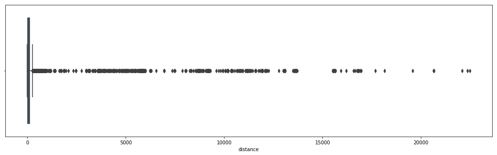


```python
fig, ax = plt.subplots(figsize=(18,5))
ax = sns.boxplot(x=lines.speed)
```


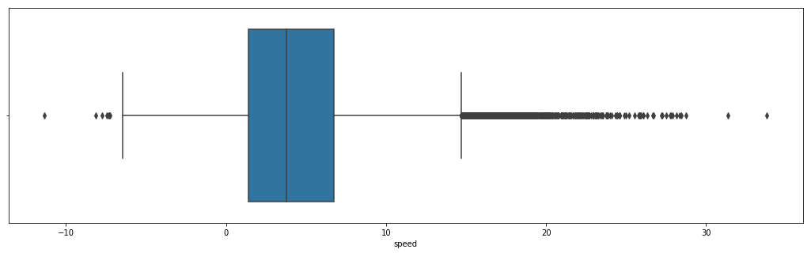


Podemos ver que tenemos velocidades negativas y que un omnibus se movio 22.5km en un intervalo de tiempo.


```python
negative_speeds = lines.query('speed < 0')
negative_speeds
```


<div>
<style scoped>
    .dataframe tbody tr th:only-of-type {
        vertical-align: middle;
    }

    .dataframe tbody tr th {
        vertical-align: top;
    }

    .dataframe thead th {
        text-align: right;
    }
</style>
<table border="1" class="dataframe">
  <thead>
    <tr style="text-align: right;">
      <th></th>
      <th>id</th>
      <th>line</th>
      <th>longitude</th>
      <th>latitude</th>
      <th>timestamp</th>
      <th>next_longitude</th>
      <th>next_latitude</th>
      <th>next_timestamp</th>
      <th>distance</th>
      <th>time</th>
      <th>speed</th>
    </tr>
  </thead>
  <tbody>
    <tr>
      <th>218</th>
      <td>76</td>
      <td>217</td>
      <td>-56.217384</td>
      <td>-34.858532</td>
      <td>2018-10-02 17:14:12</td>
      <td>-56.217384</td>
      <td>-34.858517</td>
      <td>2018-10-02 17:13:57</td>
      <td>1.667924</td>
      <td>-1 days +23:59:45</td>
      <td>-0.111195</td>
    </tr>
    <tr>
      <th>282</th>
      <td>68</td>
      <td>217</td>
      <td>-56.189632</td>
      <td>-34.872250</td>
      <td>2018-10-02 14:50:38</td>
      <td>-56.189167</td>
      <td>-34.873150</td>
      <td>2018-10-02 14:50:23</td>
      <td>108.694973</td>
      <td>-1 days +23:59:45</td>
      <td>-7.246332</td>
    </tr>
    <tr>
      <th>8311</th>
      <td>288</td>
      <td>7898</td>
      <td>-56.195280</td>
      <td>-34.905000</td>
      <td>2018-10-02 14:49:38</td>
      <td>-56.194637</td>
      <td>-34.905000</td>
      <td>2018-10-02 14:49:08</td>
      <td>58.635926</td>
      <td>-1 days +23:59:30</td>
      <td>-1.954531</td>
    </tr>
    <tr>
      <th>10079</th>
      <td>1111</td>
      <td>254</td>
      <td>-56.142303</td>
      <td>-34.850860</td>
      <td>2018-10-02 14:49:08</td>
      <td>-56.142750</td>
      <td>-34.851334</td>
      <td>2018-10-02 14:48:53</td>
      <td>66.646249</td>
      <td>-1 days +23:59:45</td>
      <td>-4.443083</td>
    </tr>
    <tr>
      <th>11549</th>
      <td>26</td>
      <td>254</td>
      <td>-56.148193</td>
      <td>-34.879470</td>
      <td>2018-10-02 14:49:38</td>
      <td>-56.148804</td>
      <td>-34.879917</td>
      <td>2018-10-02 14:48:53</td>
      <td>74.678565</td>
      <td>-1 days +23:59:15</td>
      <td>-1.659524</td>
    </tr>
    <tr>
      <th>16054</th>
      <td>9</td>
      <td>2391</td>
      <td>-56.170444</td>
      <td>-34.899776</td>
      <td>2018-10-02 14:50:53</td>
      <td>-56.169277</td>
      <td>-34.899360</td>
      <td>2018-10-02 14:50:38</td>
      <td>116.045054</td>
      <td>-1 days +23:59:45</td>
      <td>-7.736337</td>
    </tr>
    <tr>
      <th>16333</th>
      <td>94</td>
      <td>2391</td>
      <td>-56.196835</td>
      <td>-34.906140</td>
      <td>2018-10-02 14:49:08</td>
      <td>-56.195500</td>
      <td>-34.906082</td>
      <td>2018-10-02 14:48:53</td>
      <td>121.909284</td>
      <td>-1 days +23:59:45</td>
      <td>-8.127286</td>
    </tr>
    <tr>
      <th>17648</th>
      <td>86</td>
      <td>400</td>
      <td>-56.167442</td>
      <td>-34.898920</td>
      <td>2018-10-02 14:49:08</td>
      <td>-56.166805</td>
      <td>-34.898083</td>
      <td>2018-10-02 14:48:38</td>
      <td>109.712778</td>
      <td>-1 days +23:59:30</td>
      <td>-3.657093</td>
    </tr>
    <tr>
      <th>17655</th>
      <td>86</td>
      <td>400</td>
      <td>-56.172554</td>
      <td>-34.900723</td>
      <td>2018-10-02 14:50:53</td>
      <td>-56.171030</td>
      <td>-34.900223</td>
      <td>2018-10-02 14:50:08</td>
      <td>149.690867</td>
      <td>-1 days +23:59:15</td>
      <td>-3.326464</td>
    </tr>
    <tr>
      <th>17742</th>
      <td>13</td>
      <td>2390</td>
      <td>-56.194942</td>
      <td>-34.905945</td>
      <td>2018-10-02 14:49:08</td>
      <td>-56.196000</td>
      <td>-34.906055</td>
      <td>2018-10-02 14:48:53</td>
      <td>97.251338</td>
      <td>-1 days +23:59:45</td>
      <td>-6.483423</td>
    </tr>
    <tr>
      <th>19866</th>
      <td>285</td>
      <td>1476</td>
      <td>-56.140556</td>
      <td>-34.901775</td>
      <td>2018-10-02 14:49:08</td>
      <td>-56.141360</td>
      <td>-34.901917</td>
      <td>2018-10-02 14:48:53</td>
      <td>75.001419</td>
      <td>-1 days +23:59:45</td>
      <td>-5.000095</td>
    </tr>
    <tr>
      <th>23605</th>
      <td>770</td>
      <td>1483</td>
      <td>-56.185223</td>
      <td>-34.905445</td>
      <td>2018-10-02 14:49:08</td>
      <td>-56.184277</td>
      <td>-34.904835</td>
      <td>2018-10-02 14:48:53</td>
      <td>109.739258</td>
      <td>-1 days +23:59:45</td>
      <td>-7.315951</td>
    </tr>
    <tr>
      <th>27182</th>
      <td>531</td>
      <td>7919</td>
      <td>-56.111332</td>
      <td>-34.879470</td>
      <td>2018-10-02 14:49:38</td>
      <td>-56.111860</td>
      <td>-34.876442</td>
      <td>2018-10-02 14:49:08</td>
      <td>340.125786</td>
      <td>-1 days +23:59:30</td>
      <td>-11.337526</td>
    </tr>
    <tr>
      <th>33451</th>
      <td>20</td>
      <td>218</td>
      <td>-56.084400</td>
      <td>-34.880768</td>
      <td>2018-10-02 14:49:38</td>
      <td>-56.085716</td>
      <td>-34.879100</td>
      <td>2018-10-02 14:49:08</td>
      <td>220.931882</td>
      <td>-1 days +23:59:30</td>
      <td>-7.364396</td>
    </tr>
    <tr>
      <th>40651</th>
      <td>174</td>
      <td>7517</td>
      <td>-56.237434</td>
      <td>-34.867966</td>
      <td>2018-10-02 14:49:38</td>
      <td>-56.238533</td>
      <td>-34.868100</td>
      <td>2018-10-02 14:49:08</td>
      <td>101.365294</td>
      <td>-1 days +23:59:30</td>
      <td>-3.378843</td>
    </tr>
    <tr>
      <th>42310</th>
      <td>241</td>
      <td>7517</td>
      <td>-56.172950</td>
      <td>-34.879383</td>
      <td>2018-10-02 16:39:11</td>
      <td>-56.173283</td>
      <td>-34.879135</td>
      <td>2018-10-02 16:38:56</td>
      <td>41.026416</td>
      <td>-1 days +23:59:45</td>
      <td>-2.735094</td>
    </tr>
    <tr>
      <th>42335</th>
      <td>241</td>
      <td>7517</td>
      <td>-56.157050</td>
      <td>-34.885630</td>
      <td>2018-10-02 16:47:56</td>
      <td>-56.157250</td>
      <td>-34.885918</td>
      <td>2018-10-02 16:47:41</td>
      <td>36.855589</td>
      <td>-1 days +23:59:45</td>
      <td>-2.457039</td>
    </tr>
    <tr>
      <th>42462</th>
      <td>37</td>
      <td>340</td>
      <td>-56.115580</td>
      <td>-34.836470</td>
      <td>2018-10-02 14:49:38</td>
      <td>-56.117775</td>
      <td>-34.837807</td>
      <td>2018-10-02 14:48:53</td>
      <td>249.467697</td>
      <td>-1 days +23:59:15</td>
      <td>-5.543727</td>
    </tr>
    <tr>
      <th>45362</th>
      <td>269</td>
      <td>873</td>
      <td>-56.203278</td>
      <td>-34.908500</td>
      <td>2018-10-02 14:49:38</td>
      <td>-56.203056</td>
      <td>-34.908833</td>
      <td>2018-10-02 14:48:53</td>
      <td>42.200319</td>
      <td>-1 days +23:59:15</td>
      <td>-0.937785</td>
    </tr>
    <tr>
      <th>59631</th>
      <td>114</td>
      <td>7703</td>
      <td>-56.200527</td>
      <td>-34.906580</td>
      <td>2018-10-02 14:49:38</td>
      <td>-56.199500</td>
      <td>-34.906776</td>
      <td>2018-10-02 14:49:08</td>
      <td>96.153921</td>
      <td>-1 days +23:59:30</td>
      <td>-3.205131</td>
    </tr>
    <tr>
      <th>62802</th>
      <td>110</td>
      <td>2388</td>
      <td>-56.162180</td>
      <td>-34.806366</td>
      <td>2018-10-02 18:10:28</td>
      <td>-56.155666</td>
      <td>-34.822200</td>
      <td>2018-10-02 17:49:43</td>
      <td>1858.376551</td>
      <td>-1 days +23:39:15</td>
      <td>-1.492672</td>
    </tr>
    <tr>
      <th>67583</th>
      <td>75</td>
      <td>7918</td>
      <td>-56.111473</td>
      <td>-34.882500</td>
      <td>2018-10-02 14:49:38</td>
      <td>-56.110775</td>
      <td>-34.884420</td>
      <td>2018-10-02 14:49:08</td>
      <td>222.785614</td>
      <td>-1 days +23:59:30</td>
      <td>-7.426187</td>
    </tr>
    <tr>
      <th>82591</th>
      <td>495</td>
      <td>498</td>
      <td>-56.136750</td>
      <td>-34.872833</td>
      <td>2018-10-02 14:49:38</td>
      <td>-56.138332</td>
      <td>-34.873690</td>
      <td>2018-10-02 14:48:53</td>
      <td>172.942967</td>
      <td>-1 days +23:59:15</td>
      <td>-3.843177</td>
    </tr>
    <tr>
      <th>87683</th>
      <td>670</td>
      <td>242</td>
      <td>-56.123250</td>
      <td>-34.840890</td>
      <td>2018-10-02 14:49:38</td>
      <td>-56.122334</td>
      <td>-34.840275</td>
      <td>2018-10-02 14:48:53</td>
      <td>108.004083</td>
      <td>-1 days +23:59:15</td>
      <td>-2.400091</td>
    </tr>
  </tbody>
</table>
</div>


Las distancias negativas parecen venir de problemas en los tiempos. Tiempos que parecen estar al revez, primero pasa por el destino y luego por el origen. Como son pocos datos vamos a descartarlos.


```python
lines = lines.query('speed >= 0')
fig, ax = plt.subplots(figsize=(18,5))
ax.set(title='Speed in k/h')
ax = sns.boxplot(x=lines.speed.apply(lambda x: ms_to_kh(x)))
```


Ahora tenemos velocidades coherentes y no tenemos outliers que afecten nuestro modelo. Vamos a dejar las velocidades superiores a 15 m/s


```python
large_distances = lines.query('distance > 500')
large_distances.head()
```


<div>
<style scoped>
    .dataframe tbody tr th:only-of-type {
        vertical-align: middle;
    }

    .dataframe tbody tr th {
        vertical-align: top;
    }

    .dataframe thead th {
        text-align: right;
    }
</style>
<table border="1" class="dataframe">
  <thead>
    <tr style="text-align: right;">
      <th></th>
      <th>id</th>
      <th>line</th>
      <th>longitude</th>
      <th>latitude</th>
      <th>timestamp</th>
      <th>next_longitude</th>
      <th>next_latitude</th>
      <th>next_timestamp</th>
      <th>distance</th>
      <th>time</th>
      <th>speed</th>
    </tr>
  </thead>
  <tbody>
    <tr>
      <th>11</th>
      <td>76</td>
      <td>217</td>
      <td>-56.222965</td>
      <td>-34.855816</td>
      <td>2018-10-02 14:42:38</td>
      <td>-56.083332</td>
      <td>-34.882233</td>
      <td>2018-10-02 16:01:10</td>
      <td>13073.155501</td>
      <td>01:18:32</td>
      <td>2.774439</td>
    </tr>
    <tr>
      <th>48</th>
      <td>76</td>
      <td>217</td>
      <td>-56.098970</td>
      <td>-34.872250</td>
      <td>2018-10-02 16:17:41</td>
      <td>-56.106632</td>
      <td>-34.870285</td>
      <td>2018-10-02 16:19:56</td>
      <td>732.347979</td>
      <td>00:02:15</td>
      <td>5.424800</td>
    </tr>
    <tr>
      <th>168</th>
      <td>76</td>
      <td>217</td>
      <td>-56.180183</td>
      <td>-34.883415</td>
      <td>2018-10-02 16:56:56</td>
      <td>-56.187466</td>
      <td>-34.880634</td>
      <td>2018-10-02 16:59:42</td>
      <td>732.776170</td>
      <td>00:02:46</td>
      <td>4.414314</td>
    </tr>
    <tr>
      <th>342</th>
      <td>68</td>
      <td>217</td>
      <td>-56.222830</td>
      <td>-34.855732</td>
      <td>2018-10-02 15:07:24</td>
      <td>-56.083282</td>
      <td>-34.882317</td>
      <td>2018-10-02 16:25:41</td>
      <td>13069.811782</td>
      <td>01:18:17</td>
      <td>2.782587</td>
    </tr>
    <tr>
      <th>579</th>
      <td>15</td>
      <td>217</td>
      <td>-56.223000</td>
      <td>-34.855633</td>
      <td>2018-10-02 14:39:08</td>
      <td>-56.083332</td>
      <td>-34.882050</td>
      <td>2018-10-02 15:45:55</td>
      <td>13076.294595</td>
      <td>01:06:47</td>
      <td>3.263363</td>
    </tr>
  </tbody>
</table>
</div>


```python
plot_all_line(lines, 7512)
```


Podemos ver que distancias de 500~600  metros tienen sentido


```python
large_distances = lines.query('distance > 800')
large_distances.head(10)
```


<div>
<style scoped>
    .dataframe tbody tr th:only-of-type {
        vertical-align: middle;
    }

    .dataframe tbody tr th {
        vertical-align: top;
    }

    .dataframe thead th {
        text-align: right;
    }
</style>
<table border="1" class="dataframe">
  <thead>
    <tr style="text-align: right;">
      <th></th>
      <th>id</th>
      <th>line</th>
      <th>longitude</th>
      <th>latitude</th>
      <th>timestamp</th>
      <th>next_longitude</th>
      <th>next_latitude</th>
      <th>next_timestamp</th>
      <th>distance</th>
      <th>time</th>
      <th>speed</th>
    </tr>
  </thead>
  <tbody>
    <tr>
      <th>11</th>
      <td>76</td>
      <td>217</td>
      <td>-56.222965</td>
      <td>-34.855816</td>
      <td>2018-10-02 14:42:38</td>
      <td>-56.083332</td>
      <td>-34.882233</td>
      <td>2018-10-02 16:01:10</td>
      <td>13073.155501</td>
      <td>01:18:32</td>
      <td>2.774439</td>
    </tr>
    <tr>
      <th>342</th>
      <td>68</td>
      <td>217</td>
      <td>-56.222830</td>
      <td>-34.855732</td>
      <td>2018-10-02 15:07:24</td>
      <td>-56.083282</td>
      <td>-34.882317</td>
      <td>2018-10-02 16:25:41</td>
      <td>13069.811782</td>
      <td>01:18:17</td>
      <td>2.782587</td>
    </tr>
    <tr>
      <th>579</th>
      <td>15</td>
      <td>217</td>
      <td>-56.223000</td>
      <td>-34.855633</td>
      <td>2018-10-02 14:39:08</td>
      <td>-56.083332</td>
      <td>-34.882050</td>
      <td>2018-10-02 15:45:55</td>
      <td>13076.294595</td>
      <td>01:06:47</td>
      <td>3.263363</td>
    </tr>
    <tr>
      <th>1433</th>
      <td>105</td>
      <td>217</td>
      <td>-56.222683</td>
      <td>-34.855732</td>
      <td>2018-10-02 14:51:38</td>
      <td>-56.083332</td>
      <td>-34.882217</td>
      <td>2018-10-02 16:05:40</td>
      <td>13049.799294</td>
      <td>01:14:02</td>
      <td>2.937821</td>
    </tr>
    <tr>
      <th>1826</th>
      <td>91</td>
      <td>217</td>
      <td>-56.222850</td>
      <td>-34.855717</td>
      <td>2018-10-02 15:25:54</td>
      <td>-56.083168</td>
      <td>-34.881966</td>
      <td>2018-10-02 16:47:56</td>
      <td>13073.355857</td>
      <td>01:22:02</td>
      <td>2.656106</td>
    </tr>
    <tr>
      <th>1989</th>
      <td>91</td>
      <td>217</td>
      <td>-56.187565</td>
      <td>-34.875950</td>
      <td>2018-10-02 17:49:13</td>
      <td>-56.222850</td>
      <td>-34.855750</td>
      <td>2018-10-02 18:10:28</td>
      <td>3925.362634</td>
      <td>00:21:15</td>
      <td>3.078716</td>
    </tr>
    <tr>
      <th>2249</th>
      <td>45</td>
      <td>217</td>
      <td>-56.222885</td>
      <td>-34.855717</td>
      <td>2018-10-02 16:01:40</td>
      <td>-56.083200</td>
      <td>-34.881950</td>
      <td>2018-10-02 17:19:42</td>
      <td>13073.226769</td>
      <td>01:18:02</td>
      <td>2.792231</td>
    </tr>
    <tr>
      <th>2296</th>
      <td>45</td>
      <td>217</td>
      <td>-56.115784</td>
      <td>-34.871130</td>
      <td>2018-10-02 17:40:27</td>
      <td>-56.135784</td>
      <td>-34.871933</td>
      <td>2018-10-02 17:49:13</td>
      <td>1826.750030</td>
      <td>00:08:46</td>
      <td>3.472909</td>
    </tr>
    <tr>
      <th>2298</th>
      <td>45</td>
      <td>217</td>
      <td>-56.136433</td>
      <td>-34.872550</td>
      <td>2018-10-02 17:49:43</td>
      <td>-56.174118</td>
      <td>-34.885017</td>
      <td>2018-10-02 18:10:28</td>
      <td>3706.626400</td>
      <td>00:20:45</td>
      <td>2.977210</td>
    </tr>
    <tr>
      <th>2676</th>
      <td>29</td>
      <td>217</td>
      <td>-56.179115</td>
      <td>-34.883750</td>
      <td>2018-10-02 15:41:55</td>
      <td>-56.187435</td>
      <td>-34.876280</td>
      <td>2018-10-02 15:46:10</td>
      <td>1125.136303</td>
      <td>00:04:15</td>
      <td>4.412299</td>
    </tr>
  </tbody>
</table>
</div>


```python
plot_all_line(lines, 217)
```


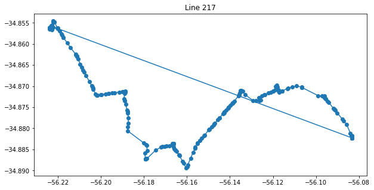


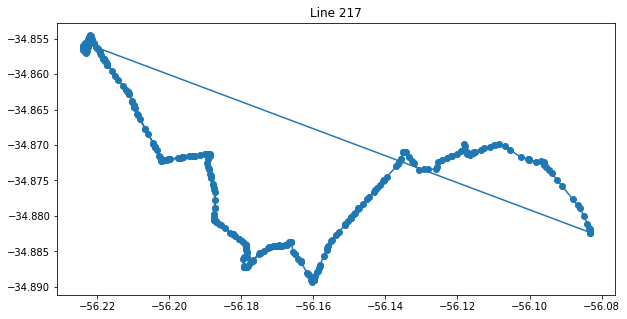


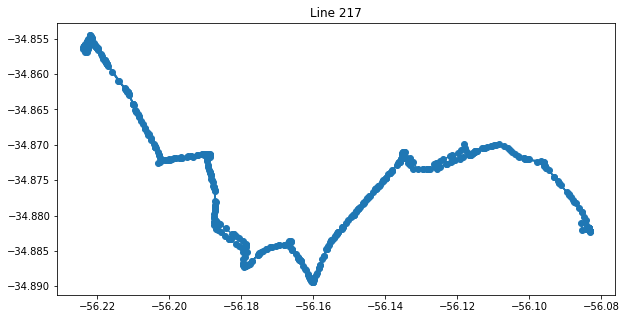


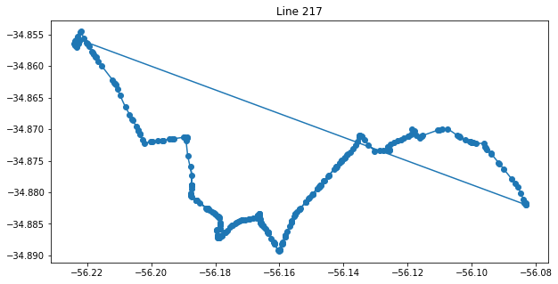


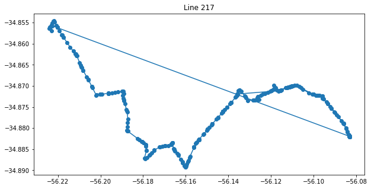


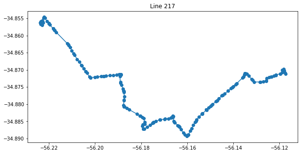


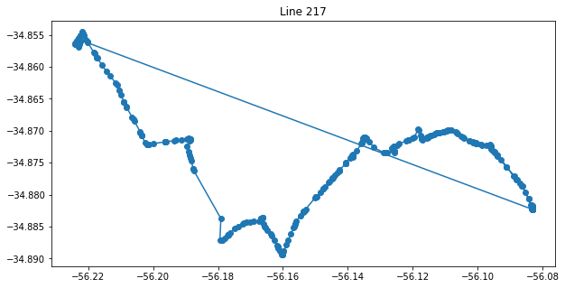


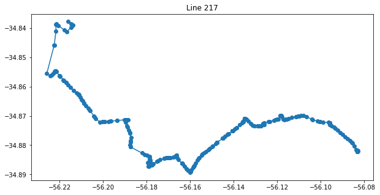


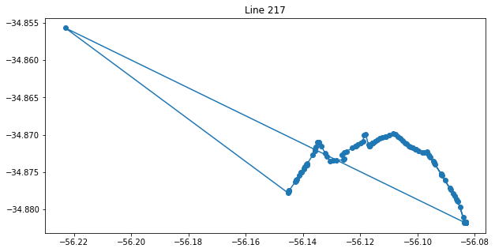


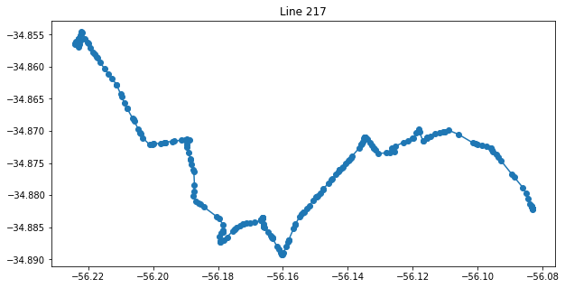


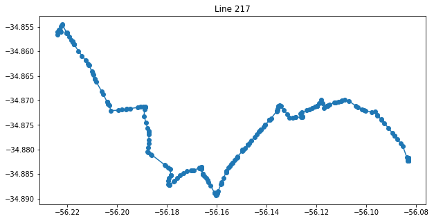


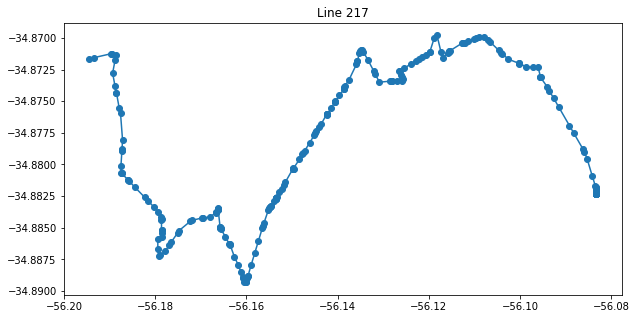


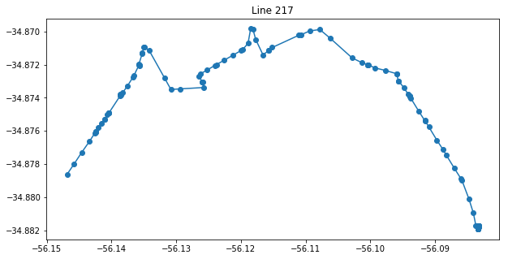


Podemos ver que estas distancias superiores a 800 metros suelen ser de nuevos omnibus que salen desde el origien. Esta distancia es obtenida mediante una linea entre el origien y el destino y no nos aporta informacion relevante. Ahora vamos a ver cuantos son estos datos e intentar ver el impacto que tienen al eliminarlos


```python
large_distances.describe()
```


<div>
<style scoped>
    .dataframe tbody tr th:only-of-type {
        vertical-align: middle;
    }

    .dataframe tbody tr th {
        vertical-align: top;
    }

    .dataframe thead th {
        text-align: right;
    }
</style>
<table border="1" class="dataframe">
  <thead>
    <tr style="text-align: right;">
      <th></th>
      <th>id</th>
      <th>line</th>
      <th>longitude</th>
      <th>latitude</th>
      <th>next_longitude</th>
      <th>next_latitude</th>
      <th>distance</th>
      <th>time</th>
      <th>speed</th>
    </tr>
  </thead>
  <tbody>
    <tr>
      <th>count</th>
      <td>398.000000</td>
      <td>398.000000</td>
      <td>398.000000</td>
      <td>398.000000</td>
      <td>398.000000</td>
      <td>398.000000</td>
      <td>398.000000</td>
      <td>398</td>
      <td>398.000000</td>
    </tr>
    <tr>
      <th>mean</th>
      <td>350.957286</td>
      <td>3607.959799</td>
      <td>-56.152844</td>
      <td>-34.878896</td>
      <td>-56.153032</td>
      <td>-34.877234</td>
      <td>7378.167208</td>
      <td>0 days 00:52:38.801507</td>
      <td>2.955186</td>
    </tr>
    <tr>
      <th>std</th>
      <td>376.325581</td>
      <td>3464.406915</td>
      <td>0.047571</td>
      <td>0.032527</td>
      <td>0.049604</td>
      <td>0.033750</td>
      <td>4555.901060</td>
      <td>0 days 00:35:23.627226</td>
      <td>1.920527</td>
    </tr>
    <tr>
      <th>min</th>
      <td>2.000000</td>
      <td>217.000000</td>
      <td>-56.253784</td>
      <td>-34.928150</td>
      <td>-56.254080</td>
      <td>-34.928150</td>
      <td>821.188877</td>
      <td>0 days 00:00:45</td>
      <td>0.816688</td>
    </tr>
    <tr>
      <th>25%</th>
      <td>59.000000</td>
      <td>341.250000</td>
      <td>-56.197195</td>
      <td>-34.905610</td>
      <td>-56.197250</td>
      <td>-34.904070</td>
      <td>3951.545367</td>
      <td>0 days 00:21:15</td>
      <td>1.908740</td>
    </tr>
    <tr>
      <th>50%</th>
      <td>121.000000</td>
      <td>2389.000000</td>
      <td>-56.159695</td>
      <td>-34.890274</td>
      <td>-56.159333</td>
      <td>-34.890055</td>
      <td>5847.929401</td>
      <td>0 days 00:53:08.500000</td>
      <td>2.635522</td>
    </tr>
    <tr>
      <th>75%</th>
      <td>719.750000</td>
      <td>7703.750000</td>
      <td>-56.125034</td>
      <td>-34.862020</td>
      <td>-56.125035</td>
      <td>-34.855951</td>
      <td>10613.094094</td>
      <td>0 days 01:18:32</td>
      <td>3.373455</td>
    </tr>
    <tr>
      <th>max</th>
      <td>1111.000000</td>
      <td>7929.000000</td>
      <td>-55.995472</td>
      <td>-34.768833</td>
      <td>-55.996166</td>
      <td>-34.715830</td>
      <td>22490.074027</td>
      <td>0 days 03:31:20</td>
      <td>20.042696</td>
    </tr>
  </tbody>
</table>
</div>


```python
lines.count()
```


    id                96004
    line              96004
    longitude         96004
    latitude          96004
    timestamp         96004
    next_longitude    96004
    next_latitude     96004
    next_timestamp    96004
    distance          96004
    time              96004
    speed             96004
    dtype: int64


Eliminado estos datos con largas distancias estariamos perdiendo 398/96004 datos. Como no son muchos vamos a eliminarlos


```python
lines = lines.query('distance <= 800')
fig, ax = plt.subplots(figsize=(18,5))
ax.set(title='Distances in m')
ax = sns.boxplot(x=lines.distance)
```


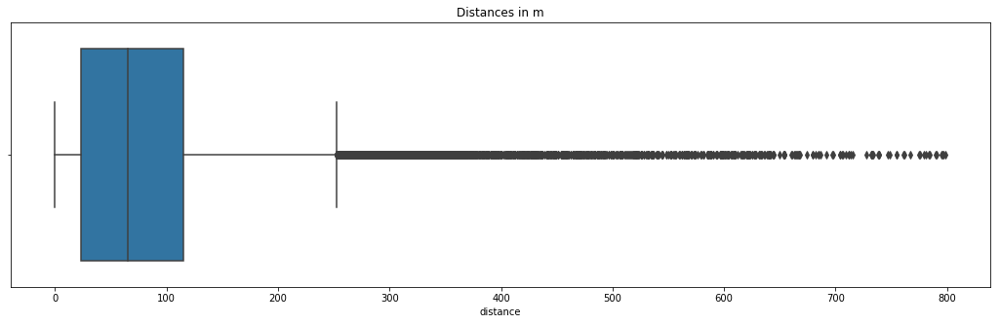


Observemos algunos de los datos que tenemos hasta ahora


```python
unique_ids = lines[lines.line == 217].id.unique()
for _id in unique_ids:
    line = lines.query('id == {0} & line == 217'.format(_id))
    plot_line_speed(line, False)
```


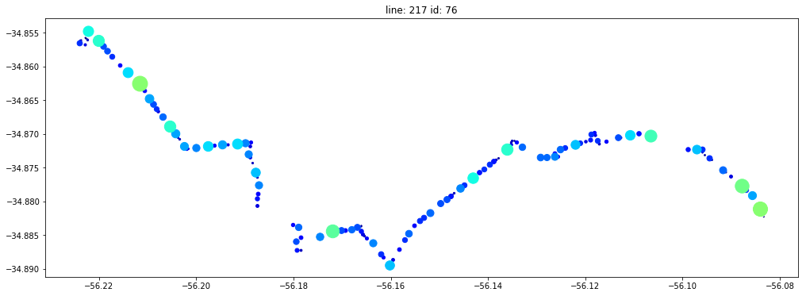


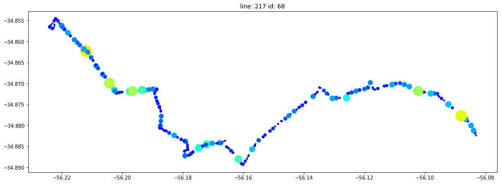


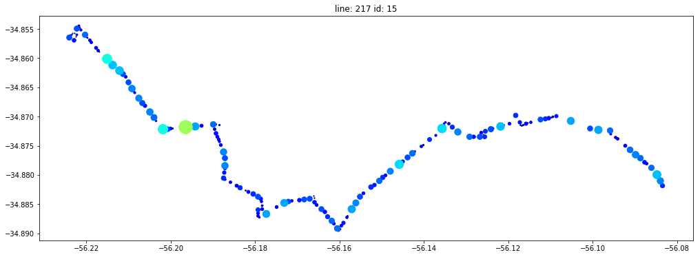


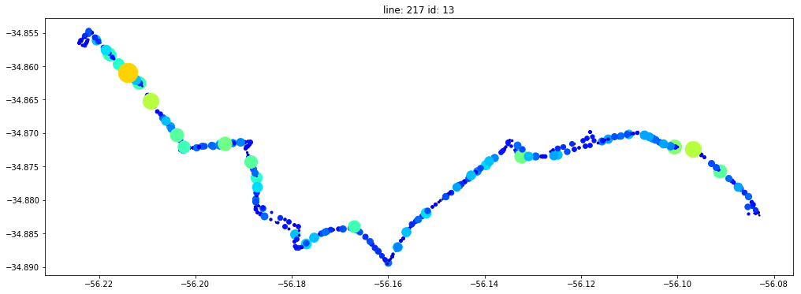


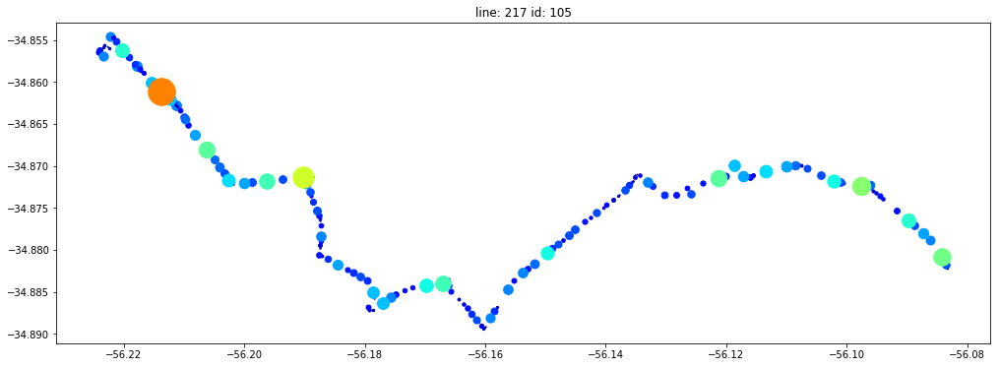


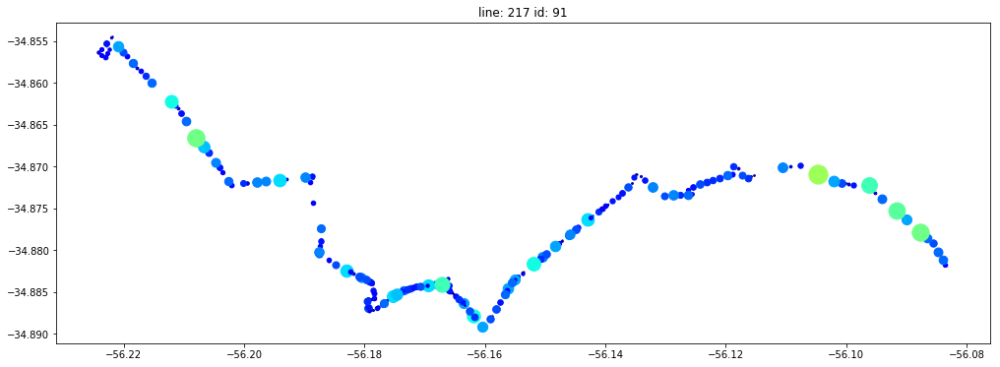


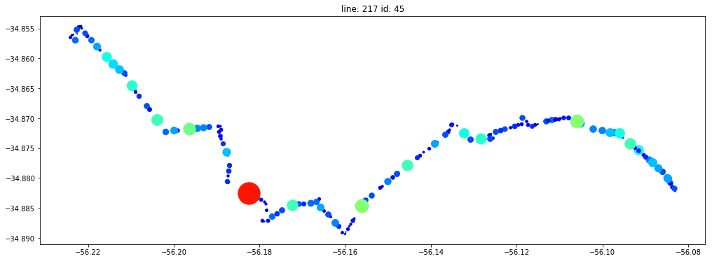


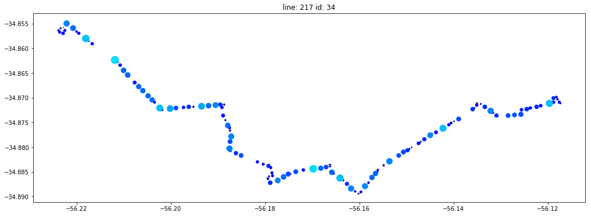


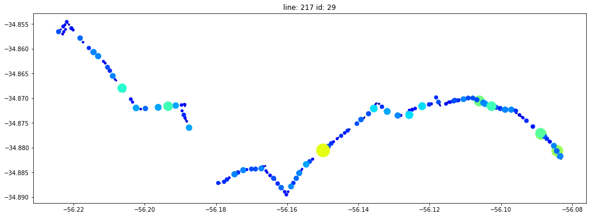


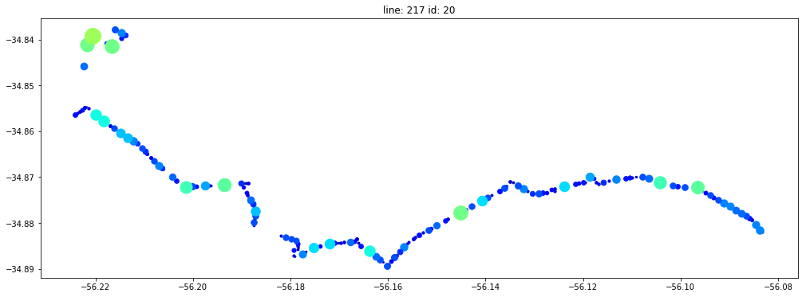


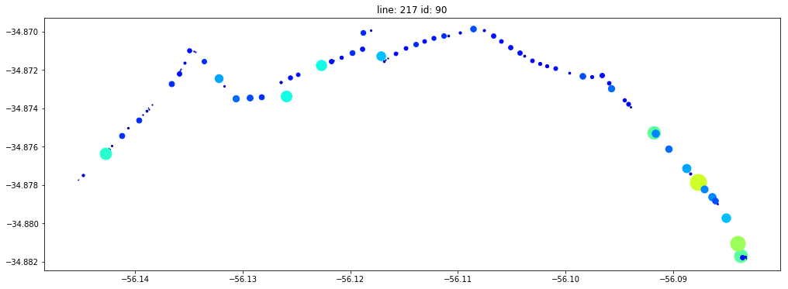


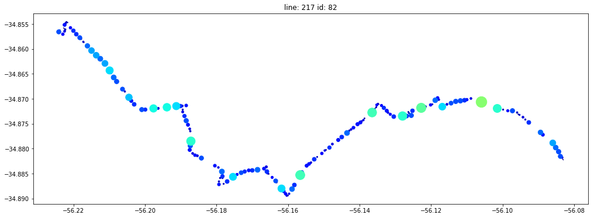


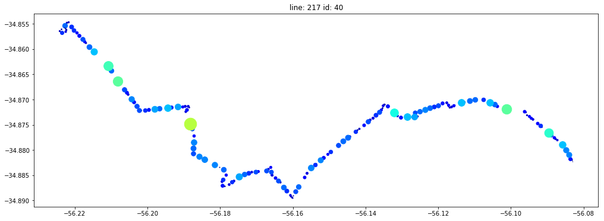


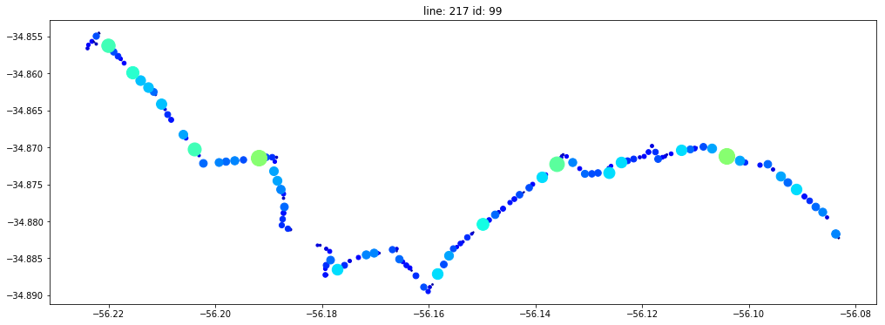


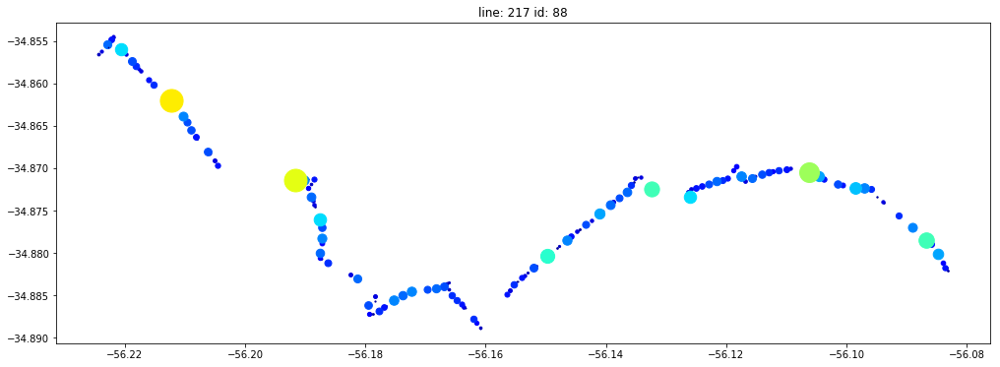


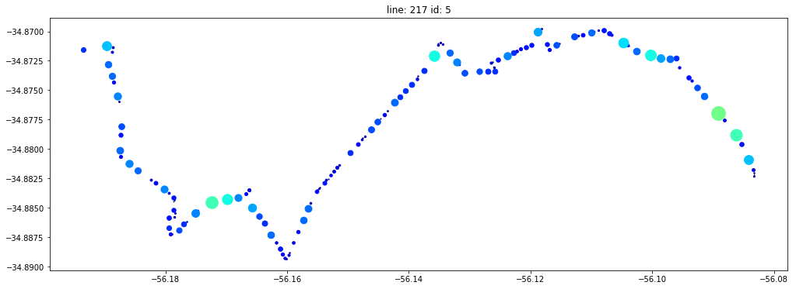


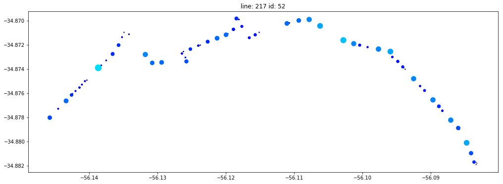


```python
lines.to_csv('../data/bus_data_stage_2.csv')
```

# Resumen 

Partimos de un conjunto de datos obtenidos de un servicio que eschaba mediante _hooks_ una simulacion de omnibus de la intendencia la cual enviaba los siguientes datos:

* **id**
* **type**
* **busCode**
* **line**
* **longitude**
* **latitude**
* **timestamp**

Elimiamos las columnas que no aportaban información relevante y nos quedamos con:

* **id**
* **line**
* **longitude**
* **latitude**
* **timestamp**

Como el problema trata de omnibus dentro de Montevideo definimos una _bounding box_ que contiene a la ciudad de montevideo para ver si alguna de las coordenadas _("longitude", "latitude")_ quedaba fuera. Descubrimos que lineas como 142 llegan a Canelones pero son consideradas lineas urbanas por lo cual no las descartamos.

Vimos que por cada linea tenemos varios omnibus y que en algunos de los recorridos no tenemos informacion del trayecto completo, lo cual podia ser ocacionado por problemas en la simulacion o que algunas lineas y sublineas se referencien con el mismo id.

Para las diferentes coordenadas obtenidas en orden cronologico por omnibus calculamos las distancias (con la formula de Haversine) y el tiempo entre la informacion contigua obtenida. Con estos datos calculamos la velocidad de los omnibus.

Descubrimos que para algunas lineas existen segmentos del trayecto con desvios e introdijimos el archivo `v_uptu_lsv.csv` obtenido de los datos abiertos de la IMM el cual nos permite mapear los identificadores a los nombres utilizados por las lineas de omnibus.

Al calcular los tiempos y distancias para todos los datos vimos que teniamos velocidades negativas y distancias muy largas.

Las velocidades negativas fueron eliminadas y las distancias superiores a 800m tambien se eliminarn ya que eran pocos datos.

En la proxima sección vamos a intentar separar Montevideo y parte de Canelones en diferentes sectores para analizar la  relación entre las velocidades y la ubicación.
