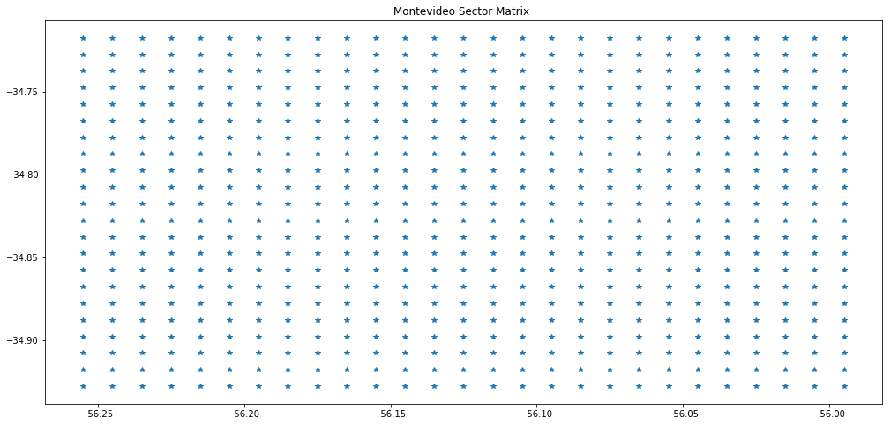
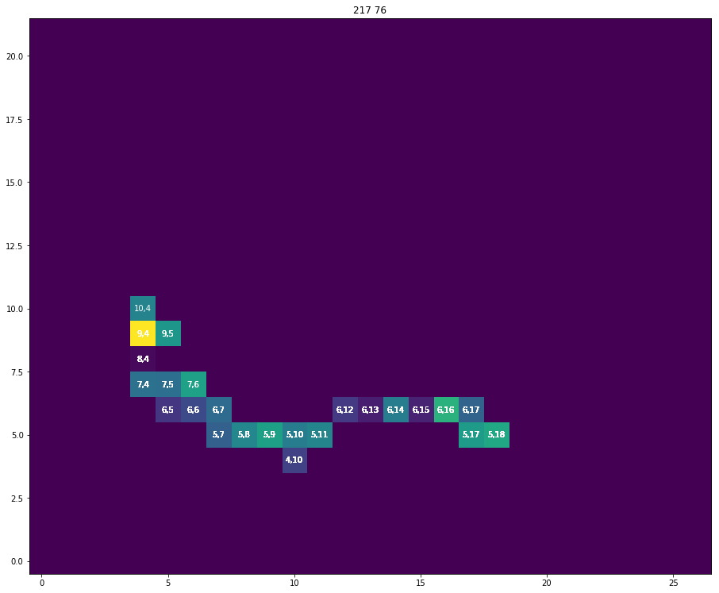
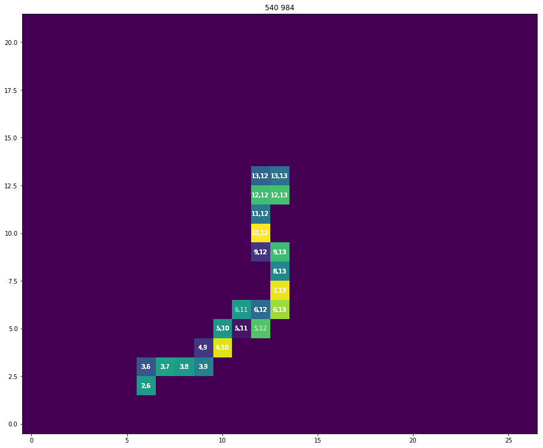
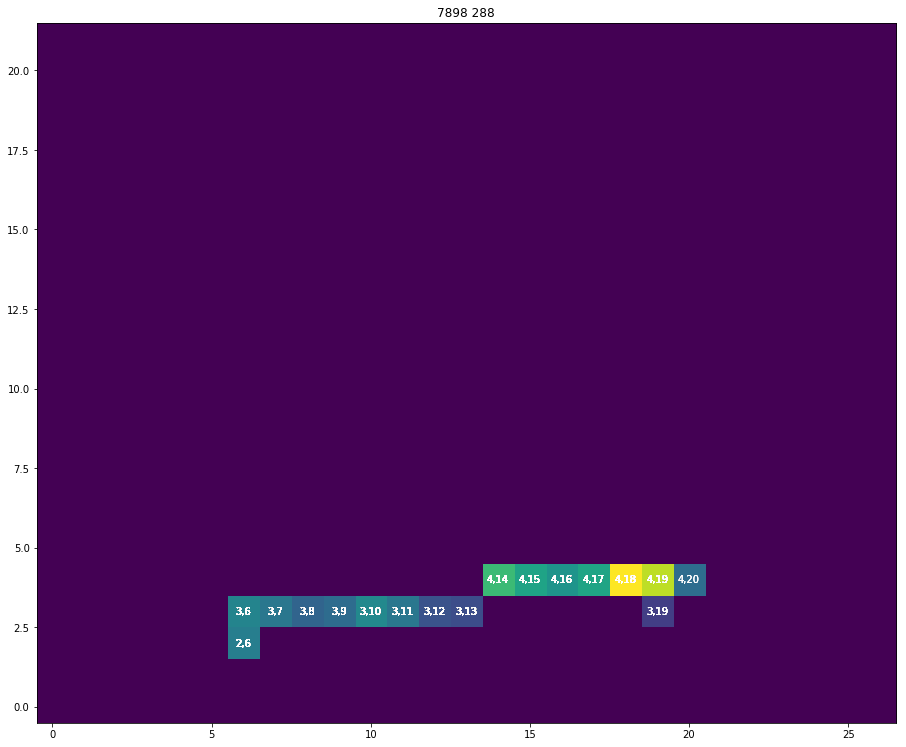
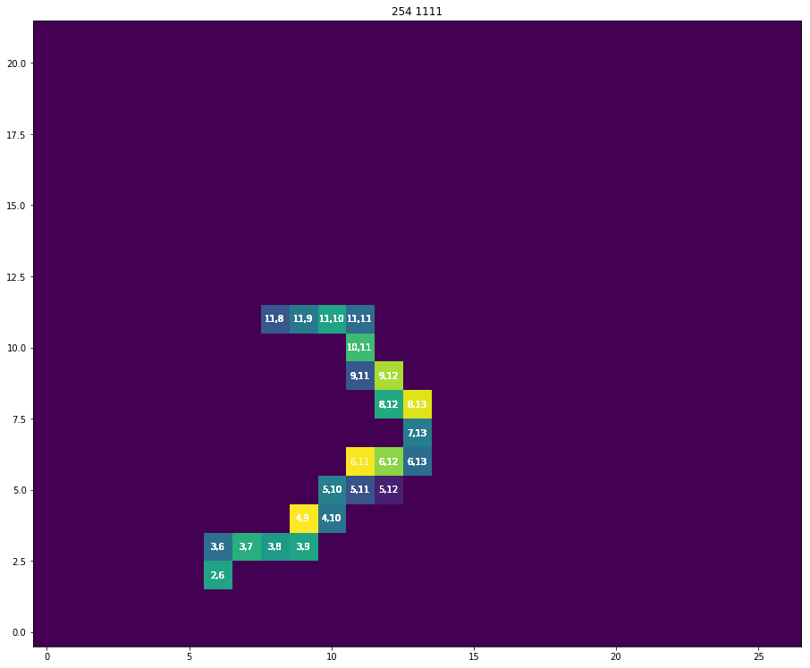
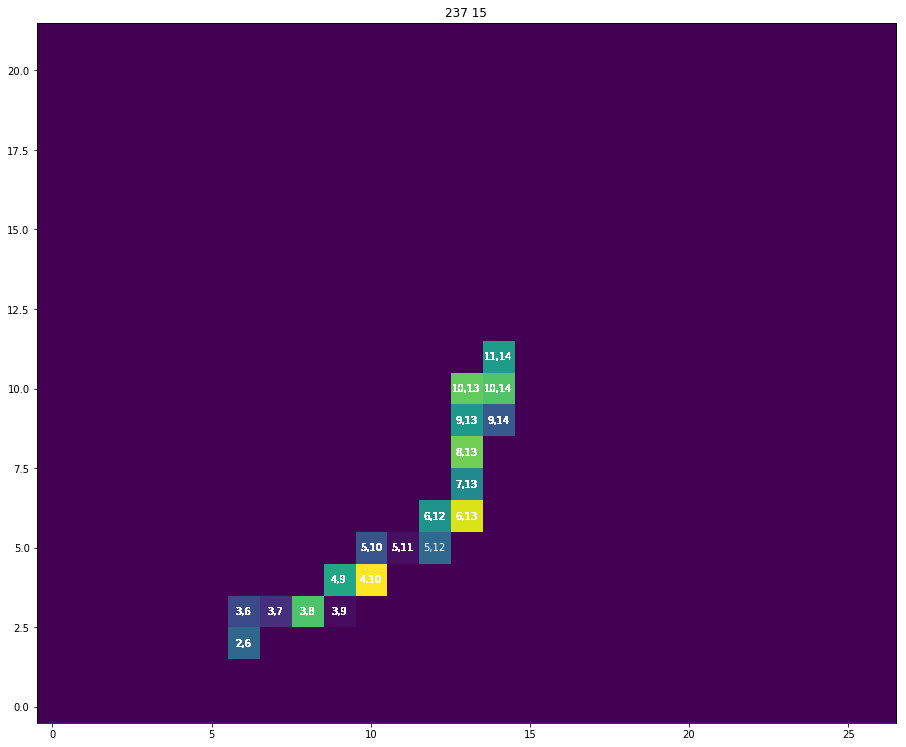

# Attribute Genration II

Las coordenadas que tenemos nos ofrecen información importante, no es lo mismo moverse en el centro de montevideo que en las afueras, los diferentes tamaños de las vias, cantidad de personas en circulación o que usan el omnibus como medio de transporte varia dependiendo de la ubicación. Trabajar con estas coordenadas en un futuro va a resultar en problemas complejos por lo cual requerimos de algun metodo para mantener la información pero tenerla en un formato mas simple. Para esto vamos a segmentar a Montevideo en una matriz de ubicaciones en las cual ubicaremos los segmentos de recorridos. 


```python
import pandas as pd
import numpy as np
import matplotlib.pyplot as plt
import matplotlib
```


```python
data = pd.read_csv('../data/bus_data_stage_2.csv')
data = data.drop(['Unnamed: 0'], axis=1)
data.head()
```


<div>
<style scoped>
    .dataframe tbody tr th:only-of-type {
        vertical-align: middle;
    }

    .dataframe tbody tr th {
        vertical-align: top;
    }

    .dataframe thead th {
        text-align: right;
    }
</style>
<table border="1" class="dataframe">
  <thead>
    <tr style="text-align: right;">
      <th></th>
      <th>id</th>
      <th>line</th>
      <th>longitude</th>
      <th>latitude</th>
      <th>timestamp</th>
      <th>next_longitude</th>
      <th>next_latitude</th>
      <th>next_timestamp</th>
      <th>distance</th>
      <th>time</th>
      <th>speed</th>
    </tr>
  </thead>
  <tbody>
    <tr>
      <th>0</th>
      <td>76</td>
      <td>217</td>
      <td>-56.222400</td>
      <td>-34.855885</td>
      <td>2018-10-02 14:38:53</td>
      <td>-56.222717</td>
      <td>-34.855766</td>
      <td>2018-10-02 14:39:23</td>
      <td>31.807877</td>
      <td>0 days 00:00:30.000000000</td>
      <td>1.060263</td>
    </tr>
    <tr>
      <th>1</th>
      <td>76</td>
      <td>217</td>
      <td>-56.222717</td>
      <td>-34.855766</td>
      <td>2018-10-02 14:39:23</td>
      <td>-56.222733</td>
      <td>-34.855780</td>
      <td>2018-10-02 14:39:53</td>
      <td>2.134200</td>
      <td>0 days 00:00:30.000000000</td>
      <td>0.071140</td>
    </tr>
    <tr>
      <th>2</th>
      <td>76</td>
      <td>217</td>
      <td>-56.222733</td>
      <td>-34.855780</td>
      <td>2018-10-02 14:39:53</td>
      <td>-56.222916</td>
      <td>-34.855682</td>
      <td>2018-10-02 14:40:08</td>
      <td>19.939152</td>
      <td>0 days 00:00:15.000000000</td>
      <td>1.329277</td>
    </tr>
    <tr>
      <th>3</th>
      <td>76</td>
      <td>217</td>
      <td>-56.222916</td>
      <td>-34.855682</td>
      <td>2018-10-02 14:40:08</td>
      <td>-56.222866</td>
      <td>-34.855682</td>
      <td>2018-10-02 14:40:23</td>
      <td>4.562295</td>
      <td>0 days 00:00:15.000000000</td>
      <td>0.304153</td>
    </tr>
    <tr>
      <th>4</th>
      <td>76</td>
      <td>217</td>
      <td>-56.222866</td>
      <td>-34.855682</td>
      <td>2018-10-02 14:40:23</td>
      <td>-56.222850</td>
      <td>-34.855667</td>
      <td>2018-10-02 14:40:38</td>
      <td>2.216614</td>
      <td>0 days 00:00:15.000000000</td>
      <td>0.147774</td>
    </tr>
  </tbody>
</table>
</div>


Ahora vamos a crear una bounding box que contiene a todos los recorridos


```python
MAX_LAT = data.latitude.max()
MAX_LON = data.longitude.max()
MIN_LAT = data.latitude.min()
MIN_LON = data.longitude.min()
print('Max Latitude: {1}\nMax Longitude: {1}\nMin Latitude: {2}\nMin Longitude: {3}\n'.format(MAX_LAT,
                                                                                              MAX_LON,
                                                                                              MIN_LAT,
                                                                                              MIN_LON))
```

    Max Latitude: -55.99586
    Max Longitude: -55.99586
    Min Latitude: -34.928585
    Min Longitude: -56.256016
    


Ahora creamos una bounding box con un padding de 0.001 _(100m)_ y sectores de 0.01 _(1Km)_.


```python
step = 0.01
padding = 0.001
longitude = np.arange(MIN_LON+padding, MAX_LON+padding, step)
latitude  = np.arange(MIN_LAT+padding, MAX_LAT+padding, step)
print('Matrix ({0}x{1})'.format(len(latitude),len(longitude)))
matrix = pd.DataFrame(columns=['latitude','longitude'])
points_lat = []
points_lon = []
for lon in latitude:
    for lat in longitude:
        points_lat.append(lat)
        points_lon.append(lon)
matrix.latitude  = points_lat
matrix.longitude = points_lon
```

    Matrix (22x27)


```python
plt.figure(figsize=(17,8))
plt.title('Montevideo Sector Matrix ')
plt.plot(matrix.latitude, matrix.longitude,'*')
```


    [<matplotlib.lines.Line2D at 0x10c8888d0>]





```python
matrix.head()
```


<div>
<style scoped>
    .dataframe tbody tr th:only-of-type {
        vertical-align: middle;
    }

    .dataframe tbody tr th {
        vertical-align: top;
    }

    .dataframe thead th {
        text-align: right;
    }
</style>
<table border="1" class="dataframe">
  <thead>
    <tr style="text-align: right;">
      <th></th>
      <th>latitude</th>
      <th>longitude</th>
    </tr>
  </thead>
  <tbody>
    <tr>
      <th>0</th>
      <td>-56.255016</td>
      <td>-34.927585</td>
    </tr>
    <tr>
      <th>1</th>
      <td>-56.245016</td>
      <td>-34.927585</td>
    </tr>
    <tr>
      <th>2</th>
      <td>-56.235016</td>
      <td>-34.927585</td>
    </tr>
    <tr>
      <th>3</th>
      <td>-56.225016</td>
      <td>-34.927585</td>
    </tr>
    <tr>
      <th>4</th>
      <td>-56.215016</td>
      <td>-34.927585</td>
    </tr>
  </tbody>
</table>
</div>


```python
def print_base():
    plt.figure(figsize=(17,8))
    plt.plot(matrix.latitude, matrix.longitude,'o', c='b')
    
def print_section(position, section):
    plt.text(position[1]+0.002,position[0]-0.006, '({0},{1})'.format(str(section[0]),
                                                                     str(section[1])),
                                                                     fontsize=9, color='k')
    plt.plot(position[1]+0.005,position[0]-0.005,'s',c='r', markersize= 20)

def get_position_in_matrix(orig_lat, orig_long, dest_lat, dest_long, step = 0.01, padding = 0.001):
    longitude = np.arange(MIN_LON + padding, MAX_LON + padding, step)
    latitude  = np.arange(MIN_LAT + padding, MAX_LAT + padding, step)
    centroid_lat = orig_lat  + abs(orig_lat  - dest_lat) /2
    centroid_lon = orig_long + abs(orig_long - dest_long)/2
    position = [None, None]
    section  = [None, None]
    for index, lat in enumerate(latitude):
        if lat >= centroid_lat:
            position[0] = lat
            section[0]  = index
            break
    for index, lon in enumerate(longitude):
        if lon >= centroid_lon:
            position[1] = lon
            section[1]  = index
            break
    return section

def show_matrix(line, r=22,c=27, show_speed=False):
    positions, speeds = get_matrix_positions(line)
    matrix = np.zeros((r,c))
    fig, ax = plt.subplots()
    plt.title(str(line.line.iloc[0])+' '+str(line.id.iloc[0]))
    for index, point in enumerate(positions):
        matrix[point[0]][point[1]] = speeds[index]
        if show_speed:
            _ = round(speeds[index],0)
        else:
            _ = str('{0},{1}'.format(str(point[0]),str(point[1])))
        ax.text(point[1], point[0], _, ha="center", va="center", color="w")

    ax.imshow(matrix, origin='lower')
    plt.show()
    return positions

def get_matrix_positions(line):
    positions = []
    speeds    = []
    for row in line.itertuples():
        position = get_position_in_matrix(row.latitude,
                                          row.longitude,
                                          row.next_latitude,
                                          row.next_longitude)
        positions.append(position)
        speeds.append(row.speed)
    return positions, speeds
```

Ahora que tenemos sectores asignamos a cada segmento un sector. Para esto calculamos el punto medio de la recta entre el origen y el destino. Con las coordenadas de este punto vemos en que sector cae y se lo asignamos. A continuacion vamos a ver algunos ejemplos de como se ven las lineas en estos sectores, los colores muestran las velocidades en la ultima id de la linea.


```python
matplotlib.rcParams['figure.figsize'] = [15.4, 18.9]
unique_lines = data.line.unique()
for line in unique_lines[:5]:
    p = show_matrix(data.query('line == {0}'.format(line)))
```

















Ahora lo agregamos a el dataset y guardamos los cambios.


```python
positions, _ = get_matrix_positions(data)
```


```python
data['matrix_position'] = positions
```


```python
data.head(12)
```


<div>
<style scoped>
    .dataframe tbody tr th:only-of-type {
        vertical-align: middle;
    }

    .dataframe tbody tr th {
        vertical-align: top;
    }

    .dataframe thead th {
        text-align: right;
    }
</style>
<table border="1" class="dataframe">
  <thead>
    <tr style="text-align: right;">
      <th></th>
      <th>id</th>
      <th>line</th>
      <th>longitude</th>
      <th>latitude</th>
      <th>timestamp</th>
      <th>next_longitude</th>
      <th>next_latitude</th>
      <th>next_timestamp</th>
      <th>distance</th>
      <th>time</th>
      <th>speed</th>
      <th>matrix_position</th>
    </tr>
  </thead>
  <tbody>
    <tr>
      <th>0</th>
      <td>76</td>
      <td>217</td>
      <td>-56.222400</td>
      <td>-34.855885</td>
      <td>2018-10-02 14:38:53</td>
      <td>-56.222717</td>
      <td>-34.855766</td>
      <td>2018-10-02 14:39:23</td>
      <td>31.807877</td>
      <td>0 days 00:00:30.000000000</td>
      <td>1.060263</td>
      <td>[8, 4]</td>
    </tr>
    <tr>
      <th>1</th>
      <td>76</td>
      <td>217</td>
      <td>-56.222717</td>
      <td>-34.855766</td>
      <td>2018-10-02 14:39:23</td>
      <td>-56.222733</td>
      <td>-34.855780</td>
      <td>2018-10-02 14:39:53</td>
      <td>2.134200</td>
      <td>0 days 00:00:30.000000000</td>
      <td>0.071140</td>
      <td>[8, 4]</td>
    </tr>
    <tr>
      <th>2</th>
      <td>76</td>
      <td>217</td>
      <td>-56.222733</td>
      <td>-34.855780</td>
      <td>2018-10-02 14:39:53</td>
      <td>-56.222916</td>
      <td>-34.855682</td>
      <td>2018-10-02 14:40:08</td>
      <td>19.939152</td>
      <td>0 days 00:00:15.000000000</td>
      <td>1.329277</td>
      <td>[8, 4]</td>
    </tr>
    <tr>
      <th>3</th>
      <td>76</td>
      <td>217</td>
      <td>-56.222916</td>
      <td>-34.855682</td>
      <td>2018-10-02 14:40:08</td>
      <td>-56.222866</td>
      <td>-34.855682</td>
      <td>2018-10-02 14:40:23</td>
      <td>4.562295</td>
      <td>0 days 00:00:15.000000000</td>
      <td>0.304153</td>
      <td>[8, 4]</td>
    </tr>
    <tr>
      <th>4</th>
      <td>76</td>
      <td>217</td>
      <td>-56.222866</td>
      <td>-34.855682</td>
      <td>2018-10-02 14:40:23</td>
      <td>-56.222850</td>
      <td>-34.855667</td>
      <td>2018-10-02 14:40:38</td>
      <td>2.216614</td>
      <td>0 days 00:00:15.000000000</td>
      <td>0.147774</td>
      <td>[8, 4]</td>
    </tr>
    <tr>
      <th>5</th>
      <td>76</td>
      <td>217</td>
      <td>-56.222850</td>
      <td>-34.855667</td>
      <td>2018-10-02 14:40:38</td>
      <td>-56.222866</td>
      <td>-34.855667</td>
      <td>2018-10-02 14:40:53</td>
      <td>1.459935</td>
      <td>0 days 00:00:15.000000000</td>
      <td>0.097329</td>
      <td>[8, 4]</td>
    </tr>
    <tr>
      <th>6</th>
      <td>76</td>
      <td>217</td>
      <td>-56.222866</td>
      <td>-34.855667</td>
      <td>2018-10-02 14:40:53</td>
      <td>-56.222935</td>
      <td>-34.855650</td>
      <td>2018-10-02 14:41:38</td>
      <td>6.573623</td>
      <td>0 days 00:00:45.000000000</td>
      <td>0.146081</td>
      <td>[8, 4]</td>
    </tr>
    <tr>
      <th>7</th>
      <td>76</td>
      <td>217</td>
      <td>-56.222935</td>
      <td>-34.855650</td>
      <td>2018-10-02 14:41:38</td>
      <td>-56.222950</td>
      <td>-34.855650</td>
      <td>2018-10-02 14:41:53</td>
      <td>1.368689</td>
      <td>0 days 00:00:15.000000000</td>
      <td>0.091246</td>
      <td>[8, 4]</td>
    </tr>
    <tr>
      <th>8</th>
      <td>76</td>
      <td>217</td>
      <td>-56.222950</td>
      <td>-34.855650</td>
      <td>2018-10-02 14:41:53</td>
      <td>-56.222935</td>
      <td>-34.855750</td>
      <td>2018-10-02 14:42:08</td>
      <td>11.203411</td>
      <td>0 days 00:00:15.000000000</td>
      <td>0.746894</td>
      <td>[8, 4]</td>
    </tr>
    <tr>
      <th>9</th>
      <td>76</td>
      <td>217</td>
      <td>-56.222935</td>
      <td>-34.855750</td>
      <td>2018-10-02 14:42:08</td>
      <td>-56.222935</td>
      <td>-34.855766</td>
      <td>2018-10-02 14:42:23</td>
      <td>1.779119</td>
      <td>0 days 00:00:15.000000000</td>
      <td>0.118608</td>
      <td>[8, 4]</td>
    </tr>
    <tr>
      <th>10</th>
      <td>76</td>
      <td>217</td>
      <td>-56.222935</td>
      <td>-34.855766</td>
      <td>2018-10-02 14:42:23</td>
      <td>-56.222965</td>
      <td>-34.855816</td>
      <td>2018-10-02 14:42:38</td>
      <td>6.197096</td>
      <td>0 days 00:00:15.000000000</td>
      <td>0.413140</td>
      <td>[8, 4]</td>
    </tr>
    <tr>
      <th>11</th>
      <td>76</td>
      <td>217</td>
      <td>-56.083332</td>
      <td>-34.882233</td>
      <td>2018-10-02 16:01:10</td>
      <td>-56.083317</td>
      <td>-34.882233</td>
      <td>2018-10-02 16:01:25</td>
      <td>1.368247</td>
      <td>0 days 00:00:15.000000000</td>
      <td>0.091216</td>
      <td>[5, 18]</td>
    </tr>
  </tbody>
</table>
</div>


Como en Montevideo el transito se comporta diferente dependiendo de la hora del dia podemos ver entre que rangos tenemos las horas y evaluar la posiblidad de discretizar los rangos horarios para mantener esa informacion o descartarla en caso de que no aporte mucho.


```python
max_time = data.timestamp.max()
min_time = data.timestamp.min()

print('Max time: {0}\nMin time: {1}'.format(max_time, min_time))
```

    Max time: 2018-10-02 17:49:43
    Min time: 2018-10-02 14:38:53


Vemos que se encuentran en un rango entre las 14:30hs ~ 17:50hs. No tenemos un rango lo suficientemente amplio como para separarlo en bins.


```python
data.to_csv('../data/bus_data_stage_3.csv')
```

Ahora que tenemos datos como para modelar un problema, en la proxima sección vamos a comprobar estos datos buscando missing values y outliers en los datos generados.
