# Outliers II & Missing Values

Ahora buscaremos missing values y outliers


```python
import pandas as pd
import numpy as np
import matplotlib.pyplot as plt
import matplotlib
from datetime import datetime
import seaborn as sns
import missingno as msn
```


```python
data = pd.read_csv('../data/bus_data_stage_3.csv')
data = data.drop(['Unnamed: 0'], axis=1)
data.tail()
```


<div>
<style scoped>
    .dataframe tbody tr th:only-of-type {
        vertical-align: middle;
    }

    .dataframe tbody tr th {
        vertical-align: top;
    }

    .dataframe thead th {
        text-align: right;
    }
</style>
<table border="1" class="dataframe">
  <thead>
    <tr style="text-align: right;">
      <th></th>
      <th>id</th>
      <th>line</th>
      <th>longitude</th>
      <th>latitude</th>
      <th>timestamp</th>
      <th>next_longitude</th>
      <th>next_latitude</th>
      <th>next_timestamp</th>
      <th>distance</th>
      <th>time</th>
      <th>speed</th>
      <th>matrix_position</th>
    </tr>
  </thead>
  <tbody>
    <tr>
      <th>95601</th>
      <td>813</td>
      <td>236</td>
      <td>-56.124500</td>
      <td>-34.841720</td>
      <td>2018-10-02 17:47:43</td>
      <td>-56.124916</td>
      <td>-34.842804</td>
      <td>2018-10-02 17:47:58</td>
      <td>126.372707</td>
      <td>0 days 00:00:15.000000000</td>
      <td>8.424847</td>
      <td>[9, 14]</td>
    </tr>
    <tr>
      <th>95602</th>
      <td>813</td>
      <td>236</td>
      <td>-56.124916</td>
      <td>-34.842804</td>
      <td>2018-10-02 17:47:58</td>
      <td>-56.125250</td>
      <td>-34.843887</td>
      <td>2018-10-02 17:48:13</td>
      <td>124.221731</td>
      <td>0 days 00:00:15.000000000</td>
      <td>8.281449</td>
      <td>[9, 14]</td>
    </tr>
    <tr>
      <th>95603</th>
      <td>813</td>
      <td>236</td>
      <td>-56.125250</td>
      <td>-34.843887</td>
      <td>2018-10-02 17:48:13</td>
      <td>-56.125694</td>
      <td>-34.845470</td>
      <td>2018-10-02 17:48:58</td>
      <td>180.624887</td>
      <td>0 days 00:00:45.000000000</td>
      <td>4.013886</td>
      <td>[9, 13]</td>
    </tr>
    <tr>
      <th>95604</th>
      <td>813</td>
      <td>236</td>
      <td>-56.125694</td>
      <td>-34.845470</td>
      <td>2018-10-02 17:48:58</td>
      <td>-56.126415</td>
      <td>-34.847443</td>
      <td>2018-10-02 17:49:28</td>
      <td>229.041450</td>
      <td>0 days 00:00:30.000000000</td>
      <td>7.634715</td>
      <td>[9, 13]</td>
    </tr>
    <tr>
      <th>95605</th>
      <td>813</td>
      <td>236</td>
      <td>-56.126415</td>
      <td>-34.847443</td>
      <td>2018-10-02 17:49:28</td>
      <td>-56.126720</td>
      <td>-34.848305</td>
      <td>2018-10-02 17:49:43</td>
      <td>99.809236</td>
      <td>0 days 00:00:15.000000000</td>
      <td>6.653949</td>
      <td>[9, 13]</td>
    </tr>
  </tbody>
</table>
</div>


```python
def ms_to_kh(ms):
    return (ms*18)/5
```

Buscamos missing values con la libreria missingno que nos muestra un diagrama de barras con espacios en los missing values.


```python
msn.matrix(data)
```


    <matplotlib.axes._subplots.AxesSubplot at 0x1a0e770e80>


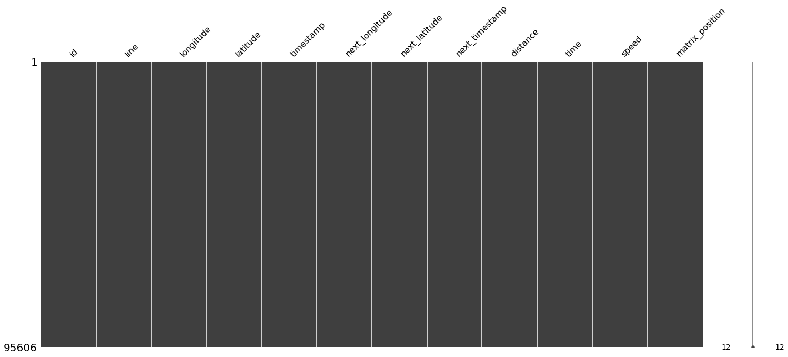


Vemos que no encuentra ningun missing value

Ahora buscamos outliers y para esto usamos un diagrama de `boxenplot` muy similar a un diagrama de caja _(boxplot)_


```python
matplotlib.rcParams['figure.figsize'] = [20,20]
plt.subplot(411)
plt.title('Origin Longitude')
sns.boxenplot(data=data.longitude, orient='horizontal', color='red')
plt.subplot(412)
plt.title('End Longitude')
sns.boxenplot(data=data.next_longitude, orient='horizontal', color='red')
plt.subplot(413)
plt.title('Origin Latitude')
sns.boxenplot(data=data.latitude, orient='horizontal', color='red')
plt.subplot(414)
plt.title('End Latitude')
sns.boxenplot(data=data.next_latitude, orient='horizontal', color='red')

plt.show()
```


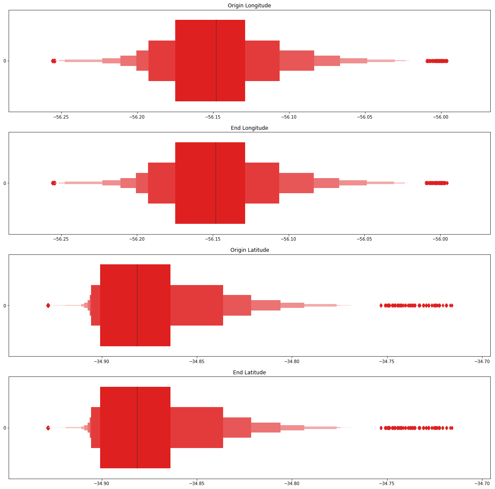


Podemos ver algunos datos que pueden ser considerados outliers pero como vimos en secciones anteriores estas son de la linea 142 que se aleja de la media de los datos dado que esta linea llega a Canelones.


```python
matplotlib.rcParams['figure.figsize'] = [20,5]
plt.title('Speed in K/h')
sns.boxenplot(data=data.speed.apply(lambda x: ms_to_kh(x)), orient='horizontal', color='red')
```


    <matplotlib.axes._subplots.AxesSubplot at 0x1a0de7cf28>


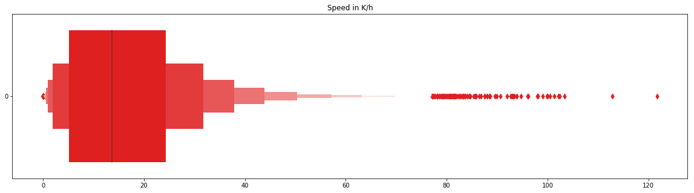


Las velocidades son razonables para los omnibus, los pocos casos en los que se llegan a altas velocidades pueden deberse a las zonas. Para comprobar esto vamos a ver cuales son las zonas en las cuales se llega a estas velocidades. Vamos a utilizar las velocidades superiores a 30 m/s (aproximadamente 108 k/h)


```python
data.query('speed > 30')
```


<div>
<style scoped>
    .dataframe tbody tr th:only-of-type {
        vertical-align: middle;
    }

    .dataframe tbody tr th {
        vertical-align: top;
    }

    .dataframe thead th {
        text-align: right;
    }
</style>
<table border="1" class="dataframe">
  <thead>
    <tr style="text-align: right;">
      <th></th>
      <th>id</th>
      <th>line</th>
      <th>longitude</th>
      <th>latitude</th>
      <th>timestamp</th>
      <th>next_longitude</th>
      <th>next_latitude</th>
      <th>next_timestamp</th>
      <th>distance</th>
      <th>time</th>
      <th>speed</th>
      <th>matrix_position</th>
    </tr>
  </thead>
  <tbody>
    <tr>
      <th>2161</th>
      <td>45</td>
      <td>217</td>
      <td>-56.182518</td>
      <td>-34.882500</td>
      <td>2018-10-02 15:37:55</td>
      <td>-56.187200</td>
      <td>-34.880733</td>
      <td>2018-10-02 15:38:10</td>
      <td>470.107551</td>
      <td>0 days 00:00:15.000000000</td>
      <td>31.340503</td>
      <td>[5, 8]</td>
    </tr>
    <tr>
      <th>21540</th>
      <td>1015</td>
      <td>343</td>
      <td>-56.134140</td>
      <td>-34.865665</td>
      <td>2018-10-02 14:39:08</td>
      <td>-56.135025</td>
      <td>-34.870167</td>
      <td>2018-10-02 14:39:23</td>
      <td>507.068996</td>
      <td>0 days 00:00:15.000000000</td>
      <td>33.804600</td>
      <td>[7, 13]</td>
    </tr>
  </tbody>
</table>
</div>


**-34.882500, -56.182518**

**-34.880733, -56.187200**

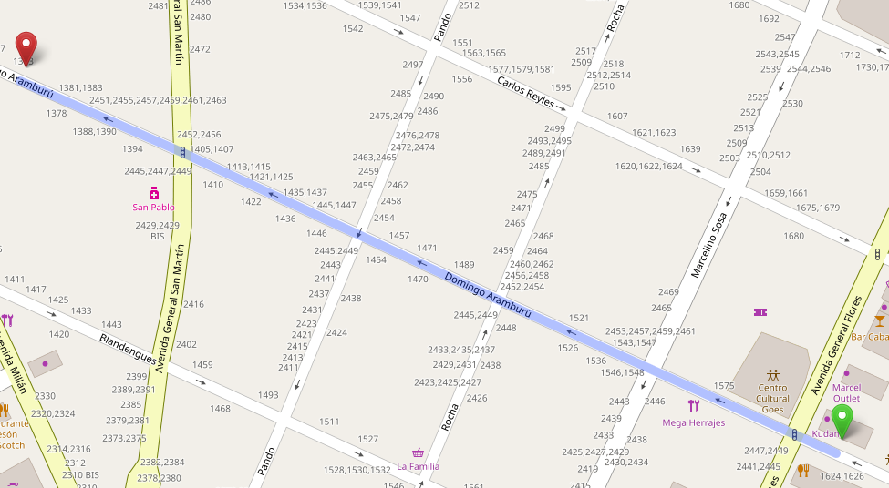

**-34.865665, -56.134140**

**-34.870167, -56.135025**

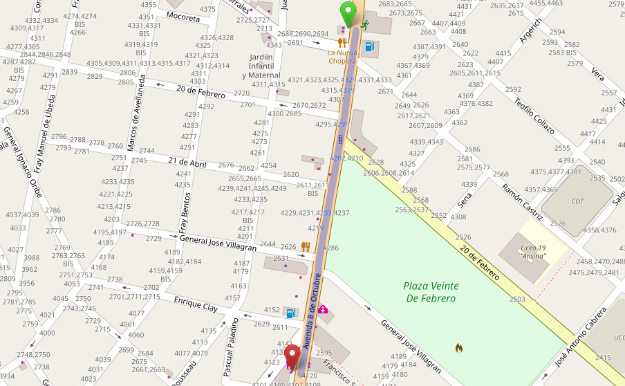

Podemos ver que en estas calles se puede llegar a estas velocidades pero al ser casos muy particulares pueden afectar a nuestros modelos y por esto vamos a eliminarlos.


```python
data.query('speed > 25').count()
```


    id                 24
    line               24
    longitude          24
    latitude           24
    timestamp          24
    next_longitude     24
    next_latitude      24
    next_timestamp     24
    distance           24
    time               24
    speed              24
    matrix_position    24
    dtype: int64


Vamos a eliminar las 24 filas que tienen datos con velocidades superiores a 25 m/s _(90 K/h)_


```python
data = data.query('speed < 25')
```


```python
matplotlib.rcParams['figure.figsize'] = [20,5]
plt.title('Distance in meters')
sns.boxenplot(data=data.distance, orient='horizontal', color='red')
```


    <matplotlib.axes._subplots.AxesSubplot at 0x1a1d0ec4a8>


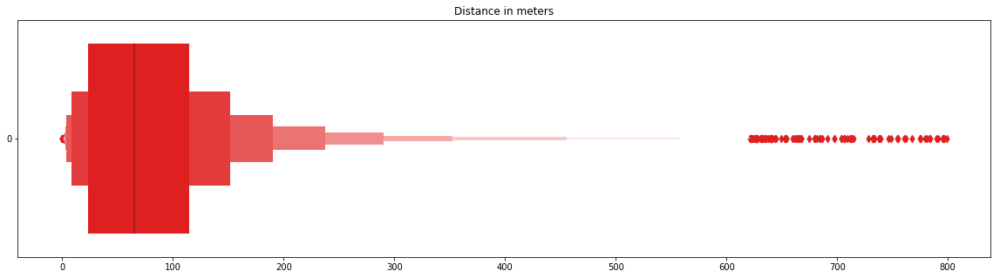


Ahora vamos a ver donde caen las largas distancias


```python
data.query('distance > 795')
```


<div>
<style scoped>
    .dataframe tbody tr th:only-of-type {
        vertical-align: middle;
    }

    .dataframe tbody tr th {
        vertical-align: top;
    }

    .dataframe thead th {
        text-align: right;
    }
</style>
<table border="1" class="dataframe">
  <thead>
    <tr style="text-align: right;">
      <th></th>
      <th>id</th>
      <th>line</th>
      <th>longitude</th>
      <th>latitude</th>
      <th>timestamp</th>
      <th>next_longitude</th>
      <th>next_latitude</th>
      <th>next_timestamp</th>
      <th>distance</th>
      <th>time</th>
      <th>speed</th>
      <th>matrix_position</th>
    </tr>
  </thead>
  <tbody>
    <tr>
      <th>23232</th>
      <td>79</td>
      <td>343</td>
      <td>-56.162167</td>
      <td>-34.891666</td>
      <td>2018-10-02 17:12:12</td>
      <td>-56.166306</td>
      <td>-34.897972</td>
      <td>2018-10-02 17:13:27</td>
      <td>796.348669</td>
      <td>0 days 00:01:15.000000000</td>
      <td>10.617982</td>
      <td>[4, 10]</td>
    </tr>
    <tr>
      <th>58060</th>
      <td>709</td>
      <td>342</td>
      <td>-56.165670</td>
      <td>-34.897305</td>
      <td>2018-10-02 16:37:11</td>
      <td>-56.161472</td>
      <td>-34.891000</td>
      <td>2018-10-02 16:38:11</td>
      <td>798.817304</td>
      <td>0 days 00:01:00.000000000</td>
      <td>13.313622</td>
      <td>[4, 10]</td>
    </tr>
    <tr>
      <th>63679</th>
      <td>241</td>
      <td>7516</td>
      <td>-56.253967</td>
      <td>-34.895500</td>
      <td>2018-10-02 15:45:25</td>
      <td>-56.248085</td>
      <td>-34.890217</td>
      <td>2018-10-02 15:54:25</td>
      <td>795.540435</td>
      <td>0 days 00:09:00.000000000</td>
      <td>1.473223</td>
      <td>[4, 1]</td>
    </tr>
  </tbody>
</table>
</div>


**-34.891666, -56.162167**

**-34.897972, -56.166306**


- - - - - - - - - - - - - -

**-34.897305, -56.165670**

**-34.891000, -56.161472**

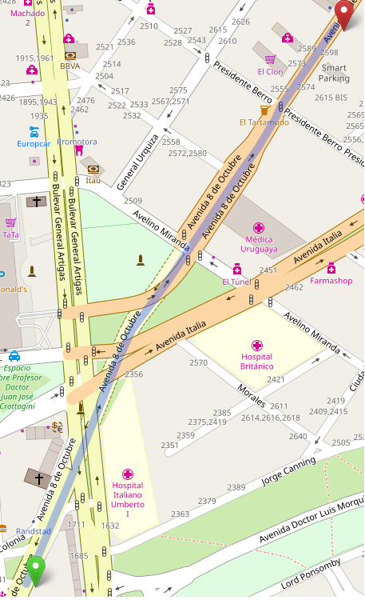
- - - - - - - - - - - - - -

**-34.895500, -56.253967**

**-34.890217, -56.248085**

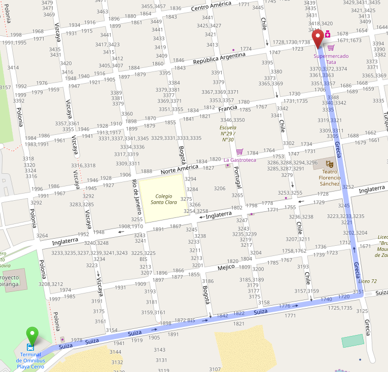

En el primer caso podemos ver que esa distancia no afectaria mucho, por otra parte la segunda distancia tiene forma de distancia Manhattan


En este caso nuestra distancia se ve afectada porque estamos usando la distancia haversine que se calcula como:


Vamos a tener que ver hasta que punto son tolerables largas distancias.


```python
data.query('distance > 500').head(5)
```


<div>
<style scoped>
    .dataframe tbody tr th:only-of-type {
        vertical-align: middle;
    }

    .dataframe tbody tr th {
        vertical-align: top;
    }

    .dataframe thead th {
        text-align: right;
    }
</style>
<table border="1" class="dataframe">
  <thead>
    <tr style="text-align: right;">
      <th></th>
      <th>id</th>
      <th>line</th>
      <th>longitude</th>
      <th>latitude</th>
      <th>timestamp</th>
      <th>next_longitude</th>
      <th>next_latitude</th>
      <th>next_timestamp</th>
      <th>distance</th>
      <th>time</th>
      <th>speed</th>
      <th>matrix_position</th>
    </tr>
  </thead>
  <tbody>
    <tr>
      <th>47</th>
      <td>76</td>
      <td>217</td>
      <td>-56.098970</td>
      <td>-34.872250</td>
      <td>2018-10-02 16:17:41</td>
      <td>-56.106632</td>
      <td>-34.870285</td>
      <td>2018-10-02 16:19:56</td>
      <td>732.347979</td>
      <td>0 days 00:02:15.000000000</td>
      <td>5.424800</td>
      <td>[6, 16]</td>
    </tr>
    <tr>
      <th>167</th>
      <td>76</td>
      <td>217</td>
      <td>-56.180183</td>
      <td>-34.883415</td>
      <td>2018-10-02 16:56:56</td>
      <td>-56.187466</td>
      <td>-34.880634</td>
      <td>2018-10-02 16:59:42</td>
      <td>732.776170</td>
      <td>0 days 00:02:46.000000000</td>
      <td>4.414314</td>
      <td>[5, 8]</td>
    </tr>
    <tr>
      <th>867</th>
      <td>13</td>
      <td>217</td>
      <td>-56.211582</td>
      <td>-34.862534</td>
      <td>2018-10-02 14:50:38</td>
      <td>-56.217250</td>
      <td>-34.858566</td>
      <td>2018-10-02 14:51:23</td>
      <td>679.795382</td>
      <td>0 days 00:00:45.000000000</td>
      <td>15.106564</td>
      <td>[7, 5]</td>
    </tr>
    <tr>
      <th>2275</th>
      <td>45</td>
      <td>217</td>
      <td>-56.100100</td>
      <td>-34.872032</td>
      <td>2018-10-02 17:35:27</td>
      <td>-56.106033</td>
      <td>-34.870483</td>
      <td>2018-10-02 17:36:27</td>
      <td>568.004185</td>
      <td>0 days 00:01:00.000000000</td>
      <td>9.466736</td>
      <td>[6, 16]</td>
    </tr>
    <tr>
      <th>2461</th>
      <td>34</td>
      <td>217</td>
      <td>-56.212017</td>
      <td>-34.862350</td>
      <td>2018-10-02 15:32:24</td>
      <td>-56.216835</td>
      <td>-34.859050</td>
      <td>2018-10-02 15:33:09</td>
      <td>572.618527</td>
      <td>0 days 00:00:45.000000000</td>
      <td>12.724856</td>
      <td>[7, 5]</td>
    </tr>
  </tbody>
</table>
</div>


**-34.870285, -56.106632**

**-34.872250, -56.098970**

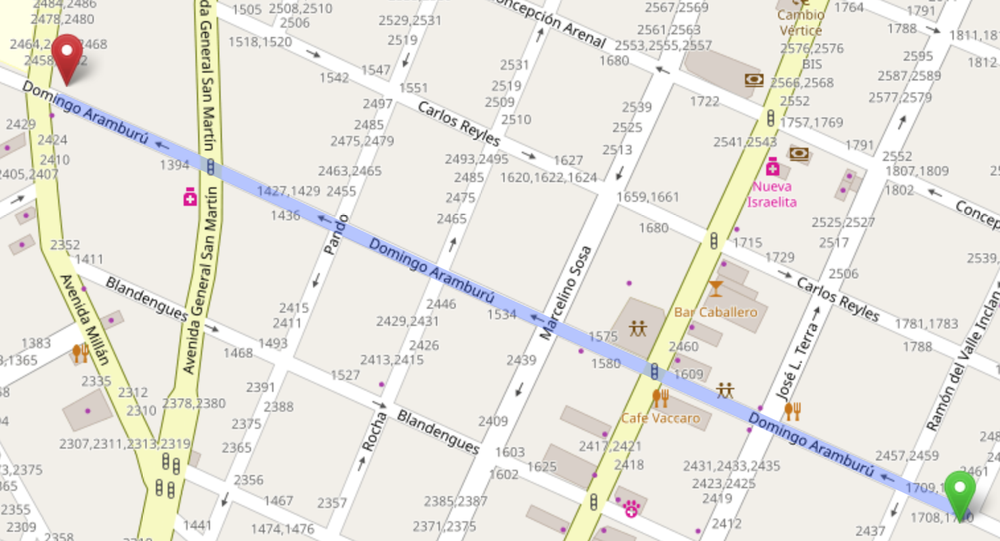

**-34.883415, -56.180183**

**-34.880634, -56.187466**

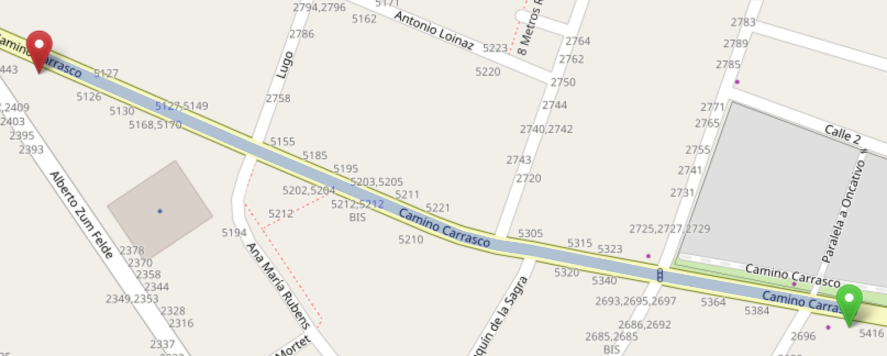


**-34.859050, -56.216835**

**-34.862350, -56.212017**

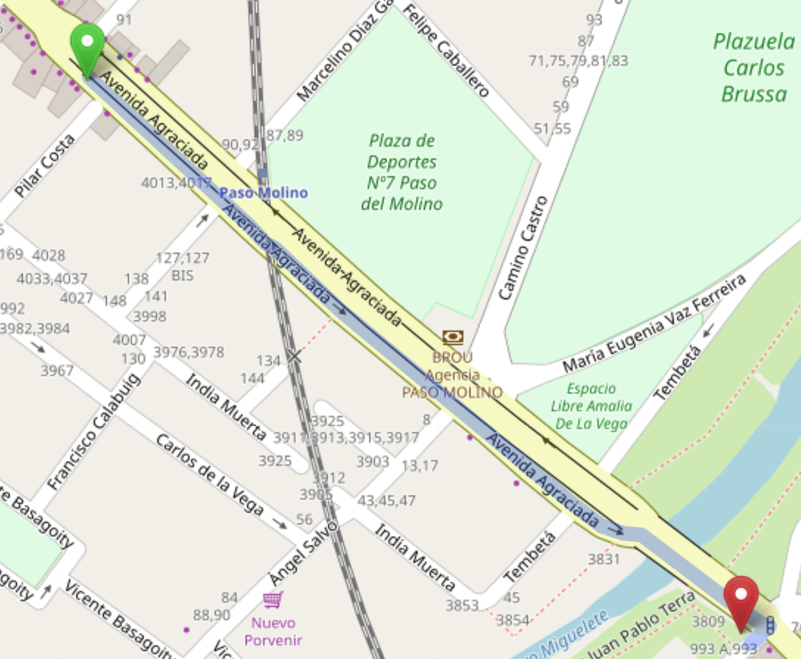

Parece que estas largas distancias son el linea recta a velocidades superiores a la media, por temas de simplicidad vamosa suponer que esto es asi.


```python
data = data.query('distance <= 500')
```

Como ya terminamos de preparar nuestros datos vamos a realizar un ultimo cambio, vamos a convertir los tiempos de datetimes a segundos en int32.


```python
print('\nTime as date')
data.head()
```

    
    Time as date


<div>
<style scoped>
    .dataframe tbody tr th:only-of-type {
        vertical-align: middle;
    }

    .dataframe tbody tr th {
        vertical-align: top;
    }

    .dataframe thead th {
        text-align: right;
    }
</style>
<table border="1" class="dataframe">
  <thead>
    <tr style="text-align: right;">
      <th></th>
      <th>id</th>
      <th>line</th>
      <th>longitude</th>
      <th>latitude</th>
      <th>timestamp</th>
      <th>next_longitude</th>
      <th>next_latitude</th>
      <th>next_timestamp</th>
      <th>distance</th>
      <th>time</th>
      <th>speed</th>
      <th>matrix_position</th>
    </tr>
  </thead>
  <tbody>
    <tr>
      <th>0</th>
      <td>76</td>
      <td>217</td>
      <td>-56.222400</td>
      <td>-34.855885</td>
      <td>2018-10-02 14:38:53</td>
      <td>-56.222717</td>
      <td>-34.855766</td>
      <td>2018-10-02 14:39:23</td>
      <td>31.807877</td>
      <td>0 days 00:00:30.000000000</td>
      <td>1.060263</td>
      <td>[8, 4]</td>
    </tr>
    <tr>
      <th>1</th>
      <td>76</td>
      <td>217</td>
      <td>-56.222717</td>
      <td>-34.855766</td>
      <td>2018-10-02 14:39:23</td>
      <td>-56.222733</td>
      <td>-34.855780</td>
      <td>2018-10-02 14:39:53</td>
      <td>2.134200</td>
      <td>0 days 00:00:30.000000000</td>
      <td>0.071140</td>
      <td>[8, 4]</td>
    </tr>
    <tr>
      <th>2</th>
      <td>76</td>
      <td>217</td>
      <td>-56.222733</td>
      <td>-34.855780</td>
      <td>2018-10-02 14:39:53</td>
      <td>-56.222916</td>
      <td>-34.855682</td>
      <td>2018-10-02 14:40:08</td>
      <td>19.939152</td>
      <td>0 days 00:00:15.000000000</td>
      <td>1.329277</td>
      <td>[8, 4]</td>
    </tr>
    <tr>
      <th>3</th>
      <td>76</td>
      <td>217</td>
      <td>-56.222916</td>
      <td>-34.855682</td>
      <td>2018-10-02 14:40:08</td>
      <td>-56.222866</td>
      <td>-34.855682</td>
      <td>2018-10-02 14:40:23</td>
      <td>4.562295</td>
      <td>0 days 00:00:15.000000000</td>
      <td>0.304153</td>
      <td>[8, 4]</td>
    </tr>
    <tr>
      <th>4</th>
      <td>76</td>
      <td>217</td>
      <td>-56.222866</td>
      <td>-34.855682</td>
      <td>2018-10-02 14:40:23</td>
      <td>-56.222850</td>
      <td>-34.855667</td>
      <td>2018-10-02 14:40:38</td>
      <td>2.216614</td>
      <td>0 days 00:00:15.000000000</td>
      <td>0.147774</td>
      <td>[8, 4]</td>
    </tr>
  </tbody>
</table>
</div>


```python
line_times = []
for row in data.itertuples():
    start_time = datetime.strptime(row.timestamp,'%Y-%m-%d %H:%M:%S')
    end_time   = datetime.strptime(row.next_timestamp,'%Y-%m-%d %H:%M:%S')
    time = end_time - start_time
    line_times.append(time.total_seconds())

data['time']  = line_times
```


```python
print('\nTime in seconds int32')
data.head()
```

    
    Time in seconds int32


<div>
<style scoped>
    .dataframe tbody tr th:only-of-type {
        vertical-align: middle;
    }

    .dataframe tbody tr th {
        vertical-align: top;
    }

    .dataframe thead th {
        text-align: right;
    }
</style>
<table border="1" class="dataframe">
  <thead>
    <tr style="text-align: right;">
      <th></th>
      <th>id</th>
      <th>line</th>
      <th>longitude</th>
      <th>latitude</th>
      <th>timestamp</th>
      <th>next_longitude</th>
      <th>next_latitude</th>
      <th>next_timestamp</th>
      <th>distance</th>
      <th>time</th>
      <th>speed</th>
      <th>matrix_position</th>
    </tr>
  </thead>
  <tbody>
    <tr>
      <th>0</th>
      <td>76</td>
      <td>217</td>
      <td>-56.222400</td>
      <td>-34.855885</td>
      <td>2018-10-02 14:38:53</td>
      <td>-56.222717</td>
      <td>-34.855766</td>
      <td>2018-10-02 14:39:23</td>
      <td>31.807877</td>
      <td>30.0</td>
      <td>1.060263</td>
      <td>[8, 4]</td>
    </tr>
    <tr>
      <th>1</th>
      <td>76</td>
      <td>217</td>
      <td>-56.222717</td>
      <td>-34.855766</td>
      <td>2018-10-02 14:39:23</td>
      <td>-56.222733</td>
      <td>-34.855780</td>
      <td>2018-10-02 14:39:53</td>
      <td>2.134200</td>
      <td>30.0</td>
      <td>0.071140</td>
      <td>[8, 4]</td>
    </tr>
    <tr>
      <th>2</th>
      <td>76</td>
      <td>217</td>
      <td>-56.222733</td>
      <td>-34.855780</td>
      <td>2018-10-02 14:39:53</td>
      <td>-56.222916</td>
      <td>-34.855682</td>
      <td>2018-10-02 14:40:08</td>
      <td>19.939152</td>
      <td>15.0</td>
      <td>1.329277</td>
      <td>[8, 4]</td>
    </tr>
    <tr>
      <th>3</th>
      <td>76</td>
      <td>217</td>
      <td>-56.222916</td>
      <td>-34.855682</td>
      <td>2018-10-02 14:40:08</td>
      <td>-56.222866</td>
      <td>-34.855682</td>
      <td>2018-10-02 14:40:23</td>
      <td>4.562295</td>
      <td>15.0</td>
      <td>0.304153</td>
      <td>[8, 4]</td>
    </tr>
    <tr>
      <th>4</th>
      <td>76</td>
      <td>217</td>
      <td>-56.222866</td>
      <td>-34.855682</td>
      <td>2018-10-02 14:40:23</td>
      <td>-56.222850</td>
      <td>-34.855667</td>
      <td>2018-10-02 14:40:38</td>
      <td>2.216614</td>
      <td>15.0</td>
      <td>0.147774</td>
      <td>[8, 4]</td>
    </tr>
  </tbody>
</table>
</div>


```python
data.to_csv('../data/dataset.csv')
```
